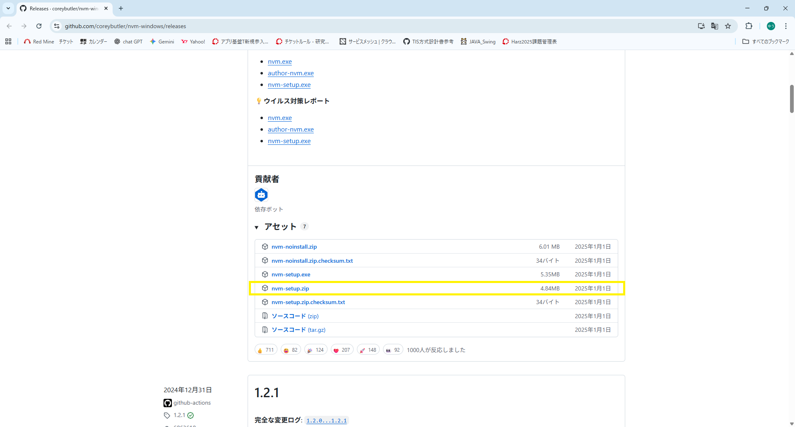
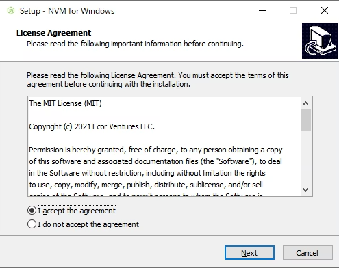
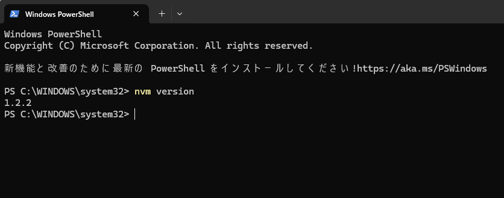
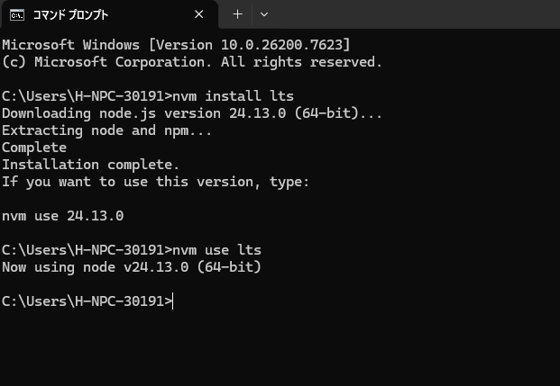
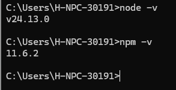
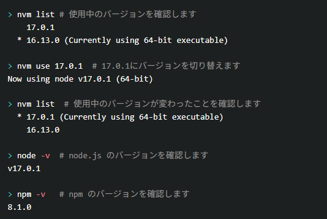
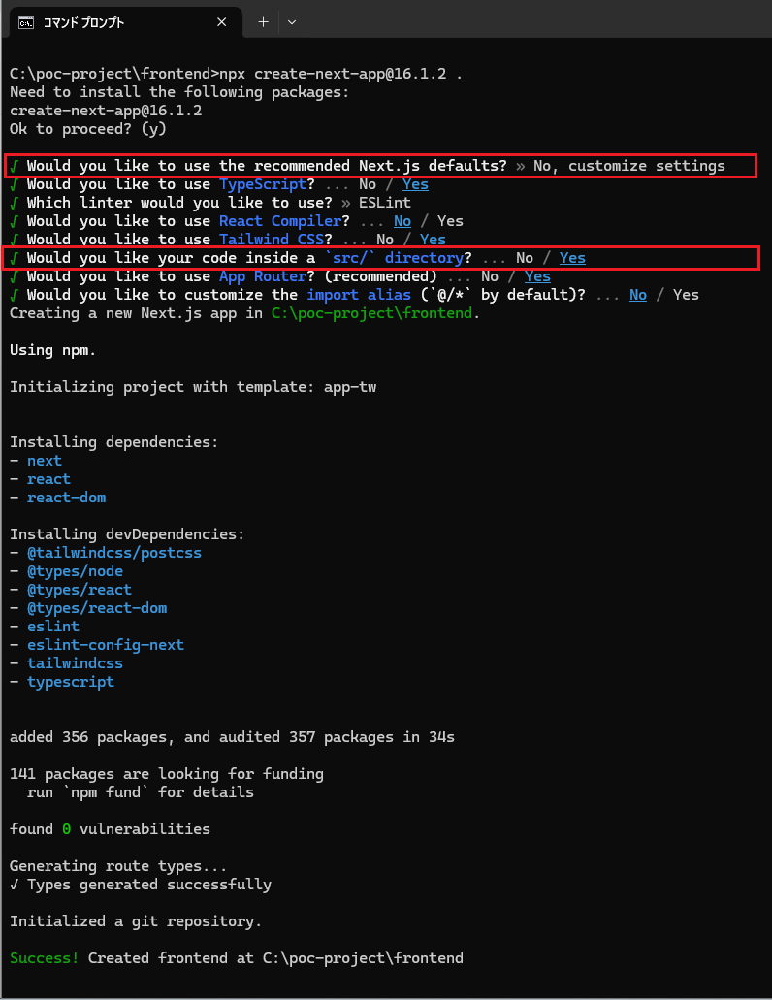
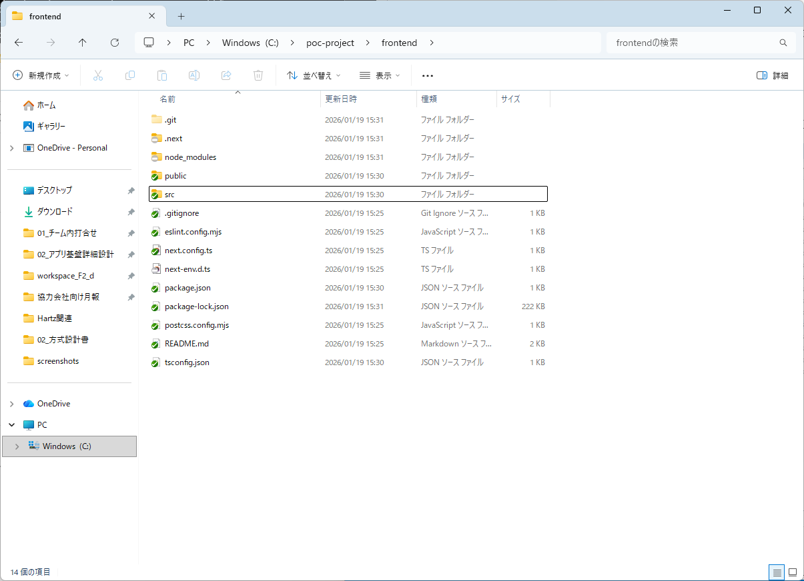
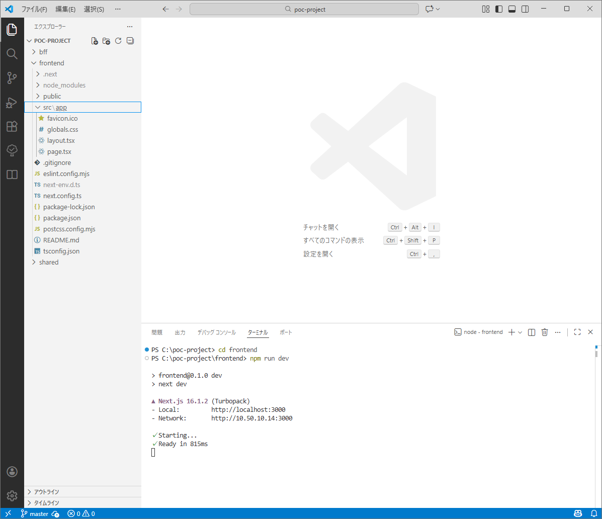
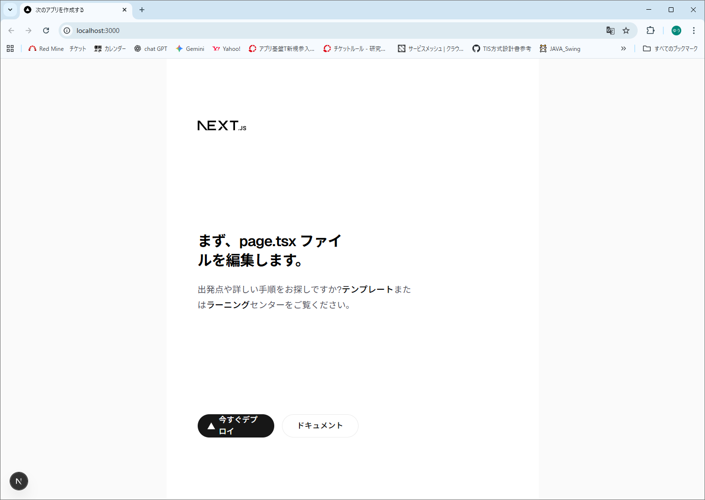

# フロントエンド PoC 基本環境構築手順書

## 1. 目的
本手順書は、フロントエンド詳細設計書に基づく PoC 検証を実施するために、
Windows 環境上で Next.js を用いたフロントエンド開発環境を構築する手順を示す。

PoC 検証の過程で設計内容が変更される可能性があるため、
本環境は検証作業を柔軟に行えることを目的とする。

---

## 2. ゴール
- nvm-windows がインストールされている
- LTS 版 Node.js が nvm 経由で利用できる
- Next.js プロジェクトが作成できる
- `npm run dev` によりローカル環境で画面が表示される

---

## 3. 前提条件
- OS：Windows 10 / 11
- Visual Studio Code がインストールされていること

---

## 4. 使用ツール・技術
**本 PoC 開発において、環境の再現性と開発効率を担保するために以下のツール・技術・バージョンを採用する。記載のバージョンは、動作検証済みである。**
| 種別 | 名称 | バージョン (2026/01時点) | 備考 |
| --- | --- | --- | --- |
| バージョン管理 | nvm-windows | v1.2.2 | **Node.js の管理:** 異なるプロジェクト間で Node.js のバージョンを容易に切り替え、チーム内での実行環境を統一するために使用する。 |
| 実行環境 | Node.js | v24.13.0 (LTS版) | **JavaScript 実行基盤:** Next.js を動作させるために不可欠なランタイム。安定性と最新機能のバランスを考慮し、構築時点のLTS版の最新を採用する。 |
| フレームワーク | Next.js | v16.1.2 | **フロントエンド基盤:** React をベースとし、高速なレンダリングと効率的なルーティングを実現するための PoC メインフレームワーク。 |
| パッケージ管理 | npm | v11.6.2 | **ライブラリ管理:** 開発に必要な各種パッケージのインストール、依存関係の管理、およびスクリプト（開発サーバ起動等）の実行に使用する。 |
| エディタ | Visual Studio Code | 1.108.1 (最新版) | **開発支援:** 豊富な拡張機能とデバッグ機能を備え、チーム共通のコーディング環境を提供するために使用する。バージョンは任意 （最新版を推奨）|

**【補足：バージョンの更新について】**
* 上記バージョンは 2026年1月15日 時点の最新（または安定版）を確認したものです。
* **最新バージョンが公開された場合：** PoC 検証の安定性を担保するため、原則として上記バージョンを使用します。ただし、脆弱性の修正や検証に必要な新機能が含まれる場合は、適宜プロジェクト内で協議の上、本手順書のバージョンを見直すものとします。
---

## 5. 環境構築手順
### 5.0 Visual Studio Code のインストール（未インストールの場合のみ）

すでにインストール済みの場合は **5.1** へ進むこと。

1. [公式サイト](https://code.visualstudio.com/) からインストーラーをダウンロードし、実行する。
2. 基本的にすべてデフォルト設定のまま「次へ」で進み、インストールを完了させる。
3. 起動後、画面左側の「Extensions」アイコンから `Japanese Language Pack` を検索して導入すると日本語化される。
> [Windows への Visual Studio Code のインストール方法(図解説明)](https://www602.math.ryukoku.ac.jp/Prog1/vscode-win.html)

---

### 5.1 nvm-windows のインストール
Node.js はアップデート頻度が高いため、
本手順では Node.js のバージョン管理ツールとして nvm-windows を使用する。

nvm-windows を使用することで、
将来的に Node.js のバージョン切り替えが必要になった場合でも
容易に対応することが可能となる。

---

### 5.1.1 インストーラーのダウンロード
1. Web ブラウザを起動し、
    [nvm-windows の公式 GitHub リポジトリ](https://github.com/coreybutler/nvm-windows/releases)
    にアクセスする
2. Releases ページから、最新版のインストーラー`nvm-setup.zip`をダウンロードする



---

### 5.1.2 nvm-windows のインストール
> ### 補足
> ※Windows版Node.jsをインストールしてもよいがバージョン切り替えが困難。（[Windows版Node.jsのインストール手順](https://zenn.dev/kuuki/articles/windows-nodejs-install)）  
> #### Node.js インストール方法の比較
> 
> | 比較項目 | nvm-windows（推奨） | Windows版（直接インストール） |
> | --- | --- | --- |
> | 切替方法 | **コマンド一つ（数秒）** | **削除して再インストール（数分〜）** |
> | 複数共存 | 可能 | 不可 |
> | 主な利点 | プロジェクト毎にVer変更が容易 | 導入が最もシンプル |  

1. ダウンロードした`nvm-setup.zip`を解凍し、 `nvm-setup.exe` を実行する
2. セットアップウィザードの画面に従い、インストールを進める

   * 基本的にすべてデフォルト設定のままで問題ない
   * メーアドレス入力は空のままで問題ない
3. インストール完了後、セットアップを終了する



---

### 5.1.3 インストール後の確認

1. コマンドプロンプトまたはPowerShellを起動する
2. 以下のコマンドを実行し、nvm のバージョンが表示されることを確認する

```bash
nvm version
```

nvm のバージョン情報が表示されれば、
nvm-windows のインストールは正常に完了している。  
※下記キャプチャは2026/01/15時点のもの



---

### 5.1.4 補足

* インストール後に `nvm` コマンドが認識されない場合は、
  CLIを再起動する
* それでも認識されない場合は、環境変数の反映状況を確認する

---

## 5.2 Node.js（LTS）のインストール

nvm-windows を使用して、
PoC 検証に利用する **LTS（Long Term Support）版の Node.js** をインストールする。  
↓  
Node.js には複数のリリース種別があります。  
`nvm list available`コマンドでインストール可能なNode.jsのバージョン一覧を確認できる

| 種別                      | 特徴           | 用途     |
| ----------------------- | ------------ | ------ |
| Current                 | 最新機能が入る      | 検証・実験  |
| LTS (Long Term Support) | 安定性重視・長期サポート | 業務・PoC |  

LTS 版を使用することで、
安定性を重視した環境で PoC 検証を行うことができる。

---

### 5.2.1 Node.js（LTS）のインストール

コマンドプロンプトを起動し、以下のコマンドを実行する。

```bash
nvm install v24.13.0
```

インストール完了後、使用する Node.js のバージョンとして
インストールした LTS 版を指定する。

```bash
nvm use v24.13.0
```

※以下キャプチャは`nvm install lts`（最新のLTS）をインストールしている。


---

### 5.2.2 Node.js のバージョン確認

Node.js および npm が正しく利用できることを確認するため、
以下のコマンドを実行する。

```bash
node -v
npm -v
```

Node.js と npm のバージョンが表示されれば、
Node.js のインストールは正常に完了している。



---

### 5.2.3 補足（node.js のバージョン切り替え）
* `nvm use nvm list` を実行することで、
  使用中のバージョンを確認することができる
* `nvm use 変更したいバージョン` を実行することで、
  利用する Node.js のバージョンを切り替えることができる
* プロジェクトごとに異なる Node.js バージョンが必要になった場合も、
  nvm-windows を使用することで容易に対応可能である  


---

## 5.3 Next.js プロジェクトの作成

PoC 検証に使用する Next.js プロジェクトを作成する。
本手順では、Next.js が提供する公式のプロジェクト作成コマンドを使用する。

### 5.3.1 作業ディレクトリの準備

1. Next.js プロジェクトを作成するディレクトリに移動する
2. 必要に応じて、新規ディレクトリを作成する

例：作業用ディレクトリを作成し移動する場合

```bash
mkdir C:\poc-project\frontend
cd C:\poc-project\frontend
```

※ 既存のディレクトリを使用する場合は、本手順を適宜読み替えること

---

### 5.3.2 Next.js プロジェクトの作成

作業ディレクトリ直下で、以下のコマンドを実行する。

```bash
npx create-next-app@16.1.2 .
```

コマンド実行後、対話形式でいくつかの質問が表示される
本 PoC 環境では、**すべてデフォルト設定のまま進める**。

> **ソースコードと設定ファイルを分離し、プロジェクトの見通し（ディレクトリの視認性）を良くするため**  
> **src ディレクトリを作成する方法でプロジェクトを作成する**  
>  
> 最初の`Would you like to use the recommended Next.js defaults?` で `No, customize settings`を選択しカスタマイズ可能にする  
>  
> `Would you like your code inside a `src/` directory?` で `Yes`を選択  



---

### 5.3.3 プロジェクト作成完了の確認

プロジェクト作成完了後、以下のファイル・ディレクトリが作成されていることを確認する。

* `package.json`
* `node_modules`
* `app` または `pages` ディレクトリ
* `next.config.js`

上記が作成されていれば、
Next.js プロジェクトの作成は正常に完了している。



---

### 5.3.4 補足

* `npx` は npm に同梱されているコマンドであり、
  ローカル環境にインストールされていないツールでも実行可能である
* `npx create-next-app@latest` を指定することで、最新の安定版 Next.js が使用される

---

## チェックポイント（ゴール確認）

この時点で、以下の状態になっていることを確認する。

* Next.js プロジェクトが作成されている
* `package.json` が存在している

---

## 5.4 開発サーバーの起動

Next.js プロジェクトが作成できたら、
開発サーバーを起動して **ブラウザ上で動作を確認** する。

---

### 5.4.1 開発サーバーの起動

1. コマンドプロンプトまたは VS Code のターミナルを開く
2. Next.js プロジェクトのルートディレクトリに移動する
3. 以下のコマンドを実行する

```bash
npm run dev
```
> ### 補足
> **PowerShell で実行エラーが出る場合**  
> `npm run dev` 実行時に「スクリプトの実行が無効」というエラーが出る場合は、管理者権限で PowerShell を起動し  
> `Set-ExecutionPolicy -ExecutionPolicy RemoteSigned -Scope CurrentUser` を実行し、実行ポリシーを許可してください  
> ※`RemoteSigned` は「ローカルで作成したスクリプトは実行可能、ネットからダウンロードしたものは署名が必要」という、開発環境で一般的に使われる設定

* サーバー起動中は、ターミナルに以下のようなメッセージが表示される

```
Local:   http://localhost:3000
Network: http://192.168.x.x:3000
```



---

### 5.4.2 ブラウザで動作確認

1. Web ブラウザを開く
2. `http://localhost:3000` にアクセスする
3. Next.js の初期画面（サンプルページ）が表示されることを確認する



---

### 5.4.3 補足

* サーバーを停止したい場合は、ターミナルで `Ctrl + C` を押す
* 別プロジェクトや別バージョンの Node.js で作業する場合は、
  必ず nvm で切り替えてから `npm run dev` を実行する

---

## 6. 動作確認

この時点で以下が確認できれば、PoC 用フロントエンド環境構築は **完了**。

* Next.js 開発サーバーが起動している
* ブラウザで `http://localhost:3000` にアクセスし、初期画面が表示される

