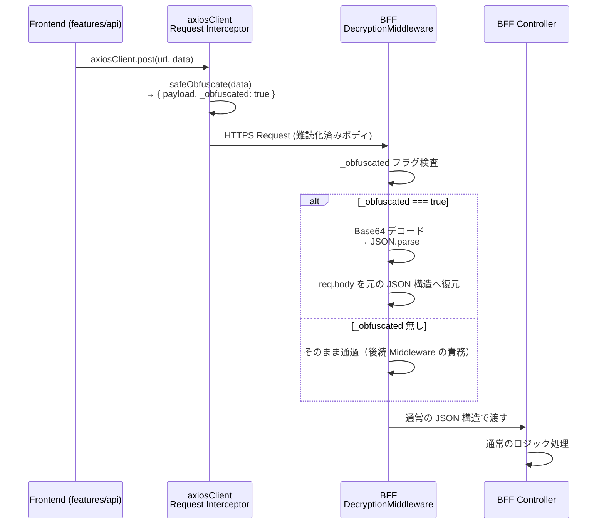

# 送信データ難読化基盤設計

> **TODO:** #12286 Base64難読化の実装方針を再検討中。別タスクで対応予定。本設計書の内容は確定前の状態であること。

フロントエンドから BFF への送信データを Base64 で透過的にエンコード／デコードする基盤の I/F とフローを定義する。

| 関連文書 | 内容 |
|---|---|
| [フロントエンド・BFF共通基盤規約.md](フロントエンド・BFF共通基盤規約.md) §2 | 通信基盤利用規約（バイパス禁止） |
| [Axios通信基盤設計.md](Axios通信基盤設計.md) §2.2 | Request Interceptor から本基盤を呼び出す |
| [10.BFF設計.md](../10.BFF設計.md) | BFF の Middleware 配線 |
| [13.セキュリティ基盤設計.md](../13.セキュリティ基盤設計.md) | セキュリティ全体方針（暗号化は HTTPS/TLS） |

> **本基盤の位置付け**: デバッグツールでの直接視認性を下げ、日本語（マルチバイト文字）を安全に伝送するための **難読化** 機構。**暗号化ではない**。本格的な機密性は HTTPS（TLS）で担保する。
>
> 根拠: [adr/obfuscation-not-encryption.md](adr/obfuscation-not-encryption.md)

---

## 1. 全体シーケンス



---

## 2. フロントエンド側（送信前変換）

### 2.1 配置

| ファイル | 配置場所 | 公開対象 |
|---|---|---|
| `safeObfuscate` 関数 | `frontend/src/shared/plugins/axiosClient.ts` 内（Request Interceptor から呼び出し） | ❌ アプリ実装者は直接呼び出さない（Interceptor 経由で自動適用） |

### 2.2 内部仕様

```typescript
/**
 * 送信データを Base64 でエンコードする。
 * 日本語（マルチバイト）を含む JSON を安全に伝送できる形に変換する。
 *
 * @param data - エンコード対象の任意のオブジェクト
 * @returns Base64 エンコード済み文字列
 *
 * @remarks
 * - 暗号化ではない。通信路の機密性は HTTPS/TLS が担保する
 * - GET リクエストには適用しない（Interceptor 側で除外）
 * - エンコード失敗時の例外処理は呼び出し元（Request Interceptor）で行う
 */
function safeObfuscate(data: unknown): string;
```

### 2.3 処理ステップ

| Step | 処理 | 目的 |
|---|---|---|
| 1 | `JSON.stringify(data)` で文字列化 | オブジェクトを直列化 |
| 2 | `TextEncoder().encode(...)` で UTF-8 バイト配列に変換 | 日本語マルチバイト対応 |
| 3 | バイト配列を 1 バイト 1 文字の文字列に変換（`String.fromCharCode`）| `btoa` の入力要件を満たす |
| 4 | `btoa(...)` で Base64 化 | 難読化結果 |

### 2.4 Request Interceptor からの呼び出し

axiosClient の Request Interceptor が以下のルールで本関数を適用する。

| 条件 | 動作 |
|---|---|
| `config.method !== 'get'` かつ `config.data` が存在 | `config.data = { payload: safeObfuscate(config.data), _obfuscated: true }` に置換 |
| `config.method === 'get'` | 何もしない（クエリ文字列はそのまま） |
| `config.data` が空 | 何もしない |

> Interceptor 側の挙動詳細は [Axios通信基盤設計.md](Axios通信基盤設計.md) §2.2 を参照。

---

## 3. BFF 側（受信後復元）

### 3.1 配置

| ファイル | 配置場所 | 公開対象 |
|---|---|---|
| `DecryptionMiddleware` | `bff/src/shared/middleware/decryption.middleware.ts` | ❌ 基盤チームが NestJS の `MiddlewareConsumer` で配線済み（BFF 実装者は触らない） |

### 3.2 NestJS Middleware シグネチャ

```typescript
/**
 * フロントエンドが Base64 で難読化したリクエストボディを透過的に復号する Middleware。
 *
 * @remarks
 * - `_obfuscated: true` フラグと `payload` の両方が存在する場合のみ復号
 * - 復号失敗時はエラーをログ出力し、後続 Middleware にそのまま通過させる
 *   （通常のエラーハンドリングに委ねる）
 * - 全ルートに対して適用するため、AppModule の `MiddlewareConsumer.forRoutes('*')` で配線
 */
@Injectable()
export class DecryptionMiddleware implements NestMiddleware {
  use(req: Request, res: Response, next: NextFunction): void;
}
```

### 3.3 処理ステップ

| Step | 処理 | 目的 |
|---|---|---|
| 1 | `req.body._obfuscated === true && req.body.payload` を判定 | 難読化済みデータかを識別 |
| 2 | `atob(req.body.payload)` で Base64 デコード | バイト列文字列に戻す |
| 3 | `Uint8Array.from(binString, m => m.codePointAt(0)!)` でバイト配列化 | UTF-8 復元の準備 |
| 4 | `TextDecoder().decode(uint8array)` で UTF-8 文字列に復元 | 日本語マルチバイト対応 |
| 5 | `JSON.parse(jsonString)` で `req.body` を元の構造に置換 | Controller には通常の JSON が見える |

### 3.4 エラーハンドリング

| ケース | 動作 |
|---|---|
| Base64 デコード失敗 | エラーをログ出力し、`req.body` を変更せずに `next()` 呼び出し |
| JSON パース失敗 | 同上 |
| `_obfuscated` フラグ無し | そのまま通過 |

復号失敗時に独自の例外を投げないことで、後続のバリデーション層・エラーハンドリング層に判断を委ねる。

---

## 4. 適用範囲と制限事項

| 項目 | 内容 |
|---|---|
| **適用対象** | POST / PUT / PATCH 等のリクエストボディのみ（GET クエリパラメータは対象外） |
| **判定フラグ** | `_obfuscated: true` により BFF 側で難読化されたデータであることを明示 |
| **目的** | デバッグツールでの視認性低減、日本語の安全な伝送 |
| **制限** | セキュリティ対策としての暗号化ではない（Base64 は容易に復号可能）。本格的な機密性は HTTPS（TLS）に依存。> 根拠: [adr/obfuscation-not-encryption.md](adr/obfuscation-not-encryption.md) |
| **デバッグログ** | 開発環境では送信前・復号後のデータを `console.log` で確認可能。本番環境ではログ出力を無効化すること |

---

## 5. アプリ実装者・BFF 実装者の責務

| 役割 | 責務 |
|---|---|
| アプリ実装者（FE） | 何もしない。`axiosClient` を使えば自動で難読化される |
| BFF 実装者 | 何もしない。Controller では復元済みの `req.body` を受け取れる |
| 基盤チーム | `safeObfuscate` 実装、`DecryptionMiddleware` 実装、`MiddlewareConsumer` の配線 |

> アプリ実装者向けの規約は [フロントエンド・BFF共通基盤規約.md](フロントエンド・BFF共通基盤規約.md) §2.1（送信データ難読化の行）を参照。
