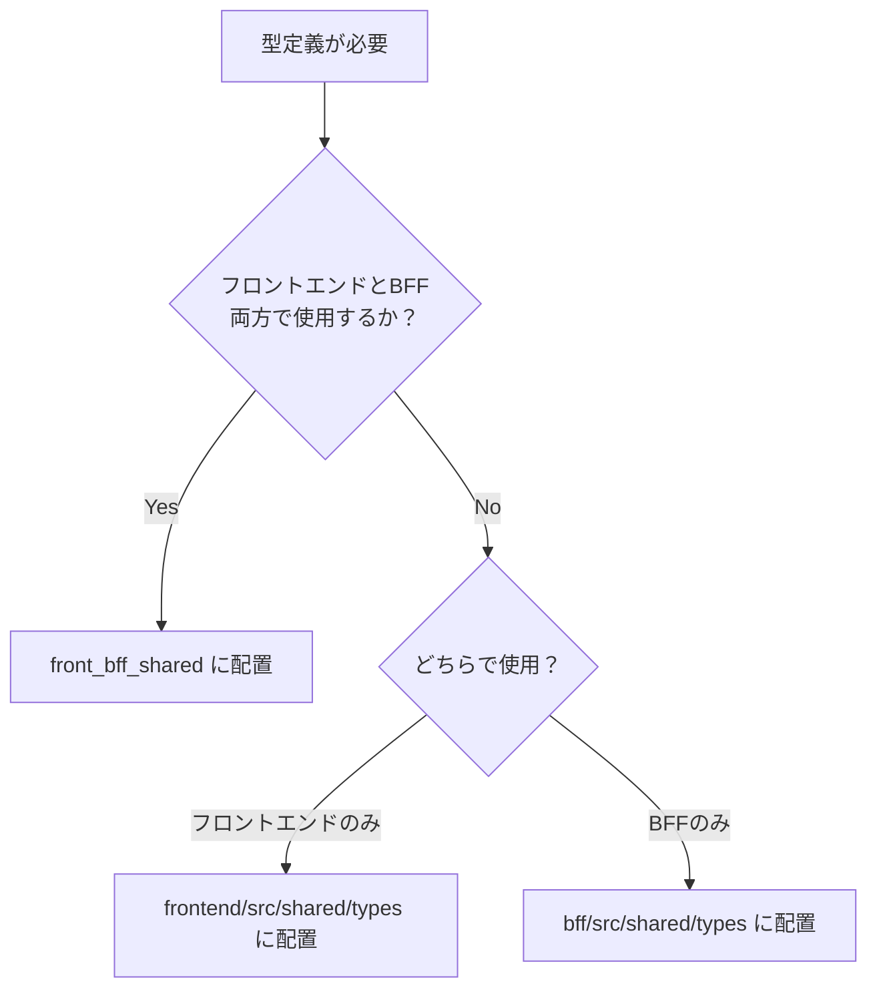

# TypeScript型管理とスキーマ共有

## 本章の範囲

本章では、**フロントエンドとBFF間で共有する型定義とバリデーションスキーマの管理方針**を定義する。

### 本章で扱う内容
- `front_bff_shared` ディレクトリによる型定義の一元管理
- Zodスキーマの定義方法と活用パターン
- フロントエンド（React Hook Form）での活用方法
- BFF（NestJS）での活用方法
- 開発環境の設定（シンボリックリンク、Next.js設定）
- i18nリソースの共有管理

### 本章で扱わない内容
以下の内容は、対応する詳細設計書を参照すること：
- **技術スタック一覧**: [01.フロントエンド・BFF共通基盤設計](./01.フロントエンド・BFF共通基盤設計.md) を参照
- **TypeScript基本設定（tsconfig.json）**: [02.開発環境](./02.開発環境.md) を参照
- **BFF内部での型定義の詳細**: [10.BFF設計](./10.BFF設計.md) を参照
- **バリデーション方針（二重化の考え方）**: 方式設計書「バリデーションについて」を参照

---

## 設計方針

### Contract-First設計の採用理由

本プロジェクトでは、フロントエンドとBFF間の通信において**Contract-First（契約優先）設計**を採用する。

#### 採用理由

| 観点 | 説明 |
|------|------|
| **型不整合の事前検出** | 型定義の変更が即座にビルドエラーとして検知されるため、実行時エラーを防止できる |
| **バリデーションルールの同期** | フロントエンドとBFFで同一のZodスキーマを共有することで、バリデーションルールの乖離を防止 |
| **開発効率の向上** | 型定義が契約（API仕様）として機能するため、ドキュメントが自己文書化される |
| **リファクタリングの容易性** | 型を変更すると関連する全てのコードでコンパイルエラーが発生するため、影響範囲を漏れなく把握できる |

#### 実現方法

`front_bff_shared` ディレクトリを**単一の真実（SSOT: Single Source of Truth）**とし、以下を一元管理する：
- API通信の型定義（Request/Response）
- バリデーションスキーマ（Zod）
- エラーメッセージ等のi18nリソース

### バリデーションの二重化

フロントエンドとBFFの両方でバリデーションを実施する。同一のZodスキーマを共有するが、**目的が異なる**。

| レイヤー | 目的 | 実行環境 | バイパスの可否 |
|---------|------|---------|-------------|
| **フロントエンド** | UX向上（即時フィードバック） | ブラウザ（ユーザーが制御可能） | 可能（開発者ツール・直接HTTPリクエストで迂回できる） |
| **BFF** | セキュリティ（最終防御ライン） | サーバー側 | 不可能 |

フロントエンドでバリデーション済みのデータでも、BFFでは必ず検証する。フロントエンドのバリデーションはあくまでブラウザ上で動作するため、悪意あるユーザーが開発者ツールやcurlで直接BFFにリクエストを送ることでバイパス可能だからである。同一スキーマを共有するのは「同じ目的で二度検証する」のではなく「ルールの乖離を防ぐため」である。

---

## ディレクトリ構造と配置ルール

### front_bff_sharedの構成

`front_bff_shared` は、プロジェクトルート直下に配置され、フロントエンドとBFFの両方からシンボリックリンクで参照される。

#### 全体構造

ディレクトリ構造の詳細は [00.ディレクトリ構成](./00.ディレクトリ構成.md) を参照すること。

```
harz/product/
└── front_bff_shared/
    ├── features/
    │   ├── shared/                     # 複数機能で共通利用するスキーマ・型
    │   │   └── schemas/
    │   │       ├── name.schema.ts      # 氏名のバリデーションルール
    │   │       ├── address.schema.ts   # 住所のバリデーションルール
    │   │       └── phone.schema.ts     # 電話番号のバリデーションルール
    │   └── <LV1機能群>/
    │       └── <LV2業務フロー>/
    │           └── <LV3画面機能>/
    │               ├── types/
    │               │   └── (機能名).types.ts   # リクエスト・レスポンス型（1ファイル）
    │               └── schemas/
    │                   └── (機能名).schema.ts
    └── i18n/
        ├── index.ts          # エントリーポイント（型エクスポート）
        ├── labels.json       # 共通ラベル
        ├── validation.json   # バリデーションエラーメッセージ
        └── errors.json       # ビジネスエラーメッセージ
```

#### ファイル命名規則

ファイル名・変数名はすべて**ローワーキャメルケース**を使用する。

| 種類 | 命名パターン | 固定サフィックス | 例 | 配置先 |
|------|-------------|----------------|-----|--------|
| **型定義ファイル** | `(機能名).types.ts` | `.types.ts` | `patientUpdate.types.ts` | `types/` |
| **Zodスキーマ** | `(機能名).schema.ts` | `.schema.ts` | `patientUpdate.schema.ts` | `schemas/` |
| **共通スキーマ** | `(項目名).schema.ts` | `.schema.ts` | `address.schema.ts` | `shared/schemas/` |

リクエスト型とレスポンス型は**1つのファイル**にまとめて定義する。別ファイルに分割すると、同一エンドポイントの定義が2ファイルに分散して可読性が低下するため。

#### 配置例

患者情報更新機能の場合：

```
front_bff_shared/
└── features/
    └── patient/              # LV1: 患者管理
        └── registration/     # LV2: 患者登録フロー
            └── update/       # LV3: 患者情報更新
                ├── types/
                │   └── patientUpdate.types.ts    # リクエスト・レスポンス両方
                └── schemas/
                    └── patientUpdate.schema.ts
```

```typescript
// patientUpdate.types.ts
// リクエスト型とレスポンス型を1ファイルで管理
import { z } from 'zod';
import { patientUpdateSchema } from '../schemas/patientUpdate.schema';

export type PatientUpdateRequest = z.infer<typeof patientUpdateSchema>;

export type PatientUpdateResponse = {
  patientId: string;
  updatedAt: string;
};
```

### 配置判断基準

#### front_bff_sharedに配置すべき型

以下に該当する型は `front_bff_shared` に配置する：

- **やっていいこと**: フロントエンドとBFFの両方で参照する型
  - API通信のリクエスト/レスポンス型
  - 両者で共有するバリデーションスキーマ
  - 両者で共有するエラーメッセージ定義

#### プロジェクト内typesに配置すべき型

以下に該当する型は各プロジェクト（`frontend/src/` または `bff/src/`）の `types/` に配置する：

- **やっていいこと**: 単一プロジェクト内でのみ使用する型
  - フロントエンド固有: コンポーネントのProps型、Store型
  - BFF固有: 内部計算用の型、DB接続用の型

#### 判断フローチャート



---

## Zodスキーマの定義パターン

Zodを使用し、**データの型とバリデーションルールを1つのスキーマで同時に定義**する。

```typescript
// 従来の方法（型とバリデーションが別々）
type UserUpdateInput = {        // 型定義（TypeScript）
  name: string;
  email: string;
};

function validate(data: UserUpdateInput) {  // バリデーション処理（別途実装）
  if (data.name.length < 2) throw new Error('名前は2文字以上');
  if (!data.email.includes('@')) throw new Error('メール形式が不正');
}
```

```typescript
// Zodを使った方法（型とバリデーションが1つのスキーマで完結）
// フィールドを追加・変更するときはスキーマだけを直せばよく、型と整合性が自動的に保たれる。
import { z } from 'zod';

const userUpdateSchema = z.object({
  name: z.string().min(2, '名前は2文字以上で入力してください'),  // 型定義 + バリデーション
  email: z.string().email('有効なメールアドレスを入力してください'),
});

// スキーマから型を自動生成（手書き不要）
type UserUpdateInput = z.infer<typeof userUpdateSchema>;
// → { name: string; email: string; } と同等
```

### 基本的な定義方法

POC検証結果に基づき、以下のパターンを標準とする。

#### プリミティブ型の検証

**ファイル**: `front_bff_shared/features/user/profile/update/schemas/userUpdate.schema.ts`

```typescript
import { z } from 'zod';

export const userUpdateSchema = z.object({
  name: z.string()
    .min(2, '名前は2文字以上で入力してください')
    .max(10, '10文字以内でお願いします'),
  
  email: z.string()
    .email('有効なメールアドレスを入力してください'),
  
  age: z.number()
    .int('整数で入力してください')
    .min(0, '0以上の値を入力してください')
    .max(150, '150以下の値を入力してください')
    .optional(),
});

// 型推論（手書きの型定義は不要）
export type UserUpdateInput = z.infer<typeof userUpdateSchema>;
```

#### オブジェクトと配列の検証

```typescript
import { z } from 'zod';
import { addressSchema } from '@/front_bff_shared/features/shared/schemas/address.schema';

export const patientUpdateSchema = z.object({
  // 共通スキーマを再利用（コピペしない）
  address: addressSchema,
  
  // 配列
  allergies: z.array(
    z.string().min(1, 'アレルギー名を入力してください')
  ).optional(),
  
  // 配列（オブジェクト）
  medications: z.array(
    z.object({
      name: z.string().min(1, '薬品名を入力してください'),
      dosage: z.string().min(1, '用量を入力してください'),
    })
  ).optional(),
});

export type PatientUpdateInput = z.infer<typeof patientUpdateSchema>;
```

#### カスタムバリデーション

```typescript
import { z } from 'zod';

export const appointmentSchema = z.object({
  startDate: z.string(),
  endDate: z.string(),
}).refine(
  (data) => new Date(data.startDate) < new Date(data.endDate),
  {
    message: '終了日時は開始日時より後に設定してください',
    path: ['endDate'], // エラーを表示するフィールド
  }
);

export type AppointmentInput = z.infer<typeof appointmentSchema>;
```

### 共通スキーマの切り出し

複数の機能スキーマに登場するバリデーションルールは `shared/schemas/` に切り出して再利用する。コピペで散在させると、ルール変更時に全箇所を修正する必要が生じる。

#### 切り出し基準

以下のいずれかに該当する場合に切り出す：

| 基準 | 例 |
|------|-----|
| **2箇所以上で使用される** | `name`（氏名）が患者登録・患者更新・スタッフ登録で共通 |
| **ドメイン横断で使われる** | `addressSchema`（住所）が患者・施設・請求など複数ドメインで登場 |
| **医療・行政の仕様に基づくフォーマットがある** | 郵便番号（7桁数字）、電話番号（ハイフン区切り）など規格が決まっているもの |

逆に以下の場合は切り出さない：

| 基準 | 例 |
|------|-----|
| **1箇所だけで使われる** | 特定の検査記録画面だけに存在するフィールド |
| **他のスキーマと形が似ているが意味が違う** | `memo`（患者備考）と `note`（処方メモ）は文字数制限が同じでも別管理 |

```typescript
// 共通スキーマ（切り出し）
// front_bff_shared/features/shared/schemas/name.schema.ts
import { z } from 'zod';

export const nameSchema = z.string()
  .min(2, '名前は2文字以上で入力してください')
  .max(50, '名前は50文字以内で入力してください');
```

```typescript
// 共通スキーマ（切り出し）
// front_bff_shared/features/shared/schemas/address.schema.ts
import { z } from 'zod';

export const addressSchema = z.object({
  postalCode: z.string().regex(/^\d{7}$/, '郵便番号は7桁の数字で入力してください'),
  prefecture: z.string().min(1, '都道府県を選択してください'),
  city: z.string().min(1, '市区町村を入力してください'),
});
```

```typescript
// 機能固有スキーマ（共通スキーマを組み合わせる）
// front_bff_shared/features/patient/registration/create/schemas/patientCreate.schema.ts
import { z } from 'zod';
import { nameSchema } from '@/front_bff_shared/features/shared/schemas/name.schema';
import { addressSchema } from '@/front_bff_shared/features/shared/schemas/address.schema';

export const patientCreateSchema = z.object({
  name: nameSchema,       // 再利用
  address: addressSchema, // 再利用
  birthDate: z.string().min(1, '生年月日を入力してください'),
});
```

### 命名規則

ファイル名・変数名はすべて**ローワーキャメルケース**を使用する。固定サフィックスはツール・IDE補完で識別しやすくするためのものであり、省略しない。

| 対象 | 命名パターン | 固定サフィックス | 例 |
|------|-------------|----------------|-----|
| **スキーマ変数** | `(機能名)(操作)Schema` | `Schema` | `userUpdateSchema`, `patientCreateSchema` |
| **型名（Input）** | `(機能名)(操作)Input` | `Input` | `UserUpdateInput`, `PatientCreateInput` |
| **型名（Response）** | `(機能名)(操作)Response` | `Response` | `UserUpdateResponse`, `PatientCreateResponse` |
| **ファイル名（型）** | `(機能名).types.ts` | `.types.ts` | `userUpdate.types.ts` |
| **ファイル名（スキーマ）** | `(機能名).schema.ts` | `.schema.ts` | `userUpdate.schema.ts` |

### 実装ルール

#### やっていいこと
- スキーマ定義にカスタムエラーメッセージを記述する
- `.optional()` や `.nullable()` を使って、省略可能なフィールドを明示する
- `.refine()` を使って、複数フィールドにまたがる検証ロジックを実装する
- `z.infer<typeof schema>` で型を自動生成する
- 複数のスキーマで共通するフィールドのルールを `shared/schemas/` に切り出して再利用する

#### やってはいけないこと
- 型定義とスキーマ定義を別々に書いて二重管理する
- 同じバリデーションルール（例: `name` フィールドの文字数制限）を複数のスキーマにコピペする
- エラーメッセージを省略する（ユーザーフィードバックが不明瞭になる）
- スキーマファイルに複数の無関係なスキーマを詰め込む

---

## 入力相関バリデーション設計

「入力相関」とは、あるフィールドの値が別フィールドのバリデーションルールに影響する関係を指す。
Zodで表現できる範囲と、Zodスコープ外（UI制御層）で扱う範囲を明確に分担する。

### `.refine()` と `.superRefine()` の使い分け

| | `.refine()` | `.superRefine()` |
|---|---|---|
| エラー追加数 | 1件 | 複数件 |
| エラーパス指定 | `path` オプション（明示的に指定） | `ctx.addIssue()` で動的指定 |
| スキーマチェーン | 可能（連続呼び出しで複数条件を検証） | 複数フィールド依存の単一チェックに適する |
| 使う場面 | 単純な比較・単一条件・形式チェック | 複数条件分岐・複数フィールド依存の複合判定 |

**方針**: 入力相関バリデーションには原則 `.superRefine()` を使う。単一フィールドの形式チェックは `.refine()` で十分。

注意: `.refine()` を複数チェーンする場合、最初のチェックで失敗するとそれ以降のチェーンは実行されない（short-circuit動作）。

例: `uploadFileSchema`（パターン3）で `.custom()` が失敗した場合、形式チェック（第2の `.refine()`）とサイズチェック（第3の `.refine()`）は実行されず、エラーはファイル選択エラーのみが返される。複数のエラーをすべて表示したい場合は、各チェックを別々の `.superRefine()` 呼び出しで実装すること。

### パターン別実装ガイド

#### パターン1: 条件付き必須

あるフィールドの値によって、別フィールドが必須になるケース。

```typescript
import { messages } from '@/front_bff_shared/i18n';

// 例: 選択肢で「その他」を選んだ場合、詳細説明が必須
export const conditionalRequiredSchema = z
  .object({
    category: z.string().min(1, messages.validation.categoryRequired),
    description: z.string().optional(),
  })
  .superRefine((data, ctx) => {
    if (data.category === 'other' && (!data.description || data.description.trim() === '')) {
      ctx.addIssue({
        code: z.ZodIssueCode.custom,
        message: messages.validation.descriptionRequiredWhenOther,
        path: ['description'],
      });
    }
  });
```

#### パターン2: フィールド間比較

複数フィールドの値の大小・前後関係を検証するケース。

```typescript
import { messages } from '@/front_bff_shared/i18n';

// 例: 開始日時 < 終了日時 の検証
export const dateRangeSchema = z
  .object({
    startDate: z.string().min(1, messages.validation.startDateRequired),
    endDate: z.string().min(1, messages.validation.endDateRequired),
  })
  .superRefine((data, ctx) => {
    const start = new Date(data.startDate);
    const end = new Date(data.endDate);
    if (!isNaN(start.getTime()) && !isNaN(end.getTime()) && start >= end) {
      ctx.addIssue({
        code: z.ZodIssueCode.custom,
        message: messages.validation.endDateAfterStartDate,
        path: ['endDate'],
      });
    }
  });
```

#### パターン3: 複合バリデーション（ファイル）

複数の独立した条件をチェーンで連結するケース。

```typescript
import { messages } from '@/front_bff_shared/i18n';

// 例: ファイル形式 + ファイルサイズの検証
export const uploadFileSchema = z
  .custom<File>(
    (file) => file instanceof File,
    { message: messages.validation.fileRequired }
  )
  .refine(
    (f) => ['image/jpeg', 'image/png', 'application/pdf'].includes(f.type),
    { message: messages.validation.fileFormatInvalid }
  )
  .refine(
    (f) => f.size <= 5 * 1024 * 1024,
    { message: messages.validation.fileSizeExceeded }
  );
```

### Zodスコープ外の相関制御

以下はZodスキーマではなく、各実装層で制御する。

| 制御内容 | 実装層 | 例 |
|---------|------|-----|
| フィールドの活性/非活性切替 | UIコンポーネント（`disabled` prop） | チェック選択 → 削除ボタン活性化 |
| ロール別フィールド制御 | UIコンポーネント（条件付きレンダリング） | 管理者ロールのみ編集可能、他は参照のみ |
| 状態遷移による一括制御 | Zustand store 連携 | 「ロック状態」になると全フィールド編集不可 |
| 手描き・描画内容チェック | `onSubmit` ハンドラ | キャンバスに描画がない場合は送信不可 |
| ユーザー操作の確認ダイアログ | イベントハンドラ | 重要な操作前に確認ダイアログを表示 |

---

## フロントエンドでのスキーマ活用

### React Hook Formとの連携

POC検証で実証された実装パターンを標準とする。

#### 基本的な実装パターン

**ファイル**: `frontend/src/features/user/profile/update/components/molecules/UserUpdateForm.tsx`

```tsx
'use client';

import { useForm } from 'react-hook-form';
import { zodResolver } from '@hookform/resolvers/zod';
import { userUpdateSchema, UserUpdateInput } from '@/front_bff_shared/features/user/profile/update/schemas/userUpdate.schema';

export const UserUpdateForm = () => {
  const {
    register,
    handleSubmit,
    formState: { errors, isValid }
  } = useForm<UserUpdateInput>({
    resolver: zodResolver(userUpdateSchema),
    // mode: 'onSubmit' がデフォルト（ボタン押下時のみバリデーション）
    // リアルタイムバリデーションが必要な場合は mode: 'onChange' を明示的に指定
  });

  const onSubmit = async (data: UserUpdateInput) => {
    console.log('✅ バリデーション成功:', data);
    // BFF APIへ送信
    // await updateUser(data);
  };

  return (
    <form onSubmit={handleSubmit(onSubmit)} className="space-y-4 p-4">
      <div>
        <label htmlFor="name">名前</label>
        <input
          id="name"
          {...register('name')}
          className="border p-2 w-full"
        />
        {errors.name && (
          <p className="text-red-500 text-sm">{errors.name.message}</p>
        )}
      </div>

      <div>
        <label htmlFor="email">メール</label>
        <input
          id="email"
          type="email"
          {...register('email')}
          className="border p-2 w-full"
        />
        {errors.email && (
          <p className="text-red-500 text-sm">{errors.email.message}</p>
        )}
      </div>

      <button
        type="submit"
        disabled={!isValid}
        className={isValid ? "bg-blue-500 text-white p-2" : "bg-gray-300 p-2"}
      >
        更新
      </button>
    </form>
  );
};
```

#### バリデーション成功・失敗の挙動

**成功時（バリデーション通過）**

入力値がスキーマの条件をすべて満たしている場合、`handleSubmit` が `onSubmit` を呼び出し、BFFへリクエストを送信する。

```
入力例:
  name: "山田太郎"  → OK（2文字以上10文字以内）
  email: "yamada@example.com"  → OK（有効なメールアドレス形式）

送信されるリクエスト:
  { "name": "山田太郎", "email": "yamada@example.com" }
```

**失敗時（バリデーション不通過）**

入力値がスキーマの条件を満たさない場合、`handleSubmit` は `onSubmit` を呼び出さず、`errors` にエラー情報が格納される。

```
入力例:
  name: "山"  → NG（2文字未満）
  email: "yamada"  → NG（メールアドレス形式でない）

表示されるエラー:
  name フィールド下: "名前は2文字以上で入力してください"
  email フィールド下: "有効なメールアドレスを入力してください"

リクエストは送信されない。
```

#### zodResolverの使用方法

`zodResolver` は、ZodスキーマをReact Hook Formと連携させるアダプターである。

```typescript
import { zodResolver } from '@hookform/resolvers/zod';

const { register, handleSubmit } = useForm<UserUpdateInput>({
  resolver: zodResolver(userUpdateSchema),
  // ↑ Zodスキーマによるバリデーションを有効化
  // mode: 'onSubmit' がデフォルト（ボタン押下時のみ検証）
});
```

#### フォーム状態管理の最適化

React Hook Formは**非制御コンポーネント**を採用しているため、入力時の再レンダリングを最小限に抑える。

| 項目 | 説明 |
|------|------|
| **register** | DOM ref経由で入力値を管理（`useState` 不要） |
| **formState** | バリデーション状態（`errors`, `isValid`）を提供 |
| **handleSubmit** | バリデーション成功時のみ `onSubmit` を実行 |

### エラーハンドリング

#### エラーメッセージの表示方法

POC検証結果に基づき、以下のパターンを標準とする：

```tsx
{errors.name && (
  <p className="text-red-500 text-sm">{errors.name.message}</p>
)}
```

- `errors.(フィールド名)` でエラーの有無を確認
- `errors.(フィールド名).message` でZodスキーマのカスタムメッセージを表示

#### バリデーション実行タイミング

バリデーションの実行タイミングについては、[04.状態管理設計](./04.状態管理設計.md)の「入力：フォーム管理規約」で定義されている。

**基盤としての標準方針**:
- デフォルトは **`mode: 'onSubmit'`**（ボタン押下時のみバリデーション実行）
- 登録・更新・追加などのボタン押下時にのみ検証を行うことで、入力中の過剰なエラー表示を避ける

**例外的なケース**:
- リアルタイムバリデーションが必要な場合（例: パスワード強度のリアルタイム表示など）は、`mode: 'onChange'` や `mode: 'onBlur'` を明示的に指定する
- この判断はアプリチーム側の設計書に記載する

```typescript
// デフォルト（ボタン押下時のみ）
useForm<UserUpdateInput>({
  resolver: zodResolver(userUpdateSchema),
  // mode: 'onSubmit' は省略可能（デフォルト）
});

// 例外: リアルタイムバリデーションが必要な場合
useForm<UserUpdateInput>({
  resolver: zodResolver(userUpdateSchema),
  mode: 'onChange', // 明示的に指定
});
```

#### isValidによる送信制御

POC検証結果に基づき、`formState.isValid` を活用して送信ボタンを制御する。

```tsx
const { formState: { isValid } } = useForm<UserUpdateInput>({ /*...*/ });

<button
  type="submit"
  disabled={!isValid}
  className={isValid ? "bg-blue-500 text-white p-2" : "bg-gray-300 p-2"}
>
  更新
</button>
```

- **効果**: バリデーションエラーがある間は送信ボタンが非活性化され、不正データの送信を防止

---

## BFFでのスキーマ活用

### フロントエンド検証とBFF検証を分ける必要性

フロントエンドと同じZodスキーマを使ってBFFでも検証を行う。同じルールを適用するが、**目的が異なる**ため、両方で検証することに意味がある。

| 観点 | フロントエンド | BFF |
|------|-------------|-----|
| **目的** | UX向上（即時フィードバック） | セキュリティ（最終防御） |
| **実行場所** | ブラウザ（ユーザーが制御可能） | サーバー（ユーザーが制御不可） |
| **バイパス** | 可能（開発者ツールやcurlで迂回できる） | 不可能 |
| **役割** | エラーがあれば送信ボタンを非活性化し、無駄な通信を削減 | 届いたリクエストをすべて検証し、不正データを遮断 |

#### なぜBFFでも検証が必要か

フロントエンドのバリデーションはブラウザ上で動作するため、curlや開発者ツールで簡単にバイパスできる。BFFはブラウザを経由しないリクエストも必ず受け取るため、サーバー側での検証が不可欠である。

```
正直なユーザー:  [ブラウザ] → フロントエンド検証 → BFF検証 → DB
悪意あるユーザー:                             curl → BFF検証 → DB
                                                     ↑ここで防ぐ
```

#### 同じスキーマを共有する理由

フロントエンドとBFFで別々にバリデーションルールを書くと、後から片方だけルールを変更した際に乖離が生じる。たとえば「患者名は10文字以内」というルールをフロントエンドで20文字に緩めたが、BFFは10文字のままだと、ユーザーには入力できているように見えてもBFFでエラーが返る。同一スキーマを共有することでこの乖離を防ぐ。

フロントエンドでバリデーション済みのリクエストがBFFに届いても、BFFでは同じスキーマで必ず再検証する。フロントエンドのバリデーションはあくまでUX改善であり、セキュリティの責任はBFFが持つ。

### リクエストバリデーション

#### Controller層でのスキーマ適用

**ファイル**: `bff/src/features/user/profile/update/userUpdate.controller.ts`

```typescript
import { Controller, Post, Body } from '@nestjs/common';
import { userUpdateSchema, UserUpdateInput } from '@/front_bff_shared/features/user/profile/update/schemas/userUpdate.schema';

@Controller('users')
export class UserUpdateController {
  @Post('update')
  async updateUser(@Body() body: unknown) {
    // Zodスキーマで検証
    const validatedData: UserUpdateInput = userUpdateSchema.parse(body);
    
    // 検証成功後の処理
    console.log('✅ バリデーション成功:', validatedData);
    
    // Service層へ委譲
    // return this.userService.update(validatedData);
  }
}
```

#### .parse() による検証と型保証

`schema.parse(data)` は、以下の動作をする：

| 結果 | 動作 |
|------|------|
| **バリデーション成功** | 型保証されたデータを返却 |
| **バリデーション失敗** | `ZodError` を throw |

```typescript
try {
  const validatedData = userUpdateSchema.parse(body);
  // validatedData は UserUpdateInput 型として保証される
} catch (error) {
  if (error instanceof ZodError) {
    // バリデーションエラーのハンドリング
    console.error('バリデーションエラー:', error.errors);
  }
}
```

#### バリデーションエラーのハンドリング

NestJS の Exception Filter を使って、`ZodError` をプロジェクト標準の統一エラーレスポンスに変換し、HTTP 400 で返却する。レスポンス形式・各フィールドの定義・`errors[].code` の一覧は [09章 BFFエラーレスポンス](./09.監視・エラーハンドリング.md#bffエラーレスポンス) を参照。

**ファイル**: `bff/src/shared/filters/zod-exception.filter.ts`

> 下記コードは方針説明用の抜粋。実装本体は `product/bff/src/shared/filters/zod-exception.filter.ts` に集約する。

```typescript
import { ExceptionFilter, Catch, ArgumentsHost, HttpStatus } from '@nestjs/common';
import type { Request, Response } from 'express';
import { ZodError, ZodIssue } from 'zod';

// Zod 内部コード → プロジェクト標準コード変換
// 変換ルールの詳細は 09章「Zod 内部コードからプロジェクトコードへの変換ルール」を参照
function mapZodCodeToProjectCode(issue: ZodIssue): 'REQUIRED' | 'INVALID_FORMAT' | 'INVALID_TYPE' {
  if (issue.code === 'invalid_type') {
    return issue.received === 'undefined' || issue.received === 'null' ? 'REQUIRED' : 'INVALID_TYPE';
  }
  return 'INVALID_FORMAT'; // too_small/too_big/invalid_string/invalid_enum_value/custom 等
}

@Catch(ZodError)
export class ZodExceptionFilter implements ExceptionFilter {
  catch(exception: ZodError, host: ArgumentsHost) {
    const ctx = host.switchToHttp();
    const request = ctx.getRequest<Request>();
    const response = ctx.getResponse<Response>();

    const errors = exception.issues.map((issue) => ({
      // path は string/number/symbol が混在するため String(p) で結合
      field: issue.path.map((p) => String(p)).join('.'),
      code: mapZodCodeToProjectCode(issue),
      message: issue.message,
    }));

    response.status(HttpStatus.BAD_REQUEST).json({
      title: '不正なリクエストです。',
      status: 400,
      detail: '入力内容に不備があります。各項目の詳細を確認してください。',
      instance: request.url, // リクエストパス文字列（例: "/clinical/entry/vital-info"）
      errors,
      traceId: getTraceId(request), // 監査ログ・Sentry と紐付くリクエストID
    });
  }
}
```

> `getTraceId(request)` は別途共通ユーティリティとして提供する想定。BFF 側のリクエストIDミドルウェアで採番された値（UUID）を取得する。

### 実装パターン

本プロジェクトでは、**コントローラー単位での検証**を標準パターンとする。

#### 標準パターン: コントローラー単位での検証

各コントローラーで明示的にスキーマを適用する。

```typescript
@Controller('users')
export class UserUpdateController {
  @Post('update')
  async updateUser(@Body() body: unknown) {
    // Zodスキーマで明示的に検証
    const validatedData = userUpdateSchema.parse(body);
    
    // 以降、validatedData は型保証されている
    // return this.userService.update(validatedData);
  }
}
```

#### 採用理由

| 理由 | 説明 |
|------|------|
| **可読性** | コントローラー内で検証ロジックが完結し、コードが追いやすい。ミドルウェアに隠蔽されないため、エンドポイントの仕様が一目で把握できる |
| **柔軟性** | エンドポイントごとに異なるスキーマを容易に適用でき、特定のエンドポイントだけバリデーションを変更する場合も影響範囲が局所的 |
| **型安全性** | `parse()` の戻り値が型推論されるため、TypeScriptの恩恵を最大限に受けられる。IDEの補完も正確に機能する |
| **デバッグ容易性** | バリデーションエラーが発生した際、どのコントローラーのどのスキーマで失敗したかが明確 |

---

## 多言語対応（i18n）リソースの共有

### リソースファイルの構成

エラーメッセージやラベル名など、フロントエンドとBFFの両方で必要となる文言定義を共有資産として管理する。メッセージの種類が増えても管理が破綻しないよう、**種類ごとにファイルを分割**する。

```
front_bff_shared/
└── i18n/
    ├── index.ts          # エントリーポイント（各ファイルを統合・型エクスポート）
    ├── labels.json       # 共通ラベル（"患者ID", "診療科" 等）
    ├── validation.json   # バリデーションエラーメッセージ
    └── errors.json       # ビジネスエラーメッセージ
```

### 共有すべきメッセージの種類

| ファイル | 対象メッセージ | 例 | 共有理由 |
|---------|-------------|-----|---------|
| **labels.json** | 共通ラベル | "患者ID", "診療科", "予約日時" | 用語の統一 |
| **validation.json** | バリデーションエラー | "名前は2文字以上で入力してください" | フロントエンドとBFFで同一メッセージを表示 |
| **errors.json** | ビジネスエラー | "この患者IDは既に登録されています" | BFFで発生したエラーをフロントエンドに通知 |

1ファイルで全種類を管理すると、プロジェクトが成長するにつれてファイルが肥大化し、メッセージの追加・修正時に影響範囲が不明確になる。種類ごとにファイルを分けることで「バリデーションメッセージだけ変更したい」「ビジネスエラーを確認したい」という操作が容易になる。

#### ファイル内容例

**`labels.json`**:

```json
{
  "patientId": "患者ID",
  "department": "診療科",
  "appointmentDate": "予約日時",
  "name": "氏名",
  "birthDate": "生年月日"
}
```

**`validation.json`**:

```json
{
  "nameMinLength": "名前は2文字以上で入力してください",
  "nameMaxLength": "名前は50文字以内で入力してください",
  "emailInvalid": "有効なメールアドレスを入力してください",
  "postalCodeFormat": "郵便番号は7桁の数字で入力してください",
  "required": "この項目は必須です"
}
```

**`errors.json`**:

```json
{
  "patientIdDuplicate": "この患者IDは既に登録されています",
  "networkError": "通信エラーが発生しました。再度お試しください",
  "unauthorized": "ログインセッションが切れました。再度ログインしてください"
}
```

### 型推論による管理

各JSONファイルから直接型を推論することで、`config.ts` に `Messages` 型を手書きする二重管理を解消する。メッセージを追加する場合はJSONファイルにキーと文字列を追加するだけでよく、型は自動的に更新される。

**`index.ts`**:

i18n設定・型エクスポートの構造を管理。JSONファイルの追加・削除があった場合のみ修正する。
**基盤チームが作成・管理する。**

```typescript
// front_bff_shared/i18n/index.ts

import labels from './labels.json';
import validation from './validation.json';
import errors from './errors.json';

// JSONから型を推論（手書き型定義は不要）
export type LabelMessages = typeof labels;
export type ValidationMessages = typeof validation;
export type ErrorMessages = typeof errors;

export const i18nConfig = {
  defaultLocale: 'ja' as const,
  locales: ['ja'] as const,
} as const;

export type Locale = typeof i18nConfig.locales[number];

// 統合されたメッセージオブジェクト（利用側はここからimport）
export const messages = {
  labels,
  validation,
  errors,
} as const;
```

### 活用方法

#### Zodスキーマでのカスタムメッセージ

```typescript
import { z } from 'zod';
import { messages } from '@/front_bff_shared/i18n';

export const userUpdateSchema = z.object({
  name: z.string().min(2, messages.validation.nameMinLength),
  email: z.string().email(messages.validation.emailInvalid),
});
```

#### BFFビジネスエラーメッセージ

```typescript
import { messages } from '@/front_bff_shared/i18n';

if (await this.userService.isDuplicate(data.patientId)) {
  throw new BadRequestException(messages.errors.patientIdDuplicate);
}
```

#### 管理のメリット

| メリット | 説明 |
|---------|------|
| **トーン＆マナーの統一** | フロントエンドとBFFで一貫したメッセージを提供 |
| **二重管理の解消** | JSONのみ編集すれば型も自動更新される |
| **メッセージの保守性向上** | 種類ごとにファイルが分かれており、修正対象が明確 |
| **多言語化対応の容易性** | 将来的に英語等の言語を追加する際、一括で翻訳管理が可能 |
