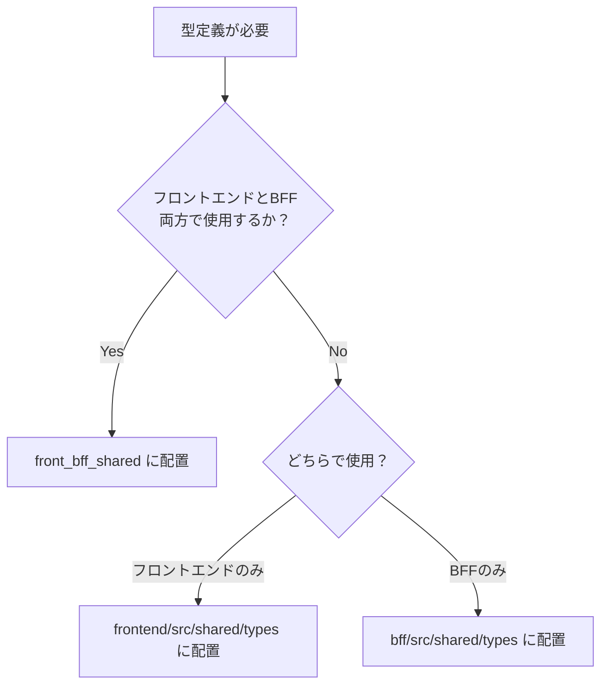

# TypeScript型管理規約

| 関連設計書 | リンク |
|---|---|
| Zodスキーマ基盤設計 | [Zodスキーマ基盤設計.md](./Zodスキーマ基盤設計.md) |
| BFFバリデーション基盤設計 | [BFFバリデーション基盤設計.md](./BFFバリデーション基盤設計.md) |
| i18nリソース共有設計 | [i18nリソース共有設計.md](./i18nリソース共有設計.md) |

---

## 1. 型・スキーマの配置規約

> 根拠: [ADR-1](adr/contract-first-design.md)

### 1-1. 配置判断フロー



### 1-2. 配置先の基準

| 配置先 | 対象 |
|---|---|
| `front_bff_shared/features/.../types/` | API通信のリクエスト/レスポンス型 |
| `front_bff_shared/features/.../schemas/` | フロントエンドとBFFで共有するZodスキーマ |
| `front_bff_shared/features/shared/schemas/` | 複数機能で共通利用するZodスキーマ |
| `front_bff_shared/i18n/` | 両側で共有するエラーメッセージ・ラベル |
| `frontend/src/shared/types/` | コンポーネントProps型、Store型等フロントエンド固有 |
| `bff/src/shared/types/` | DB接続用型、内部計算用型等BFF固有 |

**Do**: フロントエンドとBFFの両方で参照する型は `front_bff_shared` に配置する。

**Don't**: フロントエンド固有の型（Propsや内部State）を `front_bff_shared` に置かない。BFF固有の型（ORM Entityなど）も同様。

### 1-3. ディレクトリ構成

```
front_bff_shared/
├── features/
│   ├── shared/                     # 複数機能で共通利用するスキーマ・型
│   │   └── schemas/
│   │       ├── name.schema.ts
│   │       ├── address.schema.ts
│   │       └── phone.schema.ts
│   └── <LV1機能群>/
│       └── <LV2業務フロー>/
│           └── <LV3画面機能>/
│               ├── types/
│               │   └── (機能名).types.ts   # リクエスト・レスポンス型（1ファイル）
│               └── schemas/
│                   └── (機能名).schema.ts
└── i18n/
    ├── index.ts          # エントリーポイント（型エクスポート）
    ├── labels.json
    ├── validation.json
    └── errors.json
```

---

## 2. 基盤 I/F 利用規約

> **基盤が提供するスキーマ・i18nメッセージ・型を経由しない直接実装は禁止する。**

> 根拠: [ADR-1](adr/contract-first-design.md)

| 用途 | ✅ 経由必須 I/F | ⛔ バイパス禁止 | 詳細 |
|---|---|---|---|
| Zodスキーマ利用 | `front_bff_shared/features/.../schemas/*.schema.ts` | スキーマ手書きコピー | [Zodスキーマ基盤設計.md](./Zodスキーマ基盤設計.md) §1 |
| バリデーションエラーメッセージ | `messages.validation.*`（i18n/index.ts経由） | スキーマ内の文字列リテラル直書き | [i18nリソース共有設計.md](./i18nリソース共有設計.md) §2 |
| ビジネスエラーメッセージ | `messages.errors.*`（i18n/index.ts経由） | BFF側での文字列直書き | [i18nリソース共有設計.md](./i18nリソース共有設計.md) §2 |
| 共通ラベル | `messages.labels.*`（i18n/index.ts経由） | UIコンポーネント内のラベル文字列直書き | [i18nリソース共有設計.md](./i18nリソース共有設計.md) §2 |
| i18n JSON 参照 | `messages.*`（i18n/index.ts 経由） | `labels.json` / `validation.json` / `errors.json` を直接 import | [i18nリソース共有設計.md](./i18nリソース共有設計.md) §2 |
| 型定義（API通信） | `z.infer<typeof schema>` による型推論 | Request/Response型の手書き定義 | §3 |

**例外条件**:

| 条件 | 例外 |
|---|---|
| プロトタイプ・PoC実装 | バイパス可（本番コードに残さない） |
| 基盤チームによるスキーマ新規作成 | 新規ファイル作成時のみ直書き可 |

**PR レビュー観点（grep ターゲット）**:

```bash
# バリデーションメッセージの文字列直書き検出
grep -r "z\.string()\.min\|z\.string()\.max" front_bff_shared/ --include="*.ts" | grep -v "messages\."

# 型の手書き定義検出（Request/Response型）
grep -rn "type.*Request\s*=" frontend/src/ --include="*.ts"
grep -rn "type.*Response\s*=" frontend/src/ --include="*.ts"
```

---

## 3. 命名規則

| 対象 | 命名パターン | 固定サフィックス | 例 |
|---|---|---|---|
| **スキーマ変数** | `(機能名)(操作)Schema` | `Schema` | `userUpdateSchema`, `patientCreateSchema` |
| **型名（Input）** | `(機能名)(操作)Input` | `Input` | `UserUpdateInput`, `PatientCreateInput` |
| **型名（Response）** | `(機能名)(操作)Response` | `Response` | `UserUpdateResponse`, `PatientCreateResponse` |
| **ファイル名（型）** | `(機能名).types.ts` | `.types.ts` | `userUpdate.types.ts` |
| **ファイル名（スキーマ）** | `(機能名).schema.ts` | `.schema.ts` | `userUpdate.schema.ts` |

ファイル名・変数名はすべて**ローワーキャメルケース**。固定サフィックスはIDE補完で識別しやすくするため省略しない。

---

## 4. 型ファイルの構成規則

リクエスト型とレスポンス型は**1つのファイル**にまとめて定義する。

**Do**:
```typescript
// patientUpdate.types.ts — リクエスト・レスポンス両方を1ファイルで管理
import { z } from 'zod';
import { patientUpdateSchema } from '../schemas/patientUpdate.schema';

export type PatientUpdateRequest = z.infer<typeof patientUpdateSchema>;

export type PatientUpdateResponse = {
  patientId: string;
  updatedAt: string;
};
```

**Don't**:
```typescript
// NG: 型定義とスキーマ定義を別々に手書きして二重管理する
type PatientUpdateRequest = {  // 手書き型定義
  name: string;
  address: string;
};
// スキーマと型が乖離するリスクが高い
```

---

## 5. 共通スキーマの切り出し規則

### 5-1. 切り出す基準

| 基準 | 例 |
|---|---|
| 2箇所以上で使用される | `name`（氏名）が患者登録・患者更新・スタッフ登録で共通 |
| ドメイン横断で使われる | `addressSchema`（住所）が患者・施設・請求など複数ドメインで登場 |
| 医療・行政の仕様に基づくフォーマットがある | 郵便番号（7桁数字）、電話番号（ハイフン区切り）等 |

### 5-2. 切り出さない基準

| 基準 | 例 |
|---|---|
| 1箇所だけで使われる | 特定の検査記録画面だけに存在するフィールド |
| 形が似ているが意味が違う | `memo`（患者備考）と `note`（処方メモ）は文字数制限が同じでも別管理 |

**Do**:
```typescript
// 共通スキーマを再利用する
import { addressSchema } from '@/front_bff_shared/features/shared/schemas/address.schema';

export const patientUpdateSchema = z.object({
  address: addressSchema,  // 再利用
});
```

**Don't**:
```typescript
// NG: 同じバリデーションルールをコピペする
export const patientUpdateSchema = z.object({
  address: z.object({
    postalCode: z.string().regex(/^\d{7}$/, '郵便番号は7桁の数字で入力してください'), // コピペ
  }),
});
```

---

## 6. フォームバリデーション実行タイミング規約

フロントエンドの `useForm` におけるバリデーション実行タイミングの標準は **`mode: 'onSubmit'`（送信時）** とする。

**Don't**: `mode` を省略せず、必ず明示指定する。

リアルタイムバリデーション（`mode: 'onChange'`）が必要な場合は、アプリチームの設計書に理由を記載した上で明示指定する。詳細は [Zodスキーマ基盤設計.md §2-2](./Zodスキーマ基盤設計.md#2-2-バリデーション実行タイミング) を参照。

---

## 責務サマリ表

| アプリチームがすること | 参照先 |
|---|---|
| 型・スキーマは `front_bff_shared` に配置する | §1-2 |
| 共有型は `z.infer<typeof schema>` で型推論する（手書き不要） | §4 |
| エラーメッセージは `messages.validation.*` から参照する | [i18nリソース共有設計.md §2](./i18nリソース共有設計.md) |
| 共通スキーマは `shared/schemas/` から再利用する | §5 |
| フロントエンドでは `zodResolver(schema)` を利用する | [Zodスキーマ基盤設計.md §2](./Zodスキーマ基盤設計.md) |
| バリデーションモードは `onSubmit` を標準とする | §6 |
| BFFでは `schema.parse(body)` を利用する | [BFFバリデーション基盤設計.md §1](./BFFバリデーション基盤設計.md) |
