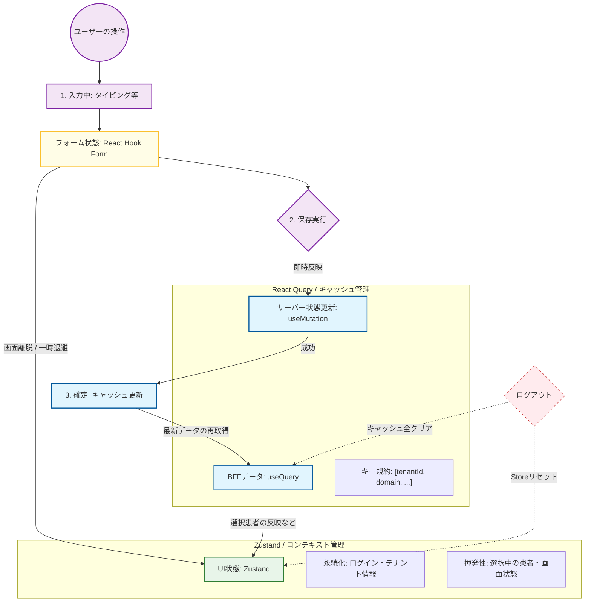

# 状態管理設計

本章では、電子カルテの複雑なデータを「サーバー」「クライアント」「フォーム」の3つの状態に分類し、それぞれの役割と寿命（ライフサイクル）に応じた管理規約を定義する。
また、これら3つの境界を明確に分離することで、1万件規模のデータ描画に耐えうるパフォーマンスと、テナント間のデータ混入を物理的に遮断する安全性を両立させる。

## 状態管理分類図


---

## ライフサイクルによる状態の定義

状態（State）を「どこのデータか」という場所だけでなく、「いつ生まれて、いつ消えるか」という**寿命（ライフサイクル）**の観点で以下の3つに定義する。

### サーバー状態 (Server State)
BFF（Backend For Frontend）などの外部リソースに実体があり、フロントエンドがそのコピーを保持している状態。
* **主なデータ**: 1万件の経過記録、患者基本情報、マスタデータ（職員・病名等）。
* **ライフサイクル**: キャッシュ戦略に基づき管理。画面を閉じても一定期間（gcTime）は保持され、必要に応じてバックグラウンドで更新（SWR）される。
* **管理ツール**: **React Query**

### クライアント状態 / UI状態 (Client State / UI State)
ブラウザのメモリ内でのみ発生・完結する、ユーザーの操作状況やアプリの設定に関する状態。
* **主なデータ**: 
    * **永続 (Persist)**: ログイン中のテナントID、ユーザー設定（テーマ・文字サイズ等）。
    * **揮発 (Memory)**: 選択中の患者ID、サイドバーの開閉状態、モーダルの表示フラグ。
* **ライフサイクル**: アプリ起動中、または特定のドメイン（患者コンテキスト）を扱っている間維持される。ログアウト時に明示的にリセットされる。
* **管理ツール**: **Zustand**

### フォーム状態 (Form State)
ユーザーが入力デバイスを通じて「今、入力している最中」の、未確定なデータ。
* **主なデータ**: 診察記事のドラフト内容、処方オーダーの入力値、バリデーションエラーの状態。
* **ライフサイクル**: 最も短命。フォームが表示されている間のみ維持され、保存（確定）ボタンの押下や画面の破棄とともに、サーバー状態やクライアント状態へと引き継がれるか、消滅する。
* **管理ツール**: **React Hook Form**

---

## 入力：フォーム管理規約

ユーザーが最初に行う「入力」フェーズでは、医療現場のスピード感を損なわない **「動作の軽快さ」** と、誤入力を防ぐ **「堅牢なバリデーション」** の両立を重視する。

### React Hook Form による実現

React Hook Form の「非制御コンポーネント」アプローチにより、入力中の再レンダリングを最小限に抑えつつ、Zod スキーマと連携した型安全なバリデーションを実現する。

#### 基本構成

| API | 役割 |
|---|---|
| `useForm<T>({ resolver, mode, defaultValues })` | フォームの初期化。型パラメータ `T` は `z.infer<typeof schema>` で得た型を渡す |
| `zodResolver(schema)` | Zod スキーマを React Hook Form に接続するアダプタ |
| `register('フィールド名')` | `<input>` 等に展開し、値の追跡とバリデーションを登録する |
| `handleSubmit(onSubmit)` | `<form onSubmit>` に渡す。バリデーション成功時のみ `onSubmit` を呼ぶ |
| `formState.errors` | フィールドごとのエラーメッセージ。Zod スキーマのメッセージが入る |
| `formState.isDirty` | 初期値から変更があるか（未保存チェックに使用） |
| `formState.isValid` | バリデーションが通っているか（送信制御に使用） |
| `reset(values?)` | フォームを初期状態（または指定値）に戻す。保存成功後に呼ぶ |

`isDirty` と `isValid` は役割が異なる。保存ボタンの活性制御では、**変更がある かつ バリデーションが通っている** 場合のみ送信可とするため、両方を組み合わせて使用する。

#### 実装パターン

```tsx
'use client';

import { useForm } from 'react-hook-form';
import { zodResolver } from '@hookform/resolvers/zod';
import { patientUpdateSchema } from '@/bff_shared/features/patient/schemas/patientUpdate.schema';
import type { PatientUpdateRequest } from '@/bff_shared/features/patient/types/patientUpdate.types';

export const PatientUpdateForm = () => {
  const {
    register,
    handleSubmit,
    reset,
    formState: { errors, isDirty, isValid },
  } = useForm<PatientUpdateRequest>({
    resolver: zodResolver(patientUpdateSchema),
    // mode はデフォルト（'onSubmit'）を使用。保存ボタン押下時のみバリデーションを実行する
    defaultValues: { name: '', birthDate: '' },
  });

  const onSubmit = (data: PatientUpdateRequest) => {
    // バリデーション成功時のみここに到達する
    // useMutation の呼び出し等を行う
    console.log('送信データ:', data);
  };

  return (
    <form onSubmit={handleSubmit(onSubmit)}>
      <input {...register('name')} />
      {errors.name && <p>{errors.name.message}</p>}

      <input {...register('birthDate')} />
      {errors.birthDate && <p>{errors.birthDate.message}</p>}

      {/* 変更がある かつ バリデーションが通っている場合のみ送信可 */}
      <button type="submit" disabled={!isDirty || !isValid}>保存</button>
    </form>
  );
};
```

### 描画最適化による操作性の維持
1万件の経過記録や大量のデータが表示されている画面においても、タイピングの遅延を発生させないための規約を定義する。

* **レンダリングの抑制**: 
    React Hook Form は `register` による非制御コンポーネント方式を採用しており、`useState` を使わないため入力中の1文字ごとの再レンダリングが発生しない。必要なタイミング（バリデーション実行時や確定時）のみ状態を同期させる。
* **仮想化との共存**: 
    リストの仮想化技術を使用している環境下でも、入力状態をメモリ上で軽量に保持し、描画負荷を最小限に抑えつつスクロール時のデータ整合性を維持する。
* **更新範囲の局所化**: 
    フォーム全体を再描画するのではなく、特定の入力項目やエラー表示部のみが更新されるコンポーネント構造とする。

### バリデーション境界：二段構えの検証
ユーザーへの即時フィードバックと、システムとしてのデータ整合性を両立させるため、検証処理を二層化する。

* **フロントエンド（即時UX）**:
    * `front_bff_shared/features/**/schemas/{機能名}.schema.ts` に定義された **Zod スキーマ**を共有の定義体として使用し、保存ボタン押下時（`mode: 'onSubmit'`）に型チェックや必須チェック、桁数チェック等の形式的な検証を行う。
    * React Hook FormのuseFormで `mode: 'onSubmit'`（デフォルト）を使用することで、登録・更新・追加などのボタン押下時のみバリデーションを実行する。
    * リアルタイムバリデーションが必要な場合の、`mode: 'onChange'` や `mode: 'onBlur'` 等の例外時は、アプリチーム側の設計書に記載する。
* **BFF（最終保証）**:
    * フロントエンドと同じ Zod スキーマ（シンボリックリンク経由で共有）を用いて、受信したリクエストをサーバー側で再度厳格に検証する。
    * ビジネスロジックに基づく複雑な整合性チェック（例：重複チェックや権限確認等）は、このレイヤーで最終的な保証を行う。

### 変更状態（Dirty）の管理
「入力中」の不完全なデータが不意に失われることを防ぎ、システム全体の整合性を維持するための制御を行う。

* **変更検知**:
    * React Hook Form の `isDirty` フラグを用い、初期状態から変更があるかどうか（編集済みか否か）をリアルタイムに判定する。
* **画面遷移の制御**:
    * Next.js App Router 環境では `beforePopState` が使用できないため、`useRouter` の `push` / `replace` をラップした **カスタム Hook**（例：`useNavigationGuard`）を実装して遷移を制御する。
    * `isDirty` が `true` の状態でアプリ内遷移が発生した際、確認ダイアログを表示して意図しないデータ消失を防止する。
    * ブラウザのタブ閉じ・リロードに対しては `window.beforeunload` イベントを併用する。
* **保存後の状態リセット**:
    * サーバーへの保存が成功し、最新のデータと同期されたタイミングで `reset()` を呼び出し「変更あり」の状態を解除し、次の操作に備える。

---

## 遷移・保持：操作コンテキスト管理規約

「入力」されたデータや「選択」された情報は、画面遷移に伴って適切に引き継がれるか、あるいは破棄される必要がある。本セクションでは、操作の文脈（コンテキスト）を維持するための管理規約を定義する。

### Storeのスコープ定義とライフサイクル
データの共有範囲と生存期間に基づき、Storeを3つのスコープに分類して管理する。これにより、メモリ効率の最適化と不要なデータ残存による誤操作を防止する。

* **Global（アプリ全域・永続）**:
    * **対象**: 認証情報、ログイン中のテナントID、ユーザー設定（テーマ、文字サイズ等）。
    * **管理方針**: アプリケーション全体で参照可能とし、ブラウザのリロード後も維持すべき情報はLocalStorageへの永続化対象とする。
    * **persist設定**: **あり**（`partialize` で永続化するフィールドを限定する）。
    * **ロード制約**: アプリ起動時（レイアウトのProviders）で必ずロードし、`resetAllStores()` 呼び出し前に `storeRegistry` への登録済みであることを保証する。
* **Domain（ドメイン共有・画面跨ぎ）**:
    * **対象**: 選択中の患者ID、現在進行中の診療コンテキスト（診察中のエピソード情報等）。
    * **管理方針**: 特定の業務ドメイン（例：電子カルテ全体）を移動している間は保持される。患者の切り替えや、業務ドメインからの離脱（ログアウト等）時に明示的に破棄する。
    * **persist設定**: **なし**。ログアウト時に確実に破棄する必要があるため、persistを設定するとリセット後に前テナントの状態が復元されるリスクがあり使用しない。
    * **ロード制約**: アプリ起動時（レイアウトのProviders）で必ずロードし、`resetAllStores()` 呼び出し前に `storeRegistry` への登録済みであることを保証する。
* **Page（画面固有・揮発）**:
    * **対象**: 特定画面内の検索フィルタ条件、モーダルやアコーディオンの開閉状態、一時的な表示モード。
    * **管理方針**: 画面（URLパス）の遷移とともに破棄することを原則とする。コンポーネントのアンマウント時に状態を初期化（Reset）する機能を備える。
    * **persist設定**: **なし**。URLパス遷移での破棄を原則とするため、LocalStorageへの永続化とは相反する。`storeRegistry` への登録対象外とし、ハードリダイレクト時にJSランタイムごとリセットされる。

### 認証情報の管理方針（認証基盤連携サービス方式設計書 2.1.2.9 準拠）

認証情報（トークン類）はGlobalスコープStoreの中でも特殊で、**XSS被害時のトークン窃取リスクを最小化するため、機密度に応じて保管場所を分離する**。`localStorage` / `sessionStorage` は JavaScript から読み取り可能であるため、認証トークンを置いてはならない（13章「セキュリティ基盤設計」のXSS対策と整合）。

| 項目 | 種別 | 有効期限 | 保管場所 | 理由 |
|---|---|---|---|---|
| アクセストークン (AT) | JWT | 10分 | **authStore のメモリのみ（persistなし）** | XSSによる窃取被害を「メモリ存在期間」に限定。短命のためリロード時の再取得コストは許容 |
| IDトークン本体 | JWT | 10分 | **保管しない** | 方式書 2.1.2.9 で明示的に「保管しない」と規定。受信時にデコードし、必要なクレームのみメモリ展開する |
| IDトークンクレーム（`userId`/`name` 等） | デコード結果 | AT と同寿命 | **authStore のメモリのみ（persistなし）** | UI表示・API呼び出しに必要なクレームのみを抽出し、トークン文字列自体は保持しない |
| リフレッシュトークン (RT) | JWT | 1日 | **HttpOnly + Secure Cookie（BFFが Set-Cookie で発行）** | JavaScript からアクセス不可とし、XSS耐性を確保。ストア対象外 |

#### authStore の構造

```typescript
// frontend/src/shared/stores/authStore.ts
import { create } from 'zustand';
import { registerStore } from '@/shared/stores/storeRegistry';

interface IdTokenClaims {
  userId: string;
  // name 等、UI表示・API呼び出しに必要なクレームのみを保持。トークン文字列自体は持たない
}

interface AuthState {
  accessToken: string | null;
  idTokenClaims: IdTokenClaims | null;
  setAuth: (accessToken: string, idTokenClaims: IdTokenClaims) => void;
  clearAuth: () => void;
}

const initialState = { accessToken: null, idTokenClaims: null };

export const useAuthStore = create<AuthState>()((set) => ({
  ...initialState,
  setAuth: (accessToken, idTokenClaims) => set({ accessToken, idTokenClaims }),
  clearAuth: () => set(initialState),
}));

// persist は使用しない。Global スコープだが認証情報はメモリのみで保持する。
// Global スコープのため layout の Providers で必ず import し、`resetAllStores()` 呼び出し前に
// storeRegistry への登録を保証する（本章「データリーク防止の二重策」「`storeRegistry.ts`」参照）。
registerStore(() => useAuthStore.getState().clearAuth());
```

#### リフレッシュトークン（HttpOnly Cookie）の扱い

* **保管・送信**: Cookie はブラウザが自動送信するため、フロントエンドのコードからは一切操作しない。Axios は `withCredentials: true` でクッキーを同送する。
* **再発行（リフレッシュ）**: アクセストークン失効時（401応答時等）、フロントエンドはRT再発行APIを呼び出す。RTはCookieで自動送信されるため、リクエストボディ等に含めない。
* **ログアウト**: BFFが `Set-Cookie` で `Max-Age=0` を返却し、Cookieを失効させる（フロントから `document.cookie` で削除しようとしてもHttpOnly Cookieは消せない）。

#### リロード時のセッション復元

メモリ保持のためリロードでAT・IDクレームは失われる。アプリ起動時にCookieのRTを使ってAT再発行APIを呼び出し、authStore に再投入するシーケンスとなる。具体的なエンドポイントとシーケンスは **認証基盤連携サービス詳細設計確定後に確定する**（本章末尾「[残件](#残件認証基盤連携サービス詳細設計確定後に確定)」を参照）。

### データの「退避」ルール
長大な入力フォームにおいて、ユーザーが一時的に他の画面（例：過去の検査結果の参照）に移動し、再び元のフォームに戻るケースを想定したデータの保持ルール。

* **退避の判断基準**: 
    「一時保存（サーバー送信）」を行うほどではないが、画面遷移によって入力内容が消失するとユーザーの作業効率を著しく損なう場合に適用する。
* **退避用Storeの活用**:
    * 入力中の未確定データは、通常はフォーム管理（フェーズ1）に留めるが、遷移時には「下書き用Store（Zustand）」へデータをコピー（退避）する。
    * 元の画面に戻った際、退避用Storeにデータが存在すれば、それを初期値として読み込みフォームを復元する。
* **自動クリーンアップ**:
    * 退避されたデータは「確定（サーバー保存成功）」または「明示的なキャンセル」が行われた時点で、退避用Storeから即座に削除する。
    * 古い下書きが残り、別件の入力時に混入することを防ぐ。
* **保存失敗時の扱い**:
    * `useMutation` がエラーを返した場合、退避用 Store のデータはそのまま保持する。ユーザーが内容を確認・修正して再試行できる状態を維持することを優先する。
    * エラー内容はフォームまたはトースト通知でユーザーに提示するが、入力済みデータは消去しない。

### テナント境界の保護
マルチテナント環境において、A病院のコンテキストがB病院に漏洩することを物理的に遮断する。

* **コンテキストの一括破棄**: 
    ログアウト時、全てのスコープ（Global, Domain, Page）のStoreに対して初期化関数を一斉実行し、以前のテナントに関する情報をメモリおよびストレージから完全に抹消する。

---

## 確定・同期：サーバー状態管理規約

「入力」され「遷移・保持」されたデータが、保存ボタンの押下等によってサーバーへ送信され、システム全体の「正解」として確定・同期されるフェーズの規約を定義する。

### クエリキー規約とマルチテナント安全性の担保
サーバーから取得したデータを識別するための「住所」にあたるクエリキーは、マルチテナント環境におけるデータ混入を物理的に防ぐため、以下の階層構造を必須とする。

本プロジェクトでは、型安全性・保守性・可読性を向上させるため、**`@lukemorales/query-key-factory`** ライブラリを採用し、クエリキーを一元管理する。

#### ライブラリ採用の背景と判断

| 採用理由 | 内容 |
|---------|------|
| **タイポ検知** | エディタでの補完が効き、`diagnosis` を `diagnosees` と書くとコンパイルエラーになる |
| **カタログ化** | 全クエリキーが `queryKeyStore.ts` に一元管理され、grep不要で一覧可能 |
| **安全なキャッシュ破棄** | 階層構造（`._def`）を利用した正確な無効化により、関係ないキャッシュを誤って消すリスクを排除 |
| **リファクタ安全性** | キー構造変更時、`queryKeyStore.ts` の1箇所修正で全呼び出し箇所に反映 |

#### キー構造の定義

`query-key-factory` は自動的に `[domain, scope]` をプレフィックスとして追加するため、ユーザー定義のキーには **domain と scope を含めない**。

* **ユーザー定義キー（必須構造）**: `[tenantId, params?]`
    * **tenantId**（必須、文字列）: ログイン中のテナントID。別テナントのデータとの参照を完全に隔離する。
    * **params**（オプション、オブジェクト）: 検索条件やページング情報等の動的なパラメータ。

* **実際のキー構造**: `[domain, scope, tenantId, params?]`
    * **domain**（factory自動追加）: 業務ドメイン（例：`diagnosis`, `reception`）。ディレクトリ構成の LV1 に準拠。
    * **scope**（factory自動追加）: 具体的なリソースや機能単位（例：`patientList`, `patientDetail`）。

**例**:
```typescript
// ユーザー定義
queries.diagnosis.patientList(tenantId, { page: 1 })

// 実際に生成されるキー
['diagnosis', 'patientList', 'tenant-001', { page: 1 }]
// ^^^^^^^^^^^^^^^^^^^^^^^^^ ← factory自動追加キー
//                           ^^^^^^^^^^^^^^^^^^^^^^^ ← ユーザー定義キー
```

#### QueryKeyStore の作成例

**ファイル配置**: `src/shared/keys/queryKeyStore.ts`

```typescript
import { createQueryKeyStore } from '@lukemorales/query-key-factory';

/**
 * クエリキーストア（全クエリキーを一元管理）
 */
export const queries = createQueryKeyStore({
  /**
   * 診断ドメイン (diagnosis)
   */
  diagnosis: {
    /**
     * 患者一覧
     * 実際のキー: ['diagnosis', 'patientList', tenantId, filters]
     */
    patientList: (tenantId: string, filters?: { search?: string; page?: number }) => ({
      queryKey: [tenantId, filters],
    }),

    /**
     * 患者詳細
     * 実際のキー: ['diagnosis', 'patientDetail', tenantId, patientId]
     */
    patientDetail: (tenantId: string, patientId: string) => ({
      queryKey: [tenantId, patientId],
    }),

    /**
     * 経過記録一覧
     * 実際のキー: ['diagnosis', 'medicalRecords', tenantId, patientId]
     */
    medicalRecords: (tenantId: string, patientId: string) => ({
      queryKey: [tenantId, patientId],
    }),
  },

  /**
   * マスタドメイン (master)
   */
  master: {
    /**
     * 職員マスタ
     * 実際のキー: ['master', 'staff', tenantId]
     */
    staff: (tenantId: string) => ({
      queryKey: [tenantId],
    }),
  },
});
```

#### 実装サンプル（useQueryでの使用）

```typescript
import { queries } from '@/shared/keys/queryKeyStore';

export const useGetPatients = (filters: PatientFilters) => {
  const { currentTenantId } = useTenantStore();
  
  return useQuery({
    queryKey: queries.diagnosis.patientList(currentTenantId, filters).queryKey,
    queryFn: () => fetchPatientList(currentTenantId, filters),
    staleTime: 1000 * 60,
    gcTime: 1000 * 60 * 5,
  });
};
```

#### キャッシュ無効化時の実装例

```typescript
export const useSaveDiagnosis = () => {
  const queryClient = useQueryClient();
  const { currentTenantId } = useTenantStore();
  
  return useMutation({
    mutationFn: (data: DiagnosisFormData) => 
      saveDiagnosis(currentTenantId, data),
    onSuccess: () => {
      // ドメイン全体を無効化（型安全）
      queryClient.invalidateQueries(queries.diagnosis._def);
    },
  });
};
```

#### キャッシュ削除（remove）の実装例

`invalidateQueries` は「stale（古い）状態」にするだけでキャッシュは残る。完全削除には `removeQueries` を使用する。

```typescript
// ドメイン全体を削除
queryClient.removeQueries({
  predicate: (query) => {
    const key = query.queryKey as string[];
    // key[0] = domain (factory自動), key[1] = scope (factory自動), key[2] = tenantId (ユーザー定義)
    return key[0] === 'diagnosis' && key[2] === currentTenantId;
  }
});

// 特定リソースのみ削除
const targetKey = queries.diagnosis.patientDetail(currentTenantId, patientId).queryKey;
queryClient.removeQueries({
  predicate: (query) => {
    return JSON.stringify(query.queryKey) === JSON.stringify(targetKey);
  }
});
```

#### 運用ルール

* **基盤チームの責務**: `queryKeyStore.ts` のテンプレート作成・保守
* **実装チームの責務**: 各機能のクエリキーを `queryKeyStore.ts` に追加し、カスタムフック内で使用
* **禁止事項**: クエリキーの手書き。必ず `queries` 経由で指定する
* **例外**: プロトタイプや検証コードのみ手書き可

データの取得（Query）時だけでなく、キャッシュの無効化（Invalidation）・削除（Remove）時にも `queries` を用いることで、操作対象の影響範囲を厳密に制御する。

### データ特性に応じたキャッシュ制御戦略
医療データの特性（鮮度要求とデータ量のトレードオフ）に基づき、キャッシュの有効期限（staleTime）と保持期間（gcTime）の標準値を設定する。

| データ特性 | 例 | staleTime (鮮度) | gcTime (保持) | refetchOnWindowFocus | 戦略概要 |
| :--- | :--- | :--- | :--- | :--- | :--- |
| **マスタ系** | 職員、病名、医薬品マスタ | 60分 | 60分 | **OFF** | 変更頻度が極めて低いため、長期間キャッシュを利用し通信を削減。別タブ復帰時の自動再取得も不要。 |
| **動的データ** | 現在のバイタル、予約状況 | 0秒 | 5分 | **ON** | 常に最新である必要があるため、キャッシュを即座に古いものと判定し、画面表示・タブ復帰のたびに最新データを再取得する。 |
| **重い履歴データ** | 1万件の経過記録、画像一覧 | 1分 | 10分 | **OFF** | 再取得の負荷が高いため、一定時間はキャッシュを優先しつつ、離脱後は速やかにメモリを解放。 |

#### 実装例

```typescript
// マスタ系データの取得
export const useGetStaffMaster = () => {
  const { currentTenantId } = useTenantStore();
  
  return useQuery({
    queryKey: [currentTenantId, 'master', 'staff'],
    queryFn: () => fetchStaffMaster(currentTenantId),
    staleTime: 1000 * 60 * 60,    // 60分
    gcTime: 1000 * 60 * 60,       // 60分
    refetchOnWindowFocus: false,  // タブ復帰時の再取得OFF
  });
};

// 動的データの取得
export const useGetVitalSigns = (patientId: string) => {
  const { currentTenantId } = useTenantStore();
  
  return useQuery({
    queryKey: [currentTenantId, 'diagnosis', 'vital-signs', { patientId }],
    queryFn: () => fetchVitalSigns(currentTenantId, patientId),
    staleTime: 0,                 // 0秒（常に最新取得）
    gcTime: 1000 * 60 * 5,        // 5分
    refetchOnWindowFocus: true,   // タブ復帰時の再取得ON
  });
};

// 重い履歴データの取得
export const useGetMedicalRecords = (patientId: string) => {
  const { currentTenantId } = useTenantStore();
  
  return useQuery({
    queryKey: [currentTenantId, 'diagnosis', 'medical-records', { patientId }],
    queryFn: () => fetchMedicalRecords(currentTenantId, patientId),
    staleTime: 1000 * 60,         // 1分
    gcTime: 1000 * 60 * 10,       // 10分
    refetchOnWindowFocus: false,  // タブ復帰時の再取得OFF
  });
};
```

### Mutation（更新）とキャッシュの同期
データの保存・更新・削除（Mutation）が成功した際、手元のキャッシュ（古いデータ）を最新の状態へ安全に同期させる手順を定義する。

* **キャッシュの無効化（Invalidation）**:
    * サーバー側のデータ更新が成功した直後に、関連するクエリキーを指定して「無効化」を宣言する。
    * これにより、React Query は対象のデータが「古い（stale）」と判断し、自動的に最新データを再取得（Refetch）して画面を最新状態に更新する。
* **影響範囲の最小化**:
    * 無効化を行う際は、可能な限り具体的なキー（例：特定の患者IDを含むキー）を指定し、無関係なデータの再取得によるネットワーク負荷を避ける。
* **楽観的更新（Optimistic Updates）の検討**:
    * 「保存中」の待ち時間を感じさせないよう、サーバーからの応答を待たずに手元のキャッシュを仮更新する手法は、データの整合性が極めて重要な医療情報の特性を考慮し、慎重に適用範囲を検討する（原則は保存成功後の再取得を推奨）。

---

## 破棄：マルチテナント安全性の徹底（物理リセット）

医療システムにおいて、別テナント（他病院等）のデータが画面に残存することは、重大な個人情報漏洩事故に直結する。本セクションでは、ログアウト時に、メモリおよびストレージ上の全状態を「物理的に」抹消するための規約を定義する。

### ログアウト時のクリーンアップ・シーケンス
ユーザーがログアウトした際は、以下のステップをアトミック（一連の不可分な処理）に実行し、以前のコンテキストを完全に排除する。

1.  **サーバー状態の全削除（Query Cache Clear）**:
    * 保持されている全てのサーバーデータのキャッシュを強制的に破棄する。
    * これにより、バックグラウンドで動いている古いテナントへの通信や、メモリ上の古い診療記録を即座に抹消する。
2.  **クライアント状態の初期化（Zustand Store Reset）**:
    * アプリケーション内に存在する全てのStoreに対し、定義済みの初期化関数を実行する。
    * 「選択中の患者ID」や「編集中のフラグ」など、UIの状態を初期状態（未選択）に戻す。
3.  **永続化データの削除（LocalStorage Cleanup）**:
    * ストレージに保存されている、以前のテナントに紐づく設定情報や認証キャッシュのキーを完全に削除する。
4.  **ブラウザのハードリダイレクト（強制再読み込み）**:
    * `window.location.href` によるリダイレクトを**原則必須**とし、Reactの内部状態（JavaScriptの変数等）が完全にリセットされた状態で新しいテナントの画面を構築する。リダイレクト先は `/login` とする。ソフトリダイレクト（`router.push()`）はJSランタイムのリセットが不要な通常の画面遷移にのみ使用し、ログアウト時は例外なくハードリダイレクトを使用する。

### データリーク防止の二重策
実装漏れやヒューマンエラーによるデータ混入を防ぐため、システム基盤として以下のガードレールを設ける。

* **クエリキーへのテナントID強制付与**:
    * 全てのサーバーデータ取得において、キーの第一階層にテナントIDを含めることを規約とする。
    * 万が一、前項の「クリーンアップ」に漏れがあったとしても、キー（住所）が異なるため、新しいテナントの画面で古いテナントのデータが表示されるリスクを物理的に遮断する。
* **リセット漏れを防ぐ共通機能の提供**:
    * 各Storeを作成する際、自動的にリセット対象として登録される仕組み、または一括で全Storeを初期化できる共通Hooks/関数を提供する。
    * 開発者が個別にリセット処理を記述する手間を省き、新しい機能（Store）を追加した際のリセット実装漏れを構造的に防止する。

### 安全性の検証
基盤設計として、ログアウト直後にブラウザのデベロッパーツール（Network, Application, Memory）を確認し、以前のテナントIDに関連するデータが一切残っていないことを確認するテストを必須工程とする。

### 配置先

| ファイル | 役割 |
|---------|------|
| `src/shared/stores/storeRegistry.ts` | 全Storeを一括リセットするレジストリ。各Storeはここに登録し、`resetAllStores()` で一斉初期化する |
| `src/shared/hooks/useTenantCleanup.ts` | ログアウト時に呼び出すカスタムフック。上記4ステップをアトミックに実行する |

本セクションで定義したクリーンアップ処理は、**基盤チームが共通ユーティリティとして実装・提供**する。  
実装チームは個別にリセット処理を書く必要はなく、提供された関数・フックを呼び出す。

#### 実装の重要点

- **`storeRegistry.ts`**: 各Storeは作成時（= ストアファイルが初めて `import` されたモジュールロード時）に `registerStore(reset関数)` でレジストリに登録する。GlobalおよびDomainスコープのストアはすべてレイアウトのProvidersで必ずロードし、`resetAllStores()` 呼び出し前に登録済みであることを保証する。PageスコープのストアはPageがimportされた時点で登録されるが、ハードリダイレクトでJSランタイムごとリセットされるため登録対象外としてよい。
- **`useTenantCleanup.ts`**: 以下の順序で処理を実行する
  0. WebSocket接続を切断する（リセット前に切断しないと新着データがリセット後のストアに書き込まれる）。`notificationStore` のクリアは `storeRegistry` への登録により `resetAllStores()` に包含されるため、`clearNotifications()` の個別呼び出しは不要。
  1. `queryClient.clear()` でReact Queryのキャッシュを全削除
  2. `resetAllStores()` で全ZustandStoreを初期化
  3. 対象キーのLocalStorageを削除（`harz:theme` を削除。`harz:tenant` は tenantStore 永続化方針確定後に対象判定。`harz:auth` は authStore がpersistなしのため対象外）
  4. `window.location.href` でハードリダイレクト（`/login` へリダイレクト）
  * **処理順序の根拠（②→③）**: Zustand persistのlocalStorageへの書き込みは `createJSONStorage(() => localStorage)` 使用時に同期的に実行される。そのため②の `resetAllStores()` 実行直後にpersistが初期値をLocalStorageに書き込み、③でその初期値ごと削除される。逆順（③→②）にすると削除後にpersistが初期値を再書き込みしてしまうため現状の順序が正しい。
  * **エラーハンドリング**: ①〜③はtry-catchでSentryに記録しつつ続行する。④は例外なく必ず実行する（④のハードリダイレクトでJSランタイムごとリセットされるため、①〜③の部分的な失敗は次回ロード時に無効化される）。各ステップの失敗リスクは異なる（①はインメモリ操作のため基本的に失敗しない、②はリセット関数内での例外が起こりえる、③はプライベートブラウジング環境等でSecurityErrorが発生する可能性がある）。
- **呼び出し側**（実装チーム）: ログアウト処理の中で `const { cleanup } = useTenantCleanup()` を呼び出すだけでよい

---

## 実装ディレクトリと配置規約

状態管理に関連するコードは、[00.ディレクトリ構成.md](00.ディレクトリ構成.md)で定義された階層構造に従い、その影響範囲（スコープ）に応じて適切に配置する。これにより、機能ごとのカプセル化と再利用性を両立させる。

### 機能固有の状態管理（features層）

特定の業務機能（LV3）に密接に関連する状態やロジックは、各機能ディレクトリ配下に配置し、外部からの直接参照を制限する。

  * **`src/features/**/stores/`**（Page スコープ）:
      * **役割**: 画面固有の UI 状態（Zustand）を格納。画面から離れる際に破棄される一時的な状態を置く。
      * **例**: 診察記事入力画面のタブ切り替え状態、特定の検索パネルの開閉フラグ。
  * **`src/features/**/hooks/`**:
      * **役割**: React Query によるデータフェッチ（useQuery）や更新（useMutation）、および React Hook Form の複雑なフォームロジックをカプセル化したカスタムフックを格納。
      * **配置場所**: `src/features/LV1層フォルダ（機能群）/LV2層フォルダ/LV3層フォルダ（画面機能）/hooks`
      * **例**: 
        * 経過記録取得用の `useGetMedicalRecords.ts`
        * 保存実行用の `useSaveDiagnosis.ts`
        * フォーム管理用の `useDiagnosisForm.ts`
      * **利点**: コンポーネントからデータ取得・更新の「手続き」を隠蔽し、宣言的な実装を可能にする。

#### カスタムフックの役割と分類

カスタムフックは、状態管理ロジック（React Query、Zustand、React Hook Form）をコンポーネントから分離し、再利用性とテスタビリティを向上させる。

以下は主要な分類であり、プロジェクトの要件に応じて必要なカスタムフックを適宜追加する。

| 分類 | 役割 | 配置場所 | 命名規則 | 例 |
|------|------|----------|----------|-----|
| **データフェッチ** | React Queryのラッパー | `features/**/hooks/` | `useGet{Resource}.ts` | `useGetPatients.ts` |
| **データ更新** | Mutationのラッパー | `features/**/hooks/` | `useSave{Resource}.ts` | `useSaveDiagnosis.ts` |
| **フォーム管理** | React Hook Formの複雑なロジック | `features/**/hooks/` | `use{Feature}Form.ts` | `useDiagnosisForm.ts` |
| **UI状態管理** | Zustand Storeへのアクセス | `features/**/hooks/` | `use{Feature}State.ts` | `useModalState.ts` |

#### UIコンポーネントとの分離

* **UIコンポーネント**（Atoms、Molecules）: 見た目・デザインの共通化を担当。状態管理ロジックを持たず、Propsで受け取った値を表示する。
* **カスタムフック**: ロジック・状態管理の共通化を担当。データ取得、更新、フォーム制御などの「動作」をカプセル化する。

この分離により、UIコンポーネントはテスト可能で再利用しやすくなり、カスタムフックは複数のコンポーネントから呼び出すことができる。

---

### アプリ全体共通の状態管理（shared層）

業務ドメイン内共通・ドメイン跨ぎの区別なく、機能固有でない状態・ロジックは一律で `src/shared/` 配下に配置する。

  * **`src/shared/stores/`**:
      * **役割**: アプリ全体・ドメイン共有を問わず、複数機能をまたいで使用される Store（Zustand）を格納。
      * **例**: 認証情報（authStore）、テナント情報（tenantStore）、テーマ設定（themeStore）、選択中の患者ID（patientStore）。
      * **スコープと永続化の対応**:

        | Store | スコープ | persist | LocalStorageキー | ログアウト時 | 備考 |
        |---|---|---|---|---|---|
        | authStore | Global | **なし** | — | メモリ破棄 | アクセストークンとIDトークンクレーム（`userId` 等）をメモリのみで保持。詳細は「[認証情報の管理方針](#認証情報の管理方針認証基盤連携サービス方式設計書-2129準拠)」を参照 |
        | tenantStore | Global | あり（TBD） | `harz:tenant`（TBD） | 削除（TBD） | `currentTenantId` の永続化可否は認証基盤連携サービス詳細設計確定後に確定する。IDトークンクレーム由来とする場合は authStore 経由で参照しpersist不要となる可能性あり |
        | themeStore | Global | あり | `harz:theme` | 削除 | 永続化フィールドはTBD。フィールド確定後に `partialize` で限定する |
        | patientStore | **Domain** | **なし** | — | — | 選択中の患者IDはテナント依存のためpersist不使用 |
        | notificationStore | **Domain** | **なし** | — | — | `storeRegistry` に登録し `resetAllStores()` に包含。WebSocket切断（Step 0）後にリセット対象となる |

      * **LocalStorageキー命名規則**: `harz:{store-name}` 形式。プロダクト名をprefixとして付与し、他ライブラリとのキー衝突を防ぐ。DomainおよびPageスコープはpersistを使用しないためLocalStorageキーは存在しない。新ストア追加時も同規則に従い、Globalスコープかつpersistが必要な場合のみキーを定義する。
      * **persist + `partialize` の実装例**:

        Globalスコープでpersistを使用する場合、永続化対象を明示的に絞り込むため `partialize` を必ず指定する。アクション関数や派生状態を誤ってLocalStorageへ書き込まないようにすることが目的。

        ```typescript
        // frontend/src/shared/stores/themeStore.ts
        import { create } from 'zustand';
        import { persist, createJSONStorage } from 'zustand/middleware';
        import { registerStore } from '@/shared/stores/storeRegistry';

        type Theme = 'light' | 'dark';
        type FontSize = 'small' | 'medium' | 'large';

        interface ThemeState {
          theme: Theme;
          fontSize: FontSize;
          // アクション関数は永続化対象外
          setTheme: (theme: Theme) => void;
          setFontSize: (fontSize: FontSize) => void;
          reset: () => void;
        }

        const initialState = { theme: 'light' as Theme, fontSize: 'medium' as FontSize };

        export const useThemeStore = create<ThemeState>()(
          persist(
            (set) => ({
              ...initialState,
              setTheme: (theme) => set({ theme }),
              setFontSize: (fontSize) => set({ fontSize }),
              reset: () => set(initialState),
            }),
            {
              name: 'harz:theme',
              storage: createJSONStorage(() => localStorage),
              // partialize で永続化対象を明示的に限定する（関数・派生状態は除外）
              partialize: (state) => ({
                theme: state.theme,
                fontSize: state.fontSize,
              }),
            }
          )
        );

        registerStore(() => useThemeStore.getState().reset());
        ```

        ```typescript
        // frontend/src/shared/stores/tenantStore.ts（tenantId 永続化を採用する場合の例）
        // 注: tenantId の永続化可否は認証基盤連携サービス詳細設計確定後に確定する。
        //     IDトークンクレーム由来とする方針が確定した場合、本ストアはpersistなしに変更する。
        import { create } from 'zustand';
        import { persist, createJSONStorage } from 'zustand/middleware';
        import { registerStore } from '@/shared/stores/storeRegistry';

        interface TenantState {
          currentTenantId: string | null;
          setTenantId: (tenantId: string) => void;
          clearTenant: () => void;
        }

        const initialState = { currentTenantId: null };

        export const useTenantStore = create<TenantState>()(
          persist(
            (set) => ({
              ...initialState,
              setTenantId: (currentTenantId) => set({ currentTenantId }),
              clearTenant: () => set(initialState),
            }),
            {
              name: 'harz:tenant',
              storage: createJSONStorage(() => localStorage),
              partialize: (state) => ({ currentTenantId: state.currentTenantId }),
            }
          )
        );

        registerStore(() => useTenantStore.getState().clearTenant());
        ```

        **対比**: authStore は Global スコープだが **persist を使用しない**（`create` を直接ラップせず、`createJSONStorage` も使わない）。アクセストークン・IDトークンクレームは認証基盤連携サービス方式設計書 2.1.2.9 に従いメモリのみで保持する。実装例は「[認証情報の管理方針](#認証情報の管理方針認証基盤連携サービス方式設計書-2129準拠)」を参照。

      * **ディレクトリ管理方針**: `src/shared/stores/` 配下のサブディレクトリ（例: `stores/patient/`, `stores/auth/`）は実装チームが実装に応じて作成する。
  * **`src/shared/hooks/`**:
      * **役割**: アプリ全体・ドメイン共有を問わず、複数機能をまたいで使用されるカスタムフックを格納。
      * **例**: 
        * 画面遷移制御用の `useNavigationGuard.ts`（未保存データの確認）
        * グローバルStore共通アクセス用の `useAuth.ts`、`useTenant.ts`
        * 共通UIロジック用の `useToast.ts`、`useModal.ts`
      * **ディレクトリ管理方針**: `src/shared/hooks/` 配下のサブディレクトリ（例: `hooks/patient/`, `hooks/navigation/`）は実装チームが実装に応じて作成する。

---

### ディレクトリ構成との整合性

  * **カプセル化の徹底**:
    `features` 配下の `stores` や `hooks` は、同一機能内のコンポーネントのみが参照することを原則とする。他機能から参照が必要なデータは、URLパラメータ経由で渡すか、`shared` への昇格を検討する。
  * **Server/Client の分離**:
    `app` 層の `page.tsx`（Server Component）で初期取得したデータは、`features` 層のコンポーネント（Client Component）へ Props を通じて渡し、React Query の `initialData` として同期させる。
  * **命名規則**:
    ファイル名は `use[機能名].ts`（hooks）や `[機能名]Store.ts`（stores）とし、一目で役割が判別できる名称を付与する。

---

## 残件（認証基盤連携サービス詳細設計確定後に確定）

本章で定義した認証情報の管理方針は、認証基盤連携サービス方式設計書 2.1.2.9 を根拠とする。一方で、以下の項目は認証基盤連携サービスの**詳細設計**が完了していないため、現時点では確定できない。詳細設計確定後、本章および関連章を再度更新する。

| # | 項目 | 影響範囲 | 確定すべき内容 |
|---|---|---|---|
| 1 | リフレッシュトークン Cookie の発行仕様 | BFF / 認証基盤連携サービス | `Set-Cookie` 属性（`SameSite=Lax`/`Strict`、パス、ドメイン）、有効期限の更新ポリシー |
| 2 | アクセストークン再発行APIの仕様 | フロントエンド / BFF | エンドポイント・リクエスト/レスポンス形式・呼び出し主体（フロント直接 or BFF経由） |
| 3 | アプリ起動・リロード時のセッション復元シーケンス | フロントエンド / BFF | RT Cookie → AT再発行 → authStore 再投入 → IDクレームデコード の処理手順とエラー時の挙動。**IDトークンのデコード主体（フロント直接 or BFF経由でクレームのみ返却）も併せて確定する**（フロント直接の場合は短時間のメモリ存在を許容するか要判断） |
| 4 | 401応答時の自動リフレッシュ動作 | フロントエンド（Axiosインターセプター） | リトライ戦略（同時多発リクエストの直列化、再失敗時のログアウト等）。01章 Axiosインターセプターの記述更新が必要 |
| 5 | tenantId の保持方式 | tenantStore | IDトークンクレーム由来とするか、独立した永続化対象とするか（本章スコープ表の `tenantStore` 行に紐づく） |
| 6 | ログアウト時のRT失効処理 | BFF | BFF が `Set-Cookie: Max-Age=0` で RT Cookie を失効させるエンドポイント仕様 |
| 7 | CSRFトークンとAT/RT併用時の整合 | BFF / 13章 | RT Cookie 利用時のCSRF対策（Double Submit Cookie 等）の選定。13章「セキュリティ基盤設計」CSRF対策と整合させる |
