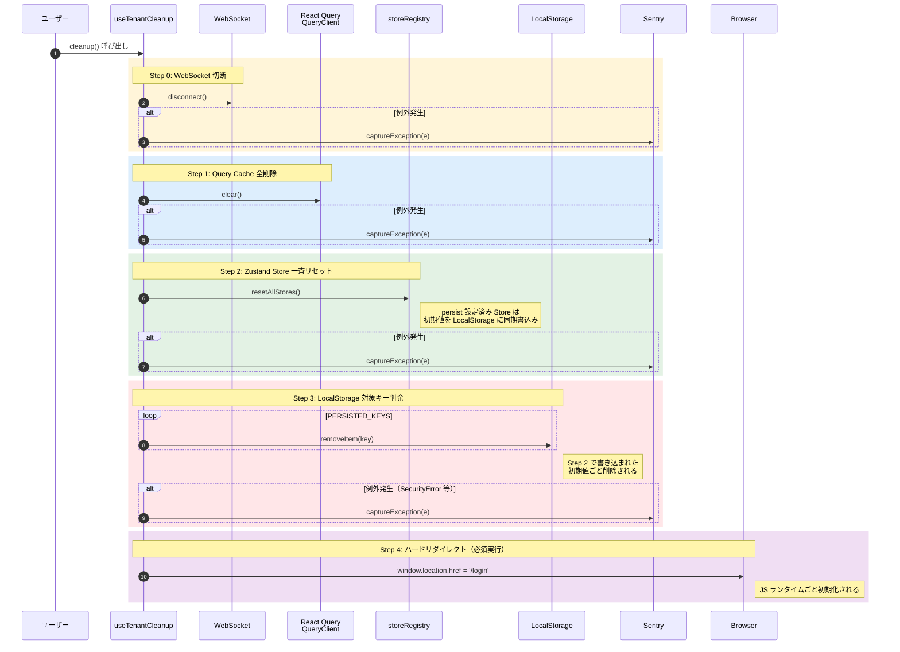

# クリーンアップ基盤設計

ログアウト・テナント切替時に、メモリおよびストレージ上の状態を一斉抹消する基盤機構の I/F 契約を定義する。

| 関連文書 | 内容 |
|---|---|
| [状態管理規約.md](状態管理規約.md) | アプリ実装チームが守る規約 |
| [ストア基盤設計.md](ストア基盤設計.md) | 各 Store の I/F 仕様 |
| [adr/logout-step-order.md](adr/logout-step-order.md) | Step 2 → Step 3 の順序判断 |
| [adr/hard-redirect-on-logout.md](adr/hard-redirect-on-logout.md) | ハードリダイレクト必須化の判断 |

---

## 1. 配置

| ファイル | 役割 |
|---|---|
| `src/shared/stores/storeRegistry.ts` | Store の一括リセット機構（[ストア基盤設計.md](ストア基盤設計.md) §3.1 参照） |
| `src/shared/hooks/useTenantCleanup.ts` | ログアウト時のクリーンアップ統合フック |

---

## 2. useTenantCleanup の I/F

### 2.1 エクスポート

```typescript
export interface UseTenantCleanupResult {
  /**
   * クリーンアップ処理（Step 0〜4）を同期的に実行する。
   *
   * @remarks
   * - Step 0〜3 で例外が発生しても、後続ステップは継続される。
   * - 例外は Sentry に記録される。
   * - Step 4（ハードリダイレクト）は例外なく必ず実行される。
   * - 呼び出し後はページがアンロードされるため、後続コードは実行されない前提で書くこと。
   *
   * @returns void。リダイレクトが発生するため戻り値は意味を持たない。
   */
  cleanup: () => void;
}

/**
 * テナント切替・ログアウト時のクリーンアップフック。
 * ログアウトボタンの onClick 等から呼び出して使用する。
 */
export function useTenantCleanup(): UseTenantCleanupResult;
```

### 2.2 利用例

```tsx
const LogoutButton = () => {
  const { cleanup } = useTenantCleanup();
  return <button onClick={cleanup}>ログアウト</button>;
};
```

---

## 3. ログアウトシーケンス

### 3.1 全体シーケンス



### 3.2 各ステップの仕様

| Step | 処理 | 失敗時の扱い | 補足 |
|---|---|---|---|
| 0 | WebSocket 切断 | Sentry 記録のみ、続行 | リセット前に切断しないと新着データが notificationStore に書き込まれる |
| 1 | `queryClient.clear()` | Sentry 記録のみ、続行 | バックグラウンド通信・古い診療記録のキャッシュを抹消 |
| 2 | `resetAllStores()` | Sentry 記録のみ、続行 | persist の同期書き戻しは想定通り（Step 3 で削除する） |
| 3 | LocalStorage 対象キー削除 | Sentry 記録のみ、続行 | プライベートブラウジング等で `SecurityError` が発生し得る |
| 4 | `window.location.href = '/login'` | **try-catch しない・必ず実行** | JS ランタイムごとリセット。Step 0〜3 の部分失敗を吸収する |

### 3.3 LocalStorage 削除対象キー

```typescript
const PERSISTED_KEYS = ['harz:theme'] as const;
// 'harz:tenant' は tenantStore 永続化方針確定後に追加判定
// 'harz:auth'   は authStore が persist なしのため対象外
```

---

## 4. データリーク防止のガードレール

| ガードレール | 内容 | 配置 |
|---|---|---|
| クエリキー第一階層へのテナント ID 強制付与 | `removeQueries` 漏れがあっても住所違いで物理的に隔離 | [クエリキー基盤設計.md](クエリキー基盤設計.md) |
| `registerStore` による自動登録 | Store 追加時にリセット実装漏れを防止 | [ストア基盤設計.md](ストア基盤設計.md) §3.1 |
| ハードリダイレクト | JS ランタイムごと初期化し残留オブジェクトを排除 | 本章 §3 Step 4（[adr/hard-redirect-on-logout.md](adr/hard-redirect-on-logout.md)） |

---

## 5. 動作検証チェックリスト

ログアウト直後にデベロッパーツールで以下を確認する。

| 観点 | 確認内容 |
|---|---|
| Network | 旧テナント ID を含むリクエストが発生していない |
| Application > LocalStorage | `PERSISTED_KEYS` のキーが存在しない |
| Application > Cookies | RT Cookie が `Set-Cookie: Max-Age=0` で失効済み（BFF 側） |
| Memory | React Query Cache・Zustand Store のスナップショットに旧テナント値が残っていない |
| WebSocket | 旧接続が切断され、新規接続が新しい認証コンテキストで張り直されている |

---

## 6. 章間連携

| 章 | 関連内容 |
|---|---|
| 01.フロントエンド・BFF 共通基盤設計 | Axios インターセプターによる 401 自動リフレッシュ／ログアウト誘導 |
| [08_リアルタイム通信設計/Socket接続基盤設計.md](../08_リアルタイム通信設計/Socket接続基盤設計.md) | Step 0 の WebSocket 切断対象（`notificationSocket` 等） |
| [13_セキュリティ基盤設計/](../13_セキュリティ基盤設計/) | XSS／CSRF 対策との整合性（`harz:auth` 不採用と整合）。詳細は [adr/httponly-cookie.md](../13_セキュリティ基盤設計/adr/httponly-cookie.md) |
