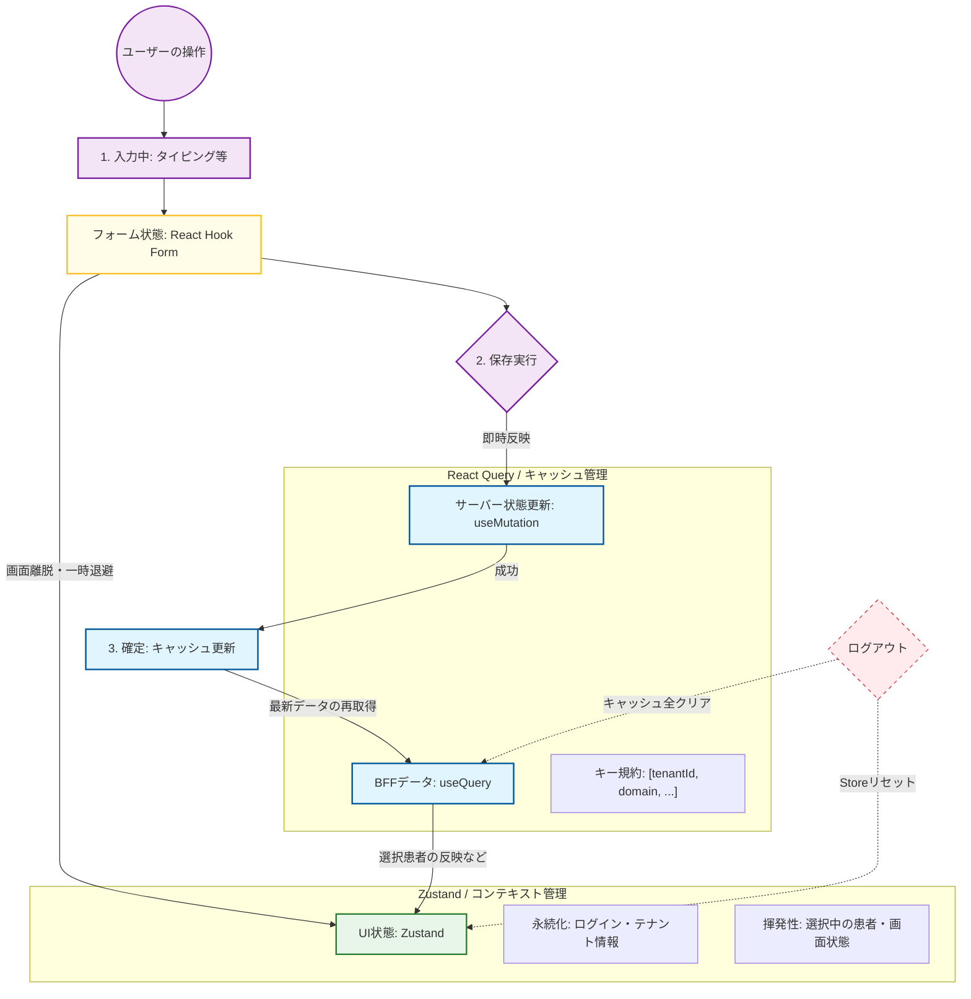

# ストア基盤設計

フロントエンド基盤が提供する Zustand Store と Store レジストリの I/F 契約を定義する。

> 04 章は電子カルテのデータを「サーバー」「クライアント」「フォーム」の3状態に分類し、それぞれの寿命に応じた管理基盤を定義する。3状態の境界を明確化することで、**1万件規模のデータ描画に耐えるパフォーマンス** と **テナント間データ混入を物理的に遮断する安全性** を両立する。

| 関連文書 | 内容 |
|---|---|
| [状態管理規約.md](状態管理規約.md) | アプリ実装チームが守る規約 |
| [クリーンアップ基盤設計.md](クリーンアップ基盤設計.md) | `useTenantCleanup` とログアウトシーケンス |
| [adr/auth-no-persist.md](adr/auth-no-persist.md) | authStore に persist を採用しない判断 |

---

## 1. Store スコープ

| スコープ | 共有範囲 | persist | storeRegistry 登録 | ロード保証 |
|---|---|---|---|---|
| Global | アプリ全域 | あり（`partialize` 必須） | 必須 | layout の Providers で必ず import |
| Domain | ドメイン共有・画面跨ぎ | なし | 必須 | layout の Providers で必ず import |
| Page | 画面固有・揮発 | なし | 不要 | 画面 import 時にロード／ハードリダイレクトで JS ランタイムごとリセット |

> 各スコープが扱うデータ種別の例は [状態管理規約.md](状態管理規約.md) §4 参照。

---

## 2. 状態分類モデル



| 状態 | 場所 | ライフサイクル | 管理ツール |
|---|---|---|---|
| サーバー状態 | BFF 等の外部リソース。フロントはコピーを保持 | キャッシュ戦略（gcTime）に基づく。SWR で自動更新 | React Query |
| クライアント / UI 状態（永続：Persist） | ブラウザのメモリ＋ LocalStorage | アプリ起動中＋リロード後も維持。ログアウトで明示リセット | Zustand（persist） |
| クライアント / UI 状態（揮発：Memory） | ブラウザのメモリ内 | アプリ起動中またはドメイン在籍中。ログアウト・リロードで消滅 | Zustand |
| フォーム状態 | フォーム表示中のメモリ | 最も短命。フォーム表示中のみ。保存成功または画面破棄で消滅 | React Hook Form |

> **永続（Persist）の例**: ログイン中のテナント ID、ユーザー設定（テーマ・文字サイズ）。
> **揮発（Memory）の例**: 選択中の患者 ID、サイドバーの開閉状態、モーダルの表示フラグ。

---

## 3. 共通基盤 I/F

### 3.1 storeRegistry

ファイル: `src/shared/stores/storeRegistry.ts`

```typescript
/** Store の状態を初期値に戻す関数。例外は呼び出し側で捕捉される。 */
export type ResetFn = () => void;

/**
 * Store のリセット関数をレジストリに登録する。
 * 各ストアファイルでモジュールトップレベルで一度だけ呼び出す。
 *
 * @param resetFn - 当該 Store を初期状態に戻す関数
 * @remarks Global / Domain スコープのストアは layout の Providers で必ず import すること。
 *          import されないと resetAllStores() に登録されない。
 */
export function registerStore(resetFn: ResetFn): void;

/**
 * 登録済み全 Store のリセット関数を呼び出す。
 *
 * @remarks
 * - 個別の reset 関数で例外が発生しても他の Store のリセットは継続する。
 * - 例外発生時は console.error で記録するのみ。Sentry 連携等は呼び出し側（useTenantCleanup）で行う。
 * - 呼び出し順は registerStore された順序。順序非依存となるよう各 reset 関数は冪等に実装すること。
 */
export function resetAllStores(): void;
```

### 3.2 LocalStorage キー命名規則

| 規則 | 値 |
|---|---|
| プレフィックス | `harz:` |
| 形式 | `harz:{store-name}` |
| 適用対象 | Global スコープかつ persist を採用するストアのみ |

例: `harz:theme`、`harz:tenant`（採用時）

---

## 4. shared/stores 配下の Store 一覧

| Store | スコープ | persist | LocalStorage キー | ファイル |
|---|---|---|---|---|
| authStore | Global | なし | — | `src/shared/stores/authStore.ts` |
| tenantStore | Global | TBD | `harz:tenant`（採用時） | `src/shared/stores/tenantStore.ts` |
| themeStore | Global | あり | `harz:theme` | `src/shared/stores/themeStore.ts` |
| patientStore | Domain | なし | — | `src/shared/stores/patientStore.ts` |
| notificationStore | Domain | なし | — | `src/shared/stores/notificationStore.ts` |

---

## 5. 各 Store の I/F 仕様

### 5.1 authStore

> 根拠: [adr/auth-no-persist.md](adr/auth-no-persist.md)（persist を採用しない設計判断）

#### 型定義

```typescript
/** ID トークンから抽出する UI/API 用クレーム。トークン文字列自体は保持しない。 */
export interface IdTokenClaims {
  /** ユーザー識別子 */
  userId: string;
  // name 等、UI 表示・API 呼び出しに必要なクレームのみを保持する
}

export interface AuthState {
  /** アクセストークン（JWT）。未認証時は null。 */
  accessToken: string | null;
  /** ID トークンクレーム。未認証時は null。 */
  idTokenClaims: IdTokenClaims | null;

  /**
   * 認証情報をセットする。
   * @param accessToken - JWT アクセストークン
   * @param idTokenClaims - ID トークンから抽出したクレーム
   */
  setAuth: (accessToken: string, idTokenClaims: IdTokenClaims) => void;

  /** 認証情報を初期状態（null, null）に戻す。storeRegistry のリセット対象。 */
  clearAuth: () => void;
}
```

#### エクスポート

```typescript
/** 認証情報の Zustand ストア。persist を使用しないメモリ保持専用。 */
export const useAuthStore: UseBoundStore<StoreApi<AuthState>>;
```

#### 認証情報の保管要件

| 項目 | 種別 | 有効期限 | 保管場所 | 理由 |
|---|---|---|---|---|
| アクセストークン (AT) | JWT | 10分 | authStore のメモリのみ（persist なし） | XSS 窃取被害をメモリ存在期間に限定。短命のためリロード時の再取得コストは許容 |
| ID トークン本体 | JWT | 10分 | 保管しない（受信時にデコードしクレームのみ展開） | 方式書 2.1.2.9 で「保管しない」と規定 |
| ID トークンクレーム（`userId` 等） | デコード結果 | AT と同寿命 | authStore のメモリのみ（persist なし） | UI 表示・API 呼び出しに必要なクレームのみ抽出。トークン文字列自体は保持しない |
| リフレッシュトークン (RT) | JWT | 1日 | HttpOnly + Secure Cookie（BFF が `Set-Cookie` で発行） | JavaScript からアクセス不可とし、XSS 耐性を確保。ストア対象外 |

#### リフレッシュトークンの扱い

* Cookie はブラウザが自動送信。フロントエンドは一切操作しない。Axios は `withCredentials: true` でクッキーを同送する。
* AT 失効時（401 応答時等）はフロントから RT 再発行 API を呼び出す。RT はリクエストボディに含めない。
* ログアウト時は BFF が `Set-Cookie: Max-Age=0` で Cookie を失効させる。

### 5.2 themeStore

#### 型定義

```typescript
export type Theme = 'light' | 'dark';
export type FontSize = 'small' | 'medium' | 'large';

export interface ThemeState {
  theme: Theme;
  fontSize: FontSize;
  setTheme: (theme: Theme) => void;
  setFontSize: (fontSize: FontSize) => void;
  /** 初期値（theme:'light', fontSize:'medium'）に戻す。storeRegistry のリセット対象。 */
  reset: () => void;
}
```

#### 永続化仕様

| 項目 | 値 |
|---|---|
| LocalStorage キー | `harz:theme` |
| storage | `createJSONStorage(() => localStorage)` |
| `partialize` 対象 | `theme`, `fontSize` のみ（アクション関数や派生状態を LocalStorage に書き込まないようにする目的） |

#### エクスポート

```typescript
/** テーマ設定の Zustand ストア。persist 採用、partialize で永続化対象を絞る。 */
export const useThemeStore: UseBoundStore<StoreApi<ThemeState>>;
```

### 5.3 tenantStore

#### 型定義

```typescript
export interface TenantState {
  /** 現在のテナント ID。未選択時は null。 */
  currentTenantId: string | null;
  setTenantId: (tenantId: string) => void;
  clearTenant: () => void;
}
```

#### 永続化仕様（採用時）

| 項目 | 値 |
|---|---|
| LocalStorage キー | `harz:tenant` |
| storage | `createJSONStorage(() => localStorage)` |
| `partialize` 対象 | `currentTenantId` のみ |

> persist 採否は認証基盤連携サービス詳細設計確定後に確定する。ID トークンクレーム由来とする方針が確定した場合、本ストアは persist なしに変更する。

#### エクスポート

```typescript
export const useTenantStore: UseBoundStore<StoreApi<TenantState>>;
```

### 5.4 patientStore（Domain スコープ）

#### 型定義

```typescript
export interface PatientState {
  /** 現在選択中の患者 ID。未選択時は null。 */
  currentPatientId: string | null;
  setPatientId: (patientId: string) => void;
  clearPatient: () => void;
}
```

| 項目 | 値 |
|---|---|
| persist | なし（選択中の患者 ID はテナント在籍中のみ有効。テナント切替・ログアウトで残存させない） |
| storeRegistry 登録 | 必須（`clearPatient`） |

```typescript
export const usePatientStore: UseBoundStore<StoreApi<PatientState>>;
```

### 5.5 notificationStore（Domain スコープ）

#### 型定義

```typescript
import type { NotificationMessageResponse } from '@/front_bff_shared/...';

export interface NotificationState {
  /** 受信済み通知の履歴。最新が先頭。 */
  notifications: NotificationMessageResponse[];
  /** 未読件数。 */
  unreadCount: number;

  addNotification: (notification: NotificationMessageResponse) => void;
  markAsRead: (notificationId: string) => void;
  markAllAsRead: () => void;
  clearNotifications: () => void;
}
```

| 項目 | 値 |
|---|---|
| persist | なし |
| storeRegistry 登録 | 必須（`clearNotifications`） |
| 履歴上限 | 最新 100 件（実装側で `slice(0, 100)`） |
| WebSocket 連携 | 切断は [クリーンアップ基盤設計.md](クリーンアップ基盤設計.md) §Step 0 で実施 |

```typescript
export const useNotificationStore: UseBoundStore<StoreApi<NotificationState>>;
```
