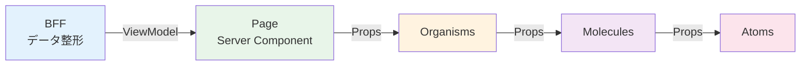

# コンポーネント設計

本章では、UIの再利用性とデザインの一貫性を高めるためのコンポーネント設計規約を定義する。  
特に、大規模な医療データを扱う際の描画負荷の抑制と、BFFから提供されるデータとの疎結合を重視する。

## Atomic Design 分類基準と責務定義

UIコンポーネントは、**bulletproof-react** のディレクトリ構成を基盤とし、`components` 配下に **Atomic Design** を組み合わせたハイブリッド構成を採用する。

階層は以下の4つに分類して管理する。

### 各階層の責務と配置

| 階層 | 責務 | 配置ルール | 業務ルール | データ構造 |
| :--- | :--- | :--- | :--- | :--- |
| **Atoms** | UIの最小単位。単体で意味を持たない基礎部品。 | `src/shared/components/atoms/` | **持たない** | Primitiveな型（string, number, boolean等） |
| **Molecules** | 複数のAtomsを組み合わせた汎用部品。 | `src/features/[LV1]/[LV2]/[LV3]/components/molecules/`（初期配置）<br>`src/shared/components/molecules/`（2機能以上で再利用時に昇格） | **持たない** | ViewModelの一部（フラットなオブジェクト） |
| **Organisms** | 画面を構成する具体的な機能の塊。その部品だけで機能のタスクが完結する。 | `src/features/[LV1]/[LV2]/[LV3]/components/organisms/` | **持つ**（機能固有のロジック） | **整形済みViewModelのみ**（FHIRリソース直接受取は禁止） |

※ディレクトリ構造の詳細は「[00.ディレクトリ構成.md](00.ディレクトリ構成.md)」を参照のこと。

### 階層別の詳細定義

本節では、Atoms、Molecules、Organismsの3階層について詳細を定義する。Page層については「[07.ルーティングとレンダリング設計方針.md](07.ルーティングとレンダリング設計方針.md)」を参照のこと。

#### Atoms (原子)

**役割**: UIの最小単位（ボタン、入力フィールド、ラベル、アイコン等）

**技術基盤**:
- **Radix UI** をPrimitiveとして使用（アクセシビリティ担保）
- **Tailwind CSS** でスタイリングを完結させる
- **shadcn/ui** のパターンに倣った実装を標準とする

**禁止事項**:
- 業務ロジックの実装
- 外部API呼び出し
- グローバル状態の直接参照

**配置場所**: `src/shared/components/atoms/`（全画面で共有するデザインシステムとして管理）

#### Molecules (分子)

**役割**: 複数のAtomsを組み合わせた汎用部品（検索バー、フォームグループ、カード等）

**設計原則**:
- **ロジックを持たない**（表示のみ）
- 再利用性を重視した設計
- 同じ構成が2箇所以上で使用された時点で `src/shared/components/molecules/` へ昇格

**データ受け渡し**: ViewModelの一部（フラットな構造）をPropsで受け取る

**配置場所**:
- 初期配置: `src/features/[LV1]/[LV2]/[LV3]/components/molecules/`
- 昇格後: `src/shared/components/molecules/`

#### Organisms (有機体)

**役割**: 画面を構成する具体的な機能の塊（機能一覧のLV3画面機能相当）

**設計原則**:
- **その部品だけで機能のタスクが完結する**
- 複雑なデータ構造を扱う場合はこの階層で定義
- **FHIRリソースを直接Propsとして渡すことは禁止**（整形済みViewModelのみ）

**状態管理**:
- 必要に応じてカスタムHooksを使用してReact QueryやZustandと連携
- 状態管理の詳細は「[04.状態管理設計.md](04.状態管理設計.md)」を参照

**配置場所**: `src/features/[LV1]/[LV2]/[LV3]/components/organisms/`

### コンポーネント間の依存方向

コンポーネント階層は **上位層から下位層への一方向の依存** を原則とする。

```
Page → Organisms → Molecules → Atoms
```

ただし、以下の例外を許可する：
- **同階層内の呼び出し**: Molecules内で別のMoleculesを使用、Organisms内で別のOrganismsを使用することは可能
- この場合も循環参照は禁止

詳細は「[07.ルーティングとレンダリング設計方針.md](07.ルーティングとレンダリング設計方針.md)」の「7.1.3. ディレクトリ間の依存関係ルール」を参照のこと。


## コンポーネントファイル構成と命名規則

### ファイル命名規則

| 対象 | 命名規則 | 例 |
| :--- | :--- | :--- |
| コンポーネントファイル | PascalCase + 拡張子 `.tsx` | `Button.tsx`, `SearchBar.tsx`, `PatientList.tsx` |
| カスタムHooks | `use` + PascalCase + `.ts` | `usePatientData.ts`, `useFormValidation.ts` |
| 型定義ファイル | PascalCase + `.types.ts` | `Patient.types.ts`, `Diagnosis.types.ts` |
| テストファイル | 対象ファイル名 + `.test.tsx` | `Button.test.tsx`, `SearchBar.test.tsx` |

### コンポーネントファイルの基本構成

```tsx
// 1. 外部ライブラリのimport
import { useState } from 'react';
import { Button } from '@/shared/components/atoms/Button';

// 2. 型定義のimport
import type { PatientViewModel } from '@/front_bff_shared/features/patients/types/responses/patient.response';

// 3. Props型定義（同一ファイル内で定義）
interface PatientCardProps {
  patient: PatientViewModel;
  onSelect: (id: string) => void;
  className?: string;
}

// 4. コンポーネント本体
export function PatientCard({ patient, onSelect, className }: PatientCardProps) {
  // ロジック実装
  
  return (
    // JSX
  );
}

// 5. displayNameの設定（デバッグ用、任意）
PatientCard.displayName = 'PatientCard';
```

### コンポーネント定義の統一規約

#### Reactのコンポーネント定義方法

Reactでは、コンポーネントを定義する方法として以下の2種類がある：

1. **クラスコンポーネント**: `class`を使用した定義（旧来の方法）
2. **関数コンポーネント**: 関数を使用した定義（React Hooks導入後の標準）

本プロジェクトでは、**関数コンポーネントに統一**する。クラスコンポーネントは使用しない。

#### 関数コンポーネントの定義方法

関数コンポーネントには、以下の2つの書き方がある：

1. **関数宣言（function）**: `function ComponentName() {}`
2. **アロー関数（const）**: `const ComponentName = () => {}`

**本プロジェクトの規約**: 
- **メインのコンポーネント**: `function`（関数宣言）で定義
- **内部のロジックやイベントハンドラー**: アロー関数で定義

#### 実装例

```typescript
// やっていいこと: メインのコンポーネントはfunction（関数宣言）
export function PatientCard({ patient, onSelect }: PatientCardProps) {
  // 内部のロジックやイベントハンドラーはアロー関数
  const handleClick = () => {
    console.log('クリックされました');
    onSelect(patient.id);
  };
  
  const formatDate = (date: string) => {
    return new Date(date).toLocaleDateString('ja-JP');
  };
  
  return (
    <div onClick={handleClick}>
      <h3>{patient.name}</h3>
      <p>{formatDate(patient.birthDate)}</p>
    </div>
  );
}

// やってはいけないこと: メインコンポーネントをアロー関数で定義
export const PatientCard = ({ patient, onSelect }: PatientCardProps) => {
  // ...
};
```

#### 理由

**function宣言のメリット**:
- **React DevToolsでコンポーネント名が正しく表示される**: デバッグ時にコンポーネントツリーで識別しやすい
- **スタックトレースが読みやすい**: エラー発生時のデバッグが容易
- **ホイスティング（巻き上げ）により、定義順序を気にせず記述可能**: コンポーネントの配置順序に柔軟性がある

**内部ロジックでアロー関数を使う理由**:
- **`this`バインディングの問題を回避**: React Hooksでは関係ないが、統一性のため
- **簡潔な記述**: 短い関数をインラインで定義しやすい

---

### Export/Import ルール

**Export規約**:
- コンポーネントは **named export** を使用（`export function ComponentName`）
- default exportは使用しない（リファクタリング時の追跡性向上のため）

**Import規約**:
```tsx
// やっていいこと: パスエイリアスを使用
import { Button } from '@/shared/components/atoms/Button';
import { usePatientData } from '@/features/patients/hooks/usePatientData';

// やってはいけないこと: 相対パスの多重ネスト
import { Button } from '../../../shared/components/atoms/Button';
```

**Index.tsの活用**:

階層ごとの複数コンポーネントをまとめてexportする際は、`index.ts` を活用する。  
この方針は **Atoms、Molecules、Organismsのすべての階層** に共通して適用する。

```tsx
// 例: src/features/patients/components/molecules/index.ts
export { PatientCard } from './PatientCard';
export { PatientSearchForm } from './PatientSearchForm';

// 利用側
import { PatientCard, PatientSearchForm } from '@/features/patients/components/molecules';
```

```tsx
// 例: src/shared/components/atoms/index.ts
export { Button } from './Button';
export { Input } from './Input';
export { Label } from './Label';

// 利用側
import { Button, Input, Label } from '@/shared/components/atoms';
```

**動的読み込み（遅延ロード）**:

初期表示が遅くなるほど大きなコンポーネント（モーダル、重いライブラリを使用するグラフ等）は、`next/dynamic` による動的読み込みを検討する。

```tsx
// 例: 大きなコンポーネントを動的読み込み
import dynamic from 'next/dynamic';

const HeavyChartComponent = dynamic(
  () => import('@/features/diagnosis/components/organisms/MedicalRecordChart'),
  { ssr: false }
);
```

詳細な適用基準、実装パターン、性能計測については「[07.ルーティングとレンダリング設計方針.md](07.ルーティングとレンダリング設計方針.md)」の「7.4.4. 動的読み込み（Code Splitting）」を参照のこと。


## Props設計規約

### Props型定義のパターン

**基本パターン**:
```tsx
// コンポーネントファイル内で定義（小規模）
interface ButtonProps {
  label: string;
  onClick: () => void;
  variant?: 'primary' | 'secondary' | 'danger';
  disabled?: boolean;
}

export function Button({ label, onClick, variant = 'primary', disabled = false }: ButtonProps) {
  // 実装
}
```

**複雑な型の場合**:
```tsx
// 別ファイルで定義（大規模・再利用性が高い場合）
// src/features/patients/components/types/PatientList.types.ts
import type { PatientViewModel } from '@/front_bff_shared/features/patients/types/responses/patient.response';

export interface PatientListProps {
  patients: PatientViewModel[];
  onSelectPatient: (patientId: string) => void;
  selectedPatientId?: string;
  isLoading?: boolean;
  error?: Error | null;
}
```

### 必須/オプションの判断基準

| 項目 | 必須 (required) | オプション (optional) |
| :--- | :--- | :--- |
| **データ表示に必須** | `patient: PatientViewModel` | - |
| **イベントハンドラー（重要）** | `onSubmit: () => void` | - |
| **スタイル調整** | - | `className?: string` |
| **デフォルト値あり** | - | `variant?: 'primary' \| 'secondary'` |
| **条件付き表示** | - | `showDetails?: boolean` |

### イベントハンドラーの命名規則

```tsx
interface ComponentProps {
  // やっていいこと: on + 動詞 + 名詞（具体的な動作を示す）
  onSubmit: () => void;
  onPatientSelect: (patientId: string) => void;
  onFormChange: (field: string, value: string) => void;
  
  // やってはいけないこと: 曖昧な命名
  handleClick: () => void;  // "handle"は内部実装で使用
  click: () => void;        // 動詞のみ
}
```

### Children と Composition

```tsx
// やっていいこと: childrenを活用した柔軟な設計
interface CardProps {
  title: string;
  children: React.ReactNode;
  footer?: React.ReactNode;
}

export function Card({ title, children, footer }: CardProps) {
  return (
    <div className="card">
      <h2>{title}</h2>
      <div className="card-body">{children}</div>
      {footer && <div className="card-footer">{footer}</div>}
    </div>
  );
}

// 使用例
<Card title="患者情報" footer={<Button label="保存" />}>
  <PatientForm />
</Card>
```

### useContextの利用方針

本プロジェクトでは、**React Context（useContext）は使用しない**方針とする。

#### 不採用の理由

- **状態管理の一元化**: 本プロジェクトでは、状態の種類に応じて適切な技術（React Hook Form、Zustand、React Query）を採用している。useContextを導入すると状態管理手法が分散し、実装パターンの一貫性が損なわれる
- **学習コストの削減**: 開発者が習得すべき状態管理手法を明確に定義することで、チーム全体の学習コストを最小化する
- **デバッグの容易性**: 採用している各技術は開発者ツールでの状態監視が容易であり、useContextよりもデバッグしやすい

#### propsバケツリレーの回避方法

コンポーネントツリーの深い階層へ値を渡す必要がある場合は、状況に応じて以下の手法を使用する：

| 状況 | 使用する技術 | 説明 |
|------|------------|------|
| **フォーム状態の共有** | **React Hook Form (FormProvider)** | フォーム内の深い階層でフォーム状態にアクセスする場合、FormProviderを使用。これにより、useFormContextでフォームの状態・メソッドにアクセス可能。 |
| **グローバルUI状態の共有** | **Zustand** | アプリ全体で共有するUI状態（テナント情報、選択中の患者等）は、Zustandで管理し、どのコンポーネントからも直接アクセス可能。 |
| **サーバーデータの共有** | **React Query (カスタムフック)** | BFFから取得したデータは、カスタムフックを通じてどのコンポーネントからもアクセス可能。キャッシュにより、同じデータを複数回取得しない。 |

詳細は「[04.状態管理設計.md](04.状態管理設計.md)」を参照のこと。

---

## データ流し込みパターン（Atomic Designリレー）

大規模開発における保守性を確保するため、BFFからフロントエンドのプレゼンテーション層（表示層）へ至るまで、**「Atomic Designリレー」** と呼ばれる型安全なデータ流通フローを適用する。

### データフローの全体像



### 各層の責務

| 層 | 責務 | データ形式 |
| :--- | :--- | :--- |
| **BFFでのデータ整形 (Mapping)** | バックエンドAPIの複雑な「生データ」を集約し、UI表示に最適化されたフラットな**ViewModel（またはDTO）** へ変換 | FHIRリソース → ViewModel |
| **Page層での一括受取** | Page（Server Component）がBFFからViewModelを型安全に受信 | ViewModel（型安全） |
| **Presentation層への流し込み** | PageからOrganisms、さらにMoleculesへと、加工済みの文字列やオブジェクトをPropsとして流し込む | ViewModelの部分集合 |
| **表示ロジックの排除** | UIコンポーネント内での計算や変換（例：日付形式の整形）を最小限に抑え、BFFから届いたデータを「そのまま表示するだけ」の状態にする | 表示用文字列 |

### 実装例：患者一覧画面

**Step 1: BFFがViewModelを生成**
```typescript
// BFF側（参考）
// front_bff_shared/features/patients/types/responses/patient.response.ts
export interface PatientViewModel {
  id: string;
  name: string;
  nameKana: string;
  birthDate: string;           // "1990-01-01"（整形済み）
  age: number;                 // 34（計算済み）
  gender: string;              // "男性"（表示用文字列）
  medicalRecordNumber: string; // "12345678"
}
```

**Step 2: Page（Server Component）がBFFからデータ取得**
```tsx
// src/app/(main)/patients/list/page.tsx
import { PatientListOrganism } from '@/features/patients/components/organisms/PatientListOrganism';
import type { PatientViewModel } from '@/front_bff_shared/features/patients/types/responses/patient.response';

async function fetchPatients(): Promise<PatientViewModel[]> {
  const res = await fetch('http://bff:3000/api/patients', {
    headers: { 'X-Tenant-Id': 'tenant-001' },
  });
  
  if (!res.ok) throw new Error('Failed to fetch patients');
  return res.json();
}

export default async function PatientListPage() {
  const patients = await fetchPatients();
  
  return (
    <div className="container">
      <h1>患者一覧</h1>
      <PatientListOrganism patients={patients} />
    </div>
  );
}
```

**Step 3: Organisms がデータを受け取りMoleculesへ渡す**
```tsx
// src/features/patients/components/organisms/PatientListOrganism.tsx
import { PatientCard } from '@/features/patients/components/molecules/PatientCard';
import type { PatientViewModel } from '@/front_bff_shared/features/patients/types/responses/patient.response';

interface PatientListOrganismProps {
  patients: PatientViewModel[];
}

export function PatientListOrganism({ patients }: PatientListOrganismProps) {
  const handleSelectPatient = (patientId: string) => {
    // 患者選択時の処理（Zustand storeへの保存等）
  };
  
  return (
    <div className="grid grid-cols-1 md:grid-cols-2 lg:grid-cols-3 gap-4">
      {patients.map((patient) => (
        <PatientCard
          key={patient.id}
          patient={patient}
          onSelect={handleSelectPatient}
        />
      ))}
    </div>
  );
}
```

**Step 4: Molecules がデータを表示**
```tsx
// src/features/patients/components/molecules/PatientCard.tsx
import { Button } from '@/shared/components/atoms/Button';
import type { PatientViewModel } from '@/front_bff_shared/features/patients/types/responses/patient.response';

interface PatientCardProps {
  patient: PatientViewModel;
  onSelect: (patientId: string) => void;
}

export function PatientCard({ patient, onSelect }: PatientCardProps) {
  return (
    <div className="border rounded-lg p-4 hover:shadow-lg transition">
      <h3 className="text-lg font-bold">{patient.name}</h3>
      <p className="text-sm text-gray-600">{patient.nameKana}</p>
      <div className="mt-2 space-y-1">
        <p>生年月日: {patient.birthDate} ({patient.age}歳)</p>
        <p>性別: {patient.gender}</p>
        <p>カルテ番号: {patient.medicalRecordNumber}</p>
      </div>
      <Button
        label="選択"
        onClick={() => onSelect(patient.id)}
        className="mt-4 w-full"
      />
    </div>
  );
}
```

### 重要な設計原則

**やっていいこと**:
- BFFでデータ整形を完了させる（日付フォーマット、計算、文字列変換等）
- ViewModelは表示用に最適化されたフラットな構造にする
- UIコンポーネントは受け取ったデータを「そのまま表示」する

**やってはいけないこと**:
- UIコンポーネント内で複雑なデータ変換を行う
- FHIRリソースを直接Propsとして渡す
- Moleculesが直接API呼び出しを行う


## 各階層の実装パターン

### Atoms - 実装例

**実装例: Button コンポーネント（Radix UI + Tailwind CSS）**

```tsx
// src/shared/components/atoms/Button.tsx
import { forwardRef } from 'react';
import { Slot } from '@radix-ui/react-slot';
import { cva, type VariantProps } from 'class-variance-authority';

const buttonVariants = cva(
  'inline-flex items-center justify-center rounded-md text-sm font-medium transition-colors focus-visible:outline-none focus-visible:ring-2 disabled:pointer-events-none disabled:opacity-50',
  {
    variants: {
      variant: {
        primary: 'bg-blue-600 text-white hover:bg-blue-700',
        secondary: 'bg-gray-200 text-gray-900 hover:bg-gray-300',
        danger: 'bg-red-600 text-white hover:bg-red-700',
      },
      size: {
        sm: 'h-9 px-3',
        md: 'h-10 px-4 py-2',
        lg: 'h-11 px-8',
      },
    },
    defaultVariants: {
      variant: 'primary',
      size: 'md',
    },
  }
);

export interface ButtonProps
  extends React.ButtonHTMLAttributes<HTMLButtonElement>,
    VariantProps<typeof buttonVariants> {
  asChild?: boolean;
}

export const Button = forwardRef<HTMLButtonElement, ButtonProps>(
  ({ className, variant, size, asChild = false, ...props }, ref) => {
    const Comp = asChild ? Slot : 'button';
    return (
      <Comp
        className={buttonVariants({ variant, size, className })}
        ref={ref}
        {...props}
      />
    );
  }
);

Button.displayName = 'Button';
```

**実装ガイドライン**:

| やっていいこと | やってはいけないこと |
| :--- | :--- |
| Radix UIをPrimitiveとして使用 | 業務ロジックを実装 |
| Tailwind CSSでスタイリング | API呼び出し |
| アクセシビリティ属性を適切に設定 | グローバル状態の直接参照 |
| 汎用的な設計（どこでも使える） | 特定の業務機能に依存 |

---

### Molecules - 実装例

**実装例: SearchBar コンポーネント**

```tsx
// src/features/patients/components/molecules/SearchBar.tsx
import { Input } from '@/shared/components/atoms/Input';
import { Button } from '@/shared/components/atoms/Button';
import { Search } from 'lucide-react';

interface SearchBarProps {
  placeholder?: string;
  value: string;
  onChange: (value: string) => void;
  onSearch: () => void;
}

export function SearchBar({
  placeholder = '検索...',
  value,
  onChange,
  onSearch,
}: SearchBarProps) {
  const handleKeyDown = (e: React.KeyboardEvent<HTMLInputElement>) => {
    if (e.key === 'Enter') {
      onSearch();
    }
  };

  return (
    <div className="flex gap-2">
      <Input
        type="text"
        placeholder={placeholder}
        value={value}
        onChange={(e) => onChange(e.target.value)}
        onKeyDown={handleKeyDown}
        className="flex-1"
      />
      <Button onClick={onSearch} size="md">
        <Search className="h-4 w-4" />
        <span className="ml-2">検索</span>
      </Button>
    </div>
  );
}
```

**実装ガイドライン**:

| やっていいこと | やってはいけないこと |
| :--- | :--- |
| Atomsを組み合わせて構築 | 独自のバリデーションロジック |
| イベントハンドラーを親から受け取る | API呼び出し |
| 再利用可能な設計 | 状態管理（useState以外） |
| シンプルなデータ構造（フラット）を受け取る | 複雑なビジネスロジック |

---

### Organisms - 実装例

**実装例: DiagnosisForm コンポーネント**

```tsx
// src/features/diagnosis/components/organisms/DiagnosisForm.tsx
import { useForm } from 'react-hook-form';
import { zodResolver } from '@hookform/resolvers/zod';
import { Button } from '@/shared/components/atoms/Button';
import { Input } from '@/shared/components/atoms/Input';
import { diagnosisSchema } from '@/front_bff_shared/features/diagnosis/schemas/diagnosis.schema';
import type { DiagnosisFormData } from '@/front_bff_shared/features/diagnosis/types/requests/diagnosis.request';

interface DiagnosisFormProps {
  initialData?: Partial<DiagnosisFormData>;
  onSubmit: (data: DiagnosisFormData) => void;
  isLoading?: boolean;
}

export function DiagnosisForm({
  initialData,
  onSubmit,
  isLoading = false,
}: DiagnosisFormProps) {
  const {
    register,
    handleSubmit,
    formState: { errors, isDirty },
  } = useForm<DiagnosisFormData>({
    resolver: zodResolver(diagnosisSchema),
    defaultValues: initialData,
  });

  return (
    <form onSubmit={handleSubmit(onSubmit)} className="space-y-4">
      <div>
        <label htmlFor="diagnosis-name" className="block text-sm font-medium">
          診断名 <span className="text-red-500">*</span>
        </label>
        <Input
          id="diagnosis-name"
          {...register('diagnosisName')}
          placeholder="診断名を入力"
          aria-invalid={!!errors.diagnosisName}
        />
        {errors.diagnosisName && (
          <p className="text-sm text-red-600 mt-1">
            {errors.diagnosisName.message}
          </p>
        )}
      </div>

      <div>
        <label htmlFor="onset-date" className="block text-sm font-medium">
          発症日
        </label>
        <Input
          id="onset-date"
          type="date"
          {...register('onsetDate')}
          aria-invalid={!!errors.onsetDate}
        />
        {errors.onsetDate && (
          <p className="text-sm text-red-600 mt-1">
            {errors.onsetDate.message}
          </p>
        )}
      </div>

      <div className="flex justify-end gap-2">
        <Button type="submit" disabled={!isDirty || isLoading}>
          {isLoading ? '保存中...' : '保存'}
        </Button>
      </div>
    </form>
  );
}
```

**実装ガイドライン**:

| やっていいこと | やってはいけないこと |
| :--- | :--- |
| 機能固有のビジネスロジックを実装 | FHIRリソースを直接Propsで受け取る |
| React Hook FormやZodを活用したバリデーション | BFF呼び出し（カスタムHooksに委譲） |
| カスタムHooksで状態管理と連携 | 他のLV3機能のOrganismsに依存 |
| ViewModelを受け取る | グローバル状態を直接変更 |
