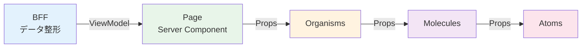

# コンポーネント設計規約

UI の再利用性とデザインの一貫性を高めるための **アプリ実装チームが守るべきコンポーネント設計規約** を定義する。
特に、大規模な医療データを扱う際の描画負荷の抑制と、BFF から提供されるデータとの疎結合を重視する。

| 関連文書 | 内容 |
|---|---|
| [00.ディレクトリ構成.md](../00.ディレクトリ構成.md) | features / shared 配下の物理配置ルール |
| [04_状態管理設計/状態管理規約.md](../04_状態管理設計/状態管理規約.md) | カスタム Hooks 経由での React Query / Zustand 連携 |
| [07章 ルーティング設計規約.md](../07_ルーティング設計/ルーティング設計規約.md) | Page 層の定義・ディレクトリ間依存・動的読み込みルール |
| [adr/](adr/) | 本章の設計判断記録（function宣言採用、useContext不採用） |

---

## 1. Atomic Design 分類基準と責務

UI コンポーネントは **bulletproof-react** のディレクトリ構成を基盤とし、`components` 配下に **Atomic Design** を組み合わせたハイブリッド構成を採用する。
階層は Atoms / Molecules / Organisms の3層に分類して管理する（Page 層は [07章 ルーティング設計規約.md](../07_ルーティング設計/ルーティング設計規約.md) §3 を参照）。

### 1.1 各階層の責務と配置

| 階層 | 責務 | 配置ルール | 業務ルール | データ構造 |
| :--- | :--- | :--- | :--- | :--- |
| **Atoms** | UI の最小単位。単体で意味を持たない基礎部品。 | `src/shared/components/atoms/` | **持たない** | Primitive な型（string, number, boolean 等） |
| **Molecules** | 複数の Atoms を組み合わせた汎用部品。 | `src/features/[LV1]/[LV2]/[LV3]/components/molecules/`（初期配置）<br>`src/shared/components/molecules/`（2機能以上で再利用時に昇格） | **持たない** | ViewModel の一部（フラットなオブジェクト） |
| **Organisms** | 画面を構成する具体的な機能の塊。その部品だけで機能のタスクが完結する。 | `src/features/[LV1]/[LV2]/[LV3]/components/organisms/` | **持つ**（機能固有のロジック） | **整形済み ViewModel のみ**（FHIR リソース直接受取は禁止） |

### 1.2 階層別の詳細定義

#### Atoms（原子）

**役割**: UI の最小単位（ボタン、入力フィールド、ラベル、アイコン等）

**技術基盤**:
- **Radix UI** を Primitive として使用（アクセシビリティ担保）
- **Tailwind CSS** でスタイリングを完結させる
- **shadcn/ui** のパターンに倣った実装を標準とする

**禁止事項**:
- 業務ロジックの実装
- 外部 API 呼び出し
- グローバル状態の直接参照

**配置場所**: `src/shared/components/atoms/`（全画面で共有するデザインシステムとして管理）

#### Molecules（分子）

**役割**: 複数の Atoms を組み合わせた汎用部品（検索バー、フォームグループ、カード等）

**設計原則**:
- **ロジックを持たない**（表示のみ）
- 再利用性を重視した設計
- 同じ構成が2箇所以上で使用された時点で `src/shared/components/molecules/` へ昇格

**データ受け渡し**: ViewModel の一部（フラットな構造）を Props で受け取る

**配置場所**:
- 初期配置: `src/features/[LV1]/[LV2]/[LV3]/components/molecules/`
- 昇格後: `src/shared/components/molecules/`

#### Organisms（有機体）

**役割**: 画面を構成する具体的な機能の塊（機能一覧の LV3 画面機能相当）

**設計原則**:
- **その部品だけで機能のタスクが完結する**
- 複雑なデータ構造を扱う場合はこの階層で定義
- **FHIR リソースを直接 Props として渡すことは禁止**（整形済み ViewModel のみ）

**状態管理**:
- 必要に応じてカスタム Hooks を使用して React Query や Zustand と連携
- 状態管理の詳細は [04_状態管理設計/状態管理規約.md](../04_状態管理設計/状態管理規約.md) を参照

**配置場所**: `src/features/[LV1]/[LV2]/[LV3]/components/organisms/`

### 1.3 コンポーネント間の依存方向

コンポーネント階層は **上位層から下位層への一方向の依存** を原則とする。

```
Page → Organisms → Molecules → Atoms
```

ただし、以下の例外を許可する。

- **同階層内の呼び出し**: Molecules 内で別の Molecules を使用、Organisms 内で別の Organisms を使用することは可能
- この場合も循環参照は禁止

詳細は [07章 ルーティング設計規約.md](../07_ルーティング設計/ルーティング設計規約.md) §2「依存関係ルール」を参照。

---

## 2. ファイル命名規則

| 対象 | 命名規則 | 例 |
| :--- | :--- | :--- |
| コンポーネントファイル | PascalCase + 拡張子 `.tsx` | `Button.tsx`, `SearchBar.tsx`, `PatientList.tsx` |
| カスタム Hooks | `use` + PascalCase + `.ts` | `usePatientData.ts`, `useFormValidation.ts` |
| 型定義ファイル | `{機能名}.type.ts`（単数形） | `patient.type.ts`, `diagnosis.type.ts` |
| テストファイル | 対象ファイル名 + `.test.tsx` | `Button.test.tsx`, `SearchBar.test.tsx` |

> 型定義ファイルの命名規則は `docs/02_アプリ基盤/frontend-naming-conventions.md` に基づく。複数の型を含む場合も単数形を使用する（例: `patient.type.ts` 内に `Patient`, `PatientList`, `PatientDetail` 等を含めてよい）。

---

## 3. コンポーネント定義の統一規約

### 3.1 関数コンポーネントへの統一

本プロジェクトでは **関数コンポーネントに統一** する。クラスコンポーネント（`class extends React.Component`）は使用しない。

### 3.2 メイン= function 宣言、内部= アロー関数

メインのコンポーネントは **`function` 宣言** で定義する。内部のロジックやイベントハンドラは **アロー関数** で定義する。

```tsx
// やっていいこと: メインは function 宣言、内部処理は arrow
export function PatientCard({ patient, onPatientSelect }: PatientCardProps) {
  const handleSelect = () => {
    onPatientSelect(patient.id);
  };

  return (
    <div onClick={handleSelect}>
      <h3>{patient.name}</h3>
      <p>{patient.birthDate}</p>
    </div>
  );
}

// やってはいけないこと: メインを arrow で定義
export const PatientCard = ({ patient, onPatientSelect }: PatientCardProps) => {
  // ...
};
```

> 根拠: [ADR-1: メインコンポーネントは function 宣言で定義する](adr/function-vs-arrow-component.md)
>
> **例外**: `React.forwardRef` を使用する場合は `export const Component = forwardRef(...)` の形式を許容する（`forwardRef` は関数呼び出しの戻り値であり `function` 宣言に変換できないため）。この場合は必ず `Component.displayName` を設定すること。

### 3.3 ファイル基本構成

```tsx
// 1. 外部ライブラリの import
import { useState } from 'react';
import { Button } from '@/shared/components/atoms/Button';

// 2. 型定義の import
import type { PatientViewModel } from '@/front_bff_shared/features/patients/types/responses/patient.response';

// 3. Props 型定義（基本は同一ファイル内で定義。複雑・再利用性が高い場合は別ファイルへ — §5.1 参照）
interface PatientCardProps {
  patient: PatientViewModel;
  onPatientSelect: (patientId: string) => void;
  className?: string;
}

// 4. コンポーネント本体
export function PatientCard({ patient, onPatientSelect, className }: PatientCardProps) {
  const handleSelect = () => {
    onPatientSelect(patient.id);
  };

  return (
    <div className={className} onClick={handleSelect}>
      {patient.name}
    </div>
  );
}

// 5. displayName の設定（function 宣言時は任意。forwardRef 使用時は必須 — §3.2 参照）
PatientCard.displayName = 'PatientCard';
```

---

## 4. Export / Import / Composition 規約

### 4.1 Export ルール

- コンポーネントは **named export** を使用する（`export function ComponentName`）。
- `default export` は使用しない（リファクタ時の追跡性向上のため）。
- **例外**: Next.js が `default export` を必須とするファイル（`app/**/page.tsx`、`app/**/layout.tsx`、`app/**/error.tsx` 等）はこの限りではない。

### 4.2 Import ルール

```tsx
// やっていいこと: パスエイリアスを使用
import { Button } from '@/shared/components/atoms/Button';
import { usePatientData } from '@/features/patients/hooks/usePatientData';

// やってはいけないこと: 相対パスの多重ネスト
import { Button } from '../../../shared/components/atoms/Button';
```

### 4.3 index.ts の活用

階層ごとの複数コンポーネントをまとめて export する際は `index.ts` を活用する。Atoms / Molecules / Organisms すべての階層に共通して適用する。

```tsx
// 例: src/features/patients/components/molecules/index.ts
export { PatientCard } from './PatientCard';
export { PatientSearchForm } from './PatientSearchForm';

// 利用側
import { PatientCard, PatientSearchForm } from '@/features/patients/components/molecules';
```

```tsx
// 例: src/shared/components/atoms/index.ts
export { Button } from './Button';
export { Input } from './Input';
export { Label } from './Label';

// 利用側
import { Button, Input, Label } from '@/shared/components/atoms';
```

### 4.4 動的読み込み（遅延ロード）

初期表示が遅くなるほど大きなコンポーネント（モーダル、重いライブラリを使用するグラフ等）は、`next/dynamic` による動的読み込みを検討する。

```tsx
import dynamic from 'next/dynamic';

const HeavyChartComponent = dynamic(
  () => import('@/features/diagnosis/components/organisms/MedicalRecordChart'),
  { ssr: false }
);
```

詳細な適用基準・実装パターン・性能計測については [07章 パフォーマンス最適化設計.md](../07_ルーティング設計/パフォーマンス最適化設計.md) §2「Code Splitting」を参照。

### 4.5 useContext を使用しない

本プロジェクトでは **`React.createContext` および `useContext` を使用しない**。

propsバケツリレーを避けたい場合は、状況に応じて以下を使用する。

| 状況 | 使用する技術 | 説明 |
|------|------------|------|
| **フォーム状態の共有** | **React Hook Form (FormProvider)** | フォーム内の深い階層でフォーム状態にアクセスする場合、`FormProvider` + `useFormContext` を使用 |
| **グローバル UI 状態の共有** | **Zustand** | アプリ全体で共有する UI 状態（テナント情報、選択中の患者等）は Zustand で管理 |
| **サーバーデータの共有** | **React Query（カスタムフック）** | BFF から取得したデータはカスタムフックを通じてアクセス。キャッシュにより同じデータを複数回取得しない |

詳細は [04_状態管理設計/状態管理規約.md](../04_状態管理設計/状態管理規約.md) を参照。

> 根拠: [ADR-2: React Context（useContext）を採用しない](adr/no-react-context.md)

---

## 5. Props 設計規約

### 5.1 Props 型定義パターン

**基本パターン（小規模・1コンポーネント内で完結）**:

```tsx
// コンポーネントファイル内で interface 定義
interface StatusBadgeProps {
  label: string;
  variant?: 'success' | 'warning' | 'danger';
}

export function StatusBadge({ label, variant = 'success' }: StatusBadgeProps) {
  // 実装
}
```

**複雑な型の場合（再利用性が高い・大規模）**:

```tsx
// 別ファイルで定義
// src/features/patients/management/list/types/patientList.type.ts
import type { PatientViewModel } from '@/front_bff_shared/features/patients/types/responses/patient.response';

export interface PatientListProps {
  patients: PatientViewModel[];
  onPatientSelect: (patientId: string) => void;
  selectedPatientId?: string;
  isLoading?: boolean;
  error?: Error | null;
}
```

### 5.2 必須 / オプションの判断基準

| 項目 | 必須（required） | オプション（optional） |
| :--- | :--- | :--- |
| **データ表示に必須** | `patient: PatientViewModel` | - |
| **イベントハンドラ（重要）** | `onSubmit: () => void` | - |
| **スタイル調整** | - | `className?: string` |
| **デフォルト値あり** | - | `variant?: 'primary' \| 'secondary'` |
| **条件付き表示** | - | `showDetails?: boolean` |

### 5.3 イベントハンドラの命名規則

```tsx
interface ComponentProps {
  // やっていいこと: on + 動詞 + 名詞（具体的な動作を示す）
  onDiagnosisSubmit: (data: DiagnosisFormData) => void;
  onPatientSelect: (patientId: string) => void;
  onFormChange: (field: string, value: string) => void;

  // やってはいけないこと: 曖昧な命名
  handleClick: () => void;  // "handle" は内部実装で使用（コンポーネント内のローカル関数名はOK）
  click: () => void;        // 動詞のみ
}
```

> **例外**: React 標準と一致するネイティブイベント名（`onChange`, `onSubmit`, `onClick` 等）は、HTML 要素に近い汎用 Atom でそのまま使うことを許容する。機能固有の意味を持つ Organism の Props は `onDiagnosisSubmit` のように具体的な名詞を付けること。

### 5.4 children と Composition

```tsx
// やっていいこと: children を活用した柔軟な設計
interface CardProps {
  title: string;
  children: React.ReactNode;
  footer?: React.ReactNode;
}

export function Card({ title, children, footer }: CardProps) {
  return (
    <div className="card">
      <h2>{title}</h2>
      <div className="card-body">{children}</div>
      {footer && <div className="card-footer">{footer}</div>}
    </div>
  );
}

// 使用例
<Card title="患者情報" footer={<Button type="submit">保存</Button>}>
  <PatientForm />
</Card>
```

---

## 6. データ流し込みパターン（Atomic Design リレー）

大規模開発における保守性を確保するため、BFF からフロントエンドのプレゼンテーション層へ至るまで **「Atomic Design リレー」** と呼ばれる型安全なデータ流通フローを適用する。

### 6.1 データフローの全体像



### 6.2 各層の責務

| 層 | 責務 | データ形式 |
| :--- | :--- | :--- |
| **BFF でのデータ整形（Mapping）** | バックエンド API の複雑な「生データ」を集約し、UI 表示に最適化されたフラットな **ViewModel（または DTO）** へ変換 | FHIR リソース → ViewModel |
| **Page 層での一括受取** | Page（Server Component）が BFF から ViewModel を型安全に受信 | ViewModel（型安全） |
| **Presentation 層への流し込み** | Page から Organisms、さらに Molecules へと、加工済みの文字列やオブジェクトを Props として流し込む | ViewModel の部分集合 |
| **表示ロジックの排除** | UI コンポーネント内での計算や変換（例: 日付形式の整形）を最小限に抑え、BFF から届いたデータを「そのまま表示するだけ」の状態にする | 表示用文字列 |

### 6.3 実装例: 患者一覧画面

**Step 1: BFF が ViewModel を生成**

```typescript
// front_bff_shared/features/patients/types/responses/patient.response.ts
export interface PatientViewModel {
  id: string;
  name: string;
  nameKana: string;
  birthDate: string;           // "1990-01-01"（整形済み）
  ageDisplay: string;          // "34歳"（表示用文字列。UI側で加工しない）
  gender: string;              // "男性"（表示用文字列）
  medicalRecordNumber: string; // "12345678"
}
```

**Step 2: Page（Server Component）が BFF からデータ取得**

```tsx
// src/app/(main)/patients/management/list/page.tsx
// Next.js の page.tsx は default export が必須（§4.1 の例外）
import { fetchPatients } from '@/features/patients/management/list/repository/patientRepository';
import { PatientListOrganism } from '@/features/patients/management/list/components/organisms/PatientListOrganism';

export default async function PatientListPage() {
  const patients = await fetchPatients();

  return (
    <div className="container">
      <h1>患者一覧</h1>
      <PatientListOrganism patients={patients} />
    </div>
  );
}
```

**Step 3: Organisms がデータを受け取り Molecules へ渡す**

```tsx
'use client';

// src/features/patients/management/list/components/organisms/PatientListOrganism.tsx
import { PatientCard } from '@/features/patients/management/list/components/molecules/PatientCard';
import { usePatientState } from '@/features/patients/management/list/hooks/usePatientState';
import type { PatientViewModel } from '@/front_bff_shared/features/patients/types/responses/patient.response';

interface PatientListOrganismProps {
  patients: PatientViewModel[];
}

export function PatientListOrganism({ patients }: PatientListOrganismProps) {
  const { selectPatient } = usePatientState();

  const handlePatientSelect = (patientId: string) => {
    selectPatient(patientId);
  };

  return (
    <div className="grid grid-cols-1 md:grid-cols-2 lg:grid-cols-3 gap-4">
      {patients.map((patient) => (
        <PatientCard
          key={patient.id}
          patient={patient}
          onPatientSelect={handlePatientSelect}
        />
      ))}
    </div>
  );
}
```

**Step 4: Molecules がデータを表示**

```tsx
'use client';

// src/features/patients/management/list/components/molecules/PatientCard.tsx
import { Button } from '@/shared/components/atoms/Button';
import type { PatientViewModel } from '@/front_bff_shared/features/patients/types/responses/patient.response';

interface PatientCardProps {
  patient: PatientViewModel;
  onPatientSelect: (patientId: string) => void;
}

export function PatientCard({ patient, onPatientSelect }: PatientCardProps) {
  const handleSelect = () => {
    onPatientSelect(patient.id);
  };

  return (
    <div className="border rounded-lg p-4 hover:shadow-lg transition">
      <h3 className="text-lg font-bold">{patient.name}</h3>
      <p className="text-sm text-gray-600">{patient.nameKana}</p>
      <div className="mt-2 space-y-1">
        <p>{patient.birthDate}（{patient.ageDisplay}）</p>
        <p>{patient.gender}</p>
        <p>{patient.medicalRecordNumber}</p>
      </div>
      <Button onClick={handleSelect} className="mt-4 w-full">
        選択
      </Button>
    </div>
  );
}
```

### 6.4 設計原則

**やっていいこと**:
- BFF でデータ整形を完了させる（日付フォーマット、計算、文字列変換等）
- ViewModel は表示用に最適化されたフラットな構造にする
- UI コンポーネントは受け取ったデータを「そのまま表示」する

**やってはいけないこと**:
- UI コンポーネント内で複雑なデータ変換を行う
- FHIR リソースを直接 Props として渡す
- Molecules が直接 API 呼び出しを行う

---

## 7. 各階層の実装パターン

### 7.1 Atoms - 実装例

**実装例: Button コンポーネント（Radix UI + Tailwind CSS）**

```tsx
// src/shared/components/atoms/Button.tsx
import { forwardRef } from 'react';
import { Slot } from '@radix-ui/react-slot';
import { cva, type VariantProps } from 'class-variance-authority';

const buttonVariants = cva(
  'inline-flex items-center justify-center rounded-md text-sm font-medium transition-colors focus-visible:outline-none focus-visible:ring-2 disabled:pointer-events-none disabled:opacity-50',
  {
    variants: {
      variant: {
        primary: 'bg-blue-600 text-white hover:bg-blue-700',
        secondary: 'bg-gray-200 text-gray-900 hover:bg-gray-300',
        danger: 'bg-red-600 text-white hover:bg-red-700',
      },
      size: {
        sm: 'h-9 px-3',
        md: 'h-10 px-4 py-2',
        lg: 'h-11 px-8',
      },
    },
    defaultVariants: {
      variant: 'primary',
      size: 'md',
    },
  }
);

export interface ButtonProps
  extends React.ButtonHTMLAttributes<HTMLButtonElement>,
    VariantProps<typeof buttonVariants> {
  asChild?: boolean;
}

export const Button = forwardRef<HTMLButtonElement, ButtonProps>(
  ({ className, variant, size, asChild = false, ...props }, ref) => {
    const Comp = asChild ? Slot : 'button';
    return (
      <Comp
        className={buttonVariants({ variant, size, className })}
        ref={ref}
        {...props}
      />
    );
  }
);

Button.displayName = 'Button';
```

**実装ガイドライン**:

| やっていいこと | やってはいけないこと |
| :--- | :--- |
| Radix UI を Primitive として使用 | 業務ロジックを実装 |
| Tailwind CSS でスタイリング | API 呼び出し |
| アクセシビリティ属性を適切に設定 | グローバル状態の直接参照 |
| 汎用的な設計（どこでも使える） | 特定の業務機能に依存 |

### 7.2 Molecules - 実装例

**実装例: SearchBar コンポーネント**

```tsx
'use client';

// src/features/patients/management/list/components/molecules/SearchBar.tsx
import { Input } from '@/shared/components/atoms/Input';
import { Button } from '@/shared/components/atoms/Button';
import { Search } from 'lucide-react';

interface SearchBarProps {
  placeholder?: string;
  value: string;
  onSearchTextChange: (value: string) => void;
  onSearch: () => void;
}

export function SearchBar({
  placeholder = '検索...',
  value,
  onSearchTextChange,
  onSearch,
}: SearchBarProps) {
  const handleChange = (e: React.ChangeEvent<HTMLInputElement>) => {
    onSearchTextChange(e.target.value);
  };

  const handleKeyDown = (e: React.KeyboardEvent<HTMLInputElement>) => {
    if (e.key === 'Enter') {
      onSearch();
    }
  };

  return (
    <div className="flex gap-2">
      <Input
        type="text"
        placeholder={placeholder}
        value={value}
        onChange={handleChange}
        onKeyDown={handleKeyDown}
        className="flex-1"
      />
      <Button onClick={onSearch} size="md">
        <Search className="h-4 w-4" />
        <span className="ml-2">検索</span>
      </Button>
    </div>
  );
}
```

**実装ガイドライン**:

| やっていいこと | やってはいけないこと |
| :--- | :--- |
| Atoms を組み合わせて構築 | 独自のバリデーションロジック |
| イベントハンドラを親から受け取る | API 呼び出し |
| 再利用可能な設計 | 状態管理（useState 以外） |
| シンプルなデータ構造（フラット）を受け取る | 複雑なビジネスロジック |

### 7.3 Organisms - 実装例

**実装例: DiagnosisForm コンポーネント**

```tsx
'use client';

// src/features/diagnosis/entry/components/organisms/DiagnosisForm.tsx
import { Button } from '@/shared/components/atoms/Button';
import { Input } from '@/shared/components/atoms/Input';
import { useDiagnosisForm } from '@/features/diagnosis/entry/hooks/useDiagnosisForm';
import type { DiagnosisFormData } from '@/front_bff_shared/features/diagnosis/types/requests/diagnosis.request';

interface DiagnosisFormProps {
  initialData?: Partial<DiagnosisFormData>;
  onDiagnosisSubmit: (data: DiagnosisFormData) => Promise<void>;
  isLoading?: boolean;
}

export function DiagnosisForm({
  initialData,
  onDiagnosisSubmit,
  isLoading = false,
}: DiagnosisFormProps) {
  const { register, handleSubmit, errors, isDirty, isValid } = useDiagnosisForm({ initialData });

  const handleFormSubmit = handleSubmit(async (data) => {
    await onDiagnosisSubmit(data);
  });

  return (
    <form onSubmit={handleFormSubmit} className="space-y-4">
      <div>
        <label htmlFor="diagnosis-name" className="block text-sm font-medium">
          診断名 <span className="text-red-500">*</span>
        </label>
        <Input
          id="diagnosis-name"
          {...register('diagnosisName')}
          placeholder="診断名を入力"
          aria-invalid={!!errors.diagnosisName}
        />
        {errors.diagnosisName && (
          <p className="text-sm text-red-600 mt-1">
            {errors.diagnosisName.message}
          </p>
        )}
      </div>

      <div>
        <label htmlFor="onset-date" className="block text-sm font-medium">
          発症日
        </label>
        <Input
          id="onset-date"
          type="date"
          {...register('onsetDate')}
          aria-invalid={!!errors.onsetDate}
        />
        {errors.onsetDate && (
          <p className="text-sm text-red-600 mt-1">
            {errors.onsetDate.message}
          </p>
        )}
      </div>

      <div className="flex justify-end gap-2">
        <Button type="submit" disabled={!isDirty || !isValid || isLoading}>
          {isLoading ? '保存中...' : '保存'}
        </Button>
      </div>
    </form>
  );
}
```

> `useDiagnosisForm` は `useForm` のラップフック（`use{Feature}Form` 命名規則 — 状態管理規約 §7.4）。`resolver`・`mode`・`defaultValues` の設定と `reset()` 呼び出しをフック側に集約することで、Organism をプレゼンテーション専任に保つ。

**実装ガイドライン**:

| やっていいこと | やってはいけないこと |
| :--- | :--- |
| 機能固有のビジネスロジックを実装 | FHIR リソースを直接 Props で受け取る |
| React Hook Form や Zod を活用したバリデーション | BFF 呼び出し（カスタム Hooks に委譲） |
| カスタム Hooks で状態管理と連携 | 他の LV3 機能の Organisms に依存 |
| ViewModel を受け取る | グローバル状態を直接変更 |

---

## 8. 責務サマリ

| 階層 | 配置 | 業務ロジック | API 呼び出し | 状態管理 | 受け取るデータ |
| :--- | :--- | :--- | :--- | :--- | :--- |
| **Atoms** | `src/shared/components/atoms/` | ❌ | ❌ | ❌ | Primitive |
| **Molecules** | `src/features/.../molecules/`（昇格時 `shared`）| ❌ | ❌ | ❌（`useState` のみ可） | フラット ViewModel |
| **Organisms** | `src/features/.../organisms/` | ✅ | ❌（カスタム Hooks 経由） | ✅（カスタム Hooks 経由） | 整形済み ViewModel |
| **Page** | `src/app/.../page.tsx` | ✅ | ✅（Server Component で fetch） | - | - |

| 設計判断 | リンク |
|---|---|
| メインコンポーネントを function 宣言で定義する理由 | [ADR-1](adr/function-vs-arrow-component.md) |
| useContext を採用しない理由 | [ADR-2](adr/no-react-context.md) |
