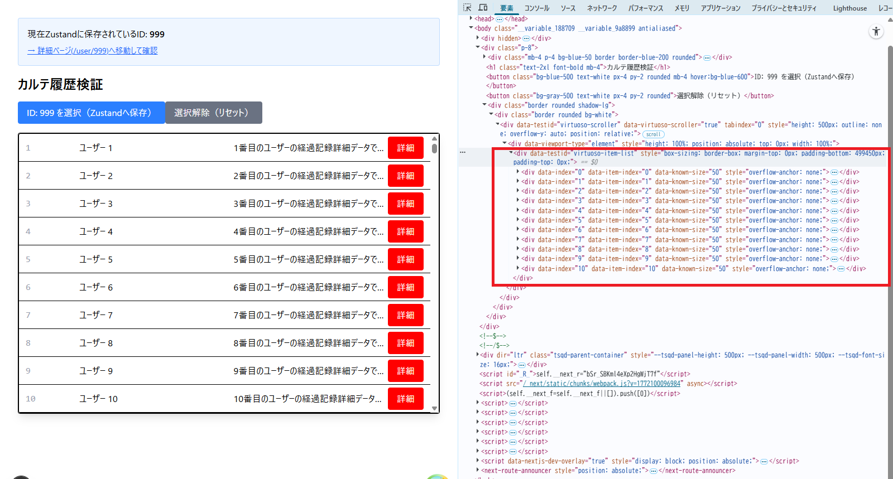

# UI実装とビジュアル設計

本章では、電子カルテシステムに求められる高度な表示パフォーマンスと、医療情報を安全に扱うためのビジュアル実装規約を定義する。

## UIレイヤアーキテクチャ

本システムのUIは、「何を表示するか（業務）」と「どう表示するか（デザイン・振る舞い）」を明確に分離したレイヤ構造で設計する。  
**本章は、デザインコンポーネント以下の層（★）を対象とする。**

```
┌──────────────────────────────────────────────────────┐
│  Pages（業務UI）                                      │
│  画面単位の構成。カルテ画面、患者一覧画面など。           │
└──────────────────────────────────────────────────────┘
                          ↓ 組み立てる
┌──────────────────────────────────────────────────────┐
│  Organisms（業務コンポーネント）                       │
│  業務ロジックを含むUIのまとまり。                       │
│  例：PatientRegisterForm（患者登録フォーム全体）        │
└──────────────────────────────────────────────────────┘
                          ↓ 組み立てる
┌──────────────────────────────────────────────────────┐
│ ★ Molecules / Atoms（デザインコンポーネント）          │
│  業務ロジックを持たない共通部品。shadcn/ui ベース。      │
│  例：Button、Input、Dialog、Card                      │
└──────────────────────────────────────────────────────┘
                          ↓ 振る舞いを提供
┌──────────────────────────────────────────────────────┐
│ ★ Radix UI                                          │
│  アクセシビリティ・フォーカス管理・キーボード操作を担う。 │
│  shadcn/ui が内部で利用。開発者は直接意識しなくてよい。  │
└──────────────────────────────────────────────────────┘
                          ↓ 見た目を適用
┌──────────────────────────────────────────────────────┐
│ ★ Tailwind CSS                                      │
│  ユーティリティクラスによるスタイル定義。                │
└──────────────────────────────────────────────────────┘
```

| レイヤ | 技術 |
|---|---|
| Pages / Organisms | React, Next.js |
| Molecules / Atoms | shadcn/ui |
| 振る舞い | Radix UI |
| スタイル | Tailwind CSS v4 |

## 本章の範囲

本章で扱う範囲は以下の通り：

- **UIデザインシステムの技術基盤**：Tailwind CSS v4を中心としたスタイリング基盤
- **テーマ設計**：CSS変数を用いたデザイントークンの一元管理
- **コンポーネントスタイリング**：ユーティリティファーストの原則と`@apply`の使用方法
- **大規模リスト表示**：react-virtuosoによる仮想化描画の実装パターン
- **画像最適化**：next/imageによる高速化とLCP対策
- **命名規則**：CSS変数、カスタムクラス、コンポーネントファイルの命名規則

各セクションには、該当する「やっていいこと」「やってはいけないこと」の実装ルールを記載している。

**関連ドキュメント**：
- UIライブラリ（Tailwind CSS、shadcn/ui、Radix UI）の採用理由については、フロントエンド方式設計書を参照
- コンポーネントの構造と責務については「[05.コンポーネント設計.md](05.コンポーネント設計.md)」を参照
- ディレクトリ配置については「[00.ディレクトリ構成.md](00.ディレクトリ構成.md)」を参照
- セキュリティ基盤全体（XSS対策、DOMPurify使用方法等）については「[13.セキュリティ基盤設計.md](13.セキュリティ基盤設計.md)」を参照
- パフォーマンス目標と計測方法については、フロントエンド方式設計書を参照

---

## UIデザインシステムの技術基盤

本システムでは、**Tailwind CSS v4**、**shadcn/ui**、**Radix UI** の3つの技術を組み合わせたデザインシステムを構築する。

各技術の採用理由と比較検討については、フロントエンド方式設計書を参照のこと。

### Tailwind CSS v4の採用

本システムでは、最新の **Tailwind CSS v4** を採用する。

#### v4採用の理由

従来のv3ではなくv4を採用する理由は以下の通り：

- **CSS変数ベースの設計**：`@theme`ブロックを用いたCSS変数による柔軟なデザイントークン管理が可能
- **設定の簡素化**：従来の`tailwind.config.js`による複雑な設定が不要となり、`globals.css`内で完結
- **パフォーマンス向上**：ビルド時の処理速度が改善され、開発体験が向上
- **長期保守性**：最新バージョンを採用することで、長期的なサポートとアップデート対応が容易

v4では`@theme`ブロックを用いたCSS変数ベースのデザインシステムが導入され、従来の`tailwind.config.js`による設定からより柔軟な管理方式へと移行している。

#### 使用方法

Tailwind CSSは、コンポーネントに**ユーティリティクラスを直接記述**して使用する：

```tsx
// 基本的な使用例
export default function Button({ children }: { children: React.ReactNode }) {
  return (
    <button className="bg-primary text-white px-4 py-2 rounded hover:opacity-80">
      {children}
    </button>
  );
}
```

複雑なスタイルは`globals.css`で`@apply`を用いてカスタムクラスとして定義：

```css
/* globals.css */
.karte-button {
  @apply bg-primary text-white px-4 py-2 rounded transition-opacity hover:opacity-80;
}
```

#### 構成ファイル

| ファイル | 役割 |
| :--- | :--- |
| `postcss.config.js` | `@tailwindcss/postcss` プラグインを使用 |
| `src/app/globals.css` | `@theme` ブロックでデザインシステムを定義 |

### shadcn/uiの使用方法

**shadcn/ui** は、アクセシブルなコンポーネントをプロジェクトにコピーして使用する方式を採用する。

#### コンポーネントのインストール

shadcn/uiは、CLIを用いて必要なコンポーネントをプロジェクトに追加する：

```bash
# 初回のみ：shadcn/uiの初期化
npx shadcn@latest init

# 必要なコンポーネントの追加（例：Button）
npx shadcn@latest add button

# 複数コンポーネントの一括追加
npx shadcn@latest add button input card dialog
```

#### 配置先と管理

インストールしたコンポーネントは、`src/shared/components/atoms/ui/` に配置される：

```
frontend/src/shared/components/atoms/
└── ui/
    ├── button.tsx        # shadcn/uiでインストール
    ├── input.tsx
    ├── card.tsx
    └── dialog.tsx
```

**重要**：これらのコンポーネントはプロジェクトの一部となるため、必要に応じてカスタマイズ可能。外部ライブラリの破壊的変更の影響を受けない。

#### 使用例

インストールしたコンポーネントは、通常のReactコンポーネントとして使用する：

```tsx
import { Button } from '@/shared/components/atoms/ui/button';
import { Input } from '@/shared/components/atoms/ui/input';

export default function LoginForm() {
  return (
    <form>
      <Input type="email" placeholder="メールアドレス" />
      <Input type="password" placeholder="パスワード" />
      <Button variant="default" size="lg">
        ログイン
      </Button>
    </form>
  );
}
```

#### カスタマイズ方法

shadcn/uiのコンポーネントはプロジェクト内にあるため、直接編集してカスタマイズできる：

```tsx
// src/shared/components/atoms/ui/button.tsx を直接編集
// 例：新しいvariantを追加
const buttonVariants = cva(
  "inline-flex items-center justify-center rounded-md text-sm font-medium",
  {
    variants: {
      variant: {
        default: "bg-primary text-white hover:opacity-80",
        outline: "border border-input bg-background hover:bg-accent",
        // カスタムvariantを追加
        danger: "bg-danger text-white hover:opacity-80",
      },
      // ...
    },
  }
);
```

### Radix UIの使用方法

**Radix UI** は、アクセシビリティを担保するプリミティブコンポーネントとして機能する。

#### 基本的な使用パターン

**shadcn/ui経由で使用する（推奨）**：

基本的に、shadcn/uiを通じてRadix UIを利用する。shadcn/uiのコンポーネントは内部でRadix UIを使用している。

```tsx
// shadcn/uiのDialogコンポーネント（内部でRadix UIを使用）
import {
  Dialog,
  DialogContent,
  DialogHeader,
  DialogTitle,
  DialogTrigger,
} from '@/shared/components/atoms/ui/dialog';

export default function ConfirmDialog() {
  return (
    <Dialog>
      <DialogTrigger asChild>
        <Button>削除</Button>
      </DialogTrigger>
      <DialogContent>
        <DialogHeader>
          <DialogTitle>削除の確認</DialogTitle>
        </DialogHeader>
        <p>本当に削除しますか？</p>
      </DialogContent>
    </Dialog>
  );
}
```

#### 直接使用する場合

shadcn/uiに含まれないコンポーネント（例：Context Menu、Hover Card等）が必要な場合は、Radix UIを直接インストールして使用する：

```bash
# 例：Context Menuを直接使用する場合
npm install @radix-ui/react-context-menu
```

使用例：

```tsx
import * as ContextMenu from '@radix-ui/react-context-menu';

export default function FileContextMenu() {
  return (
    <ContextMenu.Root>
      <ContextMenu.Trigger className="block p-4 border rounded">
        右クリックしてメニューを表示
      </ContextMenu.Trigger>
      <ContextMenu.Portal>
        <ContextMenu.Content className="bg-white border rounded shadow-lg p-1">
          <ContextMenu.Item className="px-2 py-1 hover:bg-gray-100 rounded">
            開く
          </ContextMenu.Item>
          <ContextMenu.Item className="px-2 py-1 hover:bg-gray-100 rounded">
            削除
          </ContextMenu.Item>
        </ContextMenu.Content>
      </ContextMenu.Portal>
    </ContextMenu.Root>
  );
}
```

**注意**：Radix UIを直接使用する場合も、スタイリングはTailwind CSSで行う。

### 3つの技術の連携

Tailwind CSS、shadcn/ui、Radix UIは以下のように連携して動作する：

```
┌─────────────────────────────────────────────┐
│  コンポーネント（例: LoginButton.tsx）       │
│                                             │
│  import { Button } from '@/ui/button';      │
│  <Button variant="primary">ログイン</Button>│
└─────────────────────────────────────────────┘
                    ↓
┌─────────────────────────────────────────────┐
│  shadcn/ui (src/shared/components/atoms/ui/)│
│  - コンポーネント統合                        │
│  - Radix UI + Tailwind CSS の組み合わせ     │
└─────────────────────────────────────────────┘
          ↓                    ↓
┌──────────────────┐  ┌──────────────────────┐
│  Radix UI        │  │  Tailwind CSS        │
│  - アクセシビリティ│  │  - ビジュアル        │
│  - フォーカス管理  │  │  - 色、余白、影      │
│  - キーボード操作  │  │  - レスポンシブ      │
└──────────────────┘  └──────────────────────┘
```

#### 実装フロー

1. **shadcn/uiでコンポーネントをインストール**
   ```bash
   npx shadcn@latest add button
   ```

2. **必要に応じてカスタマイズ**
   - `src/shared/components/atoms/ui/button.tsx` を直接編集
   - Tailwind CSSのクラスを追加・変更

3. **コンポーネントを使用**
   ```tsx
   import { Button } from '@/shared/components/atoms/ui/button';
   <Button variant="primary">送信</Button>
   ```

4. **アクセシビリティは自動的に担保**
   - Radix UIがフォーカス管理、ARIA属性、キーボード操作を提供
   - 開発者は振る舞いを意識せずスタイリングに集中できる

---

## テーマ設計とデザイントークン

デザインの一貫性を保つため、CSS変数を用いたデザイントークン管理を行う。

### globals.cssによるデザインシステム定義

Tailwind CSS v4では、`globals.css` 内で `@theme` ブロックを使用してデザインシステムを定義する。

#### 基本構成

`frontend/src/app/globals.css` の構成は以下の通り：

```css
/* 1. Tailwind CSSの読み込み */
@import "tailwindcss";

/* 2. テーマ変数の定義（Tailwindのトークンとして登録） */
@theme {
  --color-primary: var(--primary-color);
  --color-secondary: var(--secondary-color);
  --color-danger: var(--danger-color);
  --color-success: var(--success-color);
}

/* 3. 実際の値の定義（一元管理） */
:root {
  --primary-color: #0066cc;
  --secondary-color: #6b7280;
  --danger-color: #dc2626;
  --success-color: #16a34a;
}

/* 4. カスタムクラスの定義 */
.karte-button {
  @apply bg-primary text-white px-4 py-2 rounded transition-opacity;
}

.karte-button:hover {
  @apply opacity-80;
}
```

#### 設計のポイント

- **`@theme`ブロック**：Tailwindのユーティリティクラス（例：`bg-primary`）として使用可能になる
- **`:root`での値定義**：CSS変数の値を一箇所で管理し、変更時の影響範囲を最小化
- **カスタムクラス**：複雑なスタイリングは `@apply` を用いて再利用可能なクラスとして定義

**注意**：CSS変数の詳細な命名規則については、本章末尾の「命名規則」セクションを参照のこと。

### 実装ルール

#### やっていいこと

- **CSS変数を使用してデザイントークンを一元管理**し、変更を容易にする
- `:root`で定義したCSS変数を`@theme`ブロックで参照する

#### やってはいけないこと

- **Tailwindと同等の機能をCSS変数で再定義**する（重複を避ける）
- **グローバルCSSクラス名を無秩序に増やす**（命名衝突のリスク）

---

## コンポーネントスタイリング実装

### ユーティリティファーストの原則

基本的に、コンポーネントのスタイリングは **Tailwindのユーティリティクラスを直接使用** する。

#### 実装例

```tsx
export default function PatientCard({ patient }: { patient: Patient }) {
  return (
    <div className="border rounded-lg p-4 bg-white shadow-sm hover:shadow-md transition-shadow">
      <h3 className="text-lg font-bold text-gray-900">{patient.name}</h3>
      <p className="text-sm text-gray-600">{patient.birthDate}</p>
    </div>
  );
}
```

### @applyを用いたカスタムクラス定義

以下の条件を満たす場合、`@apply` を用いたカスタムクラスを定義する：

- **複雑なスタイル**：10個以上のユーティリティクラスが必要な場合
- **繰り返し使用**：同じスタイルの組み合わせが3箇所以上で使用される場合
- **状態管理**：hover、focus、active等の複数の状態を持つ場合

#### 実装例

`globals.css` に定義：

```css
.karte-button {
  @apply bg-primary text-white px-4 py-2 rounded transition-opacity;
}

.karte-button:hover {
  @apply opacity-80;
}

.karte-button:disabled {
  @apply opacity-50 cursor-not-allowed;
}
```

コンポーネント側で使用：

```tsx
export default function KarteListItem({ item }: { item: KarteItem }) {
  return (
    <div className="flex items-center p-3 border-b">
      <span className="flex-1">{item.name}</span>
      <button className="karte-button" onClick={() => handleClick(item.id)}>
        詳細
      </button>
    </div>
  );
}
```

### 実装ルール

#### やっていいこと

- **Tailwindユーティリティクラスを直接使用**してシンプルにスタイリングする
- **複雑なスタイルは`@apply`でカスタムクラス化**して再利用性を高める
- **shadcn/uiのコンポーネントをベース**に、必要に応じてカスタマイズする

#### やってはいけないこと

- **インラインスタイル（`style={{...}}`）を使用**する（デバッグ時を除く）
- **コンポーネントファイル内に`<style>`タグ**を記述する

---

## 大規模リスト表示の最適化

1万件規模のカルテ履歴や投薬情報などの大量データを、ブラウザをフリーズさせることなく高速に表示するため、仮想化を標準採用する。

### react-virtuosoによる仮想化描画

#### ライブラリ選定理由

- **Next.js環境との親和性**：SSR/CSRのハイブリッド環境で安定動作
- **メンテナンス性**：活発に開発が継続されている
- **使いやすさ**：react-windowよりもシンプルなAPI

#### 動作原理

- **メモリ管理**：1万件のデータ全体をメモリに保持
- **DOM制御**：表示領域内の数十個のみをDOM要素として描画
- **再利用（Recycle）**：スクロール時にDOM要素を再利用し、描画コストを最小化



### 実装パターン

#### 基本実装例

`frontend/src/features/<LV1>/<LV2>/<LV3>/components/organisms/VirtualizedKarteList.tsx`

```tsx
"use client";

import { Virtuoso } from 'react-virtuoso';
import Image from 'next/image';
import { KarteResponse } from '@/front_bff_shared/types/response/karte.response.type';

export default function VirtualizedKarteList({ data }: { data: KarteResponse[] }) {
  return (
    <div className="border rounded bg-white">
      <Virtuoso
        style={{ height: '600px' }}
        totalCount={data.length}
        itemContent={(index) => (
          <div className="flex items-center p-3 border-b h-[80px]">
            {/* 画像表示 */}
            <div className="w-[60px] h-[60px] relative mr-4 bg-gray-100 rounded overflow-hidden">
              <Image
                src={data[index].imageUrl || '/no-image.png'}
                alt={data[index].name}
                fill
                sizes="60px"
                className="object-cover"
                priority={index < 10}
              />
            </div>
            
            {/* データ表示 */}
            <span className="w-24 text-gray-400 font-mono">{data[index].id}</span>
            <span className="flex-1 truncate font-bold">{data[index].name}</span>
            <span className="flex-1 truncate">{data[index].description}</span>
            
            {/* アクションボタン */}
            <button 
              onClick={() => alert(data[index].id)}
              className="karte-button"
            >
              詳細
            </button>
          </div>
        )}
      />
    </div>
  );
}
```

#### SSRとの併用

初期データはサーバー側で生成（SSR）してHTMLに埋め込み、LCPを短縮する。

```tsx
// Page Component (SSR)
export default async function KarteListPage() {
  // サーバー側でデータ取得
  const data = await fetchKarteList();
  
  return (
    <div>
      <h1>カルテ一覧</h1>
      <VirtualizedKarteList data={data} />
    </div>
  );
}
```

**注意**：パフォーマンス目標については、フロントエンド方式設計書を参照のこと。

### 実装ルール

#### やっていいこと

- **react-virtuosoで大規模リスト**を実装し、DOMを最小限に抑える
- 1000件以上のデータを表示する場合は必ず仮想化を使用する

#### やってはいけないこと

- **大量データを通常のmapで描画**する（仮想化を使用する）
- 仮想化が必要な規模のリストに対して、全要素をDOMに展開する

### エラーハンドリングの実装例

#### データ取得失敗時の例

```tsx
export default function VirtualizedKarteList({ data }: { data: KarteResponse[] }) {
  if (!data || data.length === 0) {
    return (
      <div className="border rounded bg-white p-8 text-center text-gray-500">
        <p>表示するデータがありません</p>
      </div>
    );
  }

  return (
    <div className="border rounded bg-white">
      <Virtuoso
        style={{ height: '600px' }}
        totalCount={data.length}
        itemContent={(index) => (
          // ... 実装
        )}
      />
    </div>
  );
}
```

#### クライアント操作エラー時の例

```tsx
const handleDetailClick = (id: string) => {
  try {
    // 詳細画面への遷移処理
    router.push(`/karte/${id}`);
  } catch (error) {
    console.error('詳細画面への遷移に失敗しました:', error);
    // エラートースト表示（toast実装が必要）
  }
};
```

---

## 画像最適化

医療画像やプロファイル画像などを、通信帯域を圧迫せず、かつ高画質に表示するための最適化を行う。

### next/imageコンポーネント

すべての画像表示には、Next.jsの `<Image>` コンポーネントの使用を **必須** とする。

#### 自動最適化機能

`next/image` は以下の最適化を自動的に実行する：

- **フォーマット変換**：JPEG/PNGをWebP/AVIFに変換（ブラウザ対応状況に応じて）
- **リサイズ**：表示サイズに応じた最適な解像度で配信
- **遅延読み込み**：ビューポート外の画像は読み込みを遅延（`priority`未指定時）

画像処理エンジン `sharp` の導入方法については、POC検証結果を参照のこと。

### next.config.ts設定

外部画像を使用する場合、`next.config.ts` の `images.remotePatterns` で許可ドメインをホワイトリスト方式で設定する必要がある。

**管理責任**：
- `next.config.ts` の作成・管理は **アプリ基盤チーム** が担当する
- 画像ドメインの追加・変更が必要な場合は、基盤チームに依頼すること

**セキュリティ原則**：
- 許可したドメインのみ画像読み込み可能
- `https`のみを許可し、`http`は拒否

### LCP対策とpriority属性

ファーストビューに表示される主要画像には `priority` 属性を付与する。

#### 実装パターン

```tsx
import Image from 'next/image';

export default function VirtualizedKarteList({ data }: { data: KarteResponse[] }) {
  return (
    <Virtuoso
      totalCount={data.length}
      itemContent={(index) => (
        <div className="flex items-center p-3 border-b">
          <div className="w-[60px] h-[60px] relative">
            <Image
              src={data[index].imageUrl || '/no-image.png'}
              alt={data[index].name}
              fill
              sizes="60px"
              className="object-cover"
              priority={index < 10}  // 最初の10件のみ優先ロード
            />
          </div>
          {/* ... */}
        </div>
      )}
    />
  );
}
```

#### priority属性の効果

- **遅延読み込み無効化**：該当画像は即座に読み込みを開始
- **preload指定**：HTMLの`<head>`内に`<link rel="preload">`が自動追加
- **LCP改善**：主要コンテンツの表示時間を短縮（POC実測：1.2〜1.8秒）

#### 使い分けの基準

| 状況 | priority属性 | 理由 |
| :--- | :--- | :--- |
| ファーストビュー内の画像 | `true` | LCP対象となる可能性が高い |
| リスト上位（10件程度） | `true` | 初期表示で見える範囲 |
| リスト下位 | `false`（省略） | スクロール時に遅延読み込み |
| モーダル内の画像 | `false`（省略） | 開かれるまで不要 |

### 実装ルール

#### やっていいこと

- **next/imageで画像最適化**を自動化し、LCPを短縮する
- **priority属性をファーストビュー画像**に付与してLCPを改善する
- ファーストビュー内の画像には必ず`priority`属性を指定する

#### やってはいけないこと

- **next/image以外で画像を表示**する（``タグは禁止）
- **外部ドメインを無許可でnext/imageに渡す**（セキュリティリスク）
- 画像ドメインの追加が必要な場合は、必ずアプリ基盤チームに依頼する

### エラーハンドリングの実装例

#### 画像読み込み失敗時の例

```tsx
import Image from 'next/image';
import { useState } from 'react';

export default function PatientAvatar({ imageUrl, name }: { imageUrl: string; name: string }) {
  const [hasError, setHasError] = useState(false);

  return (
    <div className="w-[60px] h-[60px] relative bg-gray-100 rounded overflow-hidden">
      {hasError ? (
        // フォールバック表示
        <div className="flex items-center justify-center h-full text-gray-400">
          <span className="text-2xl">{name.charAt(0)}</span>
        </div>
      ) : (
        <Image
          src={imageUrl || '/no-image.png'}
          alt={name}
          fill
          sizes="60px"
          className="object-cover"
          onError={() => setHasError(true)}
        />
      )}
    </div>
  );
}
```

#### 外部ドメイン未許可エラーの例

`next.config.ts` に許可されていないドメインの画像を読み込もうとすると、以下のエラーが発生する：

```
Error: Invalid src prop (https://example.com/image.jpg) on `next/image`, hostname "example.com" is not configured under images in your `next.config.js`
```

**対応方法**：
1. アプリ基盤チームに画像ドメインの追加を依頼
2. `next.config.ts` の `remotePatterns` に該当ドメインが追加されたことを確認
3. 開発環境を再起動（設定変更を反映）

---

## 命名規則

### CSS変数

| 用途 | 命名パターン | 例 |
| :--- | :--- | :--- |
| 色 | `--{用途}-color` | `--primary-color`, `--danger-color` |
| 余白 | `--spacing-{サイズ}` | `--spacing-sm`, `--spacing-lg` |
| フォントサイズ | `--font-size-{サイズ}` | `--font-size-base`, `--font-size-lg` |
| 角丸 | `--radius-{サイズ}` | `--radius-sm`, `--radius-md` |
| 影 | `--shadow-{サイズ}` | `--shadow-sm`, `--shadow-lg` |

### カスタムCSSクラス

| 対象 | 命名パターン | 例 |
| :--- | :--- | :--- |
| 機能固有クラス | `{機能名}-{要素名}` | `karte-button`, `patient-card` |
| 状態クラス | `is-{状態}` | `is-active`, `is-loading` |

### コンポーネントファイル

| 対象 | 命名規則 | 例 |
| :--- | :--- | :--- |
| コンポーネント | PascalCase + `.tsx` | `VirtualizedKarteList.tsx`, `PatientAvatar.tsx` |
