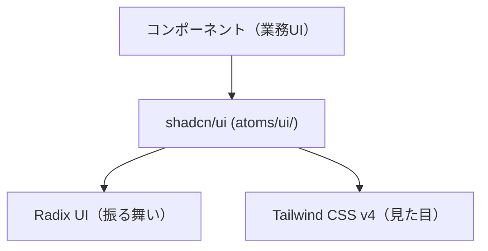

# UIライブラリ基盤設計

shadcn/ui と Radix UI を組み合わせたコンポーネントライブラリ基盤の I/F・配置・使用パターンを定義する。

| 関連文書 | 内容 |
|---|---|
| [UIビジュアル規約.md](UIビジュアル規約.md) | アプリ実装が守る Do/Don't |
| [デザインシステム基盤設計.md](デザインシステム基盤設計.md) | Tailwind CSS v4 のトークン基盤 |
| [adr/shadcn-copy-style.md](adr/shadcn-copy-style.md) | shadcn/ui コピーペースト方式採用判断 |

---

## 1. 3 ライブラリの連携構造



| ライブラリ | 担当 |
|---|---|
| shadcn/ui | コンポーネント実体（Button, Input, Dialog, Card 等）。リポジトリにコピーされたコードとして存在 |
| Radix UI | アクセシビリティ・フォーカス管理・キーボード操作。shadcn/ui が内部で利用 |
| Tailwind CSS v4 | スタイル適用。`@theme` トークン経由 |

> 採用方式の根拠は [ADR-2](adr/shadcn-copy-style.md)。

---

## 2. shadcn/ui コンポーネントの導入手順（基盤チーム実行）

### 2.1 初期化

プロジェクト初回のみ実行する。

```bash
# 初回のみ：shadcn/uiの初期化
npx shadcn@latest init
```

### 2.2 コンポーネント追加

```bash
# 単一コンポーネントの追加
npx shadcn@latest add button

# 複数コンポーネントの一括追加
npx shadcn@latest add button input card dialog
```

実行結果として `frontend/src/shared/components/atoms/ui/` 配下にコンポーネントファイルが生成される。

---

## 3. 配置とインポートパス

### 3.1 配置表

| ディレクトリ | 内容 |
|---|---|
| `frontend/src/shared/components/atoms/ui/` | shadcn/ui で導入したコンポーネント本体（コピー先） |
| `frontend/src/shared/components/atoms/` | shadcn/ui 以外の自社製 atom コンポーネント |
| `frontend/src/shared/components/molecules/` | 自社製 molecule コンポーネント（shadcn/ui の組合せ等） |

```
frontend/src/shared/components/atoms/
└── ui/
    ├── button.tsx        # shadcn/uiでインストール
    ├── input.tsx
    ├── card.tsx
    └── dialog.tsx
```

### 3.2 インポートパス（公開 I/F）

```ts
import { Button } from '@/shared/components/atoms/ui/button';
import { Input } from '@/shared/components/atoms/ui/input';
```

`@/shared/...` のパスエイリアスは `tsconfig.json` で定義済み（02章参照）。

---

## 4. 使用パターン

### 4.1 shadcn/ui 経由で利用（推奨）

```tsx
import { Button } from '@/shared/components/atoms/ui/button';
import { Input } from '@/shared/components/atoms/ui/input';

export default function LoginForm() {
  return (
    <form>
      <Input type="email" placeholder="メールアドレス" />
      <Input type="password" placeholder="パスワード" />
      <Button variant="default" size="lg">
        ログイン
      </Button>
    </form>
  );
}
```

### 4.2 Radix UI を直接利用するケース

shadcn/ui に存在しないプリミティブ（Context Menu, Hover Card 等）は `@radix-ui/react-*` を直接インストールして使用する。

```bash
npm install @radix-ui/react-context-menu
```

```tsx
import * as ContextMenu from '@radix-ui/react-context-menu';

export default function FileContextMenu() {
  return (
    <ContextMenu.Root>
      <ContextMenu.Trigger className="block p-4 border rounded">
        右クリックしてメニューを表示
      </ContextMenu.Trigger>
      <ContextMenu.Portal>
        <ContextMenu.Content className="bg-white border rounded shadow-lg p-1">
          <ContextMenu.Item className="px-2 py-1 hover:bg-gray-100 rounded">
            開く
          </ContextMenu.Item>
        </ContextMenu.Content>
      </ContextMenu.Portal>
    </ContextMenu.Root>
  );
}
```

スタイリングは Tailwind CSS で行う（[デザインシステム基盤設計.md](デザインシステム基盤設計.md) 参照）。

---

## 5. カスタマイズ方針（コピーペースト方式の運用）

shadcn/ui のコンポーネントはリポジトリ内のコードであるため、直接編集してカスタマイズする。

### 5.1 variant の追加例

```tsx
// frontend/src/shared/components/atoms/ui/button.tsx
const buttonVariants = cva(
  "inline-flex items-center justify-center rounded-md text-sm font-medium",
  {
    variants: {
      variant: {
        default: "bg-primary text-white hover:opacity-80",
        outline: "border border-input bg-background hover:bg-accent",
        // カスタムvariantを追加
        danger: "bg-danger text-white hover:opacity-80",
      },
    },
  }
);
```

### 5.2 shadcn/ui 側更新の取り込み運用

| タイミング | 担当 | 操作 |
|---|---|---|
| 新規コンポーネント追加 | 基盤チーム | `npx shadcn@latest add {component}` |
| 既存コンポーネントの上流バグ修正取り込み | 基盤チーム | shadcn/ui CLI で再取得し差分確認 → 適用判断 |
| アプリ固有の variant 追加 | アプリチーム | コピー済みファイルを直接編集 |

> 根拠: [ADR-2](adr/shadcn-copy-style.md)

---

## 6. アプリ実装者向け 4 ステップフロー

shadcn/ui + Radix UI + Tailwind CSS v4 を組み合わせて UI を構築する標準フロー。

| ステップ | 操作 | 担当 | 参照 |
|---|---|---|---|
| ① インストール | `npx shadcn@latest add {component}` で `atoms/ui/` 配下に生成 | 基盤チーム | §2.2 |
| ② 必要に応じてカスタマイズ | `atoms/ui/{name}.tsx` を直接編集（variant 追加・スタイル変更） | アプリチーム | §5 |
| ③ コンポーネントを使用 | `import { Button } from '@/shared/components/atoms/ui/button'` で呼び出し | アプリチーム | §4.1 |
| ④ アクセシビリティ自動担保 | Radix UI が ARIA 属性・フォーカス管理・キーボード操作を提供。実装者は意識不要 | （自動） | §7 |

---

## 7. アクセシビリティの自動担保

Radix UI が以下を自動的に提供する。アプリ実装者は意識せずスタイリングに集中できる。

| 機能 | 提供元 |
|---|---|
| ARIA 属性 | Radix UI |
| キーボード操作（Tab, Esc, 矢印キー等） | Radix UI |
| フォーカストラップ（Modal/Dialog 内） | Radix UI |
| スクリーンリーダー読み上げ最適化 | Radix UI |
