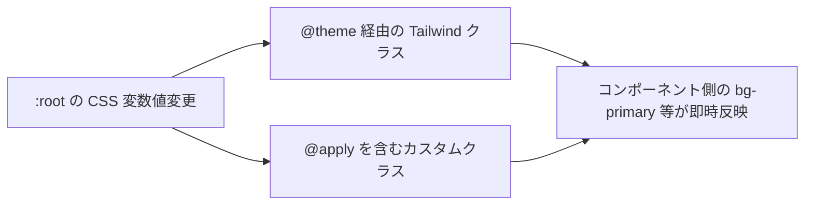

# デザインシステム基盤設計

Tailwind CSS v4 を中心としたデザイントークン管理基盤の I/F・配置・使用方法を定義する。

| 関連文書 | 内容 |
|---|---|
| [UIビジュアル規約.md](UIビジュアル規約.md) | アプリ実装が守る Do/Don't・命名規則 |
| [UIライブラリ基盤設計.md](UIライブラリ基盤設計.md) | shadcn/ui・Radix UI とのスタイル連携 |
| [adr/tailwind-v4.md](adr/tailwind-v4.md) | Tailwind v4 採用判断 |

---

## 1. UIレイヤアーキテクチャ

本システムの UI は「何を表示するか（業務）」と「どう表示するか（デザイン・振る舞い）」を分離した4層構造とする。本章は Molecules / Atoms 以下の層（★）を対象とする。

```
┌──────────────────────────────────────────────────────┐
│  Pages（業務UI）                                      │
│  画面単位の構成。カルテ画面、患者一覧画面など         │
└──────────────────────────────────────────────────────┘
                          ↓ 組み立てる
┌──────────────────────────────────────────────────────┐
│  Organisms（業務コンポーネント）                       │
│  業務ロジックを含む UI のまとまり                       │
└──────────────────────────────────────────────────────┘
                          ↓ 組み立てる
┌──────────────────────────────────────────────────────┐
│ ★ Molecules / Atoms（デザインコンポーネント）          │
│  業務ロジックを持たない共通部品。shadcn/ui ベース      │
└──────────────────────────────────────────────────────┘
                          ↓ 振る舞いを提供
┌──────────────────────────────────────────────────────┐
│ ★ Radix UI                                           │
│  アクセシビリティ・フォーカス管理・キーボード操作      │
└──────────────────────────────────────────────────────┘
                          ↓ 見た目を適用
┌──────────────────────────────────────────────────────┐
│ ★ Tailwind CSS v4                                    │
│  ユーティリティクラス・@theme トークン                 │
└──────────────────────────────────────────────────────┘
```

| レイヤ | 採用技術 |
|---|---|
| Pages / Organisms | React, Next.js |
| Molecules / Atoms | shadcn/ui |
| 振る舞い | Radix UI |
| スタイル | Tailwind CSS v4 |

---

## 2. デザインシステムの実体ファイル（公開 I/F）

アプリ実装者が直接参照・利用するファイル。

### 2.1 配置表

| ファイル | 配置 | 役割 | 公開対象 |
|---|---|---|---|
| `globals.css` | `frontend/src/app/` | `@theme` トークン定義・CSS 変数定義・カスタムクラス | ✅ アプリが直接 import（`layout.tsx` で1回のみ） |
| `postcss.config.js` | `frontend/` | `@tailwindcss/postcss` プラグイン設定 | ❌ ビルド時設定のみ。アプリ側からは触らない |

### 2.2 globals.css の構造

`globals.css` は以下の4ブロック構造で記述する。

```css
/* 1. Tailwind CSSの読み込み */
@import "tailwindcss";

/* 2. テーマ変数の定義（Tailwindのトークンとして登録） */
@theme {
  --color-primary: var(--primary-color);
  --color-secondary: var(--secondary-color);
  --color-danger: var(--danger-color);
  --color-success: var(--success-color);
}

/* 3. 実際の値の定義（一元管理） */
:root {
  --primary-color: #0066cc;
  --secondary-color: #6b7280;
  --danger-color: #dc2626;
  --success-color: #16a34a;
}

/* 4. カスタムクラスの定義 */
.karte-button {
  @apply bg-primary text-white px-4 py-2 rounded transition-opacity hover:opacity-80;
}
```

| ブロック | 役割 |
|---|---|
| ①`@import "tailwindcss"` | Tailwind CSS v4 のランタイムを読み込む |
| ②`@theme` | Tailwind ユーティリティクラス（`bg-primary` 等）として参照可能なトークンを宣言 |
| ③`:root` | CSS 変数の実値を一元定義。テーマ差し替え時はここのみ変更 |
| ④カスタムクラス | `@apply` を用いた再利用可能クラス（`karte-*`、`patient-*` 等） |

> 根拠: [ADR-1](adr/tailwind-v4.md)

### 2.3 アプリが利用できるデザイントークン

`@theme` で宣言された変数は Tailwind のユーティリティクラスとして自動展開される。

| トークン種別 | CSS 変数 | Tailwind クラス例 |
|---|---|---|
| 色 | `--color-primary` 等 | `bg-primary`, `text-primary`, `border-primary` |
| 余白 | `--spacing-{size}` | `p-{size}`, `m-{size}` |
| フォントサイズ | `--font-size-{size}` | `text-{size}` |
| 角丸 | `--radius-{size}` | `rounded-{size}` |
| 影 | `--shadow-{size}` | `shadow-{size}` |

> 命名規則の詳細は [UIビジュアル規約.md](UIビジュアル規約.md) §4 を参照。

---

## 3. カスタムクラス定義の I/F

### 3.1 カスタムクラスを定義する条件

以下のいずれかを満たす場合、`globals.css` 内で `@apply` によるカスタムクラスを定義してよい。

| 条件 | 内容 |
|---|---|
| 複雑なスタイル | 10個以上のユーティリティクラスを連結する場合 |
| 繰り返し利用 | 同じスタイル組合せが3箇所以上で出現する場合 |
| 状態管理 | `hover` / `focus` / `active` / `disabled` 等の複数状態を持つ場合 |

### 3.2 定義例

```css
.karte-button {
  @apply bg-primary text-white px-4 py-2 rounded transition-opacity;
}

.karte-button:hover {
  @apply opacity-80;
}

.karte-button:disabled {
  @apply opacity-50 cursor-not-allowed;
}
```

### 3.3 カスタムクラスの命名

| 対象 | 命名 | 例 |
|---|---|---|
| 機能固有クラス | `{機能名}-{要素名}` | `karte-button`, `patient-card` |
| 状態クラス | `is-{状態}` | `is-active`, `is-loading` |

詳細は [UIビジュアル規約.md](UIビジュアル規約.md) §4 を参照。

---

## 4. テーマ差し替え時の影響範囲

`:root` のトークン値を変更すれば、`@theme` 経由の Tailwind ユーティリティクラスとカスタムクラスの両方が一斉に更新される。



将来のダーク／ハイコントラスト対応では、`:root` の上書き（`[data-theme="dark"]` 等）を追加する形で対応する。

---

## 5. PostCSS ビルド設定（基盤側のみ）

`postcss.config.js` は基盤チームが管理する。アプリ実装者はこのファイルを編集しない。

```js
// frontend/postcss.config.js
module.exports = {
  plugins: {
    '@tailwindcss/postcss': {},
  },
};
```

役割:
- `@tailwindcss/postcss` プラグインを通じて `globals.css` の `@theme` をビルド時にトークン展開する
- Next.js の Turbopack ビルドパイプラインに組み込まれる
