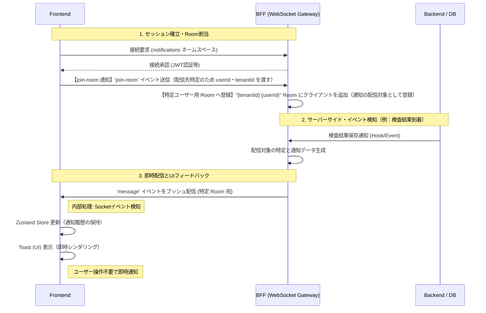

# 08. リアルタイム通信

## 本章の範囲

本章では、電子カルテシステムにおいて緊急性の高い情報を遅延なく伝えるための、WebSocket（WSS）を用いたリアルタイム通知基盤について定義する。

**対象とする通信パターン**：
- サーバー主導のプッシュ通知（医師からの指示、アラート、検査結果到着など）
- マルチテナント環境での安全な通知配信

**通知の配信単位**：

本設計では、通知の配信単位を以下の2種類に限定する。

| 配信単位 | Room名 | 用途例 |
| --- | --- | --- |
| **ユーザー単位** | `{tenantId}:{userId}` | 特定ユーザーへの通知（検査結果到着、担当患者のアラートなど） |
| **テナント単位** | `{tenantId}` | テナント全スタッフへの通知（システムメンテナンス、緊急一斉通知など） |

> **将来の検討事項**：役職・組織などのグループ単位での配信は現時点では対象外とし、将来的に要件が明確になった段階で検討する。

**対象外**：
- チャット機能などの双方向リアルタイム通信（将来的に検討）
- REST APIによる通常のデータ取得・更新
- グループ（役職・組織）単位での配信（将来的に検討）

**関連章との連携**：
- **状態管理設計**（[04.状態管理設計](./04.状態管理設計.md)）：WebSocketで受信した通知データを、UI表示用にZustandストアで**一時的に保持（キャッシュ）**
- **監視・エラーハンドリング**（[09.監視・エラーハンドリング](./09.監視・エラーハンドリング.md)）：接続エラー時のエラーハンドリング

**データ管理の役割分担**：

| レイヤー | 役割 | データの性質 | 記載箇所 |
| --- | --- | --- | --- |
| **DB** | 通知データの永続保存 | 永続データ | 未決 |
| **BFF / API** | 通知の生成・配信制御 | 通過データ | 本章 |
| **Zustand** | 受信通知のクライアント側一時キャッシュ | 一時データ | 本章・[04.状態管理設計](./04.状態管理設計.md) |
| **UI** | 通知の即時フィードバック | 通知の可視化 | 本章 |

> **【実装コードの管理方針】**  
> 本章で定義する各種実装コード（`NotificationGateway`, `useNotification`, `notification.store.ts`等）は、別途基盤側でファイルとして作成・管理する。  
> 本設計書では、実装の概要・設計上の重要点・ガイドラインのみを記載する。

---

## アーキテクチャ概要

### 技術選定と理由

本システムでは、リアルタイム通知基盤として **Socket.io** を採用する。

**採用理由**：
- **自動再接続**: ネットワーク切断時の自動再接続機能を標準搭載
- **Room機能**: マルチテナント環境での特定ユーザー・テナント宛配信を容易に実現
  > 参考：socket.inのRoom機能について  
  > [Socket.IO Rooms](https://socket.io/docs/v4/rooms/)

- **後方互換性**: WebSocketが利用できない環境でもHTTPロングポーリングに自動フォールバック
- **NestJS統合**: BFF（NestJS）との統合が標準サポート（`@nestjs/platform-socket.io`）
- **TypeScript親和性**: 型安全な通信を実現

**通信プロトコル**：
- **WSS (WebSocket Secure)**: 暗号化された全通信を適用（医療情報の機密性保証）
- TLS 1.2以上を使用（フロントエンド方式設計書 3.5 記載）

**既存通信基盤との関係**：
- 既存のREST API通信（React Query）を阻害しない非破壊的なアドオン設計
- REST APIは要求応答モデル、WebSocketはサーバープッシュモデルとして役割を分離

### 通信シーケンス

サーバーイベントの発生からフロントエンドでの通知表示までのライフサイクルを以下に定義する。
※以下は例として検査結果到着の通知の場合とする。



### レイヤー別役割定義

| 物理レイヤー | 役割・内部コンポーネント | 技術スタック |
| :--- | :--- | :--- |
| **BFF** | **WebSocket Gateway**: WebSocketゲートウェイとして実装。Room機能を活用し、マルチテナント環境における特定ユーザーへの限定配信を制御 | NestJS + `@nestjs/platform-socket.io` |
| **Frontend** | **Client Hook**: カスタムフック（`useNotification`）でSocket接続を管理。マウント時に接続、アンマウント時に切断 | `socket.io-client` |
| **Frontend** | **State (Store)**: 受信した通知データをZustandストアで管理。通知履歴の参照・既読管理を実現 | Zustand |
| **Frontend** | **Presentation (UI)**: 受信イベントをトリガーに、共通基盤のUIコンポーネント（Toast）を即座にレンダリング | `react-hot-toast` |
| **Backend** | **Event Provider**: データ更新等のイベントを検知し、BFFへ通知をトリガーする | (システム構成に準ずる) |

---

## Payload型定義

### 共有型スキーマの配置

リアルタイム通知のPayload型は、フロントエンド・BFF間の共有フォルダ **`front_bff_shared`** に配置する。

**配置先**：
```
front_bff_shared/
└── features/
    └── notification/
        └── realtime/
            ├── types/
            │   ├── requests/
            │   │   └── join-room.request.ts
            │   └── responses/
            │       └── notification-message.response.ts
            └── schemas/
                ├── join-room.schema.ts
                └── notification-message.schema.ts
```

### 通知イベント型の定義

> **実装コードは別途基盤側で管理**（本設計書では概要のみ記載）

**通知メッセージ型（`NotificationMessageResponse`）の要件**：

| フィールド | 型 | 説明 |
| --- | --- | --- |
| `title` | `string` | 通知タイトル |
| `message` | `string` | 通知メッセージ本文 |
| `type` | `'success' \| 'error' \| 'info' \| 'warning'` | 通知種別（トーストのステータス表現に使用） |
| `notificationId` | `string` (UUID) | 通知ID（重複防止・既読管理用） |
| `timestamp` | `string` (ISO 8601) | 送信日時 |
| `link?` | `{ url: string; label: string }` | オプション: 関連リソースへのリンク |

**バリデーション**：
- Zodスキーマ（`notificationMessageSchema`）で型安全性を担保
- フロントエンド受信時にバリデーション実施

### Room参加リクエスト型

#### Roomの概要

Socket.ioのRoom機能は、接続中のクライアントを名前付きグループに分類する仕組みである。BFFはRoomを単位として通知を配信するため、フロントエンドは接続後に必ずRoom参加リクエストを送信する必要がある。

**Room名の命名規則**：

| パターン | Room名 | 用途 |
| --- | --- | --- |
| **ユーザー単位** | `{tenantId}:{userId}` | 特定ユーザーへの通知（検査結果到着など） |
| **テナント単位** | `{tenantId}` | テナント全スタッフへの通知（緊急一斉通知など） |

テナントIDをRoom名に含めることで、マルチテナント環境における他テナントへのデータ流出を防止する。

> **実装コードは別途基盤側で管理**（本設計書では概要のみ記載）  
※参考：[NestJS公式ドキュメント - Gateways](https://docs.nestjs.com/websockets/gateways)  

**Room参加リクエスト型（`JoinRoomRequest`）の要件**：

| フィールド | 型 | 説明 |
| --- | --- | --- |
| `userId` | `string` (UUID) | ユーザーID（Room名として使用） |
| `tenantId` | `string` (UUID) | テナントID（マルチテナント安全性担保） |

**バリデーション**：
- Zodスキーマ（`joinRoomRequestSchema`）で型安全性を担保

---

## BFF実装詳細

### NotificationGateway の実装パターン

**ファイル配置**：
```
bff/src/
└── features/
    └── notification/
        └── notification.gateway.ts
```

> **実装コードは別途基盤側で管理**（本設計書では概要のみ記載）

**実装の概要**：
- NestJSの`@WebSocketGateway`デコレーターでWebSocketゲートウェイを定義
- Socket.ioの`Server`インスタンスを`@WebSocketServer()`で取得
- ライフサイクルフック（`OnGatewayInit`, `OnGatewayConnection`, `OnGatewayDisconnect`）を実装
- `@SubscribeMessage('join-room')`で Room参加イベントをハンドリング

**設計上の重要点**：
- **namespace**: `notifications`を指定（他のWebSocket通信と名前空間を分離）
- **CORS設定**: フロントエンドのURLを`origin`に指定（本番環境では環境変数で管理）
- **Room名の命名規則**: `${tenantId}:${userId}` でテナント+ユーザーを一意に識別
- **配信メソッド**: 
  - `sendNotificationToUser()`: 特定ユーザー宛（`this.server.to(roomName).emit('message', ...)`）
  - `sendNotificationToTenant()`: テナント全体宛（`this.server.to(tenantId).emit('message', ...)`）

### 接続ライフサイクル

**各ライフサイクルフックの役割**：

| フック | タイミング | 役割 |
| --- | --- | --- |
| `afterInit()` | Gateway初期化時（サーバー起動時） | サーバー初期化ログ出力 |
| `handleConnection()` | クライアント接続時 | 接続ログ出力、JWT認証検証（今後実装） |
| `handleDisconnect()` | クライアント切断時 | 切断ログ出力、Roomからの自動退出（Socket.io自動処理） |

**JWT認証統合**（今後の実装）：
- `handleConnection()` 内でJWTトークンを検証
- 認証失敗時は接続を拒否（`client.disconnect()`）
- 現在はPOC段階のため認証なし（本番実装時に追加）

### Room管理とターゲット配信

**Room名の命名規則**：

| パターン | Room名 | 用途 |
| --- | --- | --- |
| **個別ユーザー宛** | `{tenantId}:{userId}` | 特定ユーザーのみに配信（例: 検査結果通知） |
| **テナント全体宛** | `{tenantId}` | テナント全スタッフに配信（例: システムメンテナンス通知） |

**配信方法**：

```typescript
// 個別ユーザー宛
this.server.to(`${tenantId}:${userId}`).emit('message', notification);

// テナント全体宛
this.server.to(tenantId).emit('message', notification);
```

**複数タブ同時接続の扱い**：
- 同一ユーザーが複数タブで接続している場合、すべてのタブに同時配信される
- Socket.ioのRoom機能により、同一Room名に複数接続が自動的にグループ化される
- 各タブが独立したSocket接続を持つため、トースト通知も各タブで個別に表示される

### マルチテナント安全性の担保

**安全性確保の仕組み**：

1. **Room単位での通信経路分離**：
   - テナントIDをRoom名に含めることで、他テナントへのデータ流出を物理的に防止

2. **JWT認証による接続時検証**（今後実装）：
   - JWTから取得した`tenantId`と`userId`のみでRoom参加を許可
   - 不正なRoom参加要求を拒否

3. **BFF層での配信対象検証**：
   - 通知送信時にテナントID・ユーザーIDを検証
   - データベース更新イベント発生時、配信対象を厳密に特定

---

## フロントエンド実装詳細

**ファイル配置**：
```
frontend/src/
├── app/
│   └── layout.tsx                  # ② トースト（<Toaster />配置）
│
├── shared/
│  ├── hooks/
│  └── use-notification.ts          # ① カスタムフック
│  └── stores/
│      └── notification.store.ts    # ③ 通知履歴Store

```

### ① カスタムフック（useNotification）の実装

POC検証では`page.tsx`に直接実装していたが、実装レベルでは再利用可能なカスタムフックとして分離する。

> **実装コードは別途基盤側で管理**（本設計書では概要のみ記載）

**実装の概要**：
- `useEffect`内でSocket.io接続を管理
- 認証ストア（Zustand）から`userId`と`tenantId`を取得
- 接続成功時に`join-room`イベントを自動送信
- `message`イベント受信時にトースト表示＋通知履歴ストアに保存
- クリーンアップ関数でイベントリスナー削除＋接続クローズ

**使用箇所**：
- ルートレイアウト（`frontend/src/app/layout.tsx`）で1回のみ呼び出し
- アプリ全体で1つのSocket接続を共有

**設計上の重要点**：
- **接続オプション(Socket.io Client options)**: 
  - `transports` はデフォルト（`['polling', 'websocket']`）を使用。まずHTTPロングポーリングで接続し、WebSocketへ自動アップグレード。WebSocketが利用できない環境ではHTTPロングポーリングにフォールバック
  - `reconnection: true` で自動再接続を有効化
  - `reconnectionAttempts: 10` で再接続試行回数を10回に制限
  - `reconnectionDelay: 1000` で初回再接続までの待機時間を1秒に設定
  - `reconnectionDelayMax: 5000` で最大再接続待機時間を5秒に設定（Exponential Backoff）
  - `timeout: 20000` で接続タイムアウトを20秒に設定
  > ※参考：[Socket.io公式ドキュメント](https://socket.io/docs/v4/client-options/)  


- **イベントハンドラ**:
  - `connect`: Room参加リクエスト送信
  - `message`: トースト表示＋ストア保存
  - `connect_error`: コンソールログ出力（ユーザーには非表示）
  - `disconnect`: コンソールログ出力
- **クリーンアップ**: 必ず`socket.off()`でリスナー削除＋`socket.close()`で接続終了（メモリリーク防止）

#### 再接続戦略

**基本方針**：
- Socket.ioの自動再接続機能を使用
- 再接続試行回数は**10回**に制限（医療現場のネットワーク環境を考慮）
- Exponential Backoff方式で再接続間隔を徐々に延長（1秒→2秒→4秒→最大5秒）

**再接続時の動作**：
- Socket.ioは自動的に再接続を試行（Exponential Backoff）
- 再接続成功時、`connect`イベントが再度発火
- `useNotification`フック内で`join-room`イベントを再送信し、Roomに自動再参加

**今後の検討事項**：
- 10回の再接続失敗後の対応（ユーザーへの通知、手動再接続ボタンの表示など）
- 長時間切断後の未配信通知の取得方法（REST API経由での差分取得など）

#### エラーハンドリングパターン

**接続エラー（`connect_error`イベント）**：
- コンソールログに記録（開発環境での検証用）
- 今後の実装: エラーストアへの記録（[09.監視・エラーハンドリング](./09.監視・エラーハンドリング.md)参照）
- ユーザーにはトースト表示しない（UX低下防止）

**通知受信エラー（不正なPayload）**：
- Zodスキーマで`NotificationMessageResponse`型をバリデーション
- バリデーション失敗時はコンソールログ出力＋サイレントフェイル（無視）
- ユーザーには通知しない

### ② トースト通知の実装（react-hot-toast）

**ライブラリ**: `react-hot-toast`を採用

**設定箇所**: ルートレイアウト（`frontend/src/app/layout.tsx`）で`<Toaster />`コンポーネントを配置

**通知種別ごとの表示仕様**：

| 通知種別 | 表示メソッド | アイコン色 | 用途例 |
| --- | --- | --- | --- |
| `success` | `toast.success()` | 緑（#10b981） | 検査結果到着、処理完了 |
| `error` | `toast.error()` | 赤（#ef4444） | 緊急アラート、システムエラー |
| `info` | `toast()` | 青（デフォルト） | 一般的な通知 |
| `warning` | `toast()` | 黄（カスタム） | 注意喚起 |

**設計上の重要点**：
- **表示位置**: 画面右上（`position: "top-right"`）→ メイン操作エリアを妨げない
- **表示時間**: 4秒間（`duration: 4000`）→ 見落とし防止と邪魔にならないバランス
- **音声通知**: 今後の検討（緊急度の高い通知のみサウンド再生）

### ③ 通知履歴のStore管理（Zustand連携）

リアルタイム通知で受信したデータは、Zustandストアで管理する。これにより、通知履歴の参照・既読管理を実現する。

> **実装コードは別途基盤側で管理**（本設計書では概要のみ記載）

**Store定義の概要**：
- Zustandの`create()`でストアを作成
- `persist`ミドルウェアでLocalStorageに永続化
- 通知履歴（`notifications`）、未読数（`unreadCount`）を保持
- アクション: `addNotification`, `markAsRead`, `markAllAsRead`, `clearNotifications`

**設計上の重要点**：
- **状態分類**: クライアント状態（UI State）に分類（[04.状態管理設計](./04.状態管理設計.md) 参照）
- **永続化**: LocalStorageに保存（キー名: `notification-storage`）
- **履歴上限**: 最新100件のみ保持（`notifications.slice(0, 100)`）
- **マルチテナント安全性**: ログアウト時に通知履歴をクリア（`resetAllStores()`に包含）
- **型安全性**: `front_bff_shared`の`NotificationMessageResponse`型を使用

**既読状態の同期**（複数タブ）：
- Zustand の `persist` ミドルウェアにより、LocalStorageで既読状態を共有
- ただし、タブ間のリアルタイム同期は標準では未対応
- 今後の実装: `BroadcastChannel API` を使用してタブ間の既読状態を同期

---

## 実装ガイドライン

### やっていいこと

- **接続はアプリ全体で1箇所のみ初期化**（ルートレイアウト）
- **Socket.ioのデフォルト再接続機能を信頼**（再接続試行回数は10回に制限）
- **不正なPayloadは無視**（バリデーション失敗時はサイレントフェイル）
- **通知履歴は最新100件のみ保持**（メモリ使用量の制限）
- **ログアウト時に通知履歴をクリア**（`resetAllStores()`に包含。マルチテナント安全性担保）
- **複数タブでの同時接続を許可**（医療現場で複数画面を使用するケースに対応）
- **開発環境ではコンソールログで接続状態を確認**

### やってはいけないこと

- **ブロードキャスト配信（`this.server.emit()`）の使用**（テナント分離が破綻）
- **クライアントから送信されたRoom名をそのまま信頼**（なりすまし防止）
- **接続エラーごとにユーザーにトースト表示**（UX低下）
- **手動での再接続試行**（Socket.ioの自動再接続と競合）
- **各ページコンポーネントで個別にSocket接続**（接続数の増加）
- **古いイベントリスナーの削除忘れ**（メモリリーク）
- **複数タブ接続を制限**（ユーザビリティ低下）

### パフォーマンス考慮事項

**メモリリーク対策**：
- イベントリスナーは必ず`useEffect`のクリーンアップ関数で削除（`socket.off()`）
- コンポーネントアンマウント時に`socket.close()`で接続を終了

**接続数の制限**：
- アプリ全体で1つのSocket接続を共有（ルートレイアウトで初期化）
- 各ページコンポーネントで個別に接続しない

**通知履歴の上限設定**：
- 最新100件のみ保持（`notifications.slice(0, 100)`）
- 古い通知は自動的に削除

---

## ディレクトリ配置とファイル構成

### front_bff_shared（型定義）

```
front_bff_shared/
└── features/
    └── notification/
        └── realtime/
            ├── types/
            │   ├── requests/
            │   │   └── join-room.request.ts
            │   └── responses/
            │       └── notification-message.response.ts
            └── schemas/
                ├── join-room.schema.ts
                └── notification-message.schema.ts
```

### BFF側の配置

```
bff/src/
├── features/
│   └── notification/
│       └── notification.gateway.ts
└── front_bff_shared/  # シンボリックリンク
```

### フロントエンド側の配置

```
frontend/src/
├── shared/
│   ├── hooks/
│   │   └── use-notification.ts
│   └── stores/
│       └── notification.store.ts
├── features/
│   └── notification/
│       └── components/
│           └── notification-panel.tsx
└── front_bff_shared/  # シンボリックリンク
```

詳細は[00.ディレクトリ構成](./00.ディレクトリ構成.md)を参照。

---

## 基盤側で作成する実装ファイル一覧

本設計書に基づき、以下の実装ファイルを基盤側で作成・管理する。

### front_bff_shared（型定義・スキーマ）

1. **`join-room.request.ts`** - Room参加リクエストの型定義
2. **`join-room.schema.ts`** - Room参加リクエストのZodスキーマ
3. **`notification-message.response.ts`** - 通知メッセージの型定義
4. **`notification-message.schema.ts`** - 通知メッセージのZodスキーマ

### BFF（NestJS）

5. **`notification.gateway.ts`** - WebSocketゲートウェイ実装（Room管理・配信制御）

### Frontend（Next.js + React）

6. **`use-notification.ts`** - リアルタイム通知接続を管理するカスタムフック
7. **`notification.store.ts`** - 通知履歴・既読状態を管理するZustandストア
8. **`notification-panel.tsx`** - 通知履歴を表示するUIコンポーネント
9. **`layout.tsx`** - ルートレイアウト（リアルタイム通知接続＋トースト設定の初期化）

**計9ファイル**（front_bff_shared: 4、BFF: 1、Frontend: 4）
