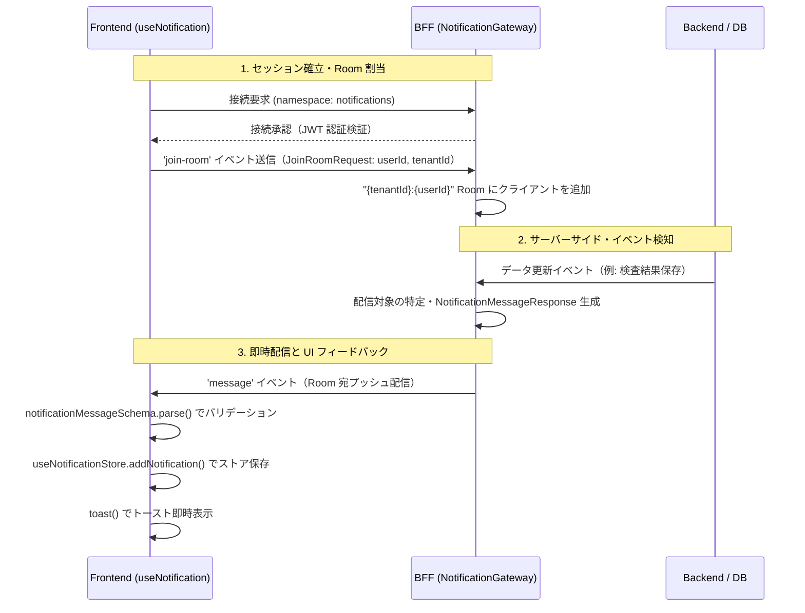

# Socket 接続基盤設計

> 規約: [リアルタイム通信規約.md](./リアルタイム通信規約.md) §2.1 の通り、Socket 接続は `useNotification` 経由とする。

## 1. ファイル配置

| ファイル | 配置パス | 役割 |
|---|---|---|
| `use-notification.ts` | `frontend/src/shared/hooks/` | Socket.io 接続管理・通知受信カスタムフック |
| `layout.tsx` | `frontend/src/app/` | フック呼び出し箇所（ルートレイアウト） |

---

## 2. 公開 I/F

### 2.1 `useNotification`

```typescript
import { useNotification } from '@/shared/hooks/use-notification';

/**
 * リアルタイム通知の Socket.io 接続を管理するカスタムフック。
 *
 * @remarks
 * - ルートレイアウト（`app/layout.tsx`）でアプリ全体を通じて1回のみ呼び出すこと。
 * - 認証ストア（`useAuthStore`）から `userId` / `tenantId` を取得し、
 *   接続成功時に自動で `join-room` イベントを送信する。
 * - コンポーネントアンマウント時に `socket.off()` でリスナーを削除し、
 *   `socket.close()` で接続を終了する（メモリリーク防止）。
 * - 戻り値なし。副作用（接続・通知受信・ストア更新）のみ担う。
 *
 * @throws 接続エラー（`connect_error`）はコンソールログのみ出力し、例外を投げない。
 *         Zod バリデーション失敗時もサイレントフェイル。
 */
function useNotification(): void
```

**呼び出し例**:

```tsx
// frontend/src/app/layout.tsx
import { useNotification } from '@/shared/hooks/use-notification';
import { Toaster } from 'react-hot-toast';

export default function RootLayout({ children }: { children: React.ReactNode }) {
  useNotification();
  return (
    <html>
      <body>
        {children}
        <Toaster position="top-right" toastOptions={{ duration: 4000 }} />
      </body>
    </html>
  );
}
```

---

## 3. 接続オプション

| オプション | 値 | 説明 |
|---|---|---|
| `transports` | デフォルト（`['polling', 'websocket']`） | HTTPロングポーリングで接続後、WebSocket へ自動アップグレード |
| `reconnection` | `true` | 自動再接続を有効化 |
| `reconnectionAttempts` | `10` | 再接続試行回数（医療現場のネットワーク環境を考慮） |
| `reconnectionDelay` | `1000` | 初回再接続待機時間（ms） |
| `reconnectionDelayMax` | `5000` | 最大再接続待機時間（ms）。Exponential Backoff で延長 |
| `timeout` | `20000` | 接続タイムアウト（ms） |

> 根拠: [ADR-1](adr/socket-io-adoption.md)

---

## 4. イベントハンドラ

| イベント | 処理内容 |
|---|---|
| `connect` | `join-room` イベントを自動送信（`JoinRoomRequest` 型で `userId` / `tenantId` を渡す） |
| `message` | `notificationMessageSchema` で Payload をバリデーション → トースト表示 + `addNotification()` でストア保存 |
| `connect_error` | コンソールログ出力のみ（ユーザーには非表示） |
| `disconnect` | コンソールログ出力のみ |

---

## 5. 通信シーケンス



---

## 6. 再接続戦略

- Socket.io の自動再接続機能を使用（Exponential Backoff: 1秒→2秒→4秒→最大5秒）
- 再接続成功時、`connect` イベントが再度発火し `join-room` を自動再送信して Room に再参加する
- 10回失敗後の対応は今後の実装事項（ユーザーへの通知・手動再接続ボタン等）

---

## 7. Toast 表示仕様

| 通知種別 | 表示メソッド | アイコン色 |
|---|---|---|
| `success` | `toast.success()` | 緑（#10b981） |
| `error` | `toast.error()` | 赤（#ef4444） |
| `info` | `toast()` | 青（デフォルト） |
| `warning` | `toast()` + カスタムスタイル | 黄 |

設定値: `position: "top-right"` / `duration: 4000ms`
