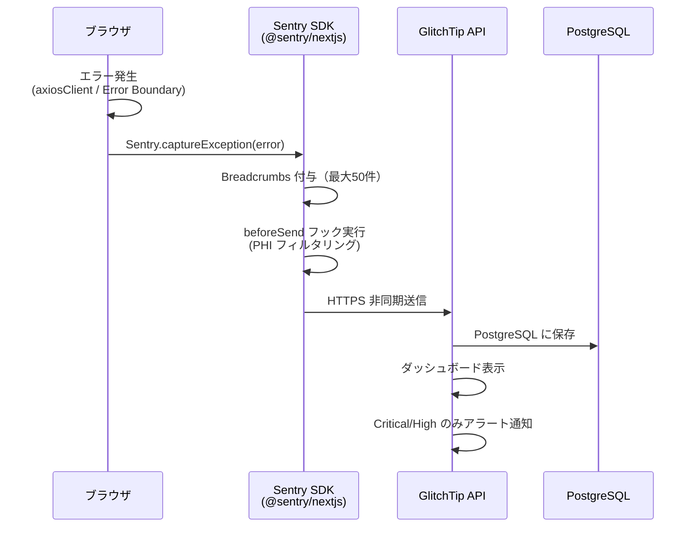
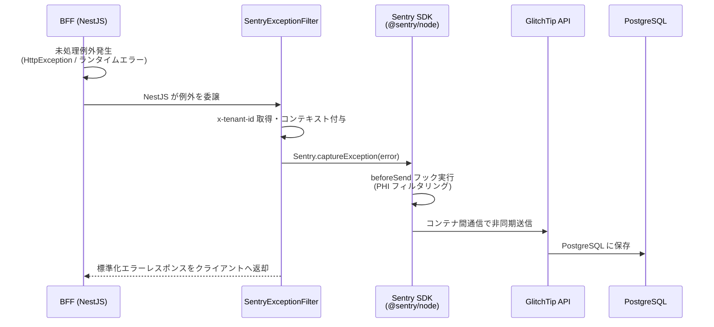

# GlitchTip 連携設計

GlitchTip（Sentry 互換 OSS）への接続・初期化・送信フィールド・PHI フィルタリングを定義する。

| 関連文書 | 内容 |
|---|---|
| [監視エラーハンドリング規約.md](監視エラーハンドリング規約.md) | アプリ実装が守る規約 |
| [エラー処理基盤設計.md](エラー処理基盤設計.md) | エラー処理フロー |
| [BFFエラーレスポンス設計.md](BFFエラーレスポンス設計.md) | BFF エラーレスポンス構造 |

> GlitchTip サーバーの構築・運用は [01_エラー監視ツール_GlitchTip設計.md](../../05_システム監視・通知サービス/02_詳細設計書/01_エラー監視ツール_GlitchTip設計.md) を参照。

---

## 1. 連携の概要

| 項目 | フロントエンド | BFF |
|---|---|---|
| 使用 SDK | `@sentry/nextjs` | `@sentry/node` |
| 初期化箇所 | `frontend/src/shared/plugins/SentryInitializer.tsx`（'use client' コンポーネント） | `product/bff/src/index.ts` |
| 送信タイミング | API エラー（axios Interceptor）、ランタイムエラー（Error Boundary） | 未処理例外（グローバル例外フィルター） |
| 送信先（開発） | `http://localhost:8080` | コンテナ間通信 `http://glitchtip:8000` |
| 送信先（本番） | TBD（[01_エラー監視ツール_GlitchTip設計.md](../../05_システム監視・通知サービス/02_詳細設計書/01_エラー監視ツール_GlitchTip設計.md) 確定待ち） | TBD |

> GlitchTip（Sentry 互換 OSS）採用の判断: [adr/glitchtip-adoption.md](adr/glitchtip-adoption.md) を参照。

---

## 2. フロントエンド初期化

### 2.1 配置と責務

**配置**: `frontend/src/shared/plugins/SentryInitializer.tsx`
**責務**:
1. `Sentry.init()` で GlitchTip 接続を初期化（DSN、environment、`tracesSampleRate`、`maxBreadcrumbs`、`beforeSend` フックを設定）
2. 認証後に `Sentry.setTag('tenant_id', ...)` と `Sentry.setUser({ id: ... })` でテナント情報を設定
3. `app/layout.tsx` に `<SentryInitializer />` コンポーネントとして組み込み、アプリ起動時に自動実行

### 2.2 送信フロー



---

## 3. フロントエンド送信フィールド

### 3.1 送信フィールド一覧

| # | フィールドパス | 型 | 説明 | 値の例 | 取得元 |
|---|---|---|---|---|---|
| **エラー詳細** | | | | | |
| 1 | `exception.values[].type` | string | エラーの型 | `"Error"`, `"TypeError"` | 自動収集 |
| 2 | `exception.values[].value` | string | エラーメッセージ | `"API Error: 404 Not Found"` | 自動収集 |
| 3 | `exception.values[].stacktrace.frames[]` | array | スタックトレース配列 | — | 自動収集 |
| 4 | `exception.values[].stacktrace.frames[].filename` | string | ファイル名 | `"app:///_next/static/chunks/app/page.js"` | 自動収集 |
| 5 | `exception.values[].stacktrace.frames[].function` | string | 関数名 | `"PatientInfoCard"` | 自動収集 |
| 6 | `exception.values[].stacktrace.frames[].lineno` | number | 行番号 | `42` | 自動収集 |
| 7 | `exception.values[].stacktrace.frames[].colno` | number | 列番号 | `15` | 自動収集 |
| 8 | `exception.values[].stacktrace.frames[].in_app` | boolean | アプリコードか否か | `true`, `false` | 自動収集 |
| **基本情報** | | | | | |
| 9 | `level` | string | エラーレベル | `"error"` | 自動収集 |
| 10 | `timestamp` | number | エラー発生日時（UNIX 時間） | `1779782345.444` | 自動収集 |
| 11 | `platform` | string | プラットフォーム | `"javascript"` | 自動収集 |
| 12 | `environment` | string | 実行環境名 | `"development"`, `"production"` | `Sentry.init()` |
| **SDK 情報** | | | | | |
| 13 | `sdk.name` | string | SDK 名 | `"sentry.javascript.nextjs"` | `beforeSend` で補完 |
| 14 | `sdk.version` | string | SDK バージョン | `"10.53.1"` | `beforeSend` で補完 |
| **コンテキスト** | | | | | |
| 15 | `contexts.browser.name` | string | ブラウザ名 | `"Chrome"` | `beforeSend`（`navigator.userAgent` 解析） |
| 16 | `contexts.browser.version` | string | ブラウザバージョン | `"148.0.0.0"` | `beforeSend`（`navigator.userAgent` 解析） |
| 17 | `contexts.os.name` | string | OS 名 | `"Windows"` | `beforeSend`（`navigator.platform` 解析） |
| 18 | `contexts.os.version` | string | OS バージョン | `"10.0"` | `beforeSend`（`navigator.userAgent` 解析） |
| **監査情報（タグ）** | | | | | |
| 19 | `tags.tenant_id` | string | テナント ID | `"tenant-hospital-a"` | フロー1: `x-tenant-id` ヘッダー／フロー2: `Sentry.setTag()` |
| 20 | `tags.trace_id` | string | リクエスト追跡 ID（API エラー時のみ） | `"550e8400-e29b-41d4-a716-446655440000"` | BFF エラーレスポンス `traceId` |
| 21 | `tags.patient_id` | string | 患者 ID（任意、カルテ操作時のみ） | `"550e8400-..."` | `setPatientContext()` 呼び出し後 |
| **ユーザー情報** | | | | | |
| 22 | `user.id` | string | ユーザー ID | `"USER_12345"` | `Sentry.setUser()`（ログイン時） |
| **操作履歴** | | | | | |
| 23 | `breadcrumbs[]` | array | 操作履歴配列（最大50件） | — | 自動収集 |
| 24 | `breadcrumbs[].timestamp` | number | 操作日時 | `1716295495.123` | 自動収集 |
| 25 | `breadcrumbs[].category` | string | 操作種別 | `"ui.click"`, `"navigation"`, `"console"`, `"xhr"` | 自動収集 |
| 26 | `breadcrumbs[].message` | string | 操作内容 | `"button.patient-info-btn"`, `"/patients/12345"` | 自動収集 |
| 27 | `breadcrumbs[].level` | string | ログレベル | `"info"`, `"warning"`, `"error"` | 自動収集 |
| 28 | `breadcrumbs[].data` | object | 追加データ（該当時のみ） | `{"status_code": 200, "method": "GET"}` | 自動収集 |
| **API エラー時の追加情報（フロー1のみ）** | | | | | |
| 29 | `extra.status` | number | HTTP ステータスコード | `404`, `500`, `409` | `error.response.status` |
| 30 | `extra.statusText` | string | HTTP ステータステキスト | `"Not Found"` | `error.response.statusText` |
| 31 | `extra.url` | string | リクエスト URL | `"/api/nonexistent-endpoint"` | `error.config.url` |
| 32 | `extra.method` | string | HTTP メソッド | `"POST"`, `"GET"` | `error.config.method` |
| 33 | `extra.errorResponse` | object | BFF エラーレスポンス全体 | `{"title": "不正なリクエストです。", ...}` | `error.response.data` |

**合計**: 33 フィールド（Breadcrumbs・API エラー追加情報を含む）

> Breadcrumbs と 14章操作ログを別経路にする判断: [adr/breadcrumbs-vs-audit-log.md](adr/breadcrumbs-vs-audit-log.md) を参照。

### 3.2 固定値・任意値・PHI 削除フィールド

**固定値**:

| フィールドパス | 設定値 | 備考 |
|---|---|---|
| `environment` | `"development"` / `"production"` | 環境変数 `NEXT_PUBLIC_SENTRY_ENVIRONMENT` |
| `platform` | `"javascript"` | Sentry SDK が自動設定 |
| `sdk.name` | `"sentry.javascript.nextjs"` | `beforeSend` で補完 |

**任意設定**:

| フィールドパス | 設定タイミング | 説明 |
|---|---|---|
| `tags.trace_id` | API エラー発生時（フロー1のみ） | BFF エラーレスポンス `traceId`。フロー2 では設定されない |
| `tags.patient_id` | 患者画面・カルテ操作時 | 操作対象患者 ID |
| `extra.*` | API エラー発生時（フロー1のみ） | HTTP ステータス・URL・メソッド・BFF エラーレスポンス |
| `breadcrumbs[].data` | ネットワークリクエスト等 | 該当する操作でのみ付与 |

**PHI 保護で削除**:

| フィールドパス | 削除理由 |
|---|---|
| `event.request.cookies` | セッション ID・認証トークン等の機密情報 |
| `event.request.headers` | Authorization・X-User-Name 等の PHI 含有可能性 |
| `event.user.email` | メールアドレスは PHI |

> PHI フィルタをホワイトリスト方式（cookies / headers / email / body）で行う判断: [adr/phi-filter-whitelist.md](adr/phi-filter-whitelist.md) を参照。

> `user.ip_address` は病院スタッフ端末情報として送信（個人情報非該当）。`sendDefaultPii: true` で有効化することで GlitchTip サーバー側が HTTP リクエストヘッダーから自動収集する。クライアント側（JavaScript）では取得できないため `beforeSend` フックでは未設定と表示されるが、GlitchTip 管理画面では正しく表示される。

### 3.3 送信実装コード（フロー1: API エラー）

```typescript
// frontend/src/shared/plugins/axiosClient.ts（抜粋）
axiosClient.interceptors.response.use(
  (response) => response,
  (error) => {
    const status = error.response?.status;
    const traceId = error.response?.data?.traceId;
    const errorCode = error.response?.data?.errors?.[0]?.code;

    // リクエストヘッダーから実際に送信したテナントIDを取得
    const tenantId = error.config?.headers?.['x-tenant-id'] as string | undefined;

    // 業務エラー判定
    const isBusinessError =
      status === 400 &&
      ['REQUIRED', 'INVALID_FORMAT', 'INVALID_TYPE'].includes(errorCode);

    if (!isBusinessError) {
      Sentry.captureException(error, {
        tags: {
          tenant_id: tenantId,
          trace_id: traceId,
        },
        extra: {
          status,
          statusText: error.response?.statusText,
          url: error.config?.url,
          method: error.config?.method?.toUpperCase(),
          errorResponse: error.response?.data,
        },
      });
    }

    return Promise.reject(error);
  }
);
```

### 3.4 送信実装コード（フロー2: ランタイムエラー）

```tsx
// frontend/src/app/error.tsx（抜粋）
'use client';
import * as Sentry from '@sentry/nextjs';
import { useEffect } from 'react';

export default function Error({ error, reset }: { error: Error & { digest?: string }; reset: () => void }) {
  useEffect(() => {
    Sentry.captureException(error);
  }, [error]);
  return <div>{/* エラー UI */}</div>;
}
```

---

## 4. BFF 送信フィールド

### 4.1 配置と責務

**初期化**: `product/bff/src/index.ts`
- `Sentry.init()` で GlitchTip 接続を初期化（DSN、environment、`tracesSampleRate`、`beforeSend` フック）
- グローバル例外フィルター（`SentryExceptionFilter`）を登録
- リクエストごとに `x-tenant-id` ヘッダーからテナント ID を取得し `Sentry.setTag()` で設定するミドルウェアを追加

**グローバル例外フィルター**: `product/bff/src/shared/filters/sentry-exception.filter.ts`
- NestJS の `@Catch()` デコレータで全ての未処理例外を自動捕捉
- リクエストヘッダーから `x-tenant-id` を取得
- `Sentry.captureException()` で GlitchTip にエラー送信（テナント ID・エンドポイント・HTTP メソッド・クエリパラメータ・リクエストボディを付与）
- クライアントには標準化されたエラーレスポンス（[BFFエラーレスポンス設計.md](BFFエラーレスポンス設計.md) §2 参照）を返却

### 4.2 送信フロー



### 4.3 送信フィールド一覧

| # | フィールドパス | 型 | 説明 | 値の例 | 取得元 |
|---|---|---|---|---|---|
| **エラー詳細** | | | | | |
| 1 | `exception.values[].type` | string | エラーの型 | `"HttpException"`, `"BadRequestException"` | 自動収集 |
| 2 | `exception.values[].value` | string | エラーメッセージ | `"Validation failed"` | 自動収集 |
| 3 | `exception.values[].stacktrace.frames[]` | array | スタックトレース配列 | — | 自動収集 |
| 4 | `exception.values[].stacktrace.frames[].filename` | string | ファイル名 | `"src/features/patients/patients.controller.ts"` | 自動収集 |
| 5 | `exception.values[].stacktrace.frames[].function` | string | 関数名 | `"createPatient"` | 自動収集 |
| 6 | `exception.values[].stacktrace.frames[].lineno` | number | 行番号 | `42` | 自動収集 |
| 7 | `exception.values[].stacktrace.frames[].colno` | number | 列番号 | `15` | 自動収集 |
| 8 | `exception.values[].stacktrace.frames[].in_app` | boolean | アプリコードか否か | `true`, `false` | 自動収集 |
| **基本情報** | | | | | |
| 9 | `level` | string | エラーレベル | `"error"` | 自動収集 |
| 10 | `timestamp` | string | エラー発生日時（ISO 8601） | `"2026-05-22T10:30:45.123Z"` | 自動収集 |
| 11 | `platform` | string | プラットフォーム | `"node"` | 自動収集 |
| 12 | `environment` | string | 実行環境名 | `"development"`, `"production"` | `Sentry.init()` |
| **SDK 情報** | | | | | |
| 13 | `sdk.name` | string | SDK 名 | `"@sentry/node"` | 自動収集 |
| 14 | `sdk.version` | string | SDK バージョン | `"8.x.x"` | 自動収集 |
| **コンテキスト** | | | | | |
| 15 | `contexts.runtime.name` | string | ランタイム名 | `"node"` | 自動収集 |
| 16 | `contexts.runtime.version` | string | Node.js バージョン | `"20.11.0"` | 自動収集 |
| **監査情報（タグ）** | | | | | |
| 17 | `tags.tenant_id` | string | テナント ID | `"tenant-hospital-a"` | リクエストヘッダー（`x-tenant-id`） |
| 18 | `tags.trace_id` | string | リクエスト追跡 ID（UUID） | `"2ab1312c-aec2-4de8-a9d0-6841715ffe80"` | 自動生成（UUID v4） |
| **ユーザー情報** | | | | | |
| 19 | `user.id` | string | ユーザー ID | `"USER_12345"` | `x-user-id` ヘッダーまたは JWT ペイロード |
| **リクエスト情報** | | | | | |
| 20 | `extra.endpoint` | string | リクエストパス | `"/clinical/entry/vital-info"` | `request.url` |
| 21 | `extra.method` | string | HTTP メソッド | `"GET"`, `"POST"` | `request.method` |
| 22 | `extra.query` | object | クエリパラメータ | `{"page": "1", "limit": "10"}` | `request.query` |
| 23 | `extra.body` | object | リクエストボディ（PHI 削除後） | `{"bloodPressure": "120/80"}` | `request.body`（`beforeSend` フィルタ） |
| 24 | `extra.statusCode` | number | HTTP ステータスコード | `500`, `404`, `409` | `exception.getStatus()` |

**合計**: 24 フィールド

### 4.4 BFF 固定値・任意値・PHI 削除フィールド

**固定値**:

| フィールドパス | 設定値 | 備考 |
|---|---|---|
| `environment` | `"development"` / `"production"` | 環境変数 `SENTRY_ENVIRONMENT` |
| `platform` | `"node"` | Sentry SDK が自動設定 |
| `sdk.name` | `"@sentry/node"` | Sentry SDK が自動設定 |

**任意設定**:

| フィールドパス | 設定タイミング | 説明 |
|---|---|---|
| `extra.query` | クエリパラメータが存在する場合のみ | リクエスト URL のクエリパラメータ |
| `extra.body` | POST リクエスト等でボディが存在する場合のみ | リクエストボディ（PHI フィルタ後） |

**PHI 保護で削除**:

| フィールドパス | 削除理由 |
|---|---|
| `event.request.cookies` | セッション ID・認証トークン等の機密情報 |
| `event.request.headers` | Authorization・X-User-Name 等の PHI 含有可能性 |
| `extra.body` 内の PHI 項目 | 患者名・生年月日・診断情報等の PHI 含有可能性（ホワイトリスト方式でフィルタリング） |

PHI マスク用正規表現パターンは `front_bff_shared/utils/phiPatterns.ts` で一元管理する。

---

## 5. 残件

- 本番環境の GlitchTip 送信先 URL（[01_エラー監視ツール_GlitchTip設計.md](../../05_システム監視・通知サービス/02_詳細設計書/01_エラー監視ツール_GlitchTip設計.md) 確定待ち）
- 端末 IP アドレス（`user.ip_address`）取得未対応。`sendDefaultPii: true` 検証待ち
