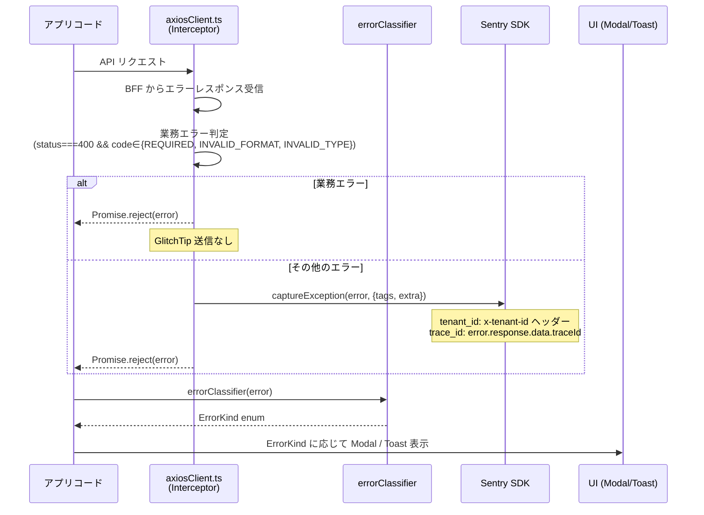
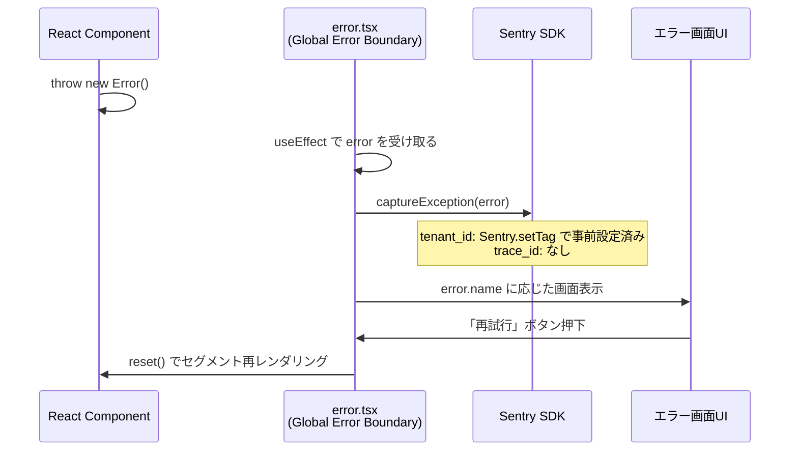
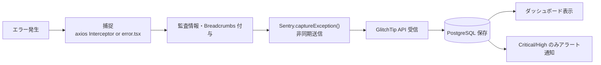

# エラー処理基盤設計

フロントエンド基盤が提供するエラー処理基盤（Error Boundary / ErrorGuard / ErrorModal / errorClassifier）の I/F 契約・処理フロー・データ構造を定義する。

| 関連文書 | 内容 |
|---|---|
| [監視エラーハンドリング規約.md](監視エラーハンドリング規約.md) | アプリ実装が守る規約 |
| [BFFエラーレスポンス設計.md](BFFエラーレスポンス設計.md) | RFC 9457 ベースのレスポンス構造 |
| [GlitchTip連携設計.md](GlitchTip連携設計.md) | Sentry SDK 初期化・送信フィールド |

---

## 1. エラー種別と対応方針

方式設計書 5.1 で定義されたエラー種別ごとに、フロントエンド実装における具体的な対応方針を示す。

| エラー種別 | 発生源 | 検知方法 | フロントエンドの対応 | GlitchTip 送信 |
|---|---|---|---|---|
| ネットワークエラー | 通信断・タイムアウト | `axiosClient` Interceptor | 通信環境確認トースト・再試行ボタン | する |
| API エラー | HTTP 4xx/5xx | `axiosClient` Interceptor | ステータスコード別モーダル／画面 | する |
| 業務エラー | バリデーション失敗・論理的データ不整合 | BFF レスポンスの `errors[].code` | フォーム該当フィールドにメッセージ表示 | しない |
| ランタイムエラー | フロント JS の予期しない例外 | Error Boundary | `error.tsx` 全画面表示 | する |
| 認可エラー | HTTP 401/403 | `axiosClient` ステータス判定 | 401: ログインへリダイレクト／403: 権限不足モーダル | する |

> 業務エラーを GlitchTip に送らない判断: [adr/exclude-business-errors.md](adr/exclude-business-errors.md) を参照。

---

## 2. ファイル配置

| ファイル | 配置場所 | 役割 |
|---|---|---|
| `error.tsx` | `frontend/src/app/` | グローバル Error Boundary（最終防波堤） |
| `ErrorGuard.tsx` | `frontend/src/shared/components/atoms/` | コンポーネント単位 Error Boundary |
| `ErrorModal.tsx` | `frontend/src/shared/components/molecules/` | 重度エラーモーダル |
| `errorClassifier.ts` | `frontend/src/shared/utils/` | エラー種別分類ユーティリティ |
| `axiosClient.ts` | `frontend/src/shared/plugins/` | API エラー Interceptor（[01章 共通基盤設計](../01_フロントエンド・BFF共通基盤設計/) 参照） |
| `SentryInitializer.tsx` | `frontend/src/shared/plugins/` | Sentry SDK 初期化（[GlitchTip連携設計.md](GlitchTip連携設計.md) §2 参照） |

---

## 3. エラー処理フロー

エラーは発生箇所によって 2 つの独立した経路に分かれる。

### 3.1 フロー1: API エラー（axios 経由）

BFF との通信中に発生したエラー（ネットワークエラー、HTTPエラー、業務エラー等）の処理フロー。



**特徴**:
- `error.tsx`（Error Boundary）は通らない
- GlitchTip 送信と呼び出し元への返却は並行処理（非同期送信）
- UI 表示は呼び出し元の責任

### 3.2 フロー2: ランタイムエラー（Error Boundary 経由）

React コンポーネント内で発生した JavaScript エラー（TypeError, ReferenceError 等）の処理フロー。



**特徴**:
- `axios` Interceptor は通らない
- 呼び出し元への返却なし（Error Boundary で処理完結）
- UI 表示は固定（`error.tsx` のデザイン）
- 画面全体がエラー UI に切り替わる

### 3.3 経路比較

| 項目 | フロー1: API エラー | フロー2: ランタイムエラー |
|---|---|---|
| 発生場所 | BFF 通信中 | コンポーネント内 |
| 捕捉箇所 | `axiosClient.ts` Interceptor | `error.tsx` |
| 業務エラー判定 | あり | なし |
| GlitchTip 送信 | 業務エラー以外 | 全て送信 |
| `tenant_id` 取得 | リクエストヘッダー（`x-tenant-id`）から動的取得 | `Sentry.setTag` で事前設定 |
| `trace_id` | BFF レスポンスから取得 | なし |
| 呼び出し元への返却 | あり（`Promise.reject`） | なし |
| 画面影響 | 部分的（Modal） | 全画面 |

> `tenant_id` 取得方式の差異理由: [adr/tenant-id-acquisition.md](adr/tenant-id-acquisition.md) を参照。

---

## 4. グローバル Error Boundary（`app/error.tsx`）

### 4.1 責務

Next.js App Router の `error.tsx` を使用し、フロントエンド内で発生するランタイムエラーを捕捉する **最終防波堤**。

> 階層的 Error Boundary を採用しない判断: [adr/global-error-boundary-only.md](adr/global-error-boundary-only.md) を参照。

**キャッチ対象**:
- React コンポーネントのレンダリング中に発生した例外
- `useEffect` 内での未捕捉例外

**キャッチ対象外**:
- BFF / BE 側で発生したエラー（各サーバーで処理）
- `axiosClient` が捕捉した API エラー（Interceptor で先行処理）
- イベントハンドラ内の例外（`onClick` 等。`try-catch` で個別処理が必要）

### 4.2 I/F 仕様

**インポートパス**: 自動配置（Next.js App Router 規約）。アプリチームは `app/(group)/error.tsx` を必要に応じて追加実装する。

**Props 型**（Next.js が自動で渡す）:

```typescript
type ErrorProps = {
  /**
   * 発生したエラーオブジェクト。`error.name` と `error.message` で表示メッセージを組み立てる。
   * `digest` は本番ビルドで Next.js が自動付与するエラー識別子（GlitchTip との突合用）。
   */
  error: Error & { digest?: string };
  /**
   * 該当ルートセグメントを再レンダリングする関数。
   * 「再試行」ボタンの onClick で呼ぶ。
   */
  reset: () => void;
};
```

### 4.3 実装パターン

```tsx
'use client';

import * as Sentry from '@sentry/nextjs';
import { useEffect } from 'react';

export default function Error({ error, reset }: ErrorProps) {
  useEffect(() => {
    Sentry.captureException(error);
  }, [error]);

  const errorMessages: Record<string, { title: string; description: string }> = {
    NetworkError: {
      title: '通信エラーが発生しました',
      description: 'ネットワーク接続を確認して、再試行してください。',
    },
    AuthenticationError: {
      title: '認証エラーが発生しました',
      description: 'セッションが切れました。再ログインしてください。',
    },
  };

  const { title, description } = errorMessages[error.name] ?? {
    title: 'システムエラーが発生しました',
    description: 'システムが停止しました。時間をおいて再試行するか、システム管理者に連絡してください。',
  };

  return (
    <div className="p-8 text-center">
      <h2 className="text-xl font-bold text-red-600">{title}</h2>
      <p className="mt-2 text-gray-600">{description}</p>
      <button onClick={() => reset()} className="mt-4 px-4 py-2 bg-blue-500 text-white rounded">
        再試行する
      </button>
    </div>
  );
}
```

### 4.4 表示仕様（致命的エラー画面）

| 項目 | 内容 |
|---|---|
| 配色 | 見出し: 赤（`text-red-600`）／説明: グレー（`text-gray-600`） |
| アクション | 「再試行する」ボタン（`reset()` を呼び出し、該当セグメントを再レンダリング） |
| レイアウト | 画面中央寄せ、全画面占有 |

### 4.5 `error.name` 別メッセージマッピング

| `error.name` | タイトル | 説明文 |
|---|---|---|
| `NetworkError` | 通信エラーが発生しました | ネットワーク接続を確認して、再試行してください。 |
| `AuthenticationError` | 認証エラーが発生しました | セッションが切れました。再ログインしてください。 |
| `TypeError` | システムエラーが発生しました | データの処理中にエラーが発生しました。再試行してください。 |
| `ReferenceError` | システムエラーが発生しました | データの処理中にエラーが発生しました。再試行してください。 |
| その他 | システムエラーが発生しました | システムが停止しました。時間をおいて再試行するか、システム管理者に連絡してください。 |

### 4.6 動作上の注意

- Server Component で `error.tsx` を発動させるには `throw` による例外発生が必要（`return <ErrorUI />` では発動しない）
- `reset()` は該当ルートセグメントを再レンダリングする。エラー原因が解消されない場合は再度発動する

---

## 5. errorClassifier

### 5.1 配置と用途

**配置**: `frontend/src/shared/utils/errorClassifier.ts`
**用途**: API エラーの種別を判定し、UI 通知方法（Modal / Toast / 画面遷移）を決定する分岐ロジックの起点とする。

### 5.2 I/F 仕様

```typescript
import type { AxiosError } from 'axios';
import type { BffErrorResponse } from '@/shared/plugins/axiosClient';

/**
 * フロント側エラー種別の列挙。UI 通知の重大度判定に用いる。
 */
export type ErrorKind =
  | 'BUSINESS'        // バリデーション・業務ルール違反（軽微）
  | 'AUTH'            // 認証/認可エラー（401/403）
  | 'CONFLICT'        // 楽観排他競合（409）
  | 'NOT_FOUND'       // リソース不在（404）
  | 'SERVER'          // サーバー側エラー（5xx）
  | 'NETWORK'         // 通信断・タイムアウト
  | 'UNKNOWN';        // 上記いずれにも該当しない

/**
 * AxiosError から ErrorKind を判定する。
 *
 * @param error - axios が返したエラー（`axiosClient` Interceptor 由来）
 * @returns エラー種別。UI 通知の分岐に利用する
 *
 * @remarks
 * 業務エラー判定: `status === 400 && code ∈ {REQUIRED, INVALID_FORMAT, INVALID_TYPE}`
 * の場合のみ `BUSINESS` を返す。それ以外の 400 系は対応する種別へマッピングする。
 *
 * @example
 * ```ts
 * try {
 *   await axiosClient.post('/patients', data);
 * } catch (error) {
 *   const kind = errorClassifier(error as AxiosError<BffErrorResponse>);
 *   if (kind === 'BUSINESS') {
 *     // フォームのフィールド単位エラー表示
 *   } else if (kind === 'CONFLICT') {
 *     showErrorModal({ message: '編集が競合しました' });
 *   }
 * }
 * ```
 */
export function errorClassifier(error: AxiosError<BffErrorResponse>): ErrorKind;
```

### 5.3 判定ロジック

| 条件 | `ErrorKind` |
|---|---|
| `error.code === 'ERR_NETWORK'` または `error.response` 不在 | `NETWORK` |
| `status === 400 && errors?.[0].code ∈ {REQUIRED, INVALID_FORMAT, INVALID_TYPE}` | `BUSINESS` |
| `status === 401` または `errors?.[0].code === 'UNAUTHORIZED'` | `AUTH` |
| `status === 403` または `errors?.[0].code === 'FORBIDDEN'` | `AUTH` |
| `status === 404` または `errors?.[0].code === 'NOT_FOUND'` | `NOT_FOUND` |
| `status === 409` または `errors?.[0].code === 'CONFLICT'` | `CONFLICT` |
| `status >= 500` | `SERVER` |
| 上記以外 | `UNKNOWN` |

> `BUSINESS` を Sentry 送信対象外とする判断: [adr/exclude-business-errors.md](adr/exclude-business-errors.md) を参照。

---

## 6. UI 通知コンポーネント

重大度別の通知方法（画面全体表示 / モーダル / トースト）への分岐は `errorClassifier` が返した `ErrorKind` をもとに、`axiosClient.ts` の Interceptor（API エラー）または Error Boundary（ランタイムエラー）内で決定する。

```mermaid
flowchart LR
    Err[エラー発生] --> Classifier[errorClassifier]
    Classifier --> Kind{ErrorKind}
    Kind -->|SERVER / NETWORK| Boundary[error.tsx<br>全画面]
    Kind -->|CONFLICT / AUTH(403)| Modal[ErrorModal<br>重度モーダル]
    Kind -->|BUSINESS| FieldError[React Hook Form setError<br>フィールド単位メッセージ]
    Kind -->|AUTH(401)| Redirect[ログイン画面リダイレクト]
```

### 6.1 ErrorGuard（コンポーネント単位 Error Boundary）

**配置**: `frontend/src/shared/components/atoms/ErrorGuard.tsx`
**用途**: Organism / Page をラップし、子コンポーネント単体のレンダリング例外を全画面エラーまで波及させずに局所的に止める。

#### I/F 仕様

```typescript
import type { ReactNode } from 'react';

type ErrorGuardProps = {
  /**
   * 監視対象の子コンポーネント。
   */
  children: ReactNode;
  /**
   * エラー発生時に表示する代替 UI（任意）。
   * 未指定時は shadcn/ui Alert の汎用エラー表示が使われる。
   */
  fallback?: ReactNode;
  /**
   * エラー発生時に呼ばれる任意のフック（任意）。
   * 既定で GlitchTip 送信は基盤側で実行されるため、追加処理が必要な場合のみ指定する。
   */
  onError?: (error: Error, info: { componentStack: string }) => void;
};

/**
 * コンポーネント単位の Error Boundary。`react-error-boundary` を内部利用し
 * 基盤側で GlitchTip 送信・shadcn/ui Alert ベースの fallback を提供する。
 *
 * @remarks
 * グローバル `app/error.tsx` の手前で局所的に Error を吸収する用途で使う。
 * Organism / Page 全体をラップするのが基本。Atom 単位ではラップしない（粒度が細かすぎる）。
 *
 * @example
 * ```tsx
 * <ErrorGuard>
 *   <PatientChartOrganism patientId={patientId} />
 * </ErrorGuard>
 * ```
 */
export function ErrorGuard(props: ErrorGuardProps): JSX.Element;
```

### 6.2 ErrorModal（重度エラーモーダル）

**配置**: `frontend/src/shared/components/molecules/ErrorModal.tsx`
**用途**: データ整合性エラー・更新競合（409）・権限不足（403）等、ユーザーが内容を確認するまで閉じさせたくないエラー通知。

#### I/F 仕様

```typescript
type ErrorModalProps = {
  /**
   * 表示するエラーメッセージ本文。BFF の `errors[].message` をそのまま渡してよい。
   */
  message: string;
  /**
   * 「閉じる」ボタン押下時のコールバック。
   * Modal を閉じる以外に必要な後処理（再取得・再試行）があればここで実行する。
   */
  onClose: () => void;
};

/**
 * 重度エラーを表示する持続的モーダル。背景オーバーレイ付き、ユーザーが閉じるまで継続表示。
 *
 * @example
 * // hooks 内でエラーを判定して直接呼ぶパターン
 * const kind = errorClassifier(error);
 * if (kind === 'CONFLICT' || kind === 'AUTH') {
 *   showErrorModal({ message: error.response?.data.errors[0].message ?? '' });
 * }
 *
 * @example
 * // 基盤の axiosClient.ts Interceptor が ErrorKind を判定し、
 * // CONFLICT/AUTH(403) のときに自動で ErrorModal を発火させるルートも存在する
 */
export function ErrorModal(props: ErrorModalProps): JSX.Element;
```

#### 表示仕様

| 項目 | 内容 |
|---|---|
| 配色 | タイトル: 赤（`text-red-600`）／背景オーバーレイ: 半透明ブラック |
| アクション | 「閉じる」ボタン（`onClose` コールバック）。ユーザーが意図的に閉じるまで継続表示 |
| レイアウト | 画面中央固定モーダル（`fixed inset-0`） |

#### Do / Don't

| 区分 | 内容 |
|---|---|
| ✅ やっていいこと | データ整合性エラー・更新競合・権限不足（403）のように、ユーザーが内容を確認するまで閉じさせたくないエラーに使用する |
| ⛔ やってはいけないこと | トーストで十分な軽微エラーにモーダルを使用する（ユーザー操作の中断は最小限にする） |
| ⛔ やってはいけないこと | 独自モーダル実装で `ErrorModal` を迂回する（[監視エラーハンドリング規約.md §2.1](監視エラーハンドリング規約.md#21-必ず経由する-if-とバイパス禁止-api) 参照） |
| ⛔ やってはいけないこと | スタックトレース・内部変数名等の技術的詳細を `message` にそのまま渡してユーザー表示する |

### 6.3 重大度別通知方針マトリクス

| 重大度 | 通知方法 | 適用エラー種別 | UI 要素 | 実装場所 |
|---|---|---|---|---|
| 致命的（Critical） | 画面全体表示 | `SERVER` / 通信断 | エラー画面、再試行ボタン | `frontend/src/app/error.tsx` |
| 重度（Severe） | 持続的モーダル | `CONFLICT` / `AUTH(403)` / データ整合性 | モーダル、閉じるボタン | `frontend/src/shared/components/molecules/ErrorModal.tsx` |
| 軽微（Minor） | フォームフィールド単位メッセージ | `BUSINESS`（バリデーション） | React Hook Form `setError`（`errors[].field` との突き合わせ） | 呼び出し元 hooks（フォーム操作のみ） |
| 軽微（Minor） | トースト | `NETWORK` 再試行・軽微な非フォームエラー | react-hot-toast（3秒自動消去） | `react-hot-toast` 直接呼び出し |

> トーストの呼び出し方法は [08章 リアルタイム通信](../08_リアルタイム通信設計/) のトースト通知の実装（react-hot-toast）を参照。

---

## 7. データフロー（共通）



クライアント側から GlitchTip へのエラー送信は非同期処理。メインスレッドをブロックせずユーザー操作を妨げない。

---

## 8. 残件

- 本番環境の GlitchTip 送信先 URL（[01_エラー監視ツール_GlitchTip設計.md](../../05_システム監視・通知サービス/02_詳細設計書/01_エラー監視ツール_GlitchTip設計.md) 確定待ち）
- 端末 IP アドレス（`user.ip_address`）取得未対応。`sendDefaultPii: true` 検証待ち（[GlitchTip連携設計.md](GlitchTip連携設計.md) §3 参照）
- フロント E-code（E001〜E999）一覧と `errors[].code` の内部マッピング表（機能設計書側で個別定義）
- 認証エラー（401）の詳細ハンドリング（認証・認可設計書へ委譲）
- 機能固有業務エラーコード（例: `ORDER_ALREADY_CONFIRMED`）の追加ガバナンス
