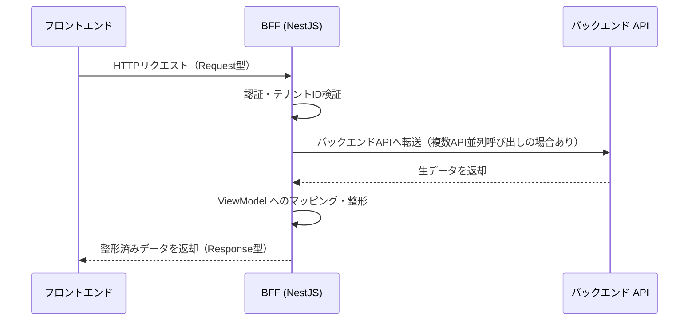
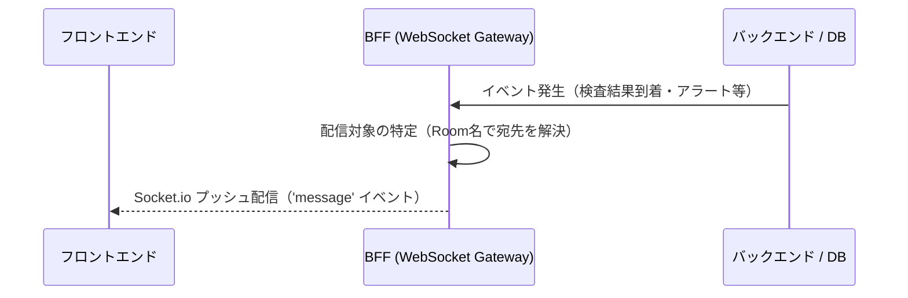
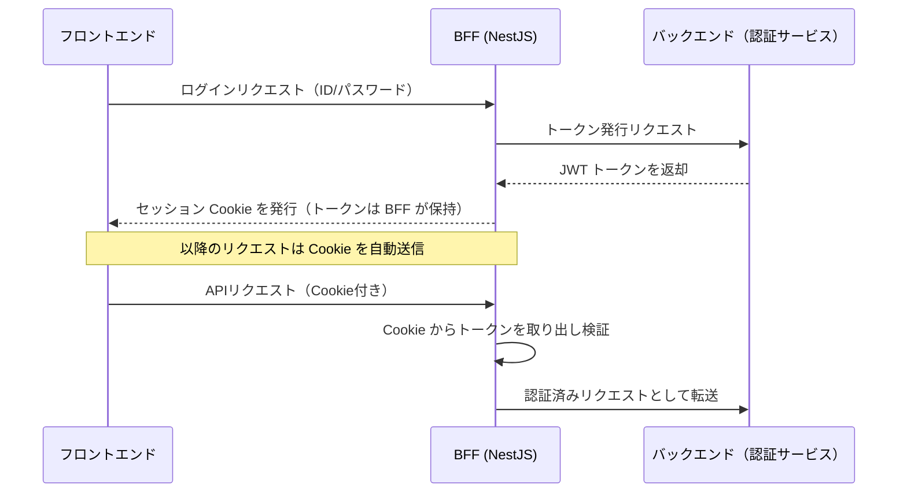
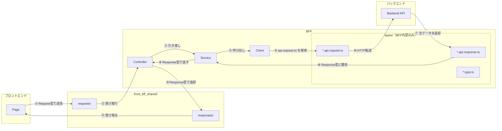

# BFF設計

本章では、フロントエンド専用のバックエンドである **BFF（Backend For Frontend）** の内部アーキテクチャと実装規約を定義する。

## 本章の範囲

| 扱う内容 | 参照先 |
|---------|--------|
| BFFの内部アーキテクチャ（三層構造） | 本章 |
| API集約・データ整形パターン | 本章 |
| リクエスト前処理・セキュリティ検証 | 本章 |
| フロントエンド・BFF間の通信基盤（Axios Interceptor、エンコード/デコード） | `01.フロントエンド・BFF共通基盤設計.md` |
| 共有型定義・Zodスキーマの管理 | `03.TypeScript型管理とスキーマ共有.md` |

---

## BFF技術スタックとプロジェクト構成

### 採用技術

BFFで使用する技術スタックの詳細（バージョン、採用理由）は `01.フロントエンド・BFF共通基盤設計.md` を参照。

| カテゴリ | 採用技術 | 備考 |
|---------|---------|------|
| 実行環境 | Node.js | 非同期I/Oの性能がBFFのAPI集約ユースケースに適合 |
| フレームワーク | NestJS | TypeScriptファーストの設計・DI（依存性注入）・Decorator によるルーティングが本プロジェクトの設計方針と一致 |
| 実行ツール | tsx | ESM対応およびパスエイリアス解決のためのTypeScript実行環境 |
| 通信 | Axios | 複数バックエンドAPIへの並列呼び出し・Interceptorによる共通処理に対応 |

### ディレクトリ構造

ディレクトリ構造の詳細は `00.ディレクトリ構成.md` を参照。BFF固有の配置ルールのみ以下に示す。

```
bff/
├── src/
│   ├── app.module.ts                  # ルートモジュール（全機能Module・ミドルウェアの登録）
│   ├── features/
│   │   └── <LV1機能群>/
│   │       └── <LV2業務フロー>/
│   │           └── <LV3画面機能>/
│   │               ├── (機能名).controller.ts   # エンドポイント定義・リクエスト制御
│   │               ├── (機能名).service.ts      # ビジネスロジック・データ整形
│   │               ├── (機能名).client.ts       # バックエンドAPI通信
│   │               ├── (機能名).module.ts       # NestJS モジュール定義・DI登録
│   │               └── types/
│   │                   ├── (機能名).api.request.ts   # バックエンドAPI向けリクエスト型（BFF内部）
│   │                   ├── (機能名).api.response.ts  # バックエンドAPI向けレスポンス型（BFF内部）
│   │                   └── (機能名).type.ts          # BFF内部で使用する型
│   ├── shared/
│   │   ├── plugins/
│   │   │   ├── server.ts                  # サーバー起動設定（エントリーポイント）
│   │   │   ├── routes.ts                  # ルーティング定義（モジュール登録一覧）
│   │   │   └── decryption.middleware.ts   # 受信データ復号ミドルウェア
│   │   ├── utils/
│   │   └── types/
│   └── front_bff_shared/  （シンボリックリンク）
├── package.json
└── tsconfig.json
```

**配置ルール**

- `features/` 配下は フロントエンドと同じ LV1/LV2/LV3 の3階層構成に準拠する
- Controller・Service・Client・Module は同一ディレクトリにまとめて配置する
- バックエンドAPIとの通信に使用する型（`*.api.request.ts`、`*.api.response.ts`）は BFF 内部の `types/` に配置し、`front_bff_shared` とは分離する
- フロントエンドと共有する型（Request/Response型、Zodスキーマ）は `front_bff_shared/` に配置する（詳細は `03.TypeScript型管理とスキーマ共有.md` を参照）

---

## 三層構造アーキテクチャの実装

BFF を介するデータの流れは以下の3パターンに分類される。

### パターン1：REST リクエスト/レスポンス（通常のデータ取得・更新）

フロントエンドのリクエストを起点に、BFF がバックエンド API へ転送・整形して返す最も基本的なパターン。

**操作・処理例**

| 操作 | フロントエンド → BFF | BFF の処理 | BFF → フロントエンド |
|-----|---------------------|-----------|---------------------|
| 患者詳細画面を開く | `GET /patients/:id` | 患者基本情報・入院情報・直近の検査結果を並列取得し統合 | 画面表示用 ViewModel を返却 |
| バイタル入力を保存 | `POST /vitals` | リクエストボディを検証し、バックエンド API に転送 | 登録完了レスポンスを返却 |
| 処方一覧を取得 | `GET /prescriptions?patientId=xxx` | テナントID・患者IDを条件に追加して転送 | ページネーション済みリストを返却 |
| 看護記録を更新 | `PUT /nursing-records/:id` | 権限スコープを確認し、差分データをバックエンド API に転送 | 更新後のデータを返却 |



### パターン2：サーバープッシュ型通信（Socket.io / リアルタイム通知）

サーバー側のイベントを起点に、BFF がフロントエンドへプッシュ配信するパターン。フロントエンドからのリクエストは発生しない。接続には Socket.io（WebSocket + HTTP ロングポーリングのフォールバック）を使用する。詳細は [08.リアルタイム通信](./08.リアルタイム通信.md) を参照。

**操作・処理例**

| イベント | 発生元 | BFF の処理 | フロントエンドへの配信 |
|---------|--------|-----------|----------------------|
| 検査結果が到着した | バックエンド / 検査システム | 対象患者の担当病棟 Room を特定 | 担当看護師の画面に通知バッジを表示 |
| 患者のアラートが発生した | バックエンド / モニタリング | アラート種別・緊急度を判定し対象 Room に配信 | 担当医・看護師の画面にアラートポップアップを表示 |
| 在室状況が変化した | バックエンド / 入退院管理 | 病棟・病室単位の Room に配信 | 病床管理画面のリアルタイム更新 |
| 他スタッフが記録を更新した | バックエンド | 同一患者を閲覧中のセッションに配信 | 「記録が更新されました」通知を表示 |



### パターン3：認証/セッション管理

フロントエンドの認証リクエストを BFF が受け取り、トークンの検証・保持・更新を担うパターン。フロントエンドはセッション Cookie を保持するだけでよい。

**操作・処理例**

| 操作 | フロントエンド → BFF | BFF の処理 | BFF → フロントエンド |
|-----|---------------------|-----------|---------------------|
| ログイン | `POST /auth/login`（ID/パスワード） | バックエンドにトークン発行を要求し、取得した JWT を BFF 側で保持 | セッション Cookie を発行 |
| APIリクエスト（認証済み） | Cookie 付きリクエスト | Cookie からトークンを取り出し検証後、バックエンド API へ転送 | API レスポンスをフロントエンドへ返却 |
| トークン自動更新 | Cookie 付きリクエスト（有効期限間近） | リフレッシュトークンを使い新しい JWT を取得 | 新しいセッション Cookie を発行し直す |
| ログアウト | `POST /auth/logout` | BFF 側のトークンを破棄 | Cookie を無効化（`Max-Age=0`）して返却 |



---

### レイヤーの責務定義

BFFの内部構造は、保守性とテスト容易性を高めるために、以下の明確に分離されたレイヤード構成を採用する。

| レイヤー | 責務 | やってはいけないこと |
|---------|------|-------------------|
| **Controller** | エンドポイント定義（Routing）、リクエスト情報の抽出（Params/Query/Body）、Serviceの呼び出しとレスポンス返却 | ビジネスロジックの実装、データ整形 |
| **Service** | 複数APIの呼び出し順序制御（オーケストレーション）、生データのViewModelへの変換、エラーハンドリング | バックエンドAPIへの直接通信 |
| **Client** | バックエンドAPIへのHTTP通信（Axiosを使用） | ビジネスロジックの実装、データ整形 |

### NestJSでの実装パターン

NestJSを基本フレームワークとして採用し、Decorator・DI（依存性注入）を活用した実装を標準パターンとする。ミドルウェア層（`decryption.middleware.ts` 等）はNestJSが内包するExpressの仕組みを一部活用する。

#### デコレーターの利用方針

**現時点の方針**

本プロジェクトでは、NestJS標準デコレーターのみを使用する。カスタムデコレーターは今後の設計で、必要に応じで定義するものとする。

**標準デコレーターを使用することで得られる効果**

NestJSの標準デコレーターを使用することで、以下が実現される：

- **宣言的なルーティング定義**: `@Get()` / `@Post()` 等を付けるだけでエンドポイントが自動登録される
- **型安全なパラメータ抽出**: `@Param()` / `@Query()` / `@Body()` でリクエストデータを型付きで取得できる
- **自動的な依存性注入**: `@Injectable()` を付けたクラスは `constructor` に書くだけで自動的にインスタンス化・注入される
- **モジュール単位の疎結合**: `@Module()` で機能をまとめることで、テストや再利用が容易になる

**使用するデコレーター一覧**

詳細な使い方は [NestJS公式ドキュメント](https://docs.nestjs.com/custom-decorators) を参照。

| カテゴリ | 主なデコレーター | 用途 |
|---------|----------------|------|
| クラス定義 | `@Controller()`, `@Injectable()`, `@Module()` | Controller・Service・Client・Moduleの定義 |
| ルーティング | `@Get()`, `@Post()`, `@Put()`, `@Delete()`, `@Patch()` | HTTPメソッドとパスの定義 |
| パラメータ抽出 | `@Param()`, `@Query()`, `@Body()`, `@Headers()` | リクエストデータの取得 |
| 依存性注入 | `@Inject()` | カスタムプロバイダー（文字列トークン、シンボル等）の注入時に使用。通常のクラスベースのプロバイダーは `constructor` の型情報だけで自動注入されるため `@Inject()` は不要 |
| 認証ガード | `@UseGuards()` | 認証ガードの適用。詳細は「認証ヘッダーの検証とテナントID照合」を参照 |

**利用方法**

各デコレーターを以下のように使用する：

```typescript
// クラス定義: Controllerとして登録し、ベースパスを指定
@Controller('users')
export class UserController {
  // 依存性注入: constructorに型を書くだけで自動注入される
  // 従来の方法: this.userService = new UserService(); のように手動でインスタンス化
  // NestJSの方法: constructorの引数に型を指定するだけ
  //   → NestJSが型情報（UserService）を読み取り、DIコンテナから自動的にインスタンスを取得して注入
  //   → @Module() の providers に登録されていれば、@Inject() デコレーターは不要
  constructor(private readonly userService: UserService) {}

  // ルーティング: GETメソッドとパスパラメータを定義
  @Get(':id')
  async getUser(
    @Param('id') id: string,  // パラメータ抽出: :id を型安全に取得
    @Query('include') include?: string,  // クエリパラメータ抽出
  ) {
    return this.userService.getUserFullDetails(id);
  }
}

// Service・Client: DIコンテナに登録
@Injectable()
export class UserService { /* ... */ }

// Module: 機能単位でまとめる
@Module({
  controllers: [UserController],
  providers: [UserService, UserClient],  // ← ここに登録されたクラスは自動注入の対象になる
})
export class UserModule {}
```

**依存性注入の仕組み**

NestJSでは、TypeScriptの型情報とリフレクション機能を使って依存性注入を実現している：

1. **従来の方法（DIなし）**: 各クラスが `new` を使って依存オブジェクトを手動で生成する必要がある
   ```typescript
   constructor() {
     this.userService = new UserService();  // 手動でインスタンス化
   }
   ```

2. **NestJSの方法（DIあり）**: `constructor` に型を書くだけで自動注入される
   ```typescript
   constructor(private readonly userService: UserService) {}  // 型を書くだけ
   ```

**やってはいけないこと**

- デコレーターを使わず手動でルーティング・DI登録を行う（NestJSの設計思想に反する）
- カスタムデコレーターを作成する（現時点では標準デコレーターで十分対応可能）

#### 実装パターン

**Controller実装パターン**

フロントエンドからのリクエストを受け取り、Serviceに処理を委譲して結果を返す。ビジネスロジックは持たない。

```typescript
// bff/src/features/<LV1>/<LV2>/<LV3>/(機能名).controller.ts
import { Controller, Get, Param } from '@nestjs/common';
import { UserService } from './(機能名).service';
import { UserGetRequest } from '@front_bff_shared/features/<LV1>/<LV2>/<LV3>/types/requests/(機能名).request';
import { UserGetResponse } from '@front_bff_shared/features/<LV1>/<LV2>/<LV3>/types/responses/(機能名).response';

@Controller('users')
export class UserController {
  constructor(private readonly userService: UserService) {}

  @Get(':id')
  async getUser(@Param() params: UserGetRequest): Promise<UserGetResponse> {
    // Serviceに処理を委譲するだけ。整形・計算などは行わない
    return this.userService.getUserFullDetails(params.id);
  }
}
```

**Service実装パターン**

複数のClientを並列呼び出しして生データを集約し、フロントエンド向けのViewModelに整形して返す。

```typescript
// bff/src/features/<LV1>/<LV2>/<LV3>/(機能名).service.ts
import { Injectable } from '@nestjs/common';
import { UserClient } from './(機能名).client';
import { UserGetResponse } from '@front_bff_shared/features/<LV1>/<LV2>/<LV3>/types/responses/(機能名).response';
import { UserBaseApiResponse, UserProfileApiResponse } from './types/(機能名).api.response';

@Injectable()
export class UserService {
  constructor(private readonly client: UserClient) {}

  async getUserFullDetails(id: string): Promise<UserGetResponse> {
    // 複数のバックエンドAPIを並列呼び出し（BFF内部型で受け取る）
    const [base, profile]: [UserBaseApiResponse, UserProfileApiResponse] =
      await Promise.all([
        this.client.fetchBase({ targetId: id }),
        this.client.fetchProfile({ targetId: id }),
      ]);

    // BFF内部の生データ（api.response）をフロントエンド向けのResponse型に整形して返す
    return {
      id: base.id,
      displayName: `${base.name} 様`,
      ageGroup: `${Math.floor(profile.age / 10) * 10}代`,
      bio: profile.bio,
    };
  }
}
```

**Client実装パターン**

バックエンドAPIへのHTTP通信のみを担当する。レスポンスはBFF内部型（`*.api.response.ts`）で受け取る。

```typescript
// bff/src/features/<LV1>/<LV2>/<LV3>/(機能名).client.ts
import { Injectable } from '@nestjs/common';
import { bffAxiosClient } from '@/shared/plugins/bffAxiosClient';
import { UserBaseApiResponse, UserProfileApiResponse } from './types/(機能名).api.response';

@Injectable()
export class UserClient {
  async fetchBase(params: { targetId: string }): Promise<UserBaseApiResponse> {
    // bffAxiosClient を使用することで X-Tenant-Id が自動付与される
    const { data } = await bffAxiosClient.get<UserBaseApiResponse>(`/users/${params.targetId}/base`);
    return data;
  }

  async fetchProfile(params: { targetId: string }): Promise<UserProfileApiResponse> {
    const { data } = await bffAxiosClient.get<UserProfileApiResponse>(`/users/${params.targetId}/profile`);
    return data;
  }
}
```

**Module定義**

NestJSのModuleは、機能単位でController・Service・Clientをまとめてアプリケーションに登録するための仕組みで、DIコンテナの構成単位でもある。Moduleを定義することで、NestJSが自動的に依存関係を解決し、各クラスのインスタンス管理を行う。各機能のModuleは、`app.module.ts`（ルートモジュール）に `imports` されることで初めてシステムに認識され、エンドポイントとして機能する。

Moduleで定義する主な項目：

| 項目 | 役割 |
|------|------|
| `controllers` | このModuleが受け持つエンドポイント（Controller）を登録する |
| `providers` | DIコンテナに登録するクラス（Service・Client）を指定する。ここに登録したクラスは `constructor` で自動注入される |
| `imports` | このModuleが依存する他のModuleを指定する（例: 共通AuthModuleの注入など） |
| `exports` | 他のModuleから参照できるようにするProviderを指定する |

```typescript
// bff/src/features/<LV1>/<LV2>/<LV3>/(機能名).module.ts
import { Module } from '@nestjs/common';
import { UserController } from './(機能名).controller';
import { UserService } from './(機能名).service';
import { UserClient } from './(機能名).client';

@Module({
  controllers: [UserController],
  providers: [UserService, UserClient],
})
export class UserModule {}
```

**共有型定義の適用**

型定義の詳細は `03.TypeScript型管理とスキーマ共有.md` を参照。

フロントエンドと通信するエンドポイントでは、すべてのデータのやり取りを `front_bff_shared` で定義された型を介して行う。

- **Request型（入力）**: フロントエンドから送られてくるデータの型。Controllerが受け取り、そのままServiceへ引数として渡す
- **Response型（出力）**: フロントエンドへ返す最終的なデータの型。Serviceがこの型に整形して返し、Controllerを経由してフロントエンドへ返却する

BFF内部の `types/` ディレクトリには、バックエンドAPIとのやり取りに使うBFF専用の型を配置する。`front_bff_shared` には含めず、フロントエンドには公開しない。

| ファイル | 役割 |
|---------|------|
| `*.api.request.ts` | ServiceからClientを経由してバックエンドAPIへ送るリクエストの型 |
| `*.api.response.ts` | バックエンドAPIから返ってくる生データの型。Serviceでこれを受け取りResponse型へ整形する |
| `*.type.ts` | Controller〜Service間など、BFF内部でのみ使用する型。フロントエンドには公開しない |

### 各レイヤー間の型境界とデータの流れ

フロントエンド〜BFF〜バックエンド間の通信において、各レイヤーでどの型を使うかを示す。`front_bff_shared/`（フロントエンドと共有）と BFF 内部の `types/`（BFF 内部のみ）の境界が本図の焦点である。BFF 内部の `types/` には、バックエンド API 向けの `*.api.request.ts` / `*.api.response.ts` に加え、Controller〜Service 間など BFF 内部でのみ使用する `*.type.ts` も含まれる。



---

## API集約とデータ整形

### 並列データ取得（Aggregator）

単一のフロントエンドリクエストに対し、複数のバックエンドサービスからデータを並列で取得し、応答性を最大化する。  
（例：「患者詳細画面」を開く際、BFFが一度のリクエストで「患者基本情報」「過去の処方履歴」「直近の検査結果」という複数のバックエンドAPIを同時に（並列で）呼び出し、それらを一つの応答にまとめてフロントエンドに返却する）

- **実装手法**: `Promise.all` を活用し、独立した複数のClientを同時に呼び出す
- 複数のバックエンドAPIから生データを並列取得し、Serviceで統合した単一レスポンスを生成する

**Service層での実装例**

```typescript
// bff/src/features/<LV1>/<LV2>/<LV3>/(機能名).service.ts
import { Injectable } from '@nestjs/common';
import { UserClient } from './(機能名).client';
import { UserGetResponse } from '@front_bff_shared/features/.../types/responses/(機能名).response';

@Injectable()
export class UserService {
  constructor(private readonly client: UserClient) {}

  async getUserFullDetails(id: string): Promise<UserGetResponse> {
    const param = { targetId: id };

    // 3つの独立したClientを並列呼び出し
    const [base, profile, stats] = await Promise.all([
      this.client.fetchBase(param),
      this.client.fetchProfile(param),
      this.client.fetchStats(param),
    ]);

    // ViewModelへのマッピング（次節参照）
    return {
      id: base.id,
      displayName: `${base.name} 様`,
      ageGroup: `${Math.floor(profile.age / 10) * 10}代`,
      statsSummary: `投稿: ${stats.posts.toLocaleString()} / フォロワー: ${stats.followers.toLocaleString()}人`,
      bio: profile.bio,
    };
  }
}
```

### ViewModelへのマッピング

バックエンドAPIから返却される「生データ（DTO）」を、フロントエンドがそのまま表示可能な「UI最適化データ（ViewModel）」へ変換する。  
**敬称付与・日付フォーマット・数値計算・条件分岐といったデータ装飾処理は、フロントエンドコンポーネントではなく BFF の Service 層で行う。** フロントエンドは受け取った値をそのまま描画するだけでよい。

**BFF で行う理由**

- **責務の明確化**: フロントエンドの責務を「描画」に限定し、加工ロジックの散在を防ぐ
- **変更の局所化**: バックエンドの生データ構造が変わっても BFF のマッピング処理のみ修正すればよく、フロントエンドへの影響を遮断できる
- **テスト容易性**: Service 層の変換処理は純粋な関数として単体テストが書きやすい

**マッピングの原則**

- **ロジックの隠蔽**: 計算・条件分岐・日付フォーマット変換などはすべてBFFのService層で完結させる
- **Presentation負荷の低減**: フロントエンドのコンポーネントが受け取った値をそのまま描画できる状態にする

**マッピングパターン例**

| 種類 | 変換前（生データ） | 変換後（ViewModel） | 処理内容 |
|-----|-------------------|---------------------|---------|
| 装飾 | `name: "山田"` | `displayName: "山田 様"` | 敬称付与。UI側での文字列結合を不要にする |
| 計算 | `age: 25` | `ageGroup: "20代"` | 年齢から年代を算出。UI側の計算ロジックを排除 |
| 要約 | `posts: 120, followers: 5000` | `statsSummary: "投稿: 120 / フォロワー: 5,000人"` | 複数数値をサマリーテキスト化 |

**運用ルール**

- 変換後のプロパティ名はUI上の役割が伝わる名称を採用する（例: `displayName`、`formattedDate`、`isWarning`）
- 返却値の型は必ず `front_bff_shared` で定義された型を使用する
- バックエンドからのデータが欠落している場合、UI側で `?? 'なし'` と記述させるのではなく、BFF側で `description || '詳細情報はありません'` のように初期値を設定して返却する

---

## リクエスト前処理とセキュリティ検証

### 受信データの自動復号ミドルウェア

フロントエンドで難読化（Base64エンコード）されたリクエストボディを、業務ロジックに届く前に自動で復元するミドルウェアを `bff/src/shared/plugins/decryption.middleware.ts` に実装する。

送信データのエンコード/デコードの詳細（実装コード、処理フロー、適用範囲）は `01.フロントエンド・BFF共通基盤設計.md` を参照。

### 認証ヘッダーの検証とテナントID照合

**NestJSのガード機能**

NestJSのガード（Guard）は、リクエストがエンドポイントに到達する前に実行される検証処理を実装するための機能である。認証・認可・リクエスト検証などの前処理を一箇所に集約でき、複数のエンドポイントで再利用できる。

ガードの利用は以下の2段階に分かれる：

1. **ガードクラスの定義（`@Injectable()`）**: 検証ロジックを持つクラスを定義する
   - `CanActivate` インターフェースを実装
   - `canActivate()` メソッドで検証ロジックを記述
   - `@Injectable()` デコレーターで DIコンテナに登録可能にする

2. **ガードの適用（`@UseGuards()`）**: 定義したガードをエンドポイントに適用する
   - Controller全体またはメソッド単位に `@UseGuards(AuthGuard)` を記述
   - 適用されたエンドポイントは、ガードの検証を通過したリクエストのみ実行される

- **役割**: リクエストを許可するか拒否するかを判定する（`true` を返すと許可、`false` または例外をスローすると拒否）
- **実行タイミング**: ミドルウェアの後、パイプ（バリデーション）の前

詳細な使い方は [NestJS公式ドキュメント - Guards](https://docs.nestjs.com/guards) を参照。

**本プロジェクトの方針**

本プロジェクトでは、プロジェクト独自の認証ガード（AuthGuard）を構築し、以下の検証を実施する。

> **現時点の方針**: 認証基盤は未定のため、現段階では「認証ヘッダーの存在確認」レベルの簡易検証を前提として記載する。認証基盤の選定後、実装詳細を具体化する。

**Step 0: ガードクラスの定義**

  * 実装コード：`bff/src/shared/guards/auth.guard.ts`

認証ガード（AuthGuard）は基盤チームが作成・管理する。実装チームはこのガードクラスを直接編集せず、後述する「ガードの適用」で `@UseGuards(AuthGuard)` デコレーターを使用してエンドポイントに適用する。

```typescript
// bff/src/shared/guards/auth.guard.ts
import { Injectable, CanActivate, ExecutionContext, UnauthorizedException } from '@nestjs/common';

@Injectable()
export class AuthGuard implements CanActivate {
  canActivate(context: ExecutionContext): boolean {
    const request = context.switchToHttp().getRequest();
    const token = request.headers.authorization?.replace('Bearer ', '');

    // 現時点: ヘッダーの存在確認のみ
    if (!token) throw new UnauthorizedException();

    // 認証基盤確定後に以下を実装
    // - トークンの有効期限チェック
    // - 署名検証
    // - テナントID照合（payload.tenantId と X-Tenant-Id ヘッダーの一致確認）

    return true;
  }
}
```

**Step 1: 認証ヘッダーの存在確認**

フロントエンドの Axios Interceptor がすべてのリクエストに認証ヘッダーを付与する（詳細は `01.フロントエンド・BFF共通基盤設計.md` を参照）。BFF側では、このヘッダーが存在しないリクエストを拒否する。

- ヘッダーが存在しない場合、`401 Unauthorized` を返却する
- 認証基盤確定後は、トークンの有効期限・署名検証に拡張する

**Step 2: テナントの一致確認（最重要）**

- リクエストヘッダー `X-Tenant-Id` の値が存在することを確認する
- **目的**: テナントAの職員が、テナントBのIDを指定してデータにアクセスする横断的なぞき見を防止する
- 認証基盤確定後は、トークン内のテナントIDとの一致確認に拡張する

**Step 3: 認可（権限確認）について**

現時点では、認可（権限確認）はバックエンド側のみで実施するため、BFFでは実装しない。認証基盤の方針が変更された場合は、本セクションに実装方針を追記する。

**ガードの適用方法（実装チーム向け）**

Step 0～2は AuthGuard クラスの定義と内部の検証ロジックを説明している。本セクションでは、定義された AuthGuard をエンドポイントに適用する方法を説明する。

実装チームは、基盤チームが作成した `AuthGuard` を `@UseGuards()` デコレーターで適用する。

```typescript
// bff/src/features/<LV1>/<LV2>/<LV3>/(機能名).controller.ts
import { Controller, Get, UseGuards, Param } from '@nestjs/common';
import { AuthGuard } from '@/shared/guards/auth.guard';

@Controller('users')
@UseGuards(AuthGuard)  // Controller全体に適用（全メソッドで認証が必要）
export class UserController {
  constructor(private readonly userService: UserService) {}

  @Get(':id')
  async getUser(@Param('id') id: string) {
    // このメソッドは AuthGuard を通過したリクエストのみ実行される
    return this.userService.getUserFullDetails(id);
  }
}
```

**適用単位**

- **Controller全体**: `@Controller()` の上に `@UseGuards(AuthGuard)` を記述（推奨）
- **メソッド単位**: 特定のメソッドのみ認証が必要な場合は、そのメソッドの上に `@UseGuards(AuthGuard)` を記述

### IDOR対策

BFF はデータベースへ直接アクセスしない。他テナントのデータは、バックエンド API へのリクエスト時にテナントIDで絞り込まれるため取得されない。

テナントIDは、BFF の Axios インスタンスがフロントエンドから受け取った `X-Tenant-Id` ヘッダーをバックエンド API へのリクエストに自動転送することで付与する。Client や Service 層で個別に `tenantId` を引数として渡す必要はなく、漏れなく全リクエストに付与されることを保証する。Axios インターセプターの詳細は `01.フロントエンド・BFF共通基盤設計.md` を参照。

---

## エラーハンドリング戦略

### BFF固有のエラー処理

BFFのエラー処理は、バックエンドAPIから返却されるエラーを抽象化し、フロントエンドへ全エラー共通のレスポンス形式（[09章 BFFエラーレスポンス](./09.監視・エラーハンドリング.md#bffエラーレスポンス)）で返却することを目的とする。

**HTTPステータスコード別の処理方針**

すべてのエラーレスポンスは [09章 BFFエラーレスポンス](./09.監視・エラーハンドリング.md#bffエラーレスポンス) で定義する統一フォーマット（`{ title, status, detail, instance, errors[], traceId }`）で返却する。

| 発生源 | BFFでの処理 | 返却ステータス | 主な `errors[].code` |
|---|---|:---:|---|
| Controller層の入力バリデーション失敗（Zod） | `ZodExceptionFilter` が `ZodError` を捕捉して統一フォーマットに変換 | 400 | `REQUIRED` / `INVALID_FORMAT` / `INVALID_TYPE` |
| 業務ルール違反（例: 自動連携行の削除試行） | Service層で `BusinessException` を throw し、`HttpExceptionFilter` が統一フォーマットに変換 | 400 | `VALIDATION_DELETE` 等の機能固有コード |
| 認証失敗（JWT 検証失敗） | NestJS Auth Guard が捕捉、`HttpExceptionFilter` が変換 | 401 | `UNAUTHORIZED` |
| 認可失敗（権限不足） | バックエンド 403 を捕捉、`HttpExceptionFilter` が変換 | 403 | `FORBIDDEN` |
| バックエンドAPIの 404 | エラー内容を解釈、`HttpExceptionFilter` が変換 | 404 | `NOT_FOUND` |
| 排他競合（編集ロック・期限切れ） | バックエンド 409 を捕捉、`errors[].meta.lockedByUserName` を付与 | 409 | `CONFLICT` |
| バックエンドAPIの 5xx（バックエンド起因） | `HttpExceptionFilter` が `502 Bad Gateway` に変換 | 502 | `BAD_GATEWAY` |
| バックエンドAPIの接続タイムアウト | `HttpExceptionFilter` が `504 Gateway Timeout` に変換 | 504 | `TIMEOUT` |
| BFF 内部のサーバーエラー（未捕捉例外） | `HttpExceptionFilter` が `500 Internal Server Error` に変換 | 500 | `SYSTEM_ERROR` |

**統一エラーフィルタの構成**

NestJS には2つのグローバル Exception Filter を登録する。両者ともレスポンスは [09章](./09.監視・エラーハンドリング.md#bffエラーレスポンス) の統一フォーマットで返す。

| フィルタ | 役割 | 捕捉対象 |
|---|---|---|
| `ZodExceptionFilter` | Zod スキーマ検証失敗を統一フォーマットに変換 | `ZodError`（HTTP 400） |
| `HttpExceptionFilter` | 上記以外の全例外を統一フォーマットに変換 | `HttpException` 派生クラス・未捕捉例外（HTTP 401〜504） |

**Service層でのエラー捕捉パターン**

Clientへのパラメータ渡しはオブジェクト形式を標準とする。将来的にフィルタ条件が追加された場合でも関数シグネチャを変えずに拡張でき、POST/PUT系と書き方が統一されるため。

```typescript
async getUserFullDetails(id: string): Promise<UserGetResponse> {
  try {
    const [base, profile] = await Promise.all([
      this.client.fetchBase({ targetId: id }),
      this.client.fetchProfile({ targetId: id }),
    ]);
    return this.mapToViewModel(base, profile);
  } catch (error) {
    // バックエンドAPIエラーをBFF固有の例外に変換（HttpExceptionFilter が統一フォーマットに整形）
    throw new ServiceUnavailableException('データ取得に失敗しました');
  }
}
```

### Zodバリデーションエラー以外のHTTPレスポンス変換

`HttpExceptionFilter` は NestJS の `HttpException` および未捕捉例外を捕捉し、HTTP ステータスごとに [09章](./09.監視・エラーハンドリング.md#bffエラーレスポンス) で定義された `errors[].code` を割り当てて統一フォーマットで返却する。

- HTTP ステータス → `errors[].code` の対応: [09章 BFFエラーレスポンス > `errors[].code` の一覧](./09.監視・エラーハンドリング.md#errorscode-の一覧)
- `errors[].meta` の付与例（CONFLICT 時の `lockedByUserName` 等）も同セクションを参照

### ZodバリデーションエラーのHTTPレスポンス変換

BFFのController層でZodスキーマを用いた入力検証を行い、バリデーション失敗時はグローバル登録された `ZodExceptionFilter` が `ZodError` を捕捉して HTTP 400 の統一エラーレスポンスに変換する。

- 実装の詳細（`ZodExceptionFilter` のコード例・Zod 内部コードからプロジェクトコードへの変換）: [03章 バリデーションエラーのハンドリング](./03.TypeScript型管理とスキーマ共有.md#バリデーションエラーのハンドリング)
- レスポンス形式・`errors[].code` の体系: [09章 BFFエラーレスポンス](./09.監視・エラーハンドリング.md#bffエラーレスポンス)
- Controller層で `parse()` を直接呼ぶ実装ルール: `.claude/skills/app-bff-zod-validation/SKILL.md`

---

## パフォーマンス最適化【将来拡張】

初期開発ではインフラ管理コストの観点からRedisによるキャッシュレイヤーの導入を見送りとなっているため、将来的にデータ量が増大など、方針が変更次第、詳細定義する。

---

## 開発ガイドライン

### 実装ルール

**やっていいこと**

- `front_bff_shared` の型定義を Controller・Serviceの入出力に使用する
- Service層でデータ整形・ViewModelへのマッピングを行う
- `Promise.all` による並列API呼び出しで応答性を最大化する
- テナントIDの付与は Axios インターセプターに任せ、Client・Service 層では意識しない

**やってはいけないこと**

- Controllerにビジネスロジックを実装する
- バックエンドAPIの生データ（DTO）をフロントエンドへそのまま返却する
- Axios インターセプターを介さず Client から直接バックエンド API を呼び出す（テナントIDが付与されない）
- フロントエンドとBFFで独自に型定義を持ち、`front_bff_shared` と二重管理する

### ファイル命名規則

| ファイル種別 | 命名パターン（ローワーキャメル） | 例 |
|------------|------------|-----|
| Controller | `(機能名).controller.ts` | `userDetail.controller.ts` |
| Service | `(機能名).service.ts` | `userDetail.service.ts` |
| Client | `(機能名).client.ts` | `userDetail.client.ts` |
| Module | `(機能名).module.ts` | `userDetail.module.ts` |
| バックエンドAPI向けリクエスト型 | `(機能名).api.request.ts` | `userDetail.api.request.ts` |
| バックエンドAPI向けレスポンス型 | `(機能名).api.response.ts` | `userDetail.api.response.ts` |
| BFF内部型 | `(機能名).type.ts` | `userDetail.type.ts` |
