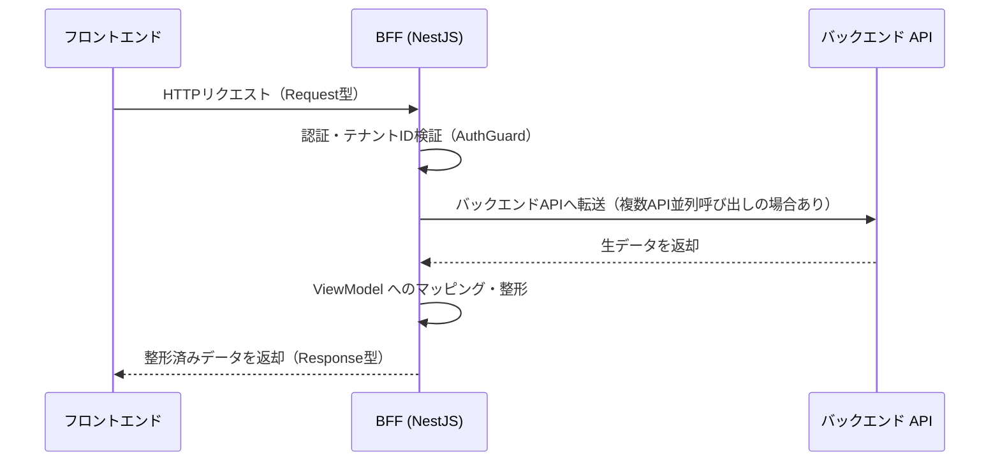
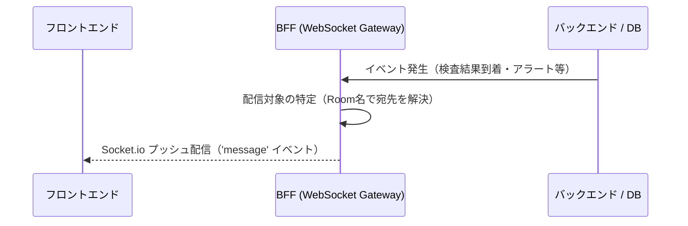
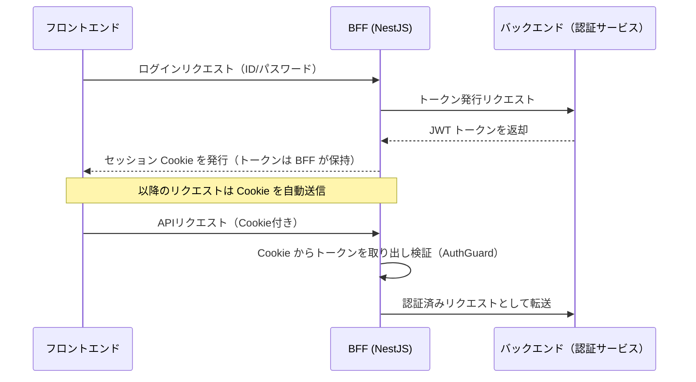
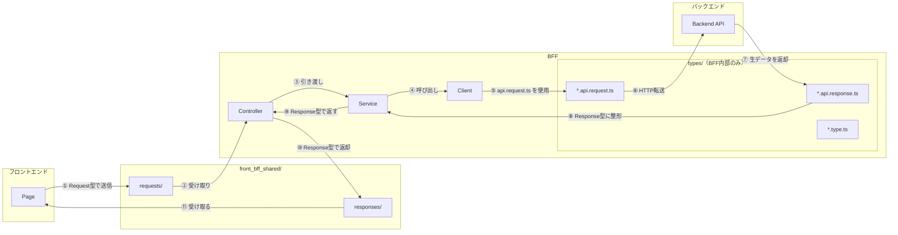

# BFF三層アーキテクチャ設計

NestJS を採用した BFF の内部レイヤード構成・通信パターン・型境界・実装パターンを定義する。

> 規約（Do/Don't・命名・経由必須 I/F）は [BFF設計規約.md](BFF設計規約.md) を参照。

---

## 1. ディレクトリ構造

```
bff/
├── src/
│   ├── app.module.ts                  # ルートモジュール（全機能Module・ミドルウェアの登録）
│   ├── features/
│   │   └── <LV1機能群>/
│   │       └── <LV2業務フロー>/
│   │           └── <LV3画面機能>/
│   │               ├── (機能名).controller.ts   # エンドポイント定義・リクエスト制御
│   │               ├── (機能名).service.ts      # ビジネスロジック・データ整形
│   │               ├── (機能名).client.ts       # バックエンドAPI通信
│   │               ├── (機能名).module.ts       # NestJS モジュール定義・DI登録
│   │               └── types/
│   │                   ├── (機能名).api.request.ts   # バックエンドAPI向けリクエスト型（BFF内部）
│   │                   ├── (機能名).api.response.ts  # バックエンドAPI向けレスポンス型（BFF内部）
│   │                   └── (機能名).type.ts          # BFF内部で使用する型
│   ├── shared/
│   │   ├── plugins/
│   │   │   ├── server.ts                  # サーバー起動設定（エントリーポイント）
│   │   │   ├── routes.ts                  # ルーティング定義（モジュール登録一覧）
│   │   │   └── decryption.middleware.ts   # 受信データ復号ミドルウェア
│   │   ├── guards/
│   │   │   └── auth.guard.ts              # 認証ガード（公開 I/F は別ファイル参照）
│   │   ├── filters/
│   │   │   └── zod-exception.filter.ts    # Zodバリデーション統一変換
│   │   ├── utils/
│   │   └── types/
│   └── front_bff_shared/  （シンボリックリンク）
├── package.json
└── tsconfig.json
```

| ディレクトリ・ファイル | 役割 |
|---|---|
| `app.module.ts` | ルートモジュール。全機能 Module・グローバル Filter / Guard を登録 |
| `features/<LV1>/<LV2>/<LV3>/` | 1画面機能 = 1ディレクトリ。Controller / Service / Client / Module / 内部 types を同居させる |
| `features/.../types/*.api.request.ts` | バックエンド API 向けリクエスト型（BFF 内部のみ） |
| `features/.../types/*.api.response.ts` | バックエンド API から返る生データ型（BFF 内部のみ）|
| `features/.../types/*.type.ts` | Controller〜Service 間で使う BFF 内部型 |
| `shared/plugins/decryption.middleware.ts` | 受信データ復号ミドルウェア（基盤チーム管理。詳細は [01_フロントエンド・BFF共通基盤設計/送信データ難読化基盤設計.md](../01_フロントエンド・BFF共通基盤設計/送信データ難読化基盤設計.md) を参照） |
| `shared/guards/auth.guard.ts` | 認証ガード（基盤チーム管理。公開 I/F は [認証ガード基盤設計.md](認証ガード基盤設計.md) を参照） |
| `shared/filters/zod-exception.filter.ts` | Zod バリデーションエラー統一変換フィルタ（[エラーハンドリング統合設計.md](エラーハンドリング統合設計.md)） |
| `front_bff_shared/`（シンボリックリンク） | フロントと共有する Request / Response 型・Zod スキーマ。`packages/front_bff_shared/` の実体を参照 |

---

## 2. NestJS デコレーター仕様

### 2.1 使用するデコレーター一覧

詳細な使い方は [NestJS 公式ドキュメント](https://docs.nestjs.com/custom-decorators) を参照。

| カテゴリ | 主なデコレーター | 用途 |
|---|---|---|
| クラス定義 | `@Controller()` / `@Injectable()` / `@Module()` | Controller / Service / Client / Module の定義 |
| ルーティング | `@Get()` / `@Post()` / `@Put()` / `@Delete()` / `@Patch()` | HTTP メソッドとパスの定義 |
| パラメータ抽出 | `@Param()` / `@Query()` / `@Body()` / `@Headers()` | リクエストデータの取得 |
| 依存性注入 | `@Inject()` | カスタムプロバイダー（文字列トークン・シンボル等）の注入時のみ。通常のクラスベースのプロバイダーは `constructor` の型情報で自動注入されるため不要 |
| 認証ガード | `@UseGuards()` | 認証ガードの適用。詳細は [認証ガード基盤設計.md §3](認証ガード基盤設計.md#3-適用方法) |

### 2.2 依存性注入

NestJS では TypeScript の型情報を使った自動 DI を採用する。`@Module()` の `providers` に登録されたクラスは `constructor` の引数型から自動注入される。

```typescript
@Controller('users')
export class UserController {
  constructor(private readonly userService: UserService) {}  // 型を書くだけで自動注入
}

@Module({
  controllers: [UserController],
  providers: [UserService, UserClient],  // ここに登録されたクラスは自動注入の対象
})
export class UserModule {}
```

> カスタムデコレーターを採用しない判断は [adr/no-custom-decorator.md](adr/no-custom-decorator.md) を参照。

---

## 3. 実装パターン

### 3.1 Controller 実装パターン

リクエストを受け取り、Service に処理を委譲して結果を返す。ビジネスロジック・整形は持たない。

```typescript
// bff/src/features/<LV1>/<LV2>/<LV3>/(機能名).controller.ts
import { Controller, Get, Param, UseGuards } from '@nestjs/common';
import { AuthGuard } from '@/shared/guards/auth.guard';
import { UserService } from './(機能名).service';
import { UserGetRequest } from '@front_bff_shared/features/<LV1>/<LV2>/<LV3>/types/requests/(機能名).request';
import { UserGetResponse } from '@front_bff_shared/features/<LV1>/<LV2>/<LV3>/types/responses/(機能名).response';

@Controller('users')
@UseGuards(AuthGuard)
export class UserController {
  constructor(private readonly userService: UserService) {}

  @Get(':id')
  async getUser(@Param() params: UserGetRequest): Promise<UserGetResponse> {
    return this.userService.getUserFullDetails(params.id);
  }
}
```

### 3.2 Service 実装パターン

複数 Client を並列呼び出しして生データを集約し、`front_bff_shared` の Response 型に整形して返す。

```typescript
// bff/src/features/<LV1>/<LV2>/<LV3>/(機能名).service.ts
import { Injectable } from '@nestjs/common';
import { UserClient } from './(機能名).client';
import { UserGetResponse } from '@front_bff_shared/features/<LV1>/<LV2>/<LV3>/types/responses/(機能名).response';
import { UserBaseApiResponse, UserProfileApiResponse } from './types/(機能名).api.response';

@Injectable()
export class UserService {
  constructor(private readonly client: UserClient) {}

  async getUserFullDetails(id: string): Promise<UserGetResponse> {
    const [base, profile]: [UserBaseApiResponse, UserProfileApiResponse] =
      await Promise.all([
        this.client.fetchBase({ targetId: id }),
        this.client.fetchProfile({ targetId: id }),
      ]);

    return {
      id: base.id,
      displayName: `${base.name} 様`,
      ageGroup: `${Math.floor(profile.age / 10) * 10}代`,
      bio: profile.bio,
    };
  }
}
```

### 3.3 Client 実装パターン

バックエンド API への HTTP 通信のみを担当する。レスポンスは BFF 内部型（`*.api.response.ts`）で受け取る。

```typescript
// bff/src/features/<LV1>/<LV2>/<LV3>/(機能名).client.ts
import { Injectable } from '@nestjs/common';
import { bffAxiosClient } from '@/shared/plugins/bffAxiosClient';
import { UserBaseApiResponse, UserProfileApiResponse } from './types/(機能名).api.response';

@Injectable()
export class UserClient {
  async fetchBase(params: { targetId: string }): Promise<UserBaseApiResponse> {
    const { data } = await bffAxiosClient.get<UserBaseApiResponse>(`/users/${params.targetId}/base`);
    return data;
  }

  async fetchProfile(params: { targetId: string }): Promise<UserProfileApiResponse> {
    const { data } = await bffAxiosClient.get<UserProfileApiResponse>(`/users/${params.targetId}/profile`);
    return data;
  }
}
```

> `bffAxiosClient` は `X-Tenant-Id` ヘッダーを自動付与する。詳細は [01_フロントエンド・BFF共通基盤設計/Axios通信基盤設計.md](../01_フロントエンド・BFF共通基盤設計/Axios通信基盤設計.md) を参照。

### 3.4 Module 定義

NestJS の Module は機能単位で Controller・Service・Client をまとめる DI コンテナの構成単位である。各機能 Module は `app.module.ts` の `imports` に登録されることでシステムに認識される。

| 項目 | 役割 |
|---|---|
| `controllers` | この Module が受け持つエンドポイント（Controller）を登録する |
| `providers` | DI コンテナに登録するクラス（Service・Client）を指定する。ここに登録したクラスは `constructor` で自動注入される |
| `imports` | この Module が依存する他の Module を指定する |
| `exports` | 他の Module から参照できるようにする Provider を指定する |

```typescript
// bff/src/features/<LV1>/<LV2>/<LV3>/(機能名).module.ts
import { Module } from '@nestjs/common';
import { UserController } from './(機能名).controller';
import { UserService } from './(機能名).service';
import { UserClient } from './(機能名).client';

@Module({
  controllers: [UserController],
  providers: [UserService, UserClient],
})
export class UserModule {}
```

---

## 4. データ整形

### 4.1 並列データ取得（Aggregator）

単一のフロントエンドリクエストに対し、複数のバックエンドサービスからデータを並列取得して応答性を最大化する。

| 項目 | 内容 |
|---|---|
| 実装手法 | `Promise.all` で独立した複数 Client を同時呼び出し |
| 統合タイミング | Service 層で並列取得した生データを ViewModel に統合 |
| Client パラメータ形式 | オブジェクト形式（`{ targetId, ... }`）を標準とする |

```typescript
async getUserFullDetails(id: string): Promise<UserGetResponse> {
  const param = { targetId: id };

  const [base, profile, stats] = await Promise.all([
    this.client.fetchBase(param),
    this.client.fetchProfile(param),
    this.client.fetchStats(param),
  ]);

  return {
    id: base.id,
    displayName: `${base.name} 様`,
    ageGroup: `${Math.floor(profile.age / 10) * 10}代`,
    statsSummary: `投稿: ${stats.posts.toLocaleString()} / フォロワー: ${stats.followers.toLocaleString()}人`,
    bio: profile.bio,
  };
}
```

### 4.2 ViewModel へのマッピング

バックエンド API から返却される生データ（DTO）を、フロントエンドがそのまま表示可能な UI 最適化データ（ViewModel）へ変換する。

| 種類 | 変換前（生データ） | 変換後（ViewModel） | 処理内容 |
|---|---|---|---|
| 装飾 | `name: "山田"` | `displayName: "山田 様"` | 敬称付与。UI 側での文字列結合を不要にする |
| 計算 | `age: 25` | `ageGroup: "20代"` | 年齢から年代を算出 |
| 要約 | `posts: 120, followers: 5000` | `statsSummary: "投稿: 120 / フォロワー: 5,000人"` | 複数数値をサマリーテキスト化 |
| 初期値補完 | `description: null` | `description: "詳細情報はありません"` | バックエンド欠落値を BFF 側で初期化 |

> BFF 側で行う根拠は [adr/view-model-mapping-on-bff.md](adr/view-model-mapping-on-bff.md) を参照。

---

## 5. 通信パターン

BFF を介するデータの流れは以下の3パターンに分類される。

### 5.1 パターン1：REST リクエスト/レスポンス

フロントエンドのリクエストを起点に、BFF がバックエンド API へ転送・整形して返す最も基本的なパターン。

| 操作 | フロントエンド → BFF | BFF の処理 | BFF → フロントエンド |
|---|---|---|---|
| 患者詳細画面を開く | `GET /patients/:id` | 患者基本情報・入院情報・直近の検査結果を並列取得し統合 | 画面表示用 ViewModel を返却 |
| バイタル入力を保存 | `POST /vitals` | リクエストボディを検証し、バックエンド API に転送 | 登録完了レスポンスを返却 |
| 処方一覧を取得 | `GET /prescriptions?patientId=xxx` | テナントID・患者IDを条件に追加して転送 | ページネーション済みリストを返却 |
| 看護記録を更新 | `PUT /nursing-records/:id` | 権限スコープを確認し、差分データをバックエンド API に転送 | 更新後のデータを返却 |



### 5.2 パターン2：サーバープッシュ型通信（Socket.io）

サーバー側のイベントを起点に、BFF がフロントエンドへプッシュ配信するパターン。フロントエンドからのリクエストは発生しない。詳細は [08_リアルタイム通信設計/BFF通知Gateway設計.md](../08_リアルタイム通信設計/BFF通知Gateway設計.md) を参照。

| イベント | 発生元 | BFF の処理 | フロントエンドへの配信 |
|---|---|---|---|
| 検査結果が到着した | バックエンド / 検査システム | 対象患者の担当病棟 Room を特定 | 担当看護師の画面に通知バッジを表示 |
| 患者のアラートが発生した | バックエンド / モニタリング | アラート種別・緊急度を判定し対象 Room に配信 | 担当医・看護師の画面にアラートポップアップを表示 |
| 在室状況が変化した | バックエンド / 入退院管理 | 病棟・病室単位の Room に配信 | 病床管理画面のリアルタイム更新 |
| 他スタッフが記録を更新した | バックエンド | 同一患者を閲覧中のセッションに配信 | 「記録が更新されました」通知を表示 |



### 5.3 パターン3：認証/セッション管理

フロントエンドの認証リクエストを BFF が受け取り、トークンの検証・保持・更新を担うパターン。フロントエンドはセッション Cookie を保持するだけでよい。

| 操作 | フロントエンド → BFF | BFF の処理 | BFF → フロントエンド |
|---|---|---|---|
| ログイン | `POST /auth/login`（ID/パスワード） | バックエンドにトークン発行を要求し、取得した JWT を BFF 側で保持 | セッション Cookie を発行 |
| API リクエスト（認証済み） | Cookie 付きリクエスト | Cookie からトークンを取り出し検証後、バックエンド API へ転送 | API レスポンスをフロントエンドへ返却 |
| トークン自動更新 | Cookie 付きリクエスト（有効期限間近） | リフレッシュトークンを使い新しい JWT を取得 | 新しいセッション Cookie を発行し直す |
| ログアウト | `POST /auth/logout` | BFF 側のトークンを破棄 | Cookie を無効化（`Max-Age=0`）して返却 |



---

## 6. 型境界とデータの流れ

フロントエンド〜BFF〜バックエンド間の通信における型境界。`front_bff_shared/`（フロントと共有）と BFF 内部の `types/`（BFF 内部のみ）の境界が本図の焦点である。

| ファイル | 役割 |
|---|---|
| `*.api.request.ts` | Service から Client を経由してバックエンド API へ送るリクエストの型 |
| `*.api.response.ts` | バックエンド API から返ってくる生データの型。Service でこれを受け取り Response 型へ整形する |
| `*.type.ts` | Controller〜Service 間など、BFF 内部でのみ使用する型。フロントには公開しない |
| `front_bff_shared/.../requests/` | フロントから送られてくる Request 型 |
| `front_bff_shared/.../responses/` | フロントへ返す最終的な Response 型 |



> 共有型・スキーマ管理の詳細は [03_TypeScript型管理/TypeScript型管理規約.md](../03_TypeScript型管理/TypeScript型管理規約.md) を参照。

---

## 7. IDOR 対策

BFF はデータベースへ直接アクセスしない。他テナントのデータは、バックエンド API へのリクエスト時にテナント ID で絞り込まれるため取得されない。

テナント ID は `bffAxiosClient` がフロントエンドから受け取った `X-Tenant-Id` ヘッダーをバックエンド API へのリクエストに自動転送することで付与する。Client / Service 層で個別に `tenantId` を引数として渡す必要はなく、漏れなく全リクエストに付与されることを保証する。

> Axios インターセプターの詳細は [01_フロントエンド・BFF共通基盤設計/Axios通信基盤設計.md](../01_フロントエンド・BFF共通基盤設計/Axios通信基盤設計.md) を参照。
> リクエスト到達前のテナント ID 整合性検証は [認証ガード基盤設計.md §2](認証ガード基盤設計.md#2-公開-if) を参照。

---

## 8. パフォーマンス最適化【将来拡張】

初期開発ではインフラ管理コストの観点から Redis によるキャッシュレイヤーの導入を見送る。データ量増大等で方針変更次第、本節を詳細化する。
