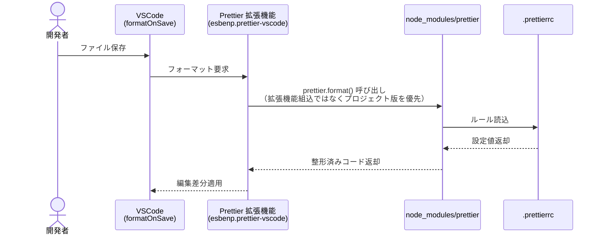

# Prettier 整形基盤設計

本章は、Prettier による自動整形基盤の構成・設定・配置・運用フローを定義する。
本基盤の利用ルール（アプリチームの Do/Don't）は [開発規律と品質管理規約.md](開発規律と品質管理規約.md) §3 を参照。

---

## 1. 構成方針

本プロジェクトでは、以下の 2 形態の Prettier を併用する。

| 形態 | 役割 |
|---|---|
| **npm パッケージ（`node_modules/prettier`）** | バージョン固定の整形エンジン。CLI／CI／VSCode 拡張機能の実体 |
| **VSCode 拡張機能（`esbenp.prettier-vscode`）** | エディタ統合 UI。`node_modules/prettier` を呼び出すアダプタ |

VSCode 拡張機能は内部的に `node_modules/prettier` を優先的に使用するため、**エディタ整形・CLI 整形・CI 整形が同一バージョン**で動作する。

> 根拠: [ADR-2](adr/prettier-npm-and-vscode-extension.md)

### 1.1 動作フロー

セットアップ手順:

1. `npm install -D prettier` でプロジェクトに Prettier をインストール
2. `.prettierrc` で整形ルールを定義
3. VSCode 拡張機能（`esbenp.prettier-vscode`）をインストール

保存時整形のシーケンス:



**ポイント**: VSCode 拡張機能は内部的に `node_modules/prettier` を **優先的に**呼び出す。これによりエディタ整形・CLI 整形・CI 整形がすべて同一バージョン・同一ルールで動作する（拡張機能組み込みバージョンは使われない）。

---

## 2. 整形ルール定義（`.prettierrc`）

プロジェクトルートの `.prettierrc` に以下のルールを定義し、すべてのソースコード（`.ts`, `.tsx`, `.json`, `.css` 等）に強制適用する。

### 2.0 配置場所

`.prettierrc` の配置場所は §6.1 の管理ファイル一覧で定義する。frontend / BFF それぞれのプロジェクトルート直下に配置する（`frontend/.prettierrc` / `bff/.prettierrc`）。


### 2.1 基本設定

```json
{
  "semi": true,
  "singleQuote": true,
  "tabWidth": 2,
  "trailingComma": "all",
  "printWidth": 100
}
```

### 2.2 各設定項目の詳細

| 設定項目 | 値 | 説明 |
|---|---|---|
| `semi` | `true` | 文末に必ず `;` を付与し、解釈の曖昧さを排除する |
| `singleQuote` | `true` | 文字列引用符を `'` に統一し、ダブルクォートの使用を制限する |
| `tabWidth` | `2` | インデントはスペース 2 つ分を標準とし、深い階層でも視認性を維持する |
| `trailingComma` | `all` | 配列・オブジェクト・関数引数の末尾カンマを可能な限り付与する |
| `printWidth` | `100` | 1 行の最大文字数を 100 文字に制限し、横スクロールを防ぐ |

> `trailingComma: "all"` 採用根拠: [ADR-1](adr/prettier-trailing-comma-all.md)

---

## 3. 除外定義（`.prettierignore`）

整形対象外のファイル・ディレクトリは `.prettierignore` で定義する。

### 3.1 標準的な除外対象

| 種別 | 例 |
|---|---|
| 依存パッケージ | `node_modules/` |
| ビルド成果物 | `.next/`, `dist/`, `build/`, `out/` |
| 自動生成ファイル | OpenAPI 自動生成型、ORM 生成スキーマ |
| 大容量データ | 大規模 JSON、ログファイル |

### 3.2 配置ルール

| プロジェクト | 配置場所 |
|---|---|
| frontend | `frontend/.prettierignore` |
| BFF | `bff/.prettierignore` |

---

## 4. エディタ統合（`.vscode/settings.json`）

リポジトリ管理の `.vscode/settings.json` で、保存時自動整形と既定フォーマッターを設定する。

### 4.1 設定値

```json
{
  "editor.formatOnSave": true,
  "editor.defaultFormatter": "esbenp.prettier-vscode",
  "[typescript]": {
    "editor.defaultFormatter": "esbenp.prettier-vscode"
  },
  "[typescriptreact]": {
    "editor.defaultFormatter": "esbenp.prettier-vscode"
  }
}
```

### 4.2 各設定項目の役割

| 設定項目 | 役割 |
|---|---|
| `editor.formatOnSave` | ファイル保存時に自動整形を実行し、コミット前の整形漏れを防ぐ |
| `editor.defaultFormatter` | 既定フォーマッターを Prettier に固定し、他フォーマッター（VSCode 内蔵等）との競合を防ぐ |
| `[typescript]` / `[typescriptreact]` 配下の同設定 | 言語別の上書きを防ぎ、TS/TSX で確実に Prettier を使用させる |

> **注**: `.vscode/settings.json` には ESLint 自動修正など 02 章（開発環境設計）由来の設定も含まれる。Prettier 関連は本章、それ以外は [02_開発環境設計](../02_開発環境設計/) を参照。

---

## 5. 実行コマンドと CI ゲート連携

### 5.1 ローカル実行コマンド

| コマンド | 用途 |
|---|---|
| `npx prettier --check .` | 整形が必要なファイルを検出（エラーで終了）。コミット前のセルフチェックに使用 |
| `npx prettier --write .` | 整形を実行し、ファイルを上書き。一括整形時に使用 |
| `npx prettier --write src/app/sample/sample.tsx` | 特定ファイルのみ整形 |

### 5.2 整形効果の例

**整形前のコード**:

```typescript
const rawData = { id: 100 };
const   uglyCode  =  "test" ;
```

**Prettier 適用後**:

```typescript
const rawData = { id: 100 };
const uglyCode = 'test';
```

スペースの乱立や引用符の混在が、`.prettierrc` の設定に基づき自動修正される。

### 5.3 CI/CD 品質ゲート連携【今後実装】

> **ステータス**: 本章執筆時点で未実装。今後 CI/CD パイプライン（GitHub Actions 等）への組み込みを行う。

| 項目 | 内容 |
|---|---|
| **CI 自動チェック（必須）** | プルリクエスト作成時に CI 上で `npx prettier --check .` を自動実行する |
| **マージブロック** | 整形チェックに失敗した場合はマージ不可とし、品質ゲートとして機能させる |
| **husky 連携検討** | コミット直前の自動整形フック（`husky` + `lint-staged`）の導入を検討する |

---

## 6. 設定ファイル管理体制

Prettier 関連の設定ファイルは **基盤チーム**が作成・管理する。アプリ実装チームは直接修正せず、変更が必要な場合は基盤チームに相談する。

### 6.1 基盤チーム管理ファイル一覧

> **正本**: 下表の「16 章 No」は [16.アプリ基盤実装コード一覧.md](../16.アプリ基盤実装コード一覧.md) を正本とし、本表は引用にとどまる。番号・配置場所に差異が生じた場合は 16 章マスターを優先する。

| ファイル名 | 配置場所 | 16 章 No | 役割 |
|---|---|---|---|
| `.prettierrc` | `frontend/` | 3 | Prettier 整形ルール（frontend 側） |
| `.prettierignore` | `frontend/` | 4 | 整形対象外定義（frontend 側） |
| `.vscode/settings.json` | `frontend/.vscode/` | 5 | VSCode 統合設定（frontend 側、02 章と共有） |
| `.prettierrc` | `bff/` | 32 | Prettier 整形ルール（BFF 側） |
| `.prettierignore` | `bff/` | 33 | 整形対象外定義（BFF 側） |
| `.vscode/settings.json` | `bff/.vscode/` | 34 | VSCode 統合設定（BFF 側、02 章と共有） |

### 6.2 frontend / BFF 間の同期ルール

frontend / BFF で同名ファイル（`.prettierrc` / `.prettierignore` / `.vscode/settings.json`）は **別エントリとして登録**されているが、**設定値は両プロジェクトで揃える**ことを必須とする。

| 観点 | ルール |
|---|---|
| `.prettierrc` の整形ルール | §2 で定義する全項目（`semi`, `singleQuote`, `tabWidth`, `trailingComma`, `printWidth`）は frontend / BFF で完全に一致させる |
| `.prettierignore` のプロジェクト固有除外 | 各プロジェクトのビルド成果物（`.next/` は frontend のみ等）はプロジェクトごとに記述する。共通除外（`node_modules/` 等）は両者に同じ記述を含める |
| `.vscode/settings.json` のフォーマッター設定 | §4 の Prettier 関連設定は両プロジェクトで一致させる。ESLint 等 02 章由来の設定は別途 02 章で同期管理する |
| 変更フロー | 基盤チームが片方を変更した場合、同 PR 内でもう片方も更新する。片側のみの変更はマージ不可 |

> **注**: 上記ルールは 02 章（開発環境設計）の TypeScript 設定・ESLint 設定の同期方針と整合する。本章では Prettier 関連設定の同期に限定する。

### 6.3 アプリ実装者から見た公開対象

本章で扱うすべての設定ファイルは **基盤チーム管理（公開対象 ❌）**であり、アプリ実装者が直接 import や呼び出しを行うことはない。
アプリ実装者は **設定値を知る・配置場所を知る・編集禁止ルールを守る** の 3 点のみ意識すれば足りる。

---

## 関連 ADR

| ADR | タイトル |
|---|---|
| [ADR-1](adr/prettier-trailing-comma-all.md) | Prettier `trailingComma` を `all` に設定する |
| [ADR-2](adr/prettier-npm-and-vscode-extension.md) | Prettier は npm パッケージと VSCode 拡張機能の両方を併用する |
