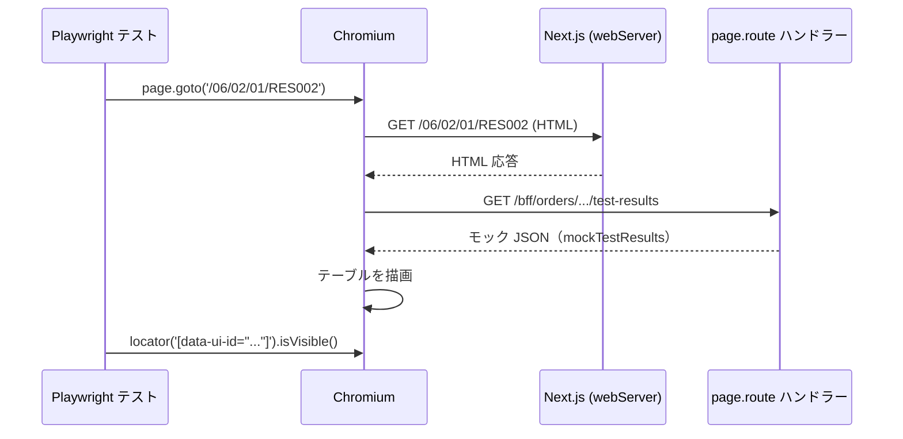

# E2E テスト基盤設計

フロントエンド基盤が提供する Playwright ベースの E2E テスト実行基盤の I/F 契約を定義する。

| 関連文書 | 内容 |
|---|---|
| [自動テスト実装規約.md](自動テスト実装規約.md) | E2E テストのシナリオ選定・セレクタ規約・実装ガイドライン |
| [単体・コンポーネント・結合テスト基盤設計.md](単体・コンポーネント・結合テスト基盤設計.md) | Vitest ベースの下位レベルテスト基盤 |
| [ビジュアルリグレッションテスト基盤設計.md](ビジュアルリグレッションテスト基盤設計.md) | Storybook + Playwright のビジュアル検証基盤（同じ Playwright を共有） |
| [adr/playwright-as-e2e.md](adr/playwright-as-e2e.md) | Playwright 採用の判断 |

---

## 1. 提供する基盤要素

| No | ファイル | 配置 | 役割 |
|---|---|---|---|
| 67 | `playwright.config.ts` | `frontend/` | E2E テスト設定（Chromium・baseURL・retries・trace 等） |

> 本基盤は 16章マスター（[16.アプリ基盤実装コード一覧.md](../16.アプリ基盤実装コード一覧.md)）の No.67 に対応する。アプリ実装チームは設定ファイル本体を直接修正してはならない（[自動テスト実装規約.md](自動テスト実装規約.md) §2.1）。

---

## 2. `playwright.config.ts` の I/F 仕様

### 2.1 配置

| 項目 | 値 |
|---|---|
| パス | `frontend/playwright.config.ts` |
| インポート対象 | `@playwright/test` の `defineConfig` / `devices` |

### 2.2 設定値の契約

アプリ実装チームの E2E テストコードが依存する設定値を以下に固定する。

| 設定キー | 値 | アプリ側への影響 |
|---|---|---|
| `testDir` | `'./e2e'` | E2E テストファイルは `frontend/e2e/` 配下に配置する |
| `use.baseURL` | `process.env.BASE_URL ?? 'http://localhost:3000'` | テスト内で `await page.goto('/RES002')` のような相対パス指定が可能 |
| `use.trace` | `'on-first-retry'` | 失敗時にトレース（スクリーンショット・操作履歴）が自動取得される |
| `use.locale` | `'ja-JP'` | ブラウザロケールが日本語に固定される |
| `projects` | Chromium 単一プロジェクト | 対象ブラウザは Desktop Chrome のみ |
| `webServer` | ローカル: `npm run dev` を自動起動 / CI: 起動済みサーバーへ接続 | ローカルでテスト実行時、開発サーバーを別ターミナルで起動する必要がない |

### 2.3 CI 環境分岐

`process.env.CI === 'true'` のときに以下の値が適用される。

| 設定キー | CI 環境での値 | 目的 |
|---|---|---|
| `forbidOnly` | `true` | `test.only(...)` の混入を CI で失敗させ、全テストを実行させる |
| `retries` | `2` | 不安定要因によるフレーキー失敗を 2 回までリトライ |
| `workers` | `1` | リソース制約下での並列実行を抑制 |

> CI 用環境変数の詳細は §6 を参照。

### 2.4 アプリ側がテストコードを書くときの利用前提

| 前提 | 説明 |
|---|---|
| 相対パス指定 | `await page.goto('/06/02/01/RES002')` のように `baseURL` 起点で書ける |
| BFF モック | `await page.route('**/bff/...', route => route.fulfill({ json: ... }))` を使用。実 BFF 起動は不要 |
| 失敗時のトレース | `trace: 'on-first-retry'` のため、初回失敗で自動的にトレースが残る |
| 認証処理 | 【今後定義予定】認証基盤連携サービス詳細設計完了後に方針を確定する。当面、認証が必要な画面の E2E は `page.route` でセッション API もモックして実装する |

### 2.5 バイパス禁止

| 禁止行為 | 理由 |
|---|---|
| `playwright.config.ts` を上書きする独自 config を `frontend/e2e/` 配下に作る | CI 実行コマンド（`npx playwright test`）が機能しなくなる |
| `baseURL` をテストコードで `await page.goto('http://localhost:3000/...')` のように絶対指定 | `BASE_URL` 環境変数差替（CI/別環境）が効かなくなる |
| `webServer` を無視して別途 `npm run dev` を立てる | ローカルで多重起動の競合が発生し得る |

---

## 3. BFF モック実装パターン

E2E では BFF を起動せず、`page.route` で HTTP リクエストをインターセプトしてモックレスポンスを返す。

### 3.1 共通モック設定の関数化

```typescript
// e2e/features/RES002.spec.ts
import { test, expect, type Page, type Route } from '@playwright/test';

const mockTestResults = [
  { id: '1', itemName: '血糖', resultValue: '150' },
  { id: '2', itemName: '白血球数', resultValue: '' },
];

async function setupRouteMocks(page: Page, override = mockTestResults) {
  await page.route('**/bff/orders/*/test-results', async (route: Route) => {
    await route.fulfill({ json: override });
  });
}

test('TC-001: 画面初期表示 — テーブルが表示される', async ({ page }) => {
  await setupRouteMocks(page);
  await page.goto('/06/02/01/RES002');
  await page.waitForLoadState('networkidle');
  await expect(page.locator('[data-ui-id="TBL_TEST_RESULTS"]')).toBeVisible();
});
```

### 3.2 シーケンス



---

## 4. 実行環境

| 種別 | 値 |
|---|---|
| 現状 | ローカル（WSL）の GitLab Runner で実行 |
| 今後 | 専用の自動テスト用サーバーへ移行予定 |

詳細は [adr/playwright-as-e2e.md](adr/playwright-as-e2e.md) を参照。

---

## 5. テスト成果物

| 生成物 | 保管先 | 備考 |
|---|---|---|
| HTML レポート（テスト実行結果一覧） | GitLab アーティファクト | `playwright-report/` |
| 失敗時スクリーンショット | GitLab アーティファクト | `trace: 'on-first-retry'` で自動 |
| 失敗時動画 | GitLab アーティファクト | 同上 |
| トレースファイル（操作履歴） | GitLab アーティファクト | 同上 |

保持期間は `.gitlab-ci.yml` の `expire_in` で制御（暫定 7 日）。

---

## 6. CI 実行コマンドと環境変数

### 6.1 実行コマンド

| 用途 | コマンド |
|---|---|
| ローカル | `npx playwright test` |
| CI | `CI=true npx playwright test` |

### 6.2 環境変数

| 環境変数 | 用途 | 例 |
|---|---|---|
| `CI` | `true` のとき §2.3 の CI 分岐が有効化される | `true` |
| `BASE_URL` | テスト対象のベース URL（`use.baseURL` で参照） | `http://localhost:3000` |

---

## 7. 関連配置（ファイル一覧）

| ファイル | 役割 |
|---|---|
| `frontend/playwright.config.ts` | Playwright 設定本体 |
| `frontend/e2e/` | E2E テストファイルのルート（`<シナリオ名>.spec.ts`） |

> 配置の詳細・ファイル命名は [自動テスト実装規約.md](自動テスト実装規約.md) §3 を参照。
