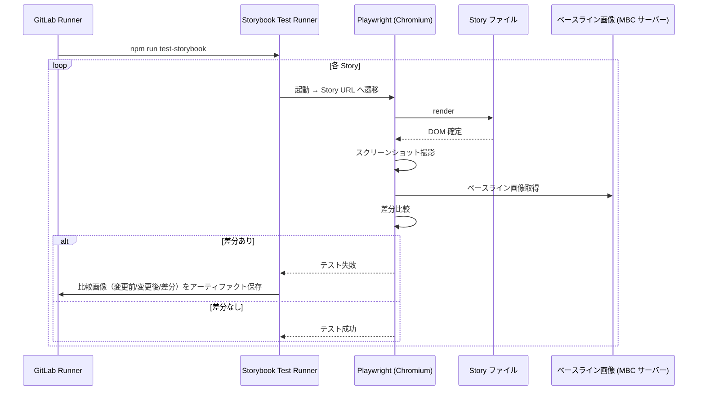

# ビジュアルリグレッションテスト基盤設計

フロントエンド基盤が提供する Storybook + Storybook Test Runner（内部 Playwright）によるビジュアルリグレッション基盤の I/F 契約を定義する。

| 関連文書 | 内容 |
|---|---|
| [自動テスト実装規約.md](自動テスト実装規約.md) | Story 命名・対象選定・実装ガイドライン |
| [E2Eテスト基盤設計.md](E2Eテスト基盤設計.md) | E2E と Playwright を共通化する設計判断の参照先 |
| [adr/storybook-test-runner-for-visual.md](adr/storybook-test-runner-for-visual.md) | Storybook + Test Runner 採用の判断 |

---

## 1. 提供する基盤要素

| No | ファイル | 配置 | 役割 |
|---|---|---|---|
| 68 | `.storybook/main.ts`     | `frontend/.storybook/` | Storybook 基本設定（stories パターン・addons・framework・パスエイリアス） |
| 69 | `.storybook/preview.ts`  | `frontend/.storybook/` | Storybook グローバル設定（mswLoader・a11y parameter・グローバル CSS） |

> 本基盤は 16章マスター（[16.アプリ基盤実装コード一覧.md](../16.アプリ基盤実装コード一覧.md)）の No.68 / No.69 に対応する。アプリ実装チームは設定ファイル本体を直接修正してはならない（[自動テスト実装規約.md](自動テスト実装規約.md) §2.1）。

---

## 2. `.storybook/main.ts` の I/F 仕様

### 2.1 配置

| 項目 | 値 |
|---|---|
| パス | `frontend/.storybook/main.ts` |
| インポート対象 | `@storybook/react-vite` の `StorybookConfig` 型 |

### 2.2 設定値の契約

| 設定キー | 値 | アプリ側への影響 |
|---|---|---|
| `stories` | `['../src/**/*.stories.@(ts\|tsx)']` | Story ファイルは `src/features/<LV1>/<LV2>/<LV3>/stories/<Component>.stories.tsx` に配置すれば自動認識される |
| `addons` | `@storybook/addon-essentials`, `@storybook/addon-a11y` | Controls / Docs / a11y チェックが Story パネルから利用できる |
| `framework` | `'@storybook/react-vite'` | Vite ベースで動作。`vitest.config.ts` と alias / preserveSymlinks の整合を取る |
| `viteFinal` | `resolve.alias` に `@` を割り当て | Story 内で `import { ... } from '@/features/...'` が使える |

### 2.3 アプリ側が Story を書くときの利用前提

| 前提 | 説明 |
|---|---|
| ファイル拡張子 | `.stories.tsx` で配置（`*.stories.ts` も可。HTML を返す Story は tsx 推奨） |
| パスエイリアス | `@/` が本番コードと同一に解決される |
| a11y チェック | `@storybook/addon-a11y` により Story パネルでアクセシビリティ違反が即時表示される |

> **TODO（確認中・担当: 渡部）**: a11y チェックの開発プロセスへの組み込みについて以下3点を確認中。解消後に本設計書を更新すること。
> 1. 現在の違反量（スコープ）の確認
> 2. CI プロセスへの組み込み状況（済み / 予定 / 対象外）
> 3. a11y 違反結果を画面設計チームへフィードバックするプロセスの有無・方針

### 2.4 バイパス禁止

| 禁止行為 | 理由 |
|---|---|
| `.storybook/main.ts` を上書きする別の Storybook 設定を `frontend/` に複数作る | CI 実行コマンド（`npm run test-storybook`）が機能しなくなる |
| `stories` パターン外の場所（例: `tests/visual/`）に Story ファイルを置く | 自動検出されず、ビジュアルリグレッションの対象外になる |
| `framework` を別の Storybook 互換ランタイムに変更 | Test Runner（内部 Playwright）との整合が崩れる |

---

## 3. `.storybook/preview.ts` の I/F 仕様

### 3.1 配置

| 項目 | 値 |
|---|---|
| パス | `frontend/.storybook/preview.ts` |
| インポート対象 | `@storybook/react` の `Preview` 型、`msw-storybook-addon` の `mswLoader` |

### 3.2 設定値の契約

| 設定キー | 値 | アプリ側への影響 |
|---|---|---|
| `loaders` | `[mswLoader]` | Story の `parameters.msw.handlers` に書いた MSW ハンドラーが自動適用される |
| `parameters.a11y` | a11y addon 用設定（rules 等） | Story 表示時にアクセシビリティ違反が自動検出される |
| グローバル CSS インポート | テーマ変数・リセット CSS | Story でも本番と同じ見た目が再現される |

### 3.3 アプリ側が Story で MSW を使うパターン

```typescript
// src/features/<LV1>/<LV2>/<LV3>/stories/UserListPanel.stories.tsx
import { http, HttpResponse } from 'msw';
import type { Meta, StoryObj } from '@storybook/react';
import { UserListPanel } from '../components/organisms/UserListPanel';

const meta: Meta<typeof UserListPanel> = {
  title: 'Features/Patient/Search/UserListPanel',
  component: UserListPanel,
};
export default meta;
type Story = StoryObj<typeof UserListPanel>;

export const Success: Story = {
  parameters: {
    msw: {
      handlers: [
        http.get('/api/users', () =>
          HttpResponse.json([
            { id: '1', name: '山田太郎', birthDate: '1980-01-01' },
          ]),
        ),
      ],
    },
  },
};
```

### 3.4 バイパス禁止

| 禁止行為 | 理由 |
|---|---|
| `preview.ts` の `loaders` から `mswLoader` を外す | `parameters.msw` 経由のモックが効かなくなる |
| Story 内で個別に `setupServer(...)` を呼ぶ | 二重起動で予期せぬ挙動になる。Story では `parameters.msw.handlers` のみ使用 |

---

## 4. 実行フロー



---

## 5. ベースライン画像

### 5.1 保管場所

| 種別 | 保管先 | 備考 |
|---|---|---|
| 現状 | MBC サーバー | 暫定運用 |
| 検討中 | AWS S3 等のマネージドサービス | 専用サーバー移行時に再評価 |

### 5.2 命名規則

```
features/<LV1機能群>/<LV2業務フロー>/<LV3画面機能>/<Atomic Design階層>/<コンポーネント名>/<ストーリー名>.png
```

例:
```
snapshots/features/patient/search/main/molecules/UserSearchForm/Default.png
snapshots/features/patient/search/main/organisms/UserListPanel/Success.png
```

| 規則 | 値 |
|---|---|
| 機能ディレクトリ構造 | `features/<LV1>/<LV2>/<LV3>/` |
| Atomic Design 階層 | `molecules/`、`organisms/` 等 |
| コンポーネント別フォルダ | `<コンポーネント名>/` |
| ファイル名 | `<ストーリー名>.png`（Story の `export const X` の `X` をそのまま使用） |

### 5.3 承認・更新フロー

```
差分検出 → GitLab アーティファクトで差分確認 → 承認操作 →
CI 環境で `npm run test-storybook -- --update-snapshots` 自動実行 →
新ベースライン画像を MBC サーバーへ自動アップロード → 再テストで差分ゼロを確認
```

> 承認操作の具体的方法は今後定義する。

---

## 6. 実行環境

| 種別 | 値 |
|---|---|
| 現状 | ローカル（WSL）の GitLab Runner で実行 |
| 今後 | 専用の自動テスト用サーバーへ移行予定 |

E2E（[E2Eテスト基盤設計.md](E2Eテスト基盤設計.md)）と同じ Playwright ランタイムを内部で共有する（[adr/storybook-test-runner-for-visual.md](adr/storybook-test-runner-for-visual.md)）。

---

## 7. テスト成果物

| 生成物 | 保管先 | 備考 |
|---|---|---|
| ベースライン画像（正解画像） | MBC サーバー | 永続保管 |
| 差分検出時の比較画像（変更前 / 変更後 / 差分） | GitLab アーティファクト | PR ごとに生成 |
| HTML レポート（差分一覧） | GitLab アーティファクト | 同上 |

保持期間は `.gitlab-ci.yml` の `expire_in` で制御（暫定 7 日）。ベースラインは MBC サーバー側で永続保管。

---

## 8. CI 実行コマンドと環境変数

| 用途 | コマンド |
|---|---|
| ローカル | `npm run test-storybook` |
| CI | `CI=true npm run test-storybook` |

| 環境変数 | 用途 |
|---|---|
| `CI` | `true` のとき Storybook Test Runner が CI 向け挙動（`--update-snapshots` 不可等）に切り替わる |

---

## 9. 関連配置（ファイル一覧）

| ファイル | 役割 |
|---|---|
| `frontend/.storybook/main.ts` | Storybook 基本設定 |
| `frontend/.storybook/preview.ts` | Storybook グローバル設定 |
| `frontend/src/features/<LV1>/<LV2>/<LV3>/stories/` | Story ファイル配置先 |

> 配置の詳細・ファイル命名は [自動テスト実装規約.md](自動テスト実装規約.md) §3 を参照。
