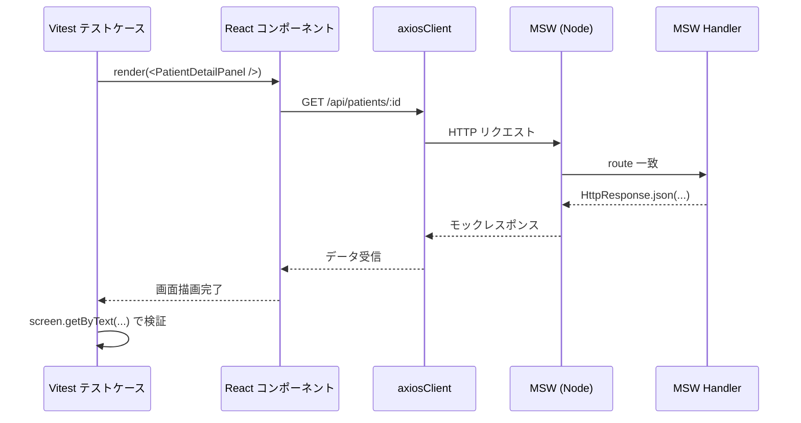

# 単体・コンポーネント・結合テスト基盤設計

フロントエンド基盤が提供する Vitest ベースのテスト実行基盤の I/F 契約を定義する。Unit / Component / Integration の 3 レベルは同一ランナー（Vitest）で実行する。

| 関連文書 | 内容 |
|---|---|
| [自動テスト実装規約.md](自動テスト実装規約.md) | アプリ実装チームが守るテスト規約 |
| [E2Eテスト基盤設計.md](E2Eテスト基盤設計.md) | Playwright を使った E2E テスト基盤 |
| [ビジュアルリグレッションテスト基盤設計.md](ビジュアルリグレッションテスト基盤設計.md) | Storybook + Test Runner を使ったビジュアルリグレッション基盤 |
| [adr/vitest-as-test-runner.md](adr/vitest-as-test-runner.md) | Vitest 採用の判断 |

---

## 1. 提供する基盤要素

| No | ファイル | 配置 | 役割 |
|---|---|---|---|
| 9  | `vitest.config.ts` | `frontend/` | Vitest 設定（jsdom 環境・setupFiles・パス解決・シンボリックリンク解決） |
| 10 | `setup.ts`         | `frontend/src/shared/plugins/` | Vitest セットアップ（jest-dom matcher 拡張・afterEach DOM クリーンアップ） |

> 本基盤は 16章マスター（[16.アプリ基盤実装コード一覧.md](../16.アプリ基盤実装コード一覧.md)）の No.9 / No.10 に対応する。アプリ実装チームは設定ファイル本体を直接修正してはならない（[自動テスト実装規約.md](自動テスト実装規約.md) §2.1）。

---

## 2. ライブラリ構成

| 分類 | パッケージ | 役割 |
|---|---|---|
| テストランナー | `vitest` | テストの実行・合否判定。Watch モードを提供 |
| UI テスト | `@testing-library/react` | コンポーネントの仮想描画、ユーザー視点の要素取得 |
| 操作再現 | `@testing-library/user-event` | クリック・キーボード入力の忠実な再現 |
| 検証拡張 | `@testing-library/jest-dom` | `toBeInTheDocument` 等の DOM マッチャー |
| ブラウザ環境 | `jsdom` | Node.js 上での仮想 DOM |
| React 変換 | `@vitejs/plugin-react` | JSX/TSX 解釈プラグイン |
| API モック | `msw` | フロント〜BFF 通信のモック（結合テスト・Story 共通） |

---

## 3. `vitest.config.ts` の I/F 仕様

### 3.1 配置

| 項目 | 値 |
|---|---|
| パス | `frontend/vitest.config.ts` |
| インポート対象 | `@vitejs/plugin-react`、`vitest/config` の `defineConfig` |

### 3.2 設定値の契約

アプリ実装チームのテストコードが依存する設定値を以下に固定する。基盤チームは以下の値を破壊的変更してはならない。

| 設定キー | 値 | アプリ側への影響 |
|---|---|---|
| `test.environment` | `'jsdom'` | コンポーネントテスト・結合テストで `document` / `window` が参照可能 |
| `test.setupFiles` | `['./src/shared/plugins/setup.ts']` | `@testing-library/jest-dom` のマッチャーがグローバル拡張済み |
| `test.include` | `['src/**/test/**/*.{ts,tsx}', 'test/integration/**/*.{ts,tsx}']` | `*_test.ts(x)` / `*_integration_test.tsx` がテスト対象として認識される |
| `test.exclude` | `node_modules`、`*.stories.tsx`、`*.d.ts` | カバレッジ対象外と一致（[自動テスト実装規約.md](自動テスト実装規約.md) §1.4） |
| `resolve.alias` | `@` → `frontend/src` | テストコードで `import { ... } from '@/features/...'` が使える |
| `resolve.preserveSymlinks` | `true` | `front_bff_shared/` のシンボリックリンクが解決され、Zod スキーマ・型を本番と共有できる |
| `plugins` | `[react()]` | JSX/TSX が解釈される |

> 根拠: [adr/vitest-as-test-runner.md](adr/vitest-as-test-runner.md)

### 3.3 アプリ側がテストコードを書くときの利用前提

| 前提 | 説明 |
|---|---|
| パスエイリアス `@/` | `tsconfig.json` の paths と同一に解決される。テストコードでも本番コードと同じ import 文が書ける |
| `front_bff_shared/` 参照 | シンボリックリンク経由でも型・スキーマが解決される（モノレポ構成のためテスト時も `preserveSymlinks: true` が必要） |
| `@testing-library/jest-dom` | `setup.ts` でグローバルロード済み。テストコード側で個別 import 不要 |
| DOM クリーンアップ | 各テストケース後に自動クリーンアップ。テストコード側で `cleanup()` を呼ぶ必要なし |

### 3.4 バイパス禁止

| 禁止行為 | 理由 |
|---|---|
| `vitest.config.ts` をテストごとに上書きする独自 config を `frontend/` 配下に作る | 設定が分裂し、CI 実行コマンド（`npm run test`）が機能しなくなる |
| `preserveSymlinks: false` を期待する import を書く | `front_bff_shared/` の解決が壊れる |
| `*.spec.ts(x)` をテストファイル名に使う | `test.include` の対象外（ファイル命名規則は [自動テスト実装規約.md](自動テスト実装規約.md) §3.2 を参照） |

---

## 4. `setup.ts` の I/F 仕様

### 4.1 配置

| 項目 | 値 |
|---|---|
| パス | `frontend/src/shared/plugins/setup.ts` |
| 呼び出され方 | `vitest.config.ts` の `test.setupFiles` から各テストファイル実行前に読まれる |

### 4.2 提供する効果

```typescript
/**
 * Vitest のテストセットアップ。本ファイルは vitest.config.ts の `test.setupFiles` から
 * 各テストファイル実行前にロードされる。アプリ実装側で個別 import する必要はない。
 *
 * @remarks
 * - `@testing-library/jest-dom` のマッチャー（`toBeInTheDocument`, `toBeDisabled` 等）を
 *   グローバルに拡張する。
 * - `afterEach` で React Testing Library の `cleanup()` を実行し、テスト間で DOM が
 *   引き継がれないようにする。
 */
```

| 効果 | 利用前提 |
|---|---|
| `@testing-library/jest-dom` の matcher 拡張 | テストコードで `expect(button).toBeDisabled()` 等が直接使える |
| `afterEach(() => cleanup())` | テストごとに DOM がリセットされる。前テストのレンダリング結果が残らない |

### 4.3 バイパス禁止

| 禁止行為 | 理由 |
|---|---|
| テストコード側で `cleanup()` を手動呼び出し | 重複クリーンアップで参照エラーが発生し得る |
| アプリ側のテストファイルで `import '@testing-library/jest-dom'` を再度書く | グローバル拡張済みのため不要。冗長 |

---

## 5. 結合テストの MSW セットアップ

結合テストでは BFF 通信を MSW でモックする。MSW のサーバー初期化は **テストファイル単位** で行うのが基本（共有サーバーは設けない）。

### 5.1 ハンドラー配置

| 種別 | 配置 | 命名 |
|---|---|---|
| 機能横断のハンドラー | `frontend/src/shared/test/mocks/handlers/<domain>.ts` | `<domain>Handlers` （例: `patientHandlers`） |
| 機能内のハンドラー | `frontend/src/features/<LV1>/<LV2>/<LV3>/integration/mocks/` | 機能内で閉じる |

### 5.2 セットアップパターン

```typescript
// test/integration/features/.../PatientDetail_integration_test.tsx
import { http, HttpResponse } from 'msw';
import { setupServer } from 'msw/node';
import type { PatientDetailResponse } from '@front_bff_shared/features/patient/types/responses/patientDetail.response';
import { patientHandlers } from '@/shared/test/mocks/handlers/patient';

const server = setupServer(...patientHandlers);
beforeAll(() => server.listen());
afterEach(() => server.resetHandlers());
afterAll(() => server.close());
```

### 5.3 ハンドラーが返すモックデータの型契約

ハンドラーが返すモックデータは **`front_bff_shared/.../<domain>.response.ts` の Response 型に必ず準拠** させる。これにより以下が保証される。

| 保証されるもの | 内容 |
|---|---|
| 型契約の検証 | フロントエンドのコンポーネントが Request 型で送信し、Response 型で受信する経路がテスト時にも崩れない |
| BFF 仕様変更の検出 | `front_bff_shared` の型が変更されると、モックデータの型エラーで結合テスト側が即座に検出する |
| 異常系（404 / 500）の扱い | エラーレスポンス型が定義されている場合は同じく型に準拠。型が無いエラーボディは検証対象外 |

```typescript
// src/shared/test/mocks/handlers/patient.ts
import { http, HttpResponse } from 'msw';
import type { PatientDetailResponse } from '@front_bff_shared/features/patient/types/responses/patientDetail.response';

export const patientHandlers = [
  http.get('/api/patients/:id', ({ params }) => {
    const mockResponse: PatientDetailResponse = {
      id: params.id as string,
      name: '山田 太郎',
      birthDate: '1960-04-01',
      wardName: '西病棟3F',
      roomNumber: '301',
    };
    return HttpResponse.json(mockResponse);
  }),
  http.get('/api/patients/not-found', () =>
    HttpResponse.json({ message: '患者が見つかりません' }, { status: 404 }),
  ),
];
```

### 5.4 シーケンス（結合テスト時のデータフロー）



---

## 6. テスト成果物

| テスト種別 | 生成物 | 保管先 | 備考 |
|---|---|---|---|
| Unit / Component / Integration | テスト実行結果（コンソール / HTML レポート） | GitLab アーティファクト | 単一ランナー（Vitest）で生成 |
| Unit / Component / Integration | カバレッジレポート（`coverage/`） | GitLab アーティファクト | 3 レベル合算 |

保持期間は `.gitlab-ci.yml` の `expire_in` で制御（暫定 7 日）。

---

## 7. 関連配置（ファイル一覧）

| ファイル | 役割 |
|---|---|
| `frontend/vitest.config.ts` | Vitest 設定本体 |
| `frontend/src/shared/plugins/setup.ts` | Vitest セットアップ |
| `frontend/src/shared/test/mocks/handlers/` | 機能横断 MSW ハンドラー |
| `frontend/src/features/<LV1>/<LV2>/<LV3>/test/` | 単体・コンポーネントテスト |
| `frontend/src/features/<LV1>/<LV2>/<LV3>/integration/` | 結合テスト |

> 配置の詳細・ファイル命名は [自動テスト実装規約.md](自動テスト実装規約.md) §3 を参照。
