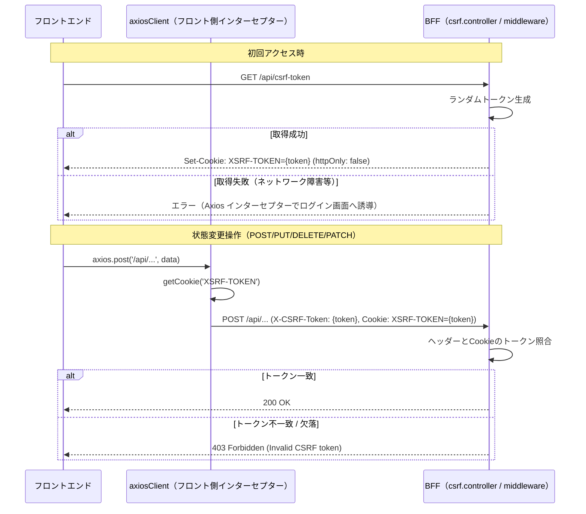

# CSRF対策設計

認証済みユーザーのブラウザを悪用した不正リクエストを防ぐための、フロントエンド・BFF 横断の CSRF（クロスサイトリクエストフォージェリ）対策を定義する。

| 関連文書 | 内容 |
|---|---|
| [セキュリティ基盤規約.md](セキュリティ基盤規約.md) | アプリチームが守る規約 |
| [セキュリティミドルウェア設計.md](セキュリティミドルウェア設計.md) | helmet・CORS・SameSite Cookie（保険的対策） |
| [adr/csrf-double-submit.md](adr/csrf-double-submit.md) | Double Submit Cookie パターン採用判断 |
| [01_フロントエンド・BFF共通基盤設計/Axios通信基盤設計.md](../01_フロントエンド・BFF共通基盤設計/Axios通信基盤設計.md) | フロント Axios インターセプター |

---

## 1. 概要

### 1.1 認証認可との違い

| 対策 | 防ぐもの | 確認内容 |
|------|---------|---------|
| **認証認可** | なりすまし | 「誰が」「何をしていいか」 |
| **CSRF対策** | 意図しない操作 | 「本人が意図して」操作したか |

### 1.2 採用方式

| No | 対策内容 | 実装方法 | 役割 |
| --- | --- | --- | --- |
| 1 | **CSRFトークン検証**（Double Submit Cookie パターン） | カスタムミドルウェア + Axios インターセプター | 主防御 |
| 2 | **セキュリティヘッダー** | `helmet` ミドルウェア | 補助 |
| 3 | **オリジン制限** | CORS 設定 | 補助 |
| 4 | **SameSite Cookie 属性** | Cookie 設定 | 補助 |

> 根拠: [adr/csrf-double-submit.md](adr/csrf-double-submit.md)

### 1.3 導入時期

初期開発フェーズから導入する。基盤チームがミドルウェアと Axios インターセプターを実装し、アプリ実装者は意識不要。

> 根拠: [adr/csrf-double-submit.md](adr/csrf-double-submit.md)

---

## 2. 公開 I/F とフロー

### 2.1 配置と公開対象

| ファイル | 配置 | 役割 | 公開対象 |
|---|---|---|---|
| `csrf.controller.ts` | `bff/src/shared/controllers/` | CSRFトークン発行エンドポイント `/api/csrf-token` | ❌ 基盤配線（フロントは `axiosClient` 経由で利用） |
| `csrf.middleware.ts` | `bff/src/shared/plugins/` | CSRFトークン検証ミドルウェア | ❌ 基盤配線 |
| `axios.ts`（BFF 側） | `bff/src/shared/utils/` | Axios インターセプター（CSRFトークン自動付与） | ❌ 基盤配線 |
| `axiosClient.ts`（フロント側） | `frontend/src/shared/plugins/` | フロント Axios インターセプター（CSRFトークン Cookie 取得・ヘッダー付与） | ✅ アプリは `axiosClient` を使うだけで自動付与される |

### 2.2 トークン発行・送信・検証シーケンス



### 2.3 CSRFトークン発行エンドポイント I/F

```typescript
/**
 * CSRFトークンを発行し、フロントエンドが読み取れるCookie（XSRF-TOKEN）に格納する。
 *
 * @returns 204 No Content。トークンは Cookie でのみ返却し、レスポンスボディには含めない。
 *
 * @remarks
 * - フロントエンドは初回アクセス時に本エンドポイントを GET し、Cookie からトークンを取得する。
 * - 以降の状態変更操作（POST/PUT/DELETE/PATCH）では、`axiosClient` インターセプターが
 *   Cookie からトークンを取り出して `X-CSRF-Token` ヘッダーに自動付与する。
 * - Cookie の `httpOnly` は `false`（JavaScript からの読み取りが必要）。
 * - 認証セッションの HttpOnly Cookie とは別物のため、本トークンが漏洩しても
 *   セッション自体は保護される。
 *
 * @throws InternalServerErrorException Cookie 設定に失敗した場合
 */
@Get('/csrf-token')
getCsrfToken(@Res() res: Response): void;
```

### 2.4 検証ミドルウェア仕様

```typescript
/**
 * 状態変更リクエスト（POST/PUT/DELETE/PATCH）に対してCSRFトークンを検証する NestJS ミドルウェア。
 *
 * @remarks
 * - 検証対象: POST / PUT / DELETE / PATCH
 * - 検証方法: `Cookie: XSRF-TOKEN` と `X-CSRF-Token` ヘッダーが一致するかを照合（Double Submit Cookie）
 * - 不一致・欠落時: `ForbiddenException('Invalid CSRF token')` をスロー（HTTP 403）
 * - GET / HEAD / OPTIONS は検証対象外（副作用がないため）
 *
 * @throws ForbiddenException CSRFトークンが不一致または欠落している場合
 */
export function csrfMiddleware(req: Request, res: Response, next: NextFunction): void;
```

### 2.5 フロント Axios インターセプター仕様

```typescript
/**
 * フロントエンド axiosClient のリクエストインターセプター。
 * 状態変更操作の場合、Cookie の XSRF-TOKEN を X-CSRF-Token ヘッダーに自動付与する。
 *
 * @remarks
 * - 対象メソッド: POST / PUT / DELETE / PATCH
 * - Cookie 読み取りは `frontend/src/shared/utils/csrf.ts` の `getCsrfToken()` を使用
 * - アプリ実装者は `axiosClient` を経由するだけで自動付与される（直接呼び出し不要）
 */
axios.interceptors.request.use((config) => {
  const token = getCsrfToken();
  if (token && ['POST', 'PUT', 'DELETE', 'PATCH'].includes(config.method?.toUpperCase() ?? '')) {
    config.headers['X-CSRF-Token'] = token;
  }
  return config;
});
```

> 詳細は [01_フロントエンド・BFF共通基盤設計/Axios通信基盤設計.md](../01_フロントエンド・BFF共通基盤設計/Axios通信基盤設計.md) を参照。

---

## 3. アプリ実装の利用方法

| 操作 | アプリ実装が書くコード | 自動的に行われること |
|---|---|---|
| 患者情報の登録（POST） | `axiosClient.post('/api/patients', data)` | XSRF-TOKEN Cookie 取得 → `X-CSRF-Token` ヘッダー付与 |
| 診療記録の更新（PUT） | `axiosClient.put('/api/records/:id', data)` | 同上 |
| 削除（DELETE） | `axiosClient.delete('/api/records/:id')` | 同上 |

> アプリ実装者は CSRF トークンを意識する必要はない。`axiosClient` を経由するだけで全自動。

---

## 4. ファイルパス・配置対応表

| ファイル | 配置 | 役割 |
|---|---|---|
| `csrf.controller.ts` | `bff/src/shared/controllers/` | CSRFトークン発行 `/api/csrf-token` |
| `csrf.middleware.ts` | `bff/src/shared/plugins/` | 検証ミドルウェア（POST/PUT/DELETE/PATCH 対象） |
| `axios.ts` | `bff/src/shared/utils/` | BFF→外部API への CSRFトークン自動付与（必要時） |
| `axiosClient.ts` | `frontend/src/shared/plugins/` | フロント Axios インターセプター |
| `csrf.ts` | `frontend/src/shared/utils/` | フロント側 Cookie 読み取りユーティリティ |

---

## 5. 残件

| No | 残件 | トリガー |
|---|---|---|
| 1 | 16章マスター No.27 `sanitize.ts` の説明文修正（「CSRFトークンのCookie読み取り」→「HTMLサニタイズユーティリティ（DOMPurify）」） | 本章 PR マージ時に同 PR で 16章を併せて更新 |
| 2 | 16章マスターに `frontend/src/shared/utils/csrf.ts` を新規登録 | 本章 PR マージ時に同 PR で 16章を併せて更新 |
| 3 | トークンローテーション周期の確定（リクエストごと vs セッションごと） | 基盤チームが Keycloak セッション仕様確定後に決定 |

---

## 参照

- フロントエンド方式設計書「4.セキュリティ・アクセス統制」
- [セキュリティ基盤規約.md](セキュリティ基盤規約.md) §4
- [セキュリティミドルウェア設計.md](セキュリティミドルウェア設計.md) §3 helmet/CORS/SameSite
- [adr/csrf-double-submit.md](adr/csrf-double-submit.md)
- [01_フロントエンド・BFF共通基盤設計/Axios通信基盤設計.md](../01_フロントエンド・BFF共通基盤設計/Axios通信基盤設計.md)
- IPA「安全なウェブサイトの作り方」CSRF対策の根本的解決策
