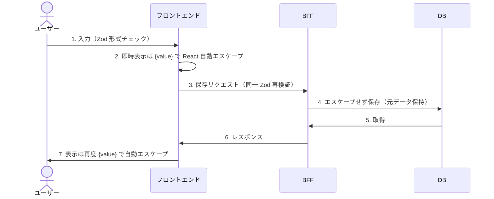
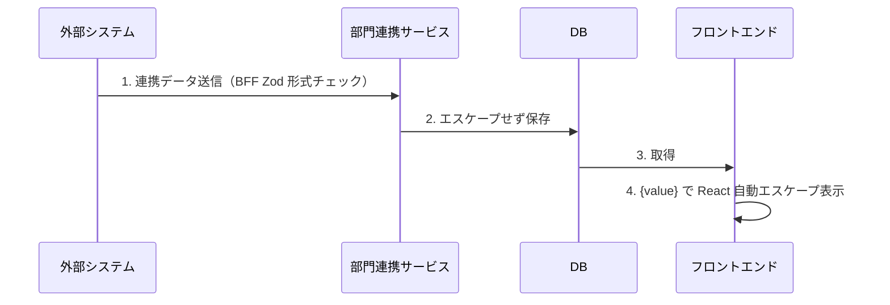

# XSS対策設計

XSS（クロスサイトスクリプティング）から PHI（患者健康情報）と認証セッションを保護するための、フロントエンド・BFF 横断の多層防御を定義する。

| 関連文書 | 内容 |
|---|---|
| [セキュリティ基盤規約.md](セキュリティ基盤規約.md) | アプリチームが守る規約 |
| [セキュリティミドルウェア設計.md](セキュリティミドルウェア設計.md) | HttpOnly Cookie / CSP（XSS 経由のトークン窃取と外部スクリプト遮断） |
| [adr/xss-defense-in-depth.md](adr/xss-defense-in-depth.md) | React 自動エスケープを主防御層とする判断 |

---

## 1. 多層防御モデル

### 1.1 防御層

| 防御層 | 目的 | 実装 | 主防御/補助 |
|-------|------|------|-------|
| **入力検証** | 明らかに異常な値を早期に排除 | Zod スキーマ・BFF バリデーション | 補助（完全な防御は不可能） |
| **React 自動エスケープ** | 表示時に自動でスクリプトを無害化 | `{value}` 形式（標準） | **主防御層** |
| **DOMPurify** | HTML 表示が必要な場合に限定的に使用 | `sanitizeHTML()` | HTML 表示時の必須防御 |
| **HttpOnly Cookie** | XSS 被害時のトークン窃取を防止 | `bff/src/shared/plugins/security.middleware.ts` | トークン保護の最終防衛線 |
| **CSP** | ブラウザレベルで外部スクリプト実行を遮断 | helmet 設定 | 最終防御層 |

> 根拠: [adr/xss-defense-in-depth.md](adr/xss-defense-in-depth.md)

### 1.2 シナリオ別データフロー

#### シナリオ1: ユーザー入力からの攻撃



| 段階 | 対策 | 実装方法 | 備考 |
|-----|------|---------|------|
| 1. 入力時 | バリデーション | React Hook Form + Zod | `<` 等を業務上入力する必要があるためスクリプトパターンの完全検出は不可能。文字数/文字種制限のみ実施 |
| 2. 画面即時表示 | React 自動エスケープ | `{value}` 形式 | `dangerouslySetInnerHTML` は使用禁止 |
| 3. DB 保存 | エスケープせずそのまま保存 | - | サニタイズは表示時に行う。> 根拠: [adr/xss-defense-in-depth.md](adr/xss-defense-in-depth.md) |
| 4. DB 取得後の表示 | React 自動エスケープ | `{value}` 形式 | 通常表示では自動エスケープで安全 |

#### シナリオ2: 外部システム連携からの攻撃



| 段階 | 対策 | 実装方法 | 備考 |
|-----|------|---------|------|
| 1. 外部受信時 | スキーマ検証 | BFF 側 Zod | 部門システムの出力仕様に依存するため最低限の制限のみ |
| 2. DB 保存 | エスケープせずそのまま保存 | - | シナリオ1と同様 |
| 3. 画面表示 | React 自動エスケープ | `{value}` 形式 | 外部連携データは信頼できない入力として扱う |

---

## 2. 公開 I/F: DOMPurify サニタイズ関数

### 2.1 配置と公開対象

| 項目 | 内容 |
|---|---|
| ファイル | `frontend/src/shared/utils/sanitize.ts` |
| インポートパス | `@/shared/utils/sanitize` |
| 公開対象 | アプリ実装者（将来 `dangerouslySetInnerHTML` 利用時） |

### 2.2 型シグネチャ

```typescript
/**
 * 信頼できないHTML文字列をサニタイズして安全なHTMLに変換する。
 *
 * @param dirty - サニタイズ対象のHTML文字列（ユーザー入力・外部連携データ等）
 * @returns ALLOWED_TAGS / ALLOWED_ATTR で許可された要素のみを残したHTML文字列
 *
 * @throws TypeError - `dirty` が string 以外の型で渡された場合（型システムを通過しないランタイム入力に対する保証）
 *
 * @remarks
 * - DOMPurify を使用してXSSペイロードを除去する。
 * - 許可するタグ・属性は基盤側で `ALLOWED_TAGS` / `ALLOWED_ATTR` により最小限に絞り込む。
 * - `dangerouslySetInnerHTML` を使用する場合は本関数の戻り値のみを渡すこと。
 * - 利用には事前に基盤チームへ利用申請を行うこと（[セキュリティ基盤規約.md](セキュリティ基盤規約.md) §2.2）。
 * - DOMPurify は DOM 環境（`window`）に依存するため、利用箇所はクライアントサイド（ブラウザ）のみを想定する。
 *   サーバーサイドで利用する場合は jsdom 等の DOM 環境を初期化すること。
 */
export function sanitizeHTML(dirty: string): string;
```

### 2.3 呼び出し例

```tsx
import { sanitizeHTML } from '@/shared/utils/sanitize';

export function PatientNote({ note }: { note: string }) {
  const safeHTML = sanitizeHTML(note);
  return <div dangerouslySetInnerHTML={{ __html: safeHTML }} />;
}
```

### 2.4 内部実装方針

| 項目 | 内容 |
|---|---|
| 実装ライブラリ | `dompurify`（公式 v3 系、メジャー固定） |
| `ALLOWED_TAGS` | `b`, `i`, `em`, `strong`, `ul`, `ol`, `li`, `p`, `br` を初期セットとし、要件確定時に基盤チームが拡張（**内部定数。外部 export しない**） |
| `ALLOWED_ATTR` | 初期は許可属性なし（リンクは `<a href>` を許可しない方針）。要件確定時に拡張（**内部定数。外部 export しない**） |
| 戻り値 | サニタイズ済み HTML 文字列。元入力にスクリプトが含まれていた場合は除去された結果を返す |

> 許可タグ・属性はアプリ実装者から見えない内部定数として管理する。利用申請時は基盤チームが申請内容に応じて拡張要否を判断する。

---

## 3. URL 入力検証

### 3.1 公開 I/F

URL 入力フィールドのバリデーションは、各機能側の Zod スキーマに以下を組み込むことで実現する。

> **現状**: 基盤側の共通スキーマは未提供（残件 §5 No.2）。各機能で個別に Zod スキーマを定義すること。共通化の確定後に以下のシグネチャで提供する。

```typescript
import { z } from 'zod';

/**
 * 信頼できるプロトコル（http://, https://）のみを許可するURLスキーマ。
 *
 * @remarks
 * - `javascript:alert(...)` のような疑似プロトコルによる XSS 攻撃を防ぐ。
 * - 内部実装は `z.string().url().refine(...)` で `http://` / `https://` のみ許可する
 *   （`refine` を含むため戻り値型は `ZodEffects<ZodString, string, string>`）。
 * - リンク・URL 入力フィールドの Zod スキーマで本定数を使用する。
 */
export const httpUrlSchema: z.ZodEffects<z.ZodString, string, string>;
```

### 3.2 使用例

```typescript
import { z } from 'zod';

const formSchema = z.object({
  websiteUrl: z.string().url().refine(
    (url) => url.startsWith('http://') || url.startsWith('https://'),
    { message: 'http:// または https:// で始まるURLのみ許可されています' }
  ),
});
```

### 3.3 適用範囲

| 入力 | 適用 |
|---|---|
| ユーザーがリンクを入力するフィールド | 必須 |
| 外部連携データの URL フィールド | BFF 側 Zod スキーマで適用 |
| 内部生成 URL（リダイレクト先・API パス） | 適用不要（コード内固定値のため） |

---

## 4. ファイルパス・配置対応表

| ファイル | 配置 | 役割 | 公開対象 |
|---|---|---|---|
| `sanitize.ts` | `frontend/src/shared/utils/` | DOMPurify ラッパー（`sanitizeHTML`） | ✅ アプリ |
| `security.middleware.ts` | `bff/src/shared/plugins/` | HttpOnly Cookie / CSP（XSS 補助層） | ❌ 基盤配線 |

---

## 5. 残件

| No | 残件 | トリガー |
|---|---|---|
| 1 | `ALLOWED_TAGS` / `ALLOWED_ATTR` の最終確定 | 将来の `dangerouslySetInnerHTML` 利用要件（WYSIWYG / 部門連携 / HL7/FHIR）が確定した時 |
| 2 | URL 入力スキーマの共通化 | URL 入力フィールドが複数機能で必要になった時に基盤側で共通定数化 |

---

## 参照

- フロントエンド方式設計書「4.セキュリティ・アクセス統制」4.1節 No.3
- [セキュリティ基盤規約.md](セキュリティ基盤規約.md) §3
- [adr/xss-defense-in-depth.md](adr/xss-defense-in-depth.md)
