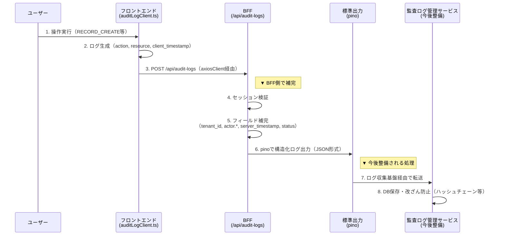
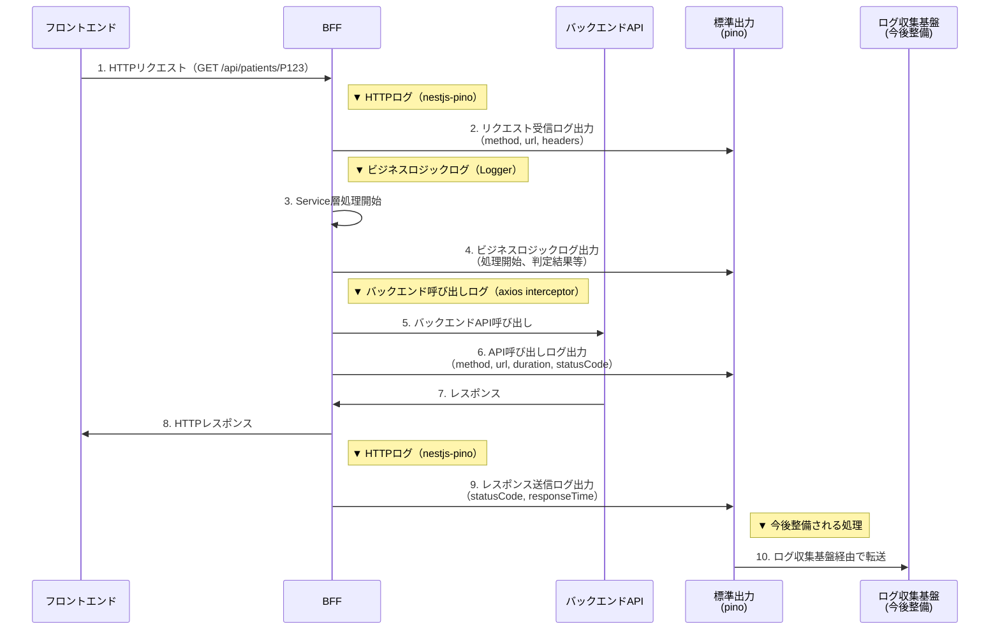

# 14 操作監査ログ・アプリケーションログ基盤

本章では、電子カルテシステムにおける2種類のログ基盤を定義する。

## 本章の概要

本章は、以下の2つのログ基盤を扱う：

### 1. フロントエンド操作ログ（監査ログ）

**目的**: ユーザー操作の証跡を記録し、コンプライアンス対応・監査要件を満たす

**対象**:
- ユーザーが実行した操作（画面遷移、データ作成・更新・削除、検索、エクスポート等）
- 「誰が・いつ・何を・どうした」という5W1Hの記録

**実装範囲**:
- フロントエンド: ログ収集・送信（`auditLogClient.ts`）
- BFF: ログ受信・フィールド補完・pino出力（`auditLog.controller/service`）

> ログの保存・改ざん防止・ハッシュチェーン・物理構成・可視化については、別途**『操作・監査ログ管理サービス方式設計書』**を参照すること。

### 2. BFFアプリケーションログ

**目的**: BFFのアプリケーション動作を監視・デバッグするための記録

**対象**:
- HTTPリクエスト/レスポンス（アクセスログ）
- バックエンドAPI呼び出しの記録
- ビジネスロジックの処理フロー

**実装範囲**:
- BFF: nestjs-pino（HTTPログ）、axios interceptor（API呼び出しログ）、Logger（ビジネスロジックログ）

**対象外**: エラーログ（09章 Sentry）、パフォーマンスメトリクス（15章）

---

## フロントエンド操作ログ（監査ログ）

### 操作監査ログの全体像

### 本章の範囲

本章は、**フロントエンドとBFFが担う実装責務**に限定する。

| 層 | 本章で扱う範囲 | 本章で扱わない範囲（参照先） |
|---|---|---|
| **フロントエンド** | ・ログ収集対象の定義<br>・送信データ構造（Request型）<br>・送信タイミング（axiosClient / fetch + keepalive）<br>・ファイル配置（`frontend/src/shared/api/auditLogClient.ts`） | （全てカバー） |
| **BFF** | ・受信エンドポイント定義<br>・フィールド補完の責務定義<br>・pino出力の実装（Controller/Service/Module層） | ・監査ログ管理サービスへの転送実装<br>→ 今後整備 |
| **バックエンド** | （扱わない） | ・ログ保存・保持期間<br>・改ざん防止<br>・検索インターフェース |

### データフロー全体図



### 使用技術とファイル配置

以下ファイルは基盤チームが作成・管理を担当する

| 層 | 主要ファイル |
|---|---|
| **フロントエンド** | `frontend/src/shared/api/auditLogClient.ts`<br>`frontend/src/shared/hooks/useRouteAuditLog.ts`<br>`front_bff_shared/features/shared/schemas/auditLog.schema.ts` |
| **BFF** | `bff/src/features/auditLog/auditLog.controller.ts`<br>`bff/src/features/auditLog/auditLog.service.ts`<br>`bff/src/features/auditLog/auditLog.module.ts`<br>`bff/src/shared/utils/auditLogger.ts` |

---

### 本章の範囲と他章との境界

| 観点 | 本章（14章） | 09章 監視・エラーハンドリング | 13章 セキュリティ基盤設計 | 15章 運用監視基盤 |
|---|---|---|---|---|
| **目的** | 業務操作の証跡・コンプライアンス対応 | エラー発生時の障害原因特定・開発者通知 | 認証・認可の検証と攻撃対策 | 性能劣化の把握・インフラ異常の予兆検知 |
| **発動条件** | ユーザーが操作したとき（常時） | エラー発生時（リアクティブ） | リクエスト処理時 | 定期的なメトリクス収集 |
| **利用者** | 監査部門・法務・システム管理者 | 開発者・運用担当者 | セキュリティ担当者 | SRE・インフラ担当 |
| **送信先** | BFF → 監査ログ管理サービス | Sentry（外部SaaS） | （BFF内で処理） | RUM監視ツール |
| **送信データ** | 操作種別・対象リソースID・タイムスタンプ | スタックトレース・Breadcrumbs | （ログデータなし） | Core Web Vitals等 |

本章はユーザー行動ログを対象とする。  
Sentry Breadcrumbs（エラー調査用の操作履歴）は **09.監視・エラーハンドリング** を、認証・認可に関するセキュリティログの基本方針は **方式設計書「4.5 セキュリティログ方針」** を参照すること。

---

### ログ収集対象の定義

業務証跡として常時記録すべきUIイベントの一覧を以下に示す。監査ログは「アクションの事実と対象ID」のみを記録し、臨床データの本体は含めない。

| カテゴリ | 収集対象のイベント例 | action 値 |
|---|---|---|
| **画面表示・遷移** | 患者一覧表示、患者詳細画面表示、画面遷移 | `PAGE_VIEW` / `PAGE_NAVIGATE` |
| **検索** | 患者検索実行、オーダー検索実行 | `SEARCH_EXECUTE` |
| **データ参照** | 患者情報の表示、文書・画像の閲覧 | `RECORD_READ` |
| **データ作成** | 処方オーダー登録、文書新規作成 | `RECORD_CREATE` |
| **データ更新** | 患者情報の更新、オーダー内容の修正 | `RECORD_UPDATE` |
| **データ削除** | 文書の削除、オーダーの取り消し | `RECORD_DELETE` |
| **エクスポート** | 帳票出力、データCSVダウンロード | `DATA_EXPORT` |

収集対象に含まない操作：
- UI上の一時的なインタラクション（モーダル開閉、アコーディオン展開等）
- 文字入力中のキーストロークイベント（送信時点のみを記録する）
- ページリロード（F5キー等による意図的でない操作）
- エラー発生時の詳細情報（→ 09章が担当）

---

### ログエントリ構造設計

フロントエンドが送信するフィールドを定義する。全フィールドは**『操作・監査ログ管理サービス方式設計書』2.3.1 標準スキーマ（5W1H）**に準拠している。

> フロントエンドが送信するのは以下の必須フィールドのみ。`tenant_id`・`actor` 等のサーバー側で取得すべき情報は BFF が補完する（詳細は本章「BFFが補完するフィールド」セクション参照）。  
> ここに定義したフィールドは初期実装として必要最小限のものを示す。要件の明確化に応じて設計フェーズで追加する。

### フロントエンドが送信するフィールド（必須）

以下のフィールドにより、**5W1H（いつ・誰が・どこで・何を・どのデータに対して・どうした）** の操作証跡が記録される。

| フィールド | 型・内容 | 5W1H対応 |
|---|---|---|
| `action` | `AuditAction`（定義済み定数） | **What（何をした）**: 操作種別（作成・更新・削除等） |
| `resource.type` | `AuditResourceType`（定義済み定数） | **What（対象種別）**: 操作対象の種別（患者・処方・文書等） |
| `resource.id` | `string`（患者ID・文書ID等） | **Which（どのデータ）**: 対象リソースの一意なID |
| `client_timestamp` | ISO 8601形式（ミリ秒精度） | **When（いつ）**: クライアント側の発生時刻 |

> **補足**: 以下の情報はBFF層で自動補完される（詳細は本章「BFFが補完するフィールド」セクション参照）
> - **Who（誰が）**: `actor.user_id`（JWTのsubクレームから取得）
> - **Where（どこから）**: `actor.ip`、`actor.user_agent`
> - **When（権威）**: `server_timestamp`（サーバー側の権威タイムスタンプ）

### フロントエンドが送信するフィールド（将来拡張）

| フィールド | 型・内容 | 備考 |
|---|---|---|
| `resource.changed_fields` | `string[]` | `RECORD_UPDATE` 時のみ：変更されたフィールド**名**の一覧（値は含めない） |
| `trace_id` | `string` | W3C Trace Context の `traceparent` ヘッダー由来 |

### BFFが補完するフィールド

BFFはフロントエンドから受信したログに対して、サーバー側で確実に取得できる情報を補完した上で監査ログ管理サービスへ転送する。クライアントの自己申告値（IPアドレス等）には依存しない。

| フィールド | 取得元 |
|---|---|
| `tenant_id` | `X-Tenant-Id` ヘッダー（axiosClient インターセプターが自動付与） |
| `actor.user_id` | JWTクレームの `sub` |
| `actor.ip` | `req.ip`（リバースプロキシ経由の場合は `X-Forwarded-For`） |
| `actor.user_agent` | `req.headers['user-agent']` |
| `server_timestamp` | サーバー側で取得（権威タイムスタンプ。`client_timestamp` は参考値として保持） |
| `status` | バリデーション結果（正当なセッション：`SUCCESS`、不正：`DENIED`） |

### スキーマ定義

**目的**: 監査ログのデータ構造をフロントエンドとBFF間で型安全に共有するため、Zodスキーマを使用する。これにより以下を実現する：
- フロントエンド送信時の型チェック（TypeScript）
- BFF受信時のバリデーション（Zod）
- 双方のデータ構造の自動同期

**配置パス**: Contract-First 設計（`03.TypeScript型管理とスキーマ共有.md` 参照）に従い、以下に配置する：

```
front_bff_shared/
└── features/
    └── shared/  # システム全体共通スキーマ（機能固有ではない）
        ├── schemas/
        │   └── auditLog.schema.ts  ← ここに配置
        └── types/
            ├── requests/
            │   └── auditLog.request.ts  ← スキーマから型を推論
            └── responses/
                └── auditLog.response.ts
```

> **参照**: ディレクトリ構造の全体像は `00.ディレクトリ構成.md` を、型管理の詳細は `03.TypeScript型管理とスキーマ共有.md` を参照すること。

**実装例**:

```typescript
// front_bff_shared/features/shared/schemas/auditLog.schema.ts
import { z } from 'zod';

export const AuditAction = {
  PAGE_VIEW: 'PAGE_VIEW',
  PAGE_NAVIGATE: 'PAGE_NAVIGATE',
  SEARCH_EXECUTE: 'SEARCH_EXECUTE',
  RECORD_READ: 'RECORD_READ',
  RECORD_CREATE: 'RECORD_CREATE',
  RECORD_UPDATE: 'RECORD_UPDATE',
  RECORD_DELETE: 'RECORD_DELETE',
  DATA_EXPORT: 'DATA_EXPORT',
} as const;

export const AuditResourceType = {
  PATIENT: 'PATIENT',
  ORDER: 'ORDER',
  PRESCRIPTION: 'PRESCRIPTION',
  DOCUMENT: 'DOCUMENT',
  PAGE: 'PAGE',
} as const;

export const auditLogRequestSchema = z.object({
  action: z.enum(Object.values(AuditAction) as [string, ...string[]]),
  resource: z.object({
    type: z.enum(Object.values(AuditResourceType) as [string, ...string[]]),
    id: z.string().min(1),
    changed_fields: z.array(z.string()).optional(), // RECORD_UPDATE 時のみ
  }),
  client_timestamp: z.string().datetime({ offset: true }),
  trace_id: z.string().optional(),
});

export type AuditLogRequest = z.infer<typeof auditLogRequestSchema>;
```

---

### ログ収集の実装方針

BFF側の監査ログ出力には、ロギングライブラリ **pino** を採用する。

**採用理由**:
- **構造化ログ（JSON形式）**: フィールドベースで検索可能なログをログ収集基盤へ転送できる
- **高性能（非同期I/O）**: ログ出力がアプリケーション処理をブロックせず、大量ログでもパフォーマンスへの影響が少ない
- **開発体験の向上**: pino-prettyにより開発環境では色付き・整形されたログを確認でき、本番環境ではJSON形式で出力する環境別設定が可能
  - pino-prettyの詳細については[BFF側の実装（pino使用）](#bff側の実装pino使用)で記載
- **工数削減**: 自作でログフォーマット処理・環境別出力切り替え・パフォーマンス最適化を実装する場合と比較して、大幅に開発工数を削減できる

#### フロントエンド側の実装

フロントエンドは、ユーザー操作時に監査ログデータをBFFへ送信する。

#### ログ送信方法の選択

**配置パス**: `frontend/src/shared/api/auditLogClient.ts`

実装者は操作の特性に応じて、以下の2つの送信方法を使い分ける：

| 条件 | 送信方法 | 実装関数 | 具体例 |
|---|---|---|---|
| 通常操作時 | `axiosClient.post` | `sendAuditLog()` | ボタンクリック、レコード作成、ページ遷移など |
| ページ離脱時 | `fetch + keepalive: true` | `sendAuditLogOnUnload()` | ブラウザタブを閉じる、外部サイトへ移動するなど、ページが完全に破棄される瞬間 |

**通常送信（axiosClient）**

```typescript
// frontend/src/shared/api/auditLogClient.ts
import { axiosClient } from '@/shared/api/axiosClient';
import type { AuditLogRequest } from '@/front_bff_shared/...';

export const sendAuditLog = (payload: AuditLogRequest): void => {
  axiosClient.post('/api/audit-logs', payload).catch((error) => {
    console.warn('[AuditLog] 送信失敗:', error);
  });
};
```

**ページ離脱時の送信（fetch + keepalive）**

```typescript
// frontend/src/shared/api/auditLogClient.ts
export const sendAuditLogOnUnload = (
  payload: AuditLogRequest,
  token: string,
  tenantId: string,
): void => {
  fetch('/api/audit-logs', {
    method: 'POST',
    keepalive: true,
    headers: {
      'Content-Type': 'application/json',
      'Authorization': `Bearer ${token}`,
      'X-Tenant-Id': tenantId,
    },
    body: JSON.stringify(payload),
  });
};
```

#### UIイベント収集

**配置パス**: `frontend/src/features/<LV1>/<LV2>/<LV3>/` の各コンポーネント内

```typescript
// 配置例: frontend/src/features/order/create/prescriptionCreate/components/organisms/OrderRegisterForm.tsx
const handleOrderRegister = (patientId: string) => {
  sendAuditLog({
    action: AuditAction.RECORD_CREATE,
    resource: { type: AuditResourceType.ORDER, id: patientId },
    client_timestamp: new Date().toISOString(),
  });
  submitOrder(patientId); // 業務処理（ログ送信の成否に影響されない）
};
```

#### 画面遷移収集

**配置パス**: `frontend/src/shared/hooks/useRouteAuditLog.ts`

```typescript
'use client';
import { useEffect } from 'react';
import { usePathname } from 'next/navigation';
import { sendAuditLog } from '@/shared/api/auditLogClient';

export const useRouteAuditLog = (): void => {
  const pathname = usePathname();
  useEffect(() => {
    sendAuditLog({
      action: AuditAction.PAGE_NAVIGATE,
      resource: { type: AuditResourceType.PAGE, id: pathname },
      client_timestamp: new Date().toISOString(),
    });
  }, [pathname]);
};
```

#### 入力値変更履歴収集

**配置パス**: `frontend/src/features/<LV1>/<LV2>/<LV3>/` のフォームコンポーネント内

```typescript
// 配置例: frontend/src/features/patient/manage/patientUpdate/components/organisms/PatientUpdateForm.tsx
const onSubmit = (data: PatientUpdateInput) => {
  const changedFields = Object.keys(data).filter(
    (key) => data[key] !== initialValues[key]
  );
  
  if (changedFields.length > 0) {
    sendAuditLog({
      action: AuditAction.RECORD_UPDATE,
      resource: {
        type: AuditResourceType.PATIENT,
        id: patientId,
        changed_fields: changedFields, // フィールド名のみ（値は含めない）
      },
      client_timestamp: new Date().toISOString(),
    });
  }
  updatePatient(data);
};
```

#### ページ離脱時の収集

**配置パス**: `frontend/src/app/layout.tsx`

ブラウザタブを閉じる、外部サイトへ移動するなど、ページが完全に破棄される瞬間には `sendAuditLogOnUnload()` を使用する。

```typescript
'use client';
import { useEffect } from 'react';
import { sendAuditLogOnUnload } from '@/shared/api/auditLogClient';
import { useAuth } from '@/shared/hooks/useAuth'; // 認証情報取得用

export default function RootLayout({ children }: { children: React.ReactNode }) {
  const { token, tenantId } = useAuth();

  useEffect(() => {
    const handleBeforeUnload = () => {
      sendAuditLogOnUnload(
        {
          action: AuditAction.SESSION_END,
          resource: { type: AuditResourceType.PAGE, id: window.location.pathname },
          client_timestamp: new Date().toISOString(),
        },
        token,
        tenantId,
      );
    };

    window.addEventListener('beforeunload', handleBeforeUnload);
    return () => window.removeEventListener('beforeunload', handleBeforeUnload);
  }, [token, tenantId]);

  return <html>{children}</html>;
}
```

> **注意**: `beforeunload` イベント時はページが即座にアンロードされるため、axiosClientでは送信が完了しない可能性がある。`fetch` の `keepalive: true` オプションにより、ページ破棄後もリクエストが継続される。

#### BFF側の実装（pino使用）

BFFは、フロントエンドから受信した監査ログにサーバー側情報を補完し、pinoで構造化ログとして出力する。

#### pinoロガーの設定

**配置パス**: `bff/src/shared/utils/auditLogger.ts`

**責務**: pinoインスタンスの初期化（level, timestamp, transport設定）のみを行う。ログの補完処理やpino出力の呼び出しは、後述のService層が担当する。

**使用ライブラリ**:
- **pino**: 高性能なNode.jsロギングライブラリ（本体）
- **pino-pretty**: 開発環境用のログ整形ツール（devDependencies）

**環境別の動作**:
- **開発環境**: pino-prettyにより、色付き・インデント付きで人間が読みやすい形式で出力
- **本番環境**: JSON形式で標準出力に書き出し（ログ収集基盤が取得）

```typescript
import pino from 'pino';

export const auditLogger = pino({
  level: 'info',
  timestamp: pino.stdTimeFunctions.isoTime,
  transport: process.env.NODE_ENV === 'development' ? {
    target: 'pino-pretty',  // 開発環境のみpino-prettyを使用
    options: { colorize: true }
  } : undefined, // 本番環境ではJSON形式で標準出力
});
```

#### 監査ログ処理

BFFは、フロントエンドからの監査ログ受信をController層で行い、Service層でフィールド補完とpino出力を実行する。

##### Controller層の実装

**配置パス**: `bff/src/features/auditLog/auditLog.controller.ts`

**責務**: フロントエンドからの `POST /api/audit-logs` リクエストを受信し、Service層へ処理を委譲する。

```typescript
import { Controller, Post, Body, Req, HttpCode, Inject } from '@nestjs/common';
import { Request } from 'express';
import { AuditLogService } from './auditLog.service';
import type { AuditLogRequest } from '@/front_bff_shared/features/shared/schemas/auditLog.schema';

@Controller('audit-logs')
export class AuditLogController {
  constructor(@Inject(AuditLogService) private readonly auditLogService: AuditLogService) {}

  @Post()
  @HttpCode(204)  // 成功時は204 No Content
  async receiveLog(
    @Body() payload: AuditLogRequest,
    @Req() req: Request,
  ): Promise<void> {
    await this.auditLogService.processAndLog(payload, req);
  }
}
```

> **注意**: tsx環境ではデコレータメタデータの処理が不完全な場合があるため、`@Inject(AuditLogService)` を明示的に記載する

##### Service層の実装

**配置パス**: `bff/src/features/auditLog/auditLog.service.ts`

**責務**:
1. **監査ログの受信と補完**: フロントエンドから受信した `AuditLogRequest` に対して、`tenant_id`、`actor.*`、`server_timestamp`、`status` を追加
2. **pino出力**: 補完後のデータを `auditLogger.info()` で構造化ログとして出力

```typescript
import { Injectable } from '@nestjs/common';
import { Request } from 'express';
import { auditLogger } from '@/shared/utills/auditLogger';
import type { AuditLogRequest } from '@/front_bff_shared/features/shared/schemas/auditLog.schema';

@Injectable()
export class AuditLogService {
  async processAndLog(payload: AuditLogRequest, req: Request): Promise<void> {
    const enrichedLog = {
      ...payload,
      tenant_id: req.headers['x-tenant-id'],
      actor: {
        user_id: req.user.sub, // JWTから取得
        ip: req.ip,
        user_agent: req.headers['user-agent'],
      },
      server_timestamp: new Date().toISOString(),
      status: 'SUCCESS',
    };

    // pinoで構造化ログを出力
    auditLogger.info({ type: 'audit', ...enrichedLog }, 'Audit log recorded');
    
    // 監査ログ管理サービスへのHTTP転送（並行実行）
    // await this.auditLogClient.forward(enrichedLog);
  }
}
```

##### Module層の設定

**配置パス**: `bff/src/features/auditLog/auditLog.module.ts`

```typescript
import { Module } from '@nestjs/common';
import { AuditLogController } from './auditLog.controller';
import { AuditLogService } from './auditLog.service';

@Module({
  controllers: [AuditLogController],
  providers: [AuditLogService],
})
export class AuditLogModule {}
```

**app.module.tsへの登録**:

```typescript
// bff/src/app.module.ts
import { AuditLogModule } from './features/auditLog/auditLog.module';

@Module({
  imports: [AuditLogModule, /* 他のモジュール */],
})
export class AppModule {}
```

#### ログの保存先と転送（TBD）

**現状**: BFFは監査ログをpinoで標準出力に書き出すところまで実装する。

**今後の方針**: 
- ログの永続化先（データベース、オブジェクトストレージ等）
- ログ収集基盤（Grafana/Alloy + Loki等）

本章では、BFFがpinoで出力した構造化ログ（JSON形式）が標準出力に流れることで、ログ収集基盤が取得可能な状態にすることを責務とする。

---

### 実装ルール

### やっていいこと

- 通常のログ送信に `axiosClient` を使用する（ヘッダーが自動付与される）
- ページ離脱時のログ送信に `fetch + keepalive: true` を使用する
- ログ送信の失敗を `console.warn` で記録する（業務処理への影響を排除するため）
- `resource.id` に業務DBの一意なキー（患者ID、文書UUID等）を含める
- `RECORD_UPDATE` 時に変更されたフィールド**名**を `changed_fields` に含める

### やってはいけないこと

- ページ離脱時に `navigator.sendBeacon` を使用する（カスタムヘッダーを付与できないため）
- ログ送信に `await` を使用して業務処理をブロックする（UX劣化と証跡欠落リスクのため）
- フォームの入力値や変更後の値をログに含める（`changed_fields` はフィールド名のみ）
- 患者の氏名・生年月日・診断内容等の臨床データをログに含める
- フロントエンドからIPアドレスやUser-Agentを自己申告する（BFFがサーバー側で強制取得する）
- `axiosClient` の代わりに `axios` を直接インスタンス化してログを送信する（ヘッダー付与が漏れるため）

---

## BFFアプリケーションログ

### 概要

BFF（Backend for Frontend）のアプリケーション動作を監視・デバッグするためのロギング基盤を定義する。

ロギングライブラリとして **pino** を採用し、以下のログを収集する：
1. HTTPリクエスト/レスポンスログ（アクセスログ）
2. バックエンドAPI呼び出しログ
3. ビジネスロジックログ

### データフロー全体図



### 使用技術とファイル配置

以下ファイルは基盤チームが作成・管理を担当する

| 層 | 主要ファイル |
|---|---|
| **BFF** | `bff/src/app.module.ts`（nestjs-pino設定。本ファイルの詳細は、10.BFF設計を参照。）<br>`bff/src/shared/utils/backendClient.ts`（axios interceptor） |

---

### 対象範囲と境界

#### 本方針で扱う範囲

- BFFのアプリケーション動作ログ（HTTPリクエスト、API呼び出し、ビジネスロジック）
- pinoを使用したログ出力の実装（標準出力まで）

#### 本方針で扱わない範囲

| 項目 | 担当章/参照先 |
|---|---|
| エラーログ（例外、スタックトレース） | 09章 監視・エラーハンドリング（Sentry） |
| パフォーマンスログ（メトリクス、APM） | 15章 運用監視基盤 |
| ユーザー操作の監査ログ | 14章 フロントエンド操作ログ（本章前半で定義済み） |
| ログの保存・転送 | 今後整備（操作・監査ログ管理サービス方式設計書で定義） |

---

### ログ収集対象

#### 1. HTTPリクエスト/レスポンスログ

**目的**: API呼び出しの追跡・パフォーマンス監視

**収集内容**:
- リクエストメソッド、URL、ヘッダー
- レスポンスステータスコード
- 処理時間（responseTime）
- クライアントIP、User-Agent

**実装方法**: nestjs-pino（ミドルウェア）で自動収集

**ログ例**:
```json
{
  "type": "http",
  "level": "info",
  "req": {
    "id": "req-12345",
    "method": "GET",
    "url": "/api/patients/P123",
    "headers": {
      "user-agent": "Mozilla/5.0...",
      "x-tenant-id": "tenant_001"
    }
  },
  "res": {
    "statusCode": 200
  },
  "responseTime": 234,
  "timestamp": "2026-05-15T10:30:00.123Z"
}
```

---

#### 2. バックエンドAPI呼び出しログ

**目的**: BFF→バックエンド通信の追跡・障害調査

**収集内容**:
- リクエストメソッド、URL
- レスポンスステータスコード
- 処理時間（duration）
- エラー情報（失敗時）

**実装方法**: axios インターセプターで収集

**ログ例（成功時）**:
```json
{
  "type": "backend_call",
  "level": "info",
  "method": "GET",
  "url": "http://backend:8080/api/patients/P123",
  "statusCode": 200,
  "duration": 180,
  "timestamp": "2026-05-15T10:30:00.200Z"
}
```

**ログ例（失敗時）**:
```json
{
  "type": "backend_call",
  "level": "warn",
  "method": "GET",
  "url": "http://backend:8080/api/patients/P123",
  "statusCode": 500,
  "duration": 180,
  "error": "Internal Server Error",
  "timestamp": "2026-05-15T10:30:00.200Z"
}
```

---

#### 3. ビジネスロジックログ

**目的**: 処理フローの追跡・デバッグ

**収集内容**:
- 処理の開始/完了
- 重要な判定結果
- データ変換の実施
- 外部サービス呼び出し

**実装方法**: Logger.log() で明示的に記録

**記録すべきポイント**:
- Service層の重要な処理の開始/完了
- データバリデーション結果
- 条件分岐の判定結果
- 大量データの処理開始/完了

**ログ例**:
```json
{
  "type": "business",
  "level": "info",
  "context": "PatientService",
  "message": "Patient record validation completed",
  "patientId": "P123",
  "validationResult": "success",
  "timestamp": "2026-05-15T10:30:00.150Z"
}
```

**記録しないもの**:
- 個人情報の値（患者名、生年月日等）
- 詳細なスタックトレース（09章のSentryが担当）
- メトリクス・パフォーマンス測定値（15章が担当）

---

### pinoの設定

#### ロギングライブラリの選定

**採用**: pino + nestjs-pino

**採用理由**:
- 監査ログ（14章前半）で既に導入済み
- Node.js環境で最高のパフォーマンス
- 構造化ログ（JSON形式）をサポート
- NestJSとの統合が容易（nestjs-pino）

#### 環境別の動作

| 環境 | 出力形式 | 使用ツール |
|---|---|---|
| 開発環境 | 色付き・インデント付き（人間が読みやすい） | pino-pretty |
| 本番環境 | JSON形式（ログ収集基盤向け） | pino（標準） |

---

### ログ収集の実装方針

#### 1. HTTPリクエスト/レスポンスログ（nestjs-pino使用）

##### 必要なパッケージ

```bash
npm install nestjs-pino pino-http
npm install --save-dev pino-pretty
```

> **補足**: `pino-http` は `nestjs-pino` の内部依存パッケージ。コード内で直接使用はしないが、`nestjs-pino` の動作に必要。

##### app.module.tsへの登録

**配置パス**: `bff/src/app.module.ts`

```typescript
import { Module } from '@nestjs/common';
import { LoggerModule } from 'nestjs-pino';

@Module({
  imports: [
    LoggerModule.forRoot({
      pinoHttp: {
        level: process.env.NODE_ENV === 'production' ? 'info' : 'debug',
        transport: process.env.NODE_ENV === 'development' ? {
          target: 'pino-pretty',
          options: {
            colorize: true,
            translateTime: 'SYS:standard',
            ignore: 'pid,hostname',
          }
        } : undefined,
        customProps: (req: any, res: any) => ({
          context: 'HTTP',
        }),
        serializers: {
          req(req: any) {
            return {
              id: req.id,
              method: req.method,
              url: req.url,
              headers: {
                'user-agent': req.headers['user-agent'],
                'x-tenant-id': req.headers['x-tenant-id'],
              },
            };
          },
          res(res: any) {
            return {
              statusCode: res.statusCode,
            };
          },
        },
      },
    }),
    // ... 他のモジュール
  ],
})
export class AppModule {}
```

**責務**:
- 全HTTPリクエスト/レスポンスを自動でログ出力
- リクエストID（req.id）の自動生成
- 処理時間（responseTime）の自動計測

---

#### 2. バックエンドAPI呼び出しログ（axiosインターセプター使用）

##### 実装箇所

**配置パス**: `bff/src/shared/utils/backendClient.ts`

```typescript
import axios, { AxiosInstance } from 'axios';
import { Logger } from '@nestjs/common';

const logger = new Logger('BackendClient');

/**
 * バックエンドAPI呼び出し用のaxiosクライアント
 * リクエスト/レスポンスを自動的にログ出力する
 */
export const backendClient: AxiosInstance = axios.create({
  baseURL: process.env.BACKEND_API_URL || 'http://backend:8080',
  timeout: 30000,
});

/**
 * リクエストログ用インターセプター
 */
backendClient.interceptors.request.use(
  (config) => {
    const startTime = Date.now();
    config.metadata = { startTime };

    logger.log({
      type: 'backend_request',
      method: config.method?.toUpperCase(),
      url: config.url,
    });

    return config;
  },
  (error) => {
    logger.error('Backend request setup failed', error);
    return Promise.reject(error);
  }
);

/**
 * レスポンスログ用インターセプター
 */
backendClient.interceptors.response.use(
  (response) => {
    const duration = Date.now() - response.config.metadata.startTime;

    logger.log({
      type: 'backend_response',
      method: response.config.method?.toUpperCase(),
      url: response.config.url,
      statusCode: response.status,
      duration,
    });

    return response;
  },
  (error) => {
    const duration = error.config?.metadata?.startTime 
      ? Date.now() - error.config.metadata.startTime 
      : 0;

    logger.warn({
      type: 'backend_error',
      method: error.config?.method?.toUpperCase(),
      url: error.config?.url,
      statusCode: error.response?.status,
      duration,
      error: error.message,
    });

    return Promise.reject(error);
  }
);
```

**責務**:
- バックエンドAPI呼び出しの開始/完了を自動記録
- 処理時間（duration）の自動計測
- エラー発生時の情報記録

---

#### 3. ビジネスロジックログ（Logger使用）

##### 実装箇所

**配置パス**: `bff/src/features/{feature}/(機能名).service.ts`

```typescript
import { Injectable, Logger } from '@nestjs/common';

@Injectable()
export class PatientService {
  private readonly logger = new Logger(PatientService.name);

  /**
   * 患者情報を取得
   */
  async getPatient(id: string) {
    this.logger.log(`Fetching patient: ${id}`);

    try {
      const patient = await this.backendClient.get(`/patients/${id}`);
      
      this.logger.log(`Patient fetched successfully: ${id}`);
      
      return patient;
    } catch (error) {
      // エラーハンドリングは09章のSentryが担当
      // ここでは簡易的な記録のみ
      this.logger.warn(`Failed to fetch patient: ${id}`);
      throw error;
    }
  }

  /**
   * 患者情報を更新
   */
  async updatePatient(id: string, data: PatientUpdateDto) {
    this.logger.log({
      message: 'Updating patient',
      patientId: id,
      fields: Object.keys(data),
    });

    const result = await this.backendClient.put(`/patients/${id}`, data);

    this.logger.log({
      message: 'Patient updated successfully',
      patientId: id,
    });

    return result;
  }
}
```

**ガイドライン**:

**やっていいこと**:
- 処理の開始/完了を記録する
- IDや件数などのメタ情報を記録する
- 重要な判定結果を記録する
- データ変換の実施を記録する

**やってはいけないこと**:
- 患者名・生年月日などの個人情報を記録する
- パスワード・トークンなどの秘密情報を記録する
- 大量のデータ全体を記録する（IDや件数のみ記録）
- try-catchで詳細なスタックトレースを記録する（09章のSentryが担当）

---

### 監査ログとアプリケーションログの分離

#### ロガーインスタンスの使い分け

| ログ種別 | pinoインスタンス | 配置パス | 用途 |
|---|---|---|---|
| **監査ログ** | `auditLogger` | `bff/src/shared/utils/auditLogger.ts` | ユーザー操作の証跡（本章前半） |
| **アプリケーションログ** | NestJS標準Logger | nestjs-pino経由でpino使用 | システム動作の監視（本セクション） |

#### 実装上の分離

```typescript
// 監査ログ（本章前半で定義済み）
import { auditLogger } from '@/shared/utils/auditLogger';

auditLogger.info({
  type: 'audit',
  action: 'RECORD_CREATE',
  resource: { type: 'PATIENT', id: 'P123' },
  // ...
}, 'Audit log recorded');
```

```typescript
// アプリケーションログ（本セクション）
import { Logger } from '@nestjs/common';

const logger = new Logger('ServiceName');

logger.log({
  type: 'business',
  message: 'Patient fetched',
  patientId: 'P123',
});
```

---

### ログの保存先と転送（TBD）

**現状**: BFFはpinoで標準出力に書き出すところまで実装する。

**今後の方針**:
- ログの永続化先（データベース、オブジェクトストレージ等）
- ログ収集基盤（Grafana/Alloy + Loki等）

本方針では、BFFがpinoで出力した構造化ログ（JSON形式）が標準出力に流れることで、ログ収集基盤が取得可能な状態にすることを責務とする。
