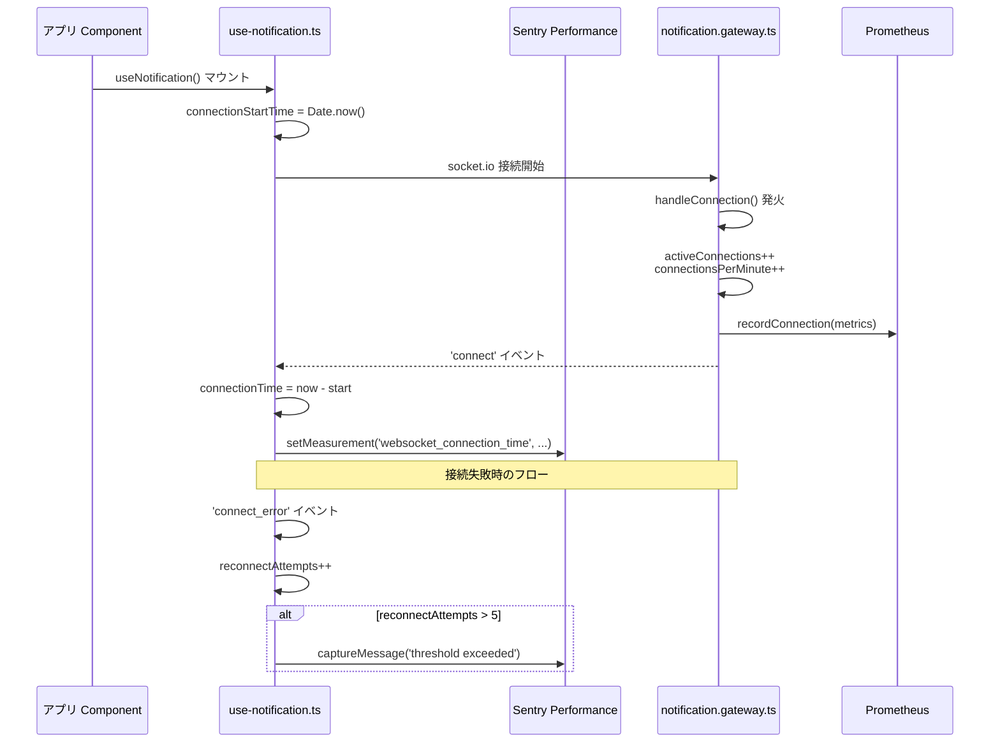

# WebSocket 監視設計

[監視指標カタログ.md](監視指標カタログ.md) で定義された **WebSocket 接続** コンポーネントの監視仕様。**接続指標** および **エラー指標** に基づき、フロントエンド側・BFF 側の両面から Socket.io 接続のメトリクスを収集する設計を確定する。

> Socket.io 実装本体（接続確立・Room 管理・認証）は [08_リアルタイム通信設計/](../08_リアルタイム通信設計/) を参照。本書は監視メトリクス収集の追加実装のみ確定する。

---

## 1. 監視の目的と方針

| 項目 | 内容 |
|---|---|
| **目的** | リアルタイム通知基盤（Socket.io）の健全性把握、接続異常の早期検知と原因特定 |
| **収集メトリクス** | [監視指標カタログ.md](監視指標カタログ.md) §5 接続指標（アクティブ接続数、接続イベント頻度、再接続試行回数等）|
| **収集方式** | BFF 側: `notification.gateway.ts` 内で集計し Prometheus に記録<br>フロントエンド側: `use-notification.ts` 内で計測し Sentry Performance に送信（※ Sentry 利用時） |

---

## 2. 監視対象メトリクスと実装

### 2.1 BFF 側（サーバー側）の監視

**配置場所**: `bff/src/features/notification/notification.gateway.ts`（08章で作成、本章で計測ロジックを追加）

**収集メトリクス**:

| メトリクス | 説明 | 異常判定閾値 | 実装方法 |
|---|---|---|---|
| **アクティブ接続数** | 現在接続中の Socket 数 | （※1） | `this.server.sockets.sockets.size` |
| **テナント別接続数** | テナントごとの接続数 | （※1） | Room 名 `{tenantId}:*` でカウント |
| **接続イベント頻度** | 1 分間あたりの接続数 | > 1000 回/分（※2） | `handleConnection()` でカウント |
| **切断イベント頻度** | 1 分間あたりの切断数 | > 500 回/分（※2） | `handleDisconnect()` でカウント |
| **再接続イベント頻度** | 再接続試行回数 | > 100 回/分（※2） | `connect` イベント発火時に前回接続 ID と比較 |

**注釈**:
- ※1: アクティブ接続数・テナント別接続数の異常判定閾値はシステム規模に依存するため、負荷試験結果・運用初期のベースライン測定に応じて決定する
- ※2: 接続・切断・再接続イベント頻度の閾値は暫定値であり、今後の設計段階に応じて変更する可能性がある

> 暫定閾値運用の根拠: [adr/provisional-thresholds.md](adr/provisional-thresholds.md)

**実装イメージ**:

```typescript
// bff/src/features/notification/notification.gateway.ts
@WebSocketGateway({ namespace: 'notifications' })
export class NotificationGateway {
  private metrics = {
    activeConnections: 0,
    connectionsPerMinute: 0,
    disconnectsPerMinute: 0,
  };

  handleConnection(client: Socket) {
    this.metrics.activeConnections = this.server.sockets.sockets.size;
    this.metrics.connectionsPerMinute++;

    // Prometheus メトリクスとして記録
    this.prometheusService.recordConnection(this.metrics);
  }
}
```

> Prometheus 記録経路は [インフラランタイム監視設計.md](インフラランタイム監視設計.md) §3 を参照。

### 2.2 フロントエンド側（クライアント側）の監視

**配置場所**: `frontend/src/shared/hooks/use-notification.ts`（08章で作成、本章で計測ロジックを追加）

**収集メトリクス**:

| メトリクス | 説明 | 異常判定閾値 | 実装方法 |
|---|---|---|---|
| **接続状態** | 接続中 / 切断中 | - | `socket.connected` の状態を監視 |
| **再接続試行回数** | 自動再接続の試行回数 | > 5 回（※） | `connect_error` イベントでカウント |
| **接続確立時間** | 接続開始から `connect` イベント発火までの時間 | > 5 秒（※） | タイムスタンプの差分 |
| **メッセージ受信数** | 受信した通知の数 | - | `message` イベントでカウント |

**注**: ※ 閾値は暫定値であり、今後の設計段階に応じて変更する可能性がある（[adr/provisional-thresholds.md](adr/provisional-thresholds.md)）

**実装イメージ**:

```typescript
// frontend/src/shared/hooks/use-notification.ts
export function useNotification() {
  useEffect(() => {
    const socket = io(`${process.env.NEXT_PUBLIC_BFF_URL}/notifications`);
    let reconnectAttempts = 0;
    const connectionStartTime = Date.now();

    socket.on('connect', () => {
      const connectionTime = Date.now() - connectionStartTime;
      // 性能監視ツールにメトリクス送信（※ Sentry 利用時）
      Sentry.setMeasurement('websocket_connection_time', connectionTime, 'millisecond');
    });

    socket.on('connect_error', () => {
      reconnectAttempts++;
      if (reconnectAttempts > 5) {
        // 異常として記録（※ Sentry 利用時）
        Sentry.captureMessage('WebSocket reconnection attempts exceeded threshold', {
          level: 'warning',
          extra: { reconnectAttempts },
        });
      }
    });
  }, []);
}
```

**注**: 上記は Sentry 利用時の実装イメージ。監視ツールが変更された場合は代替ツールのメトリクス送信 API・イベント記録 API に置き換える。

---

## 3. 接続フロー（メトリクス収集を含む）



---

## 4. 異常検知とアラート

| 異常パターン | 検知条件 | 影響範囲 | 対応アクション |
|---|---|---|---|
| **大量切断** | 1 分間に 500 回以上の切断 | テナント全体 | ネットワーク障害の可能性、インフラチーム通知 |
| **再接続ループ** | 特定クライアントが 5 回以上再接続試行 | 個別ユーザー | クライアント側ログ収集、JWT 検証状態確認 |
| **接続確立遅延** | 接続確立に 5 秒以上 | 個別ユーザー | BFF リソース状況確認、ネットワーク遅延調査 |
| **メッセージ配信失敗** | Room 宛メッセージ送信時にエラー | 特定ユーザー / テナント | Room 参加状態の確認、BFF 側ログ解析 |

**注**: 上記検知条件は `システム監視・通知サービス方式設計書` の検知条件との整合性を確認中であり、負荷試験結果・運用初期のベースライン測定・方式設計書との統合に応じて変更する可能性がある（[adr/provisional-thresholds.md](adr/provisional-thresholds.md)）。

---

## 5. 監視データの保存先

| 監視対象 | 送信先 | 可視化 |
|---|---|---|
| **BFF 側のメトリクス** | Prometheus Exporter 経由（`システム監視・通知サービス方式設計書` 参照） | Grafana ダッシュボード |
| **フロントエンド側のメトリクス** | Sentry Performance（※ Sentry 利用時） | Sentry ダッシュボード（※ Sentry 利用時） |

監視ツールが変更された場合は、代替ツールのメトリクス収集・可視化機能を使用する。

> 送信先一覧と参照画面の総覧は [ログ・トレース連携設計.md](ログ・トレース連携設計.md) を参照。

---

## 6. 配置とファイル責務

| ファイル | 配置 | 主管章 | 本章での追加内容 |
|---|---|---|---|
| `notification.gateway.ts` | `bff/src/features/notification/` | 08章 | 接続数・切断数・再接続のメトリクス収集と Prometheus 記録（§2.1） |
| `use-notification.ts` | `frontend/src/shared/hooks/` | 08章 | 接続時間の測定、再接続試行回数のカウント、性能監視ツールへのメトリクス送信（§2.2）|

> 16章マスター（[../16.アプリ基盤実装コード一覧.md](../16.アプリ基盤実装コード一覧.md) No.15, No.37）で参照章「08章, 15章」に登録済み。
