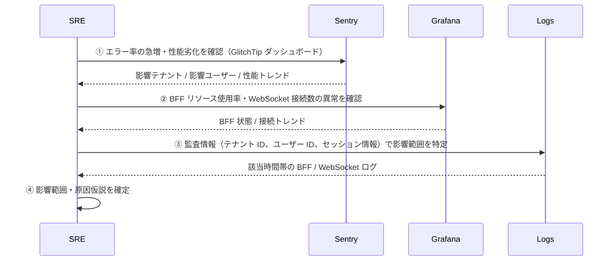

# ログ・トレース連携設計

本章で定義した監視指標の **収集先と監視画面** を、フロントエンド開発者・SRE の視点で整理する。システム全体の統合監視基盤の詳細は `システム監視・通知サービス方式設計書` を参照のこと。

> 責務分界の根拠: [adr/monitoring-layer-responsibility.md](adr/monitoring-layer-responsibility.md)

---

## 1. フロントエンド監視データの送信先一覧

フロントエンド側で収集した監視データの送信先を以下に整理する。

| 監視データ種別 | 送信先 | 関連設計 |
|---|---|---|
| **Core Web Vitals**（LCP、FID/INP、CLS、TTFB） | GlitchTip（`@sentry/nextjs` SDK 経由）（※） | [フロントエンド性能監視設計.md](フロントエンド性能監視設計.md) |
| **クライアント側エラー**（JavaScript ランタイムエラー、API 通信エラー） | GlitchTip | [09_監視エラーハンドリング設計/](../09_監視エラーハンドリング設計/監視エラーハンドリング規約.md) |
| **WebSocket 接続状態**（再接続試行回数、接続確立時間） | GlitchTip（`@sentry/nextjs` SDK 経由）（※） | [WebSocket監視設計.md](WebSocket監視設計.md) §2.2 |

**注**: ※ 現時点では GlitchTip（Sentry互換OSS）を採用。将来 Grafana Faro へ移行した場合でも、送信先が変わるのみで収集する監視指標は変わらない。

> ツール移行時の判断根拠: [adr/sentry-tentative-adoption.md](adr/sentry-tentative-adoption.md)

---

## 2. BFF / インフラ側監視データの送信先一覧

| 監視データ種別 | 送信先 | 関連設計 |
|---|---|---|
| **WebSocket 接続数・接続イベント頻度**（BFF 側） | Prometheus Exporter → Grafana | [WebSocket監視設計.md](WebSocket監視設計.md) §2.1, [インフラランタイム監視設計.md](インフラランタイム監視設計.md) §3 |
| **Node.js ランタイムリソース** | node-exporter → Prometheus → Grafana | [インフラランタイム監視設計.md](インフラランタイム監視設計.md) §2 |
| **コンテナ状態** | cAdvisor → Prometheus → Grafana | [インフラランタイム監視設計.md](インフラランタイム監視設計.md) §2 |

詳細な構成・保持ポリシーは `システム監視・通知サービス方式設計書` を参照。

---

## 3. フロントエンド開発者・SRE が参照すべき監視画面

日常的なモニタリングおよび障害発生時に確認すべき監視画面を明記する。

### 3.1 日常的なモニタリング

| 監視画面 | 確認内容 | アクセス方法 |
|---|---|---|
| **GlitchTip ダッシュボード** | フロントエンド性能（Core Web Vitals）、エラー率 | GlitchTip Web UI（開発環境: `http://localhost:8080`）|
| **Grafana ダッシュボード**（統合監視） | システム全体の健全性（BFF 性能、WebSocket 接続数、リソース使用率） | 統合監視基盤（詳細は `システム監視・通知サービス方式設計書` 参照） |

### 3.2 障害発生時の確認手順

| 順序 | アクション |
|---|---|
| ① | GlitchTip ダッシュボードで、エラー率の急増やパフォーマンス劣化を確認 |
| ② | Grafana ダッシュボードで、BFF リソース使用率・WebSocket 接続数の異常を確認 |
| ③ | エラーイベントに付与された監査情報（テナント ID、ユーザー ID、セッション情報）を元に、影響範囲を特定 |
| ④ | 影響範囲と原因仮説を確定（後続フローは [運用監視規約.md](運用監視規約.md) §6 参照）|

---

## 4. 統合監視基盤との連携

フロントエンド側で収集したデータが、システム全体の統合監視基盤でどう活用されるか、および以下の詳細については `システム監視・通知サービス方式設計書` を参照のこと:

| 観点 | 委譲先 |
|---|---|
| **統合監視基盤の全体像** | Prometheus、Grafana、アラート管理の構成 → 方式設計書 |
| **ログ・トレースの統合** | 分散トレーシング（トレース ID）によるフロントエンド・BFF・バックエンド間の連携 → 方式設計書 |
| **データ保存先・保持期間** | 各監視データの保存先、保持期間、バックアップ戦略 → 方式設計書 |
| **アラート設定・通知フロー** | 異常検知時の通知先、エスカレーション手順 → 方式設計書 |

---

## 5. 監視データ送信時の注意事項

| 観点 | 注意点 |
|---|---|
| **PHI / PII の混入防止** | フロントエンド送信は 09章の `beforeSend` フィルタを必ず経由する。フィルタを迂回した送信パスは作らない（[運用監視規約.md](運用監視規約.md) §2 / §3）|
| **送信ツール変更への耐性** | 送信先が変わっても、収集する監視指標（[監視指標カタログ.md](監視指標カタログ.md)）は変わらない。ツール固有 API の呼び出しは基盤の SDK 設定ファイルおよび `use-notification.ts` に閉じ込め、アプリ feature 側に拡散させない |
| **障害時の単一障害点回避** | GlitchTip の障害時、フロントエンド性能監視とエラー監視が同時に途絶する。Grafana 側は別経路で稼働するため、障害時は Grafana を一次情報源とする |
