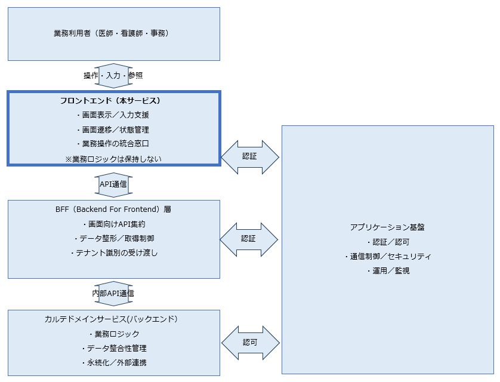

# 1. 目的と基本方針

## 1.1. サービスの目的

本フロントエンドサービスの目的は、電子カルテシステムにおける複雑な業務機能群を、業務利用者が安全かつ効率的に利用できる状態にすることである。

電子カルテシステムは、多数の業務機能や制度対応を内包することから、システム構造が利用者にとって理解しづらくなりやすい。本サービスは、その複雑性を利用者から隠蔽し、業務遂行に必要な操作のみを直感的に提供することを目的とする。

また、医療現場においては、操作ミスや入力中断が業務や安全性に影響を与える。本サービスは、利用者がシステム操作に過度な注意を払うことなく、本来の医療業務に集中できる操作環境を実現することを目的とする。

本サービスの目的は、特定の画面や機能を提供することではなく、電子カルテシステム全体の利用品質を継続的に向上させることである。

## 1.2. サービス概要

本フロントエンドサービスは、電子カルテシステムにおいて、業務利用者向けの画面機能を提供するアプリケーションサービスである。

本サービスは、診療記録、オーダー、患者情報参照等の複数の業務機能を横断し、利用者が日常業務を行うための画面表示、入力操作、画面状態管理を一つのサービス単位として提供する。

本サービスは、利用者操作に関わる責務を集約し、業務処理やデータ管理を担うバックエンドサービスとは分離された構成を前提とする。これにより、業務機能の変更や拡張が、利用者インタフェースに与える影響を最小限に抑える。

また、本サービスは、複数の業務サービスと連携することを前提とした構成を持ち、業務サービス単体では提供できない画面統合や操作フローを実現する役割を担う。

## 1.3. システム前提条件

本フロントエンドサービスは、電子カルテシステム全体の構成および運用方針を前提として設計されるものであり、以下の条件を前提とする。

| No | 前提条件 | 内容 | 設計上の意味・影響 |
| --- | --- | --- | --- |
| 1 | 利用環境 | 院内ネットワークからの利用を基本とする | インターネット公開前提の対策は行わない |
| 2 | 利用者 | 医師・看護師・事務職員ほか病院職員を主対象とする | 一般利用者向けUXは考慮しない |
| 3 | 提供形態 | Webアプリケーションとして提供する | クライアントへの個別インストール不要 |
| 4 | アプリ方式 | SPA方式を基本とする | クライアントルーティング・状態管理が前提 |
| 5 | デバイス | 院内標準PCを主、一部タブレットを想定 | レスポンシブを考慮 |
| 6 | 業務処理 | 業務ロジックはバックエンドで実施する | フロントは操作・表示に責務限定 |
| 7 | 認証・認可 | 基盤側で実施されることを前提とする | フロントは認証情報を利用するのみ |
| 8 | 通信方式 | バックエンドとはAPI連携とする | 直接DB接続等は行わない |
| 9 | 可用性 | 常時利用を前提とする | 業務システム障害時の業務影響を最小化する設計が必要 |
| 10 | 開発前提 | 段階的な機能拡張を前提とする | 初期段階で全機能実装は不要 |

## 1.4. サービスの位置づけ

本フロントエンドサービスは、電子カルテシステム全体において、利用者とバックエンド業務サービスをつなぐ操作インタフェース層として位置づけられる。

フロントエンドは、業務利用者が業務を遂行するための画面表示、入力支援、画面状態管理を担い、業務処理やデータ整合性の担保はバックエンドに委ねる。

以下に、本システムにおける責務境界の概念図を示す。

---