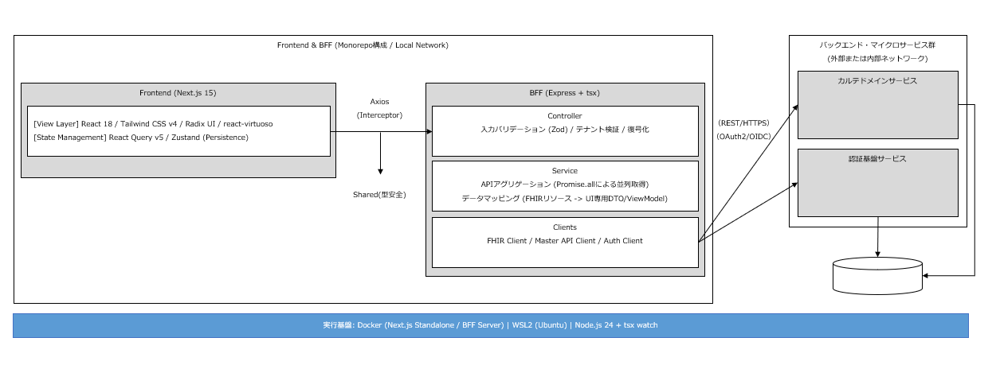

# 最終的な使用OSS・技術スタック一覧

## コンポーネント図

## 1. フレームワーク・実行基盤

| 分類 | 技術名 (OSS) | 役割・検証内容 |
| --- | --- | --- |
| **フロントエンド** | **Next.js 16 (App Router)** | SSRによる初期表示高速化、Linkによるプリフェッチ、loading/error UIの制御を実証 |
| **BFF** | **NestJS** | 多層レイヤー（Controller/Service/Client）によるデータ集約・整形基盤として採用 |
| **共有パッケージ** | **Shared (ディレクトリ参照)** | `shared/types` によるフロント-BFF間の型定義一元管理 |
| **実行ランタイム** | **Node.js 24 (LTS)** | WSL2/Docker環境での標準実行環境として確定 |
| **TS実行/開発** | **ts-node / ts-node-dev** | TypeScriptを直接実行する標準環境。tsconfig-paths との併用により、Monorepo内の別ディレクトリにある共有型定義（@shared/）の解決を実証。 |

## 2. データ取得・状態管理

| 分類 | 技術名 (OSS) | 役割・検証内容 |
| --- | --- | --- |
| **サーバー状態** | **TanStack Query v5** | `staleTime` による通信キャッシュ制御、詳細画面へのデータ引き継ぎを実証 |
| **クライアント状態** | **Zustand** | `persist` ミドルウェアによるLocalStorage連携（リロード耐性）と、ページ間でのID保持を実証 |
| **通信クライアント** | **Axios** | Interceptorを用いた共通基盤（リクエストフック、難読化、共通ヘッダー注入）を構築 |

## 3. UI・スタイリング・描画最適化

| 分類 | 技術名 (OSS) | 役割・検証内容 |
| --- | --- | --- |
| **CSSエンジン** | **Tailwind CSS v4** | `@tailwindcss/postcss` 採用。`@theme` によるCSS変数管理と `@apply` によるクラス共通化を実証 |
| **仮想化描画** | **react-virtuoso** | **[追加]** 1万件のデータ表示において、スクロール時のDOM生成数を一定に保ちフリーズを防止するために必須化 |
| **UIコンポーネント** | **Radix UI** | アクセシビリティを担保したUI基盤として、Tailwind v4と組み合わせて使用 |

## 4. フォーム・バリデーション・セキュリティ

| 分類 | 技術名 (OSS) | 役割・検証内容 |
| --- | --- | --- |
| **フォーム管理** | **React Hook Form** | 非制御コンポーネントによる高速な入力レスポンスと再レンダリング抑制を実証 |
| **スキーマ検証** | **Zod** | `shared` 由来のスキーマを用いた、フロント・BFF両端での型安全バリデーションを実証 |
| **セキュリティ** | **Standard Web Crypto API** | `TextEncoder` 等を用いた通信データの自動難読化・復号処理を axiosClient 内に実装 |
| **CORS管理** | **cors** | **[追加]** フロント-BFF間のクロスドメイン通信許可のために導入 |

## 5. テスト・開発環境

| 分類 | 技術名 (OSS) | 役割・検証内容 |
| --- | --- | --- |
| **仮想化環境** | **Docker / Docker Compose** | `docker compose up` による、Node.js 24環境の完全な再現性を実証 |
| **ホスト連携** | **WSL2 (Ubuntu)** | Windows上の開発環境とコンテナ間のホットリロード（HMR）動作を確認 |
| **テスト・QA** | **(Vitest / RTL / Playwright)** | 方式設計書に基づき導入。特にサービス層の変換ロジックを重点対象とする |
