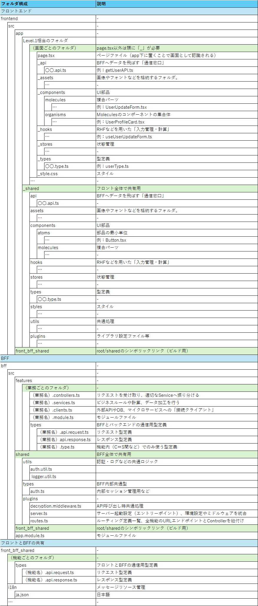

# 命名規則・拡張子定義

| 言語 | 拡張子 | 命名規則 | 例 |
| --- | --- | --- | --- |
| **TypeScript** | `.ts` | キャメルケース | `use.user.update.form.ts` |
| **TypeScript (JSX)** | `.tsx` | パスカルケース | `UserUpdateForm.tsx` |
| **スタイルシート** | `.css` | キャメルケース | `_style.css` |

# ディレクトリ構成

