# 技術検証報告書：WSL2/Dockerによる共通開発基盤の構築検証

## 1. 検証の背景と目的

本検証は、フロントエンド（Next.js）および、BFF（Node.js + Express）を用いたPoC開発において、開発者間での実行環境の完全な一致と、セットアップ工数の最小化を目的とする。Docker EngineをWSL2(Ubuntu)上で直接稼働させ、コンテナ内に開発基盤をパッケージ化することで、環境依存エラーを排除し、`docker compose up` 一発で即座に開発を開始できる体制を実証する。


## 2. 検証内容と結果マトリクス

| 検証項目 | 目的 | 検証方法 | 検証結果 |
| --- | --- | --- | --- |
| **開発環境のイメージ化** | 実行環境（Node.js 24）をパッケージ化する | Dockerfileおよびdocker-compose.ymlの作成とビルド | **[PASS]** |
| **環境の再現性・可搬性** | 全員が同一環境を即座に立ち上げられること | 生成物削除状態からの `docker compose up` 実行確認 | **[PASS]** |
| **WSL2同期・開発利便性** | ホスト側のコード変更を即座に反映する | WSL2環境下でのホットリロード（HMR）動作確認 | **[PASS]** |

---


## 3. 具体的な検証手順とエビデンス（手順詳細）

### ① 開発基盤のコード化

* **手順**:
  1. Frontend（Next.js）およびBFFの実行環境を、軽量な `alpine` イメージをベースに定義。
  2. `docker-compose.yml` を作成し、コンテナ間のネットワークとポート（3000, 3001）を統合管理する。  
  プロジェクトルート/docker-compose.yml
      ```yaml
      services:
        frontend:
          build:
            context: ./frontend # frontend専用：Dockerfileがあるディレクトリを指定
          ports:
            - "3000:3000"
          volumes:
            - ./frontend:/app # 「Ubuntu上の ./frontend」 : 「コンテナ内の /app」 を同期
            - /app/node_modules

          environment:
            - CHOKIDAR_USEPOLLING=true # WSLでのホットリロードを安定させる
            - NEXT_TURBO=0   # エラーになってしまうTurbopack を明示的にオフにする

        bff:
          build:
            context: ./bff # bff専用：Dockerfileがあるディレクトリを指定
          ports:
            - "3001:3001"
          volumes:
            - ./bff:/app
            - /app/node_modules

      ```

  3. Dockerfile によって、コンテナ起動時に自動で依存関係のインストールと開発サーバーの起動を行うよう定義。

      frontend/Dockerfile
      ```dockerfile
      # フロントエンド
      FROM node:24-alpine
      WORKDIR /app
      COPY package*.json package-lock.json ./
      RUN npm install
      RUN chmod -R 755 /app/node_modules/.bin
      COPY . .
      # Next.jsの開発サーバーを起動
      CMD ["npm", "run", "dev"]
      ```

      bff/Dockerfile
      ```dockerfile
      # BFF
      FROM node:24-alpine
      WORKDIR /app
      # ホストの「bff/package.json」をコンテナの「/app/」にコピー
      COPY package*.json package-lock.json ./
      RUN npm install
      RUN chmod -R 755 /app/node_modules/.bin
      COPY . .
      EXPOSE 3001
      CMD ["npm", "run", "dev"]
      ```

  4. .dockerignore でビルド時に不要なファイルを Docker Engine への転送対象から除外。
      frontend/.dockerignore
      ```text
      node_modules
      .next
      out
      build
      *.log
      .git
      .env
      ```

* **結果**:
  * `docker compose build` により、OSレイヤーから依存ライブラリまでが1つのイメージとしてパッケージ化されたことを確認。(Frontend/BFF)
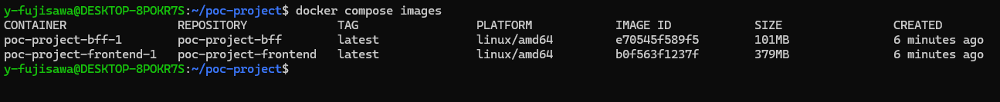


### ② `node_modules` 自動生成と整合性の検証

* **手順**:
  1. ホスト側（Ubuntu）の `node_modules` を意図的に削除した状態で `docker compose up --build` を実行。
  2. コンテナ内部で `npm install` が走り、Linux環境用のライブラリが正しく配置されるかを確認。

* **結果**:
  * 匿名ボリューム設定により、ホスト側の空ディレクトリに上書きされることなく、コンテナ内の `node_modules` が保持・利用されることを実証。
（`frontend` `bff` にて npm install が走り、ライブラリがインストールされ、開発サーバーが正常に立ち上がっていることを確認）
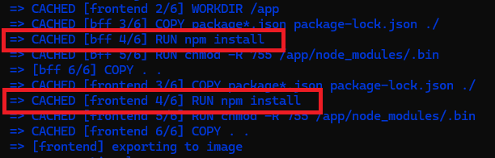
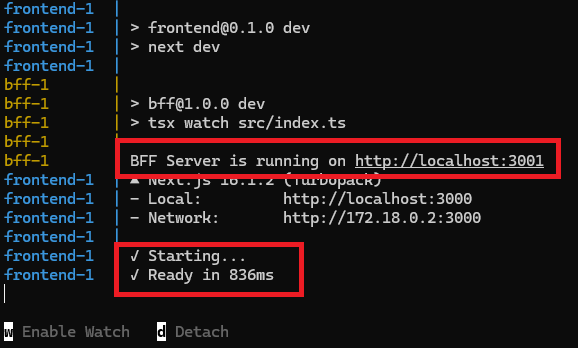  
<br>
  * コンテナ内でのライブラリ node_modules 存在を確認。
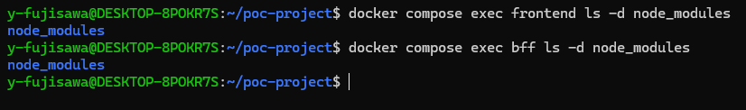


  * フロント/BFFの指定のURLでのブラウザ表示確認。
   **Frontend:** [http://localhost:3000/karte](http://localhost:3000/karte)
    * 画面が正常に表示されること。
    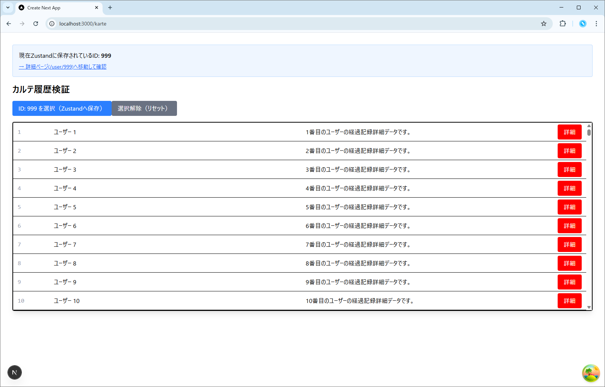  
<br>

    **BFF (API):** [http://localhost:3001/api/karte](http://localhost:3001/api/karte)
      * ブラウザの開発者ツール（F12）の Network タブで、API 通信が `200 OK` または `304 Not Modified` になっていること。
      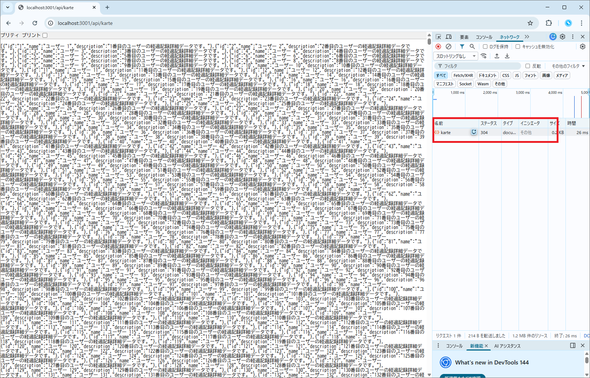


### ③ WSL2環境におけるホットリロード動作

* **手順**:
  1. Windows上のVSCodeで `page.tsx` の文言を編集し保存。
    →カルテ画面のソースコードに`<h1>検証中</h1>`を追加

* **結果**:
  * 変更保存後、即座にコンテナ内のNext.jsが再ビルド（HMR）を開始し、ブラウザへ反映されることを確認。

    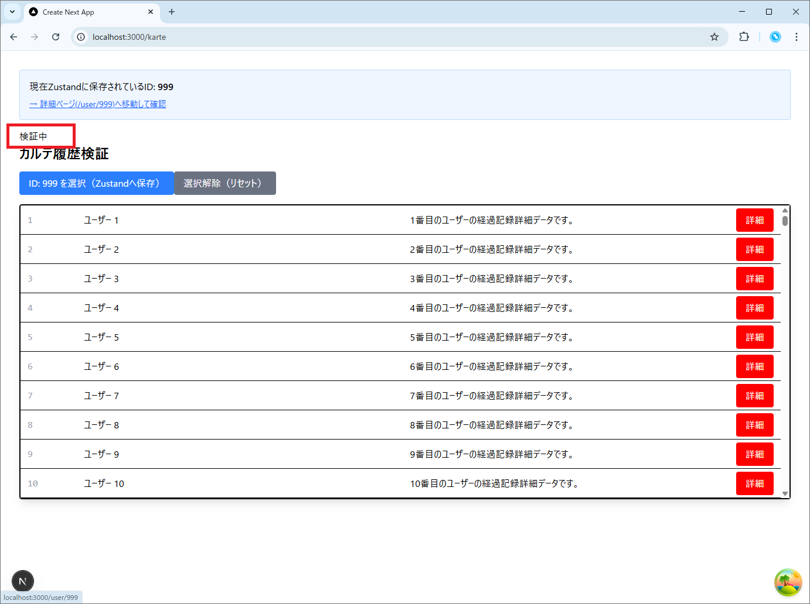

    ↓ターミナルのログにCompiled in...と表示されていることを確認
    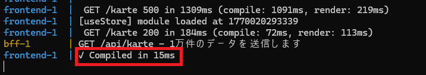


### ④ WSL2環境におけるエディタ最適化（型エラー解消）

Dockerコンテナ内のライブラリをホスト側のVS Codeで認識させ、静的解析を正常化させる手順を実証した。

* **手順**:
  1. **VS CodeのWSLリモート接続**:
      拡張機能「WSL」を導入し、左側メニューの「 >< 」アイコンから WSLへ接続する。
      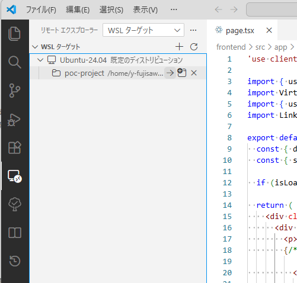

  2. **WSL(Ubuntu)内へのNode.jsインストール**:
    nvmを用いて、ホスト側にもコンテナと同一バージョンのNode.js環境を構築。

      ```bash
      # nvm (Node Version Manager) のインストール
      curl -o- https://raw.githubusercontent.com/nvm-sh/nvm/v0.39.7/install.sh | bash

      # 設定を反映（一度ターミナルを閉じて開き直すか、以下を実行）
      source ~/.bashrc

      # Node.js v24 のインストール
      nvm install 24
      nvm use 24

      ```


  3. **実行パスの確認**:
    `which node` を実行し、Windows側（C:...）ではなくWSL側のパスであることを確認。
    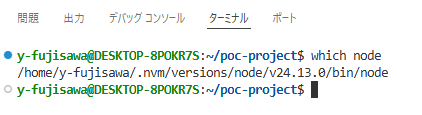

  4. **ディレクトリ所有権の修正**:
    Dockerが生成した `node_modules` 等の権限を開発ユーザーへ変更。

      ```bash
      sudo chown -R $USER:$USER ~/poc-project

      ```


  5. **ライブラリの同期**:
    `frontend` ディレクトリにて `npm install` を実行。

      ```bash
      cd frontend
      npm install
      ```
      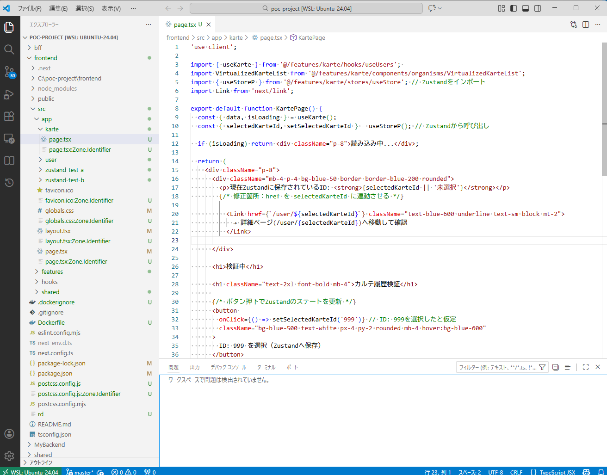

---


## 4. 技術的特記事項・課題

* **Docker Engineの直接導入**: Docker Desktopを介さずUbuntuに直接導入することで、リソース消費を抑えつつ、本番環境（Linuxサーバー）に近い挙動を実現。
* **.dockerignoreの徹底**: `node_modules` や `.next` フォルダをビルド対象から除外することで、ビルド時間を短縮。
* **WSL2リモート開発の最適化**: 拡張機能「WSL」を用いてVS CodeをWSL2へ直接接続。ホスト側（WSL）にもコンテナと同一のNode.js環境を構築・同期することで、エディタ上の型エラーを解消し、静的解析・補完機能を有効化。
* **ファイル所有権の整合性確保**: Docker（root）が生成したディレクトリに対し、`chown` コマンドで開発ユーザーへ所有権を移譲。ホスト側からの書き込みやライブラリ同期を可能にする権限管理手順を確立。
