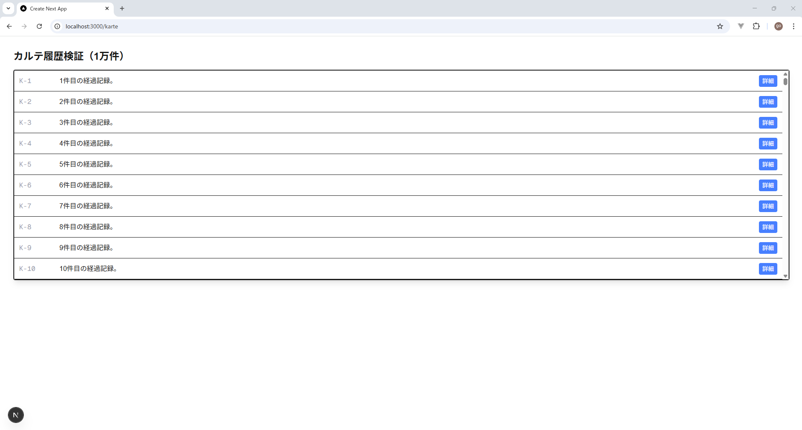
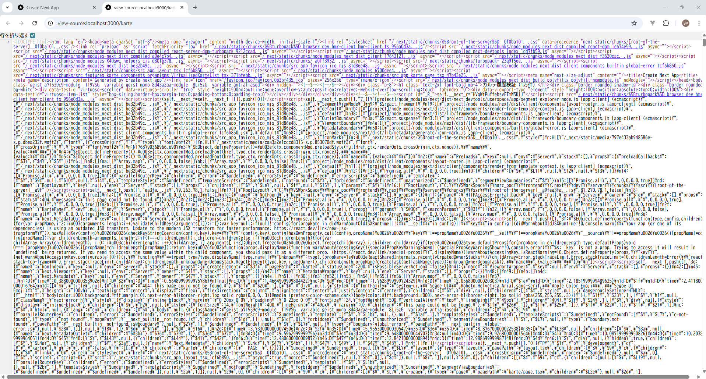
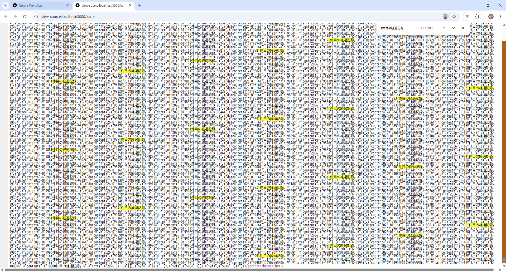
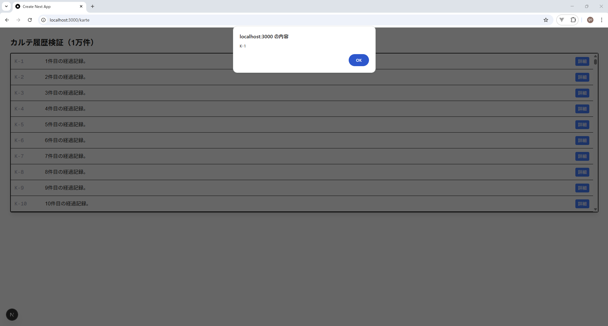
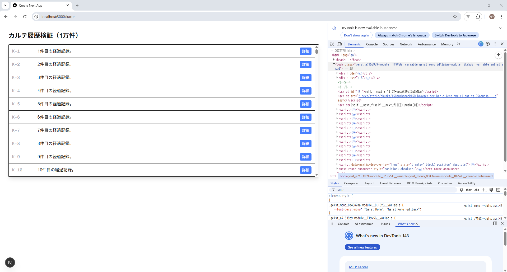
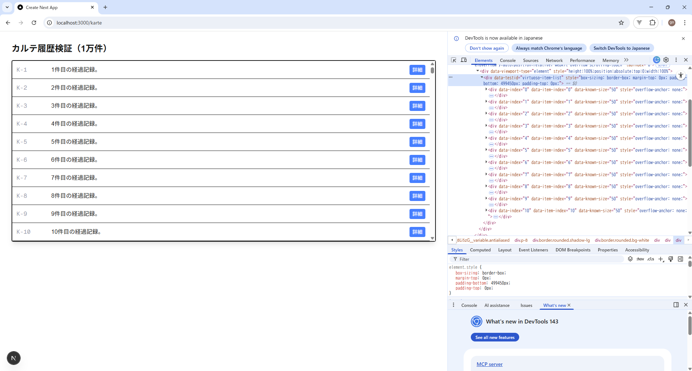
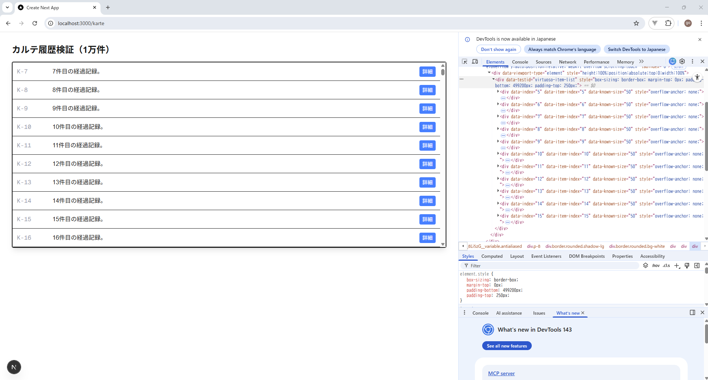

# PoC検証報告書：UI表示基盤とデータ受け渡し最適化

## 1. 検証の目的
本検証は、大規模データ（1万件）を扱うカルテ履歴表示において、以下の3点を実証することを目的とする。
1. **SSR（サーバーサイドレンダリング）** による初期表示の高速化。
2. **仮想化（Virtualization）** による大容量データ保持とブラウザ描画負荷の抑制の両立。
3. **ハイドレーション（Hydration）** を介した、サーバー生成HTMLへのクライアントサイド操作（CSR）の正常な紐付け。

---

## 2. 検証内容と結果マトリクス

| 検証項目 | 目的 | 検証方法 | 検証結果 |
| :--- | :--- | :--- | :--- |
| **SSR効果（初期データ）** | JS実行前の初期表示速度向上とSEO/アクセシビリティの確保 | ページのソースを表示し、HTML内にMock APIのデータが存在するか確認 | **[PASS]** `self.__next_f.push` 内に1万件のデータを確認 |
| **CSR動作（対話性）** | サーバー描画後のUIに対する動的アクションの有効化 | リスト内の「詳細」ボタンをクリックし、`onClick` イベントが発火するか確認 | **[PASS]** Alertダイアログの表示によりハイドレーションを確認 |
| **描画最適化（仮想化）** | メモリ消費の抑制とスムーズなスクロール操作の実現 | 開発者ツールのElementsタブで、スクロール時のDOM生成数が一定か監視 | **[PASS]** 1万件保持しつつ描画DOMは数十個に抑制 |

---

## 3. 具体的な検証手順とエビデンス（手順詳細）
### SSRとCSRの実装における記述の差異
  Next.js（App Router）では、データの取得はサーバー側（SSR）、対話的なUI操作はクライアント側（CSR）と役割を分担させます。本検証では以下の通り実装を分離し、データ連携を確認しました。

  * **SSR (Server Component)**: データの取得（fetch）を担当。デフォルトのコンポーネント。
  * **CSR (Client Component)**: `Virtuoso` や `onClick` の制御を担当。ファイル冒頭に `'use client'` を記述。

      ```tsx
        // 【SSR】 サーバー側でデータを取得する親 (app/karte/page.tsx)
        export default async function KartePage() {
          const res = await fetch('http://localhost:3001/api/karte');
          const data = await res.json(); // サーバー側で1万件取得

          // 取得したデータを、CSRコンポーネントへ渡す
          return <VirtualizedKarteList data={data} />;
        }
        

        // 【CSR】 ブラウザ側で描画を制御する子 (components/VirtualizedKarteList.tsx)
        'use client'; 
        import { Virtuoso } from 'react-virtuoso';

        export default function VirtualizedKarteList({ data }: { data: any[] }) {
          return (
            <Virtuoso
              style={{ height: '500px' }}
              totalCount={data.length}
              itemContent={(index) => (
                <div style={{ height: '50px', borderBottom: '1px solid #eee' }}>
                  {data[index].id}: {data[index].content}
                  <button onClick={() => alert(`${data[index].id}の詳細`)}>詳細</button>
                </div>
              )}
            />
          );
        }
      ```

### ① SSRによる初期データ送出の確認
* **手順**:

1. 下記コマンドを実行する。

    - フロントエンド側

      `npm install react-virtuoso`

2. 下記ソースコードを追加する。

    - フロントエンド側
   
      frontend\src\features\karte\components\organisms\VirtualizedKarteList.tsx
      ```tsx
      import { Virtuoso } from 'react-virtuoso';

      export default function VirtualizedKarteList({ data }: { data: any[] }) {
        return (
          <Virtuoso
            style={{ height: '500px' }}
            totalCount={data.length}
            itemContent={(index) => (
              <div style={{ height: '50px', borderBottom: '1px solid #eee' }}>
                {data[index].id}: {data[index].content}
              </div>
              <button 
                onClick={() => alert(`ID: ${data[index].id} を選択`)}
                className="ml-4 bg-blue-500 text-white px-2 py-1 rounded"
              >
                詳細
              </button>
            )}
          />
        );
      }
      ```

      frontend\src\app\karte\page.tsx
      ```tsx
      import VirtualizedKarteList from '@/features/karte/components/organisms/VirtualizedKarteList';

      async function getKarteData() {
        // localhost:3001 の BFF を叩く
        const res = await fetch('http://localhost:3001/api/karte', { 
          cache: 'no-store' 
        });
        
        if (!res.ok) throw new Error('Failed to fetch from BFF');
        return res.json();
      }

      export default async function KartePage() {
        const data = await getKarteData(); // Server側でのデータ取得

        return (
          <div className="p-8">
            <h1 className="text-2xl font-bold mb-4">カルテ履歴検証（1万件）</h1>
            {/* ServerからClientへデータを渡し、onClick等の動作を確認する */}
            <div className="border rounded shadow-lg">
              <VirtualizedKarteList data={data} />
            </div>
          </div>
        );
      }
      ```

    - BFF側

      \src\index.ts
      ```js
      import express from 'express';
      import cors from 'cors';
      const app = express();
      const PORT = 3001;

      // フロントエンド(localhost:3000)からのアクセスを許可
      app.use(cors());

      // --- モックデータの生成 (1万件) ---
      const mockData = Array.from({ length: 10000 }, (_, i) => ({
        id: (i + 1).toString(),
        name: `ユーザー ${i + 1}`,
        description: `${i + 1}番目のユーザーの経過記録詳細データです。`
      }));

      // --- エンドポイント1: 1万件全件取得 ---
      app.get('/api/karte', (req, res) => {
        console.log('GET /api/karte - 1万件のデータを送信します');
        res.json(mockData);
      });

      // サーバー起動
      app.listen(PORT, () => {
        console.log(`BFF Server is running on http://localhost:${PORT}`);
      });
      ```

  3. コマンド`npm run dev`を実行

  4. ブラウザで `http://localhost:3000/karte` をロード。
  
  5. 右クリック ＞ 「ページのソースを表示」を実行。
  
  6. `K-1`, `1件目の経過記録` 等の文字列を検索。
  
* **結果**: 
  - サーバー側で取得した1万件のデータがJSON形式でHTMLソース内に埋め込まれていることを確認。
  - **考察**: これにより、クライアント側での追加のAPIコール（Waterfalls）を防ぎ、LCP（Largest Contentful Paint）の短縮が期待できる。


### ② CSR（ハイドレーション）と対話性の確認
* **手順**: 
  1. 画面上のリスト各行に配置された「詳細」ボタンをクリック。
  
* **結果**: 
  - JavaScriptが正常にロードされ、`onClick` ハンドラが動作することを確認。
  - **考察**: SSRによる静的描画と、Reactコンポーネントとしての動的挙動が矛盾なく統合（ハイドレート）されている。

### ③ 仮想化リスト（Virtuoso）の動作確認
* **手順**: 
  1. 開発者ツール（F12）の「Elements」タブを開く。
  
  2. リストを高速スクロールし、DOMの動向を監視する。
  
  
* **結果**: 
  - スクロールに合わせて、表示領域外のDOMが即座に再利用（Recycle）され、ノード数が爆発しないことを確認。
  - **考察**: JavaScriptによる動的なDOM管理（CSRの側面）が正常に機能しており、1万件のデータがあってもブラウザのフリーズが発生しない。


---

## 4. 技術的特記事項・課題
* **ライブラリ選定**: `react-window` は最新のNext.js環境においてインポート形式（ESM/CJS）の互換性問題が発生したため、検証過程で `react-virtuoso` に切り替え。本開発でもメンテナンス性と親和性の観点から `react-virtuoso` もしくは `TanStack Virtual` の採用を推奨する。
* **パフォーマンス**: 1万件のデータ転送により初期HTMLサイズが増加する傾向があるため、本開発では必要に応じて「ページネーション」または「BFF側での絞り込み」との併用を検討する。

---