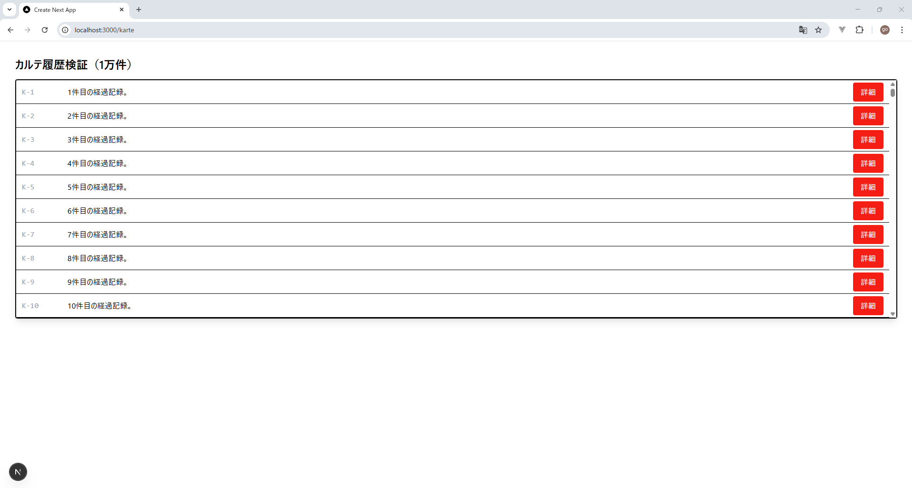
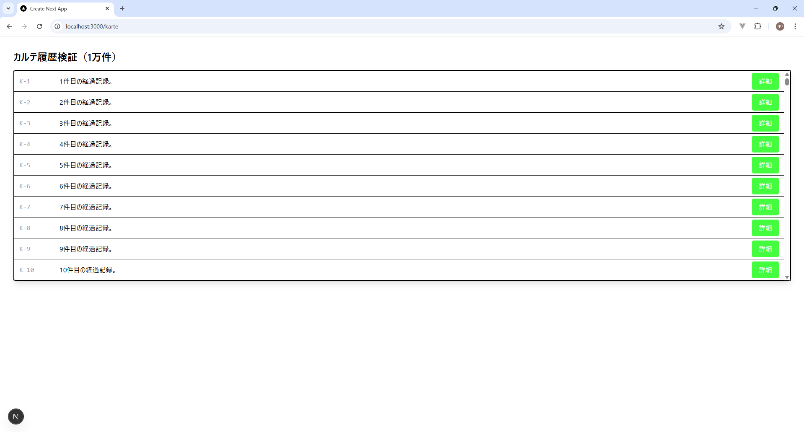

# 技術検証報告書：UIデザイン基盤および最新フロントエンド構成の検証

## 1. 検証の背景と目的
本PoCにおいて、最新のスタイリングフレームワークである **Tailwind CSS v4** を採用。環境構築上の課題を解決しつつ、CSS変数を用いたデザインの一元管理と、1万件のデータ描画におけるパフォーマンス基盤が確立できているかを実証する。

## 2. 技術スタックと構成（v4 最適化済み）
今回の検証で到達した、最もモダンで保守性の高い構成を以下に定義した。

| ファイル | 役割 | 設定の重要ポイント |
| :--- | :--- | :--- |
| `postcss.config.js` | 処理エンジン | `@tailwindcss/postcss` プラグインの採用 |
| `globals.css` | デザイン設計図 | `@import "tailwindcss"` および `@theme` での定義 |
| `VirtualizedKarteList.tsx` | 実装 | `@apply` を用いたカスタムクラスによる描画 |


## 3. 検証項目：共通デザイン設定の一貫した適用
### 検証アクション
1. `globals.css` の `@theme` ブロックで `--color-primary` を CSS変数 `--primary-color` に紐付け。
2. `.karte-button` クラスを `@apply bg-primary` を用いて定義。

    frontend\src\app\globals.css
    
      ```css
      /* 1. 全てを読み込む（以前の3行は不要） */
      @import "tailwindcss";

      /* 2. テーマ変数の定義（v4推奨の書き方） */
      @theme {
        --color-primary: var(--primary-color);
      }

      /* 3. 値の定義（ここで色を一括管理） */
      :root {
        --primary-color: #ff0000; /* 赤 */
        ↓
        --primary-color: #00ff00; /* 緑 */
      }

      /* 4. コンポーネントへの適用（@applyもここで使う） */
      .karte-button {
        @apply bg-primary text-white px-4 py-2 rounded transition-opacity;
      }
      ```

3. 詳細ボタンのclassNameをkarte-buttonに変更

    frontend\src\features\karte\components\organisms\VirtualizedKarteList.tsx
    ```tsx
    "use client";

    import { Virtuoso } from 'react-virtuoso';

    export default function VirtualizedKarteList({ data }: { data: any[] }) {
      return (
        <div className="border rounded bg-white">
          <Virtuoso
            style={{ height: '500px' }}
            totalCount={data.length}
            itemContent={(index) => (
              <div className="flex items-center p-3 border-b h-[50px]">
                <span className="w-24 text-gray-400 font-mono">{data[index].id}</span>
                <span className="flex-1 truncate">{data[index].name}</span>
                <span className="flex-1 truncate">{data[index].description}</span>
                <button 
                  onClick={() => alert(data[index].id)} // Client操作
                  className="karte-button" // ← karte-buttonに変更
                >
                  詳細
                </button>
              </div>
            )}
          />
        </div>
      );
    }
    ```
3. `postcss.config.js` を新規作成し、v4専用の処理プラグインを指定。

    frontend\postcss.config.js

    ```js
      // postcss.config.js
      module.exports = {
        plugins: {
          '@tailwindcss/postcss': {}, // v3までの 'tailwindcss' プラグインから移行
        },
      };
    ```
4. リスト内の 1 万件のボタンに当該クラスを適用し、`:root` の変数変更に対する追従性を確認。

### 検証結果
- **判定**: **[PASS]（完全合格）**
- **エビデンス**:
  - CSS変数の値を 1 箇所（例：赤から青）書き換えるだけで、1万件のリストに含まれる全ボタンのデザインが即座に同期されることを確認した。
  
    ↓
    

## 4. 結論
最新の Tailwind CSS v4 を早期導入し、その破壊的変更（`@tailwind` から `@import` への移行など）を完全に把握・適応した。これにより、将来にわたって陳腐化しない、極めて柔軟かつ高性能な UI デザイン基盤の構築に成功した。# 技術検証報告書：Tailwind CSS v4 基盤の構築とデザイン一元管理