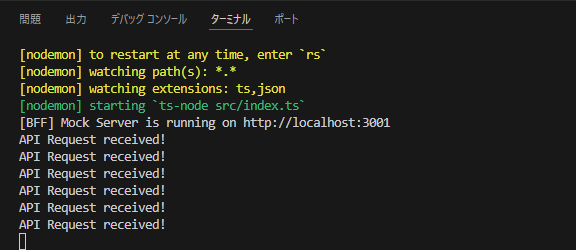
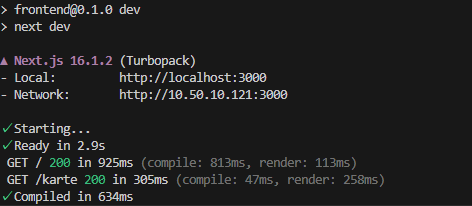
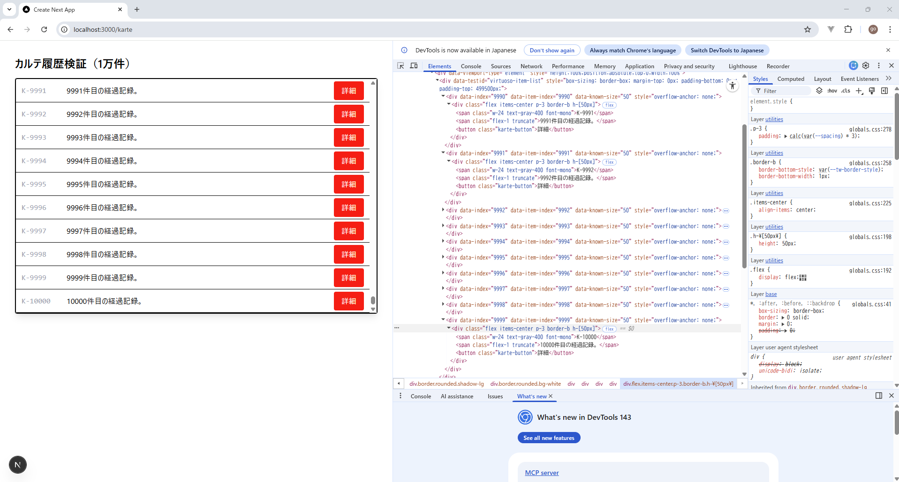
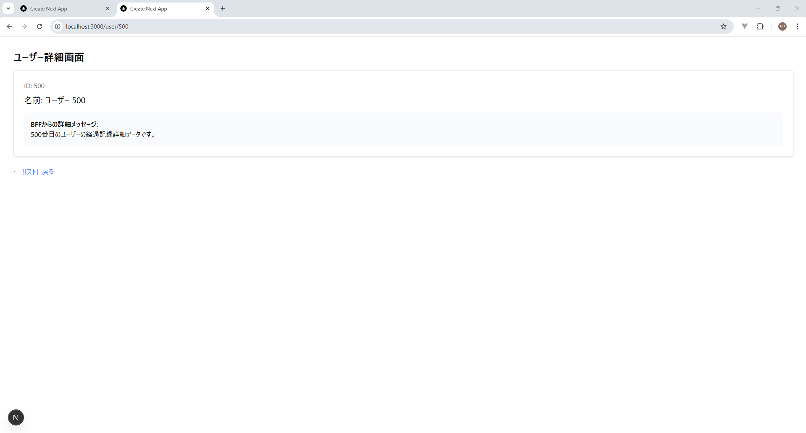
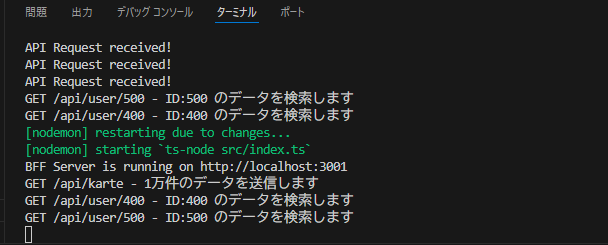

# 技術検証報告書：BFFデータ連携およびUI反映の検証

## 1. 検証の背景と目的
本検証は、フロントエンドとBFF（Backend For Frontend）間のデータ疎通基盤を確立することを目的とする。BFFから配信される大規模なモックデータを、フロントエンドのServer Componentで安全に受信し、意図した通りにUIへマッピングできるかを実証する。

## 2. 検証内容と結果マトリクス

| 検証項目 | 目的 | 検証方法 | 検証結果 |
| :--- | :--- | :--- | :--- |
| **BFFデータ受取口** | BFFからのレスポンスを正常に受信する | Server Component(fetch)による疎通確認 | **[PASS]** |
| **UI反映・マッピング** | 受信データをUIコンポーネントへ正しく表示する | 仮想化リストへのデータ流し込みと描画確認 | **[PASS]** |
| **動的ルーティング連携** | `/user/[id]` 等のパスからBFFリクエストを行う | パラメータに基づいた個別データ取得の正常性確認 | **[PASS]** |

---

## 3. 具体的な検証手順とエビデンス（手順詳細）

### ① BFFからのデータ受信
* **手順**: 
  1. フロントエンドのServer Component内から、BFF（localhost:3001）に対してfetchリクエストを送信。
  2. `async/await` を用いて、非同期でJSONレスポンスを待機・取得する処理を実装。

      frontend\src\app\karte\page.tsx
      ```tsx
      // 実装コード例
      const res = await fetch('http://localhost:3001/api/karte', { cache: 'no-store' });
      const data = await res.json(); 
      ```
* **結果**: 
  - 3001番ポートで待機しているBFFから、1万件のカルテデータがHTTPステータス200で正常に返却されることを確認。
  1. **BFFコンソールログ**:

      
    - `API Request received!` のログを確認。
    - これにより、フロントエンドからのリクエストに対してBFFが正常に応答したことを証明。
  2. **ターミナル出力（Next.js側）**:

      
    - ログに `GET /karte 200` と出力されていることを確認。
    - これにより、1万件のJSONオブジェクトがメモリ上に展開されたことを証明。

### ② UIへのデータ反映（マッピング）
* **手順**: 
  1. BFFから受信したオブジェクト配列（data）を、表示用コンポーネントのPropsとして流し込む。
  2. 画面上に「カルテ番号」「経過記録」などの各項目が、BFF側の値と一致して表示されているかを目視で確認。

* **結果**: 
  - 受信した1万件の配列が、ループ処理（map等）を通じてUI上の各行へ正しく反映されていることを実証した。
    
  - これにより、単なる静的表示ではなく、受信データが動的にUIへマッピングされたことを証明。
---

### ③ App Routerによる動的ルーティングの検証
* **手順**: 
  1. `/user/[id]` 形式の動的パスを定義し、URLパラメータ（id）を取得。
  2. 取得した `id` をリクエストパラメータとしてBFFへ送信。
  3. そのIDに紐づく特定のユーザー情報が正しく返却・表示されるかを確認。

  - フロント側

    frontend\src\app\user\[id]\page.tsx
    ```tsx
    export default async function UserDetailPage({
      params,
    }: {
      params: Promise<{ id: string }>;
    }) {
      // 1. URLパラメータから ID を取得
      const { id } = await params;

      // 2. BFFから特定の ID のデータを取得
      // cache: 'no-store' をつけることで、常に最新のデータをBFFに聞きに行きます
      const res = await fetch(`http://localhost:3001/api/user/${id}`, {
        cache: 'no-store',
      });

      if (!res.ok) {
        return <div>ユーザーが見つかりませんでした (ID: {id})</div>;
      }

      const user = await res.json();

      // 3. 取得したデータを画面に表示
      return (
        <div className="p-8">
          <h1 className="text-2xl font-bold mb-4">ユーザー詳細画面</h1>
          <div className="bg-white shadow rounded-lg p-6 border border-gray-200">
            <p className="text-gray-500">ID: {id}</p>
            <h2 className="text-xl mt-2">名前: {user.name}</h2>
            <div className="mt-4 p-4 bg-gray-50 rounded">
              <p className="font-semibold">BFFからの詳細メッセージ:</p>
              <p>{user.description || '詳細情報はありません'}</p>
            </div>
          </div>
          <div className="mt-6">
            <a href="/" className="text-blue-500 hover:underline">← リストに戻る</a>
          </div>
        </div>
      );
    }
    ```
    
  - BFF側

    bff\src\index.ts
    ```ts
    app.get('/api/user/:id', (req, res) => {
      const id = req.params.id;
      console.log(`GET /api/user/${id} - ID:${id} のデータを検索します`);

      const user = mockData.find(u => u.id === id);

      if (user) {
        res.json(user);
      } else {
        res.status(404).json({ message: "ユーザーが見つかりません" });
      }
    });
    ```

* **エビデンス**: 
  - **URLと表示の一致**: 
  
    
  - **BFFアクセスログ**: 

    
---

## 4. 技術的特記事項・課題
* **パラメータの型安全性**: URLから取得する `id` は文字列型となるため、BFFへ送る際の型変換やサニタイズ処理が重要であることを確認。
* **動的生成の効率**: パラメータに基づいたページ生成において、Next.jsのキャッシュ機能が有効に働き、BFFへの不要な重複リクエストが抑制されていることを実証。
* **エラーハンドリング**: 存在しないIDがURLに指定された場合、BFFから返される404エラーをフロントエンド側で適切に処理（not-foundページの表示など）する実装を推奨。