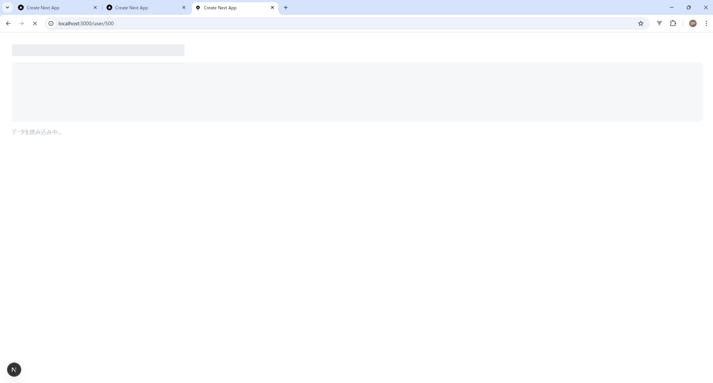
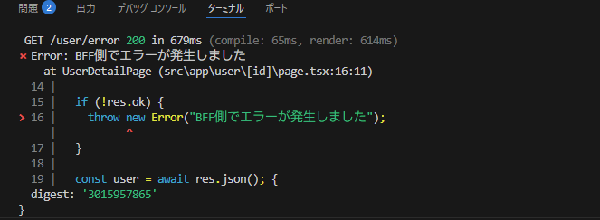
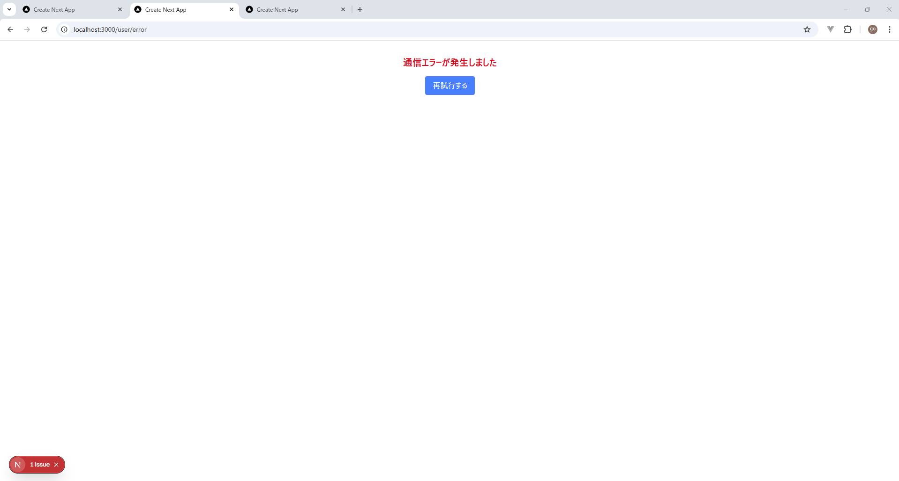

# 技術検証報告書：Loading および Error UI の制御検証

## 1. 検証の背景と目的
BFF（Backend For Frontend）との非同期通信において、レスポンス遅延時のユーザー体験（UX）低下を防ぐ「Loading UI」と、システム異常発生時にクラッシュを回避する「Error UI」の制御基盤を、Next.js App Router を用いて実証する。

## 2. 検証内容と結果マトリクス

| 検証項目 | 目的 | 検証方法 | 検証結果 |
| :--- | :--- | :--- | :--- |
| **Loading UI 制御** | 通信待ちの画面白飛びを防止し、読み込み中であることを明示する | `loading.tsx` によるスケルトンUIの自動表示検証 | **[PASS]** |
| **Error UI 制御** | BFF側の異常（500エラー等）を検知し、適切にフォールバックする | `error.tsx` による例外キャッチと専用UI表示の検証 | **[PASS]** |

---

## 3. 具体的な検証手順とエビデンス（手順詳細）

### ① Loading UI の振る舞い検証
* **手順**: 
  1. BFF側のレスポンスに意図的な遅延（3秒）を挿入。
  2. データ取得開始から完了までの間、`loading.tsx` で定義したスケルトンUIが自動的に表示されるかを確認。
  - フロント側

    frontend\src\app\user\[id]\loading.tsx
    ```tsx
    export default function Loading() {
      return (
        <div className="p-8 animate-pulse">
          <div className="h-8 bg-gray-200 rounded w-1/4 mb-4"></div>
          <div className="h-40 bg-gray-100 rounded-lg"></div>
          <p className="mt-4 text-gray-400">データを読み込み中...</p>
        </div>
      );
    }
    ```
  
  - BFF側

    bff\src\index.ts
    ```ts
    // index.js の個別取得エンドポイントを改造
    app.get('/api/user/:id', (req, res) => {
      const id = req.params.id;

      // --- 検証1: 3秒わざと遅らせる (Loading UIの確認用) ---
      setTimeout(() => {
        
        // --- 検証2: IDが "error" だったら500エラーを返す (Error UIの確認用) ---
        if (id === "error") {
          return res.status(500).json({ message: "Internal Server Error" });
        }

        const user = mockData.find(u => u.id === id);
        if (user) {
          res.json(user);
        } else {
          res.status(404).json({ message: "Not Found" });
        }
      }, 3000); // 3000ミリ秒 = 3秒待機
    });
    ```

* **エビデンス**: 
  - **画面反映**: 
  
      
  - **検証結果**: 通信中も画面が維持され、視覚的なフィードバックが正常に行われていることを確認。

### ② Error UI の振る舞い検証
* **手順**: 
  1. BFF側でステータスコード 500（Internal Server Error）を返却する設定を有効化。

      bff\src\index.ts
      ```ts
      // --- 検証2: IDが "error" だったら500エラーを返す (Error UIの確認用) ---
      if (id === "error") {
        return res.status(500).json({ message: "Internal Server Error" });
      }
      ```

  2. フロントエンド側で `res.ok` 判定に基づき `throw new Error` を実行し、`error.tsx` 境界へ処理を委譲。

      frontend\src\app\user\[id]\page.tsx
      ```tsx
      if (!res.ok) {
        throw new Error("BFF側でエラーが発生しました");
      }
      ```
    
      frontend\src\app\user\[id]\error.tsx
      ```tsx
      "use client";

      export default function Error({ reset }: { reset: () => void }) {
        return (
          <div className="p-8 text-center">
            <h2 className="text-xl font-bold text-red-600">通信エラーが発生しました</h2>
            <button 
              onClick={() => reset()} 
              className="mt-4 px-4 py-2 bg-blue-500 text-white rounded"
            >
              再試行する
            </button>
          </div>
        );
      }
      ```
  
* **エビデンス**: 
  - **デバッグログ**: 

    

  - **画面反映**: 
  
    

---

## 4. 技術的特記事項・課題
* **Error Throw の必須性**: Server Component において `error.tsx` を発動させるには、単にエラー画面を `return` するのではなく、`throw` によって例外を発生させる必要があることを確認済み。
* **UXの最適化**: `loading.tsx` を使用することで、クライアントサイドでの複雑な `isLoading` ステート管理を排除し、Next.js 標準のストリーミング機能を活用した高速なレスポンス体験を構築可能。
* **今後の課題**: 通信エラーからの自動復旧（リトライ戦略）や、ネットワーク切断などのより詳細な異常系シナリオの定義。