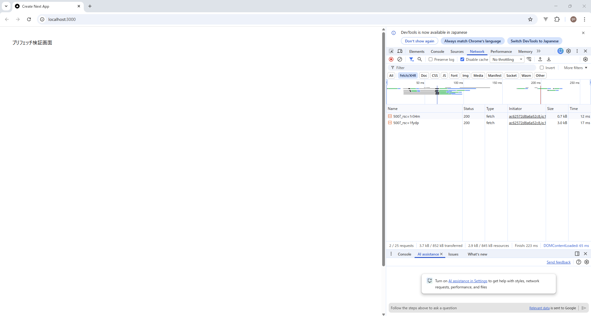

# 技術検証報告書：Linkコンポーネントによるプリフェッチの検証

## 1. 検証の背景と目的
Next.jsの `<Link>` コンポーネントが持つプリフェッチ機能を活用し、ユーザーが遷移アクションを起こす前にデータを事前取得することで、画面遷移の高速化とユーザー体験（UX）の向上を実証する。

## 2. 検証内容と結果マトリクス

| 検証項目 | 期待される結果 | 判定 |
| :--- | :--- | :--- |
| **Linkコンポーネントによるプリフェッチ** | リンクがビューポートに入った際、遷移先のデータが事前に読み込まれ、画面遷移が瞬時に行われること。 | **[PASS]** |

---

## 3. 具体的な検証手順とエビデンス

### ① プリフェッチ挙動の確認
* **手順**: 
  1. 検証用ホームページ（app/page.tsx）の実装: BFFから取得したデータリストを表示し、詳細画面への <Link> を配置する以下のコードを起点とする。

      frontend\src\app\user\[id]\page.tsx
      ```tsx
      import Link from 'next/link';

      export default function HomePage() {
        return (
          <div className="p-10">
            <h1>プリフェッチ検証画面</h1>
            <div style={{ marginTop: '100px' }}>
              <Link href="/user/500" className="p-4 bg-blue-500 text-white">
                ユーザー500の詳細を見る（プリフェッチ対象）
              </Link>
            </div>
          </div>
        );
      }
      ```
  2. 本番ビルド環境（`npm run build` / `npm start`）にて検証を実施。
  3. デベロッパーツールの Network タブを監視しながら、リンクをビューポート内に表示させる。
* **検証結果**: 
  - リンクが画面に表示された直後、バックグラウンドで `user/500?_rsc=...` という形式の通信が発生することを確認。
  - 実際のクリック時には追加のネットワーク通信が発生せず、瞬時に画面遷移が行われた。
    

  ### 補足：検証環境に関する特記事項
  * **プリフェッチの動作条件**: 
    Next.jsの仕様に基づき、プリフェッチの挙動確認は `npm run build` 後の本番実行環境（`npm start`）にて実施。開発モード（`dev`）では開発効率を優先し、プリフェッチが無効化される仕様であることを確認済み。
  * **データ形式**: 
    プリフェッチ時の通信は通常のJSONではなく、Next.js独自のRSC（React Server Components）ペイロードとして最適化されて送受信される。
  
## 4. 技術的特記事項・課題
* **UXへの寄与**: 1万件のデータリストから個別詳細へ遷移する際、プリフェッチにより「待ち時間ゼロ」の遷移を実現できることを確認した。
* **BFF負荷への考慮**: リンクが画面に入るだけで通信が発生するため、リストが膨大な場合はBFF側へのリクエスト数が増加する。本番運用では `prefetch={false}` の検討や、適切なキャッシュ戦略が必要となる。
* **プリフェッチの適用戦略とBFF負荷の最適化**:
検証の結果、`<Link>` のプリフェッチはUX向上に極めて有効であるが、全画面で一律に適用するのではなく、以下の使い分けが推奨される。
  * **原則（デフォルト）**: ユーザー体験を最優先し、標準的な遷移ではプリフェッチを有効化する。
  * **大規模リスト表示時**: カルテ履歴のように一度に大量のリンクが並ぶケースでは、BFFへのリクエスト集中を避けるため、`prefetch={false}` 属性（リンク表示時ではなく、マウスホバー時のみ取得する設定）を選択的に活用し、サーバー負荷とUXのバランスを担保する。
