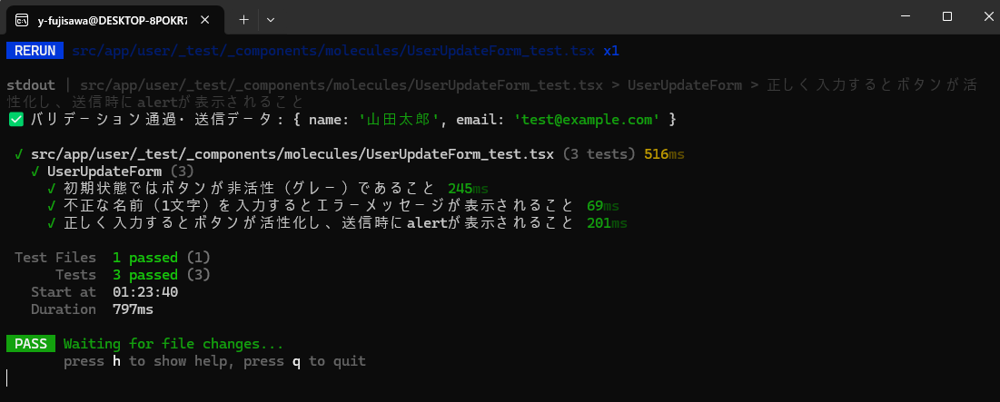
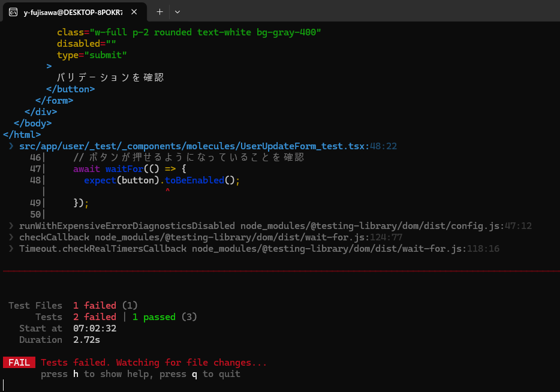

# 技術検証報告書：自動テスト基盤の構築と単体テスト実装の検証

## 1. 検証の背景と目的

方式設計書 7.3項「テスト方針」に基づき、システムの品質向上とデグレードの早期発見を目的とした自動テスト基盤を構築する。
本検証では、軽量かつ高速なテストランナーである **Vitest** と **React Testing Library** を採用し、フロントエンドにおける単体テスト（ロジック・コンポーネント）の実装フローおよびディレクトリ構成の妥当性を実証する。特に、Docker環境下での実行や、シンボリックリンクを介したスキーマ共有環境での動作を重点的に検証する。

---

## 2. 環境構築

本検証にあたり、モダンなViteエコシステムに基づいたパッケージ導入と、特殊なディレクトリ構成（Monorepo構成）に対応するための設定を行った。

* **ライブラリ導入**:
  ```bash
  # コンテナ内での権限および依存解決を考慮したインストール
  npm install -D vitest @testing-library/react @testing-library/jest-dom jsdom @testing-library/user-event @vitejs/plugin-react zod react-hook-form @hookform/resolvers

  ```

    **今回のPOCで構築した環境に含まれる全ライブラリの構成**

  | 分類 | ライブラリ名 (パッケージ名) | 役割・用途 |
  | --- | --- | --- |
  | **テストランナー** | **Vitest** | テストの実行・合否判定を行うメインエンジン。高速なWatchモードを提供。 |
  | **UIテスト** | **React Testing Library** (`@testing-library/react`) | コンポーネントを仮想描画し、ユーザー視点で要素を取得・検証する中心ライブラリ。 |
  | **操作再現** | **user-event** (`@testing-library/user-event`) | キーボード入力やクリックを、ブラウザの挙動に忠実に再現する。 |
  | **検証拡張** | **jest-dom** (`@testing-library/jest-dom`) | `toBeInTheDocument` など、DOMの状態を直感的に検証する命令セット。 |
  | **ブラウザ環境** | **jsdom** | Node.js環境（Docker内）でブラウザの挙動をシミュレートする仮想DOM環境。 |
  | **変換プラグイン** | **@vitejs/plugin-react** | VitestがReactコード（JSX/TSX）を正しく解釈するための公式プラグイン。 |
  | **スキーマ定義** | **zod** | バリデーションルールの定義。テスト時もこの定義に基づきエラーを判定。 |
  | **フォーム管理** | **react-hook-form** | フォームの状態管理。テストにおいて入力値の反映や送信イベントを制御。 |
  | **ライブラリ連携** | @hookform/resolvers | `react-hook-form` と `zod` を接続し、テスト時にバリデーションを発火させる。 |

  > ブラウザ特有の動きや、本番コードと同じチェック機能（バリデーション）をテスト環境でも再現し、開発> 中の修正が本番で正しく動くことを確認するため、上記のライブラリを導入した。


## 3 テストディレクトリ構成と命名規則

AIによるファイル検知と、開発時のファイル移動への追従性を高めるため、テスト対象ファイルと同一階層に `_test` フォルダを配置する構成を採用。

* **構成イメージ**:
  ```text
  src/app/user/
  ├── page.tsx
  ├── _api                                   # ルーティングから除外するため "_" を付与
  ├── _assets
  ├── _components/molecules/
  |                   └─ UserUpdateForm.tsx      # 実装コード
  |
  └── _test/                                     # テスト専用ディレクトリ
        └─ _components/molecules/               # 実装側とディレクトリ構造を完全に一致させる
                            └── UserUpdateForm_test.tsx    # 命名規則: {対象名}_test.tsx

  ```

---

## 4. 検証手順とエビデンス

本セクションでは、**「ユーザー情報更新画面（UserUpdateForm）」**を具体的な検証対象（テストページ）とし、自動テストが正常に動作するまでの実装工程と、修正・追加した全てのファイル内容を記述する。

### ① 検証のステップ

1. **環境設定**: Vitestをプロジェクトに適合させるための設定ファイルを追加。
2. **実装コードの調整**: テストコードから要素を特定しやすくするため、既存コンポーネントのHTML構造（アクセシビリティ）を改善。
3. **テストコードの作成**: 正常系（ボタン活性化）および異常系（バリデーションエラー）のテストを記述。
4. **テスト実行**: Dockerコンテナ内でテストを実行し、全ケースのパスを確認。

### ② 追加・修正したファイル一覧とその内容

今回のPOCにあたり、追加・変更した全ファイルの内容は以下の通りである。

#### 1. [新規] Vitest全体設定

* プロジェクトのルートに配置し、ブラウザ環境のシミュレーションやエイリアス、シンボリックリンクの解決を定義。

  `frontend/pocs/vitest.config.ts`
  ```typescript
  import { defineConfig } from 'vitest/config';
  import react from '@vitejs/plugin-react';
  import path from 'path';

  export default defineConfig({
    plugins: [react()],
    test: {
      globals: true,
      environment: 'jsdom',
      setupFiles: './src/app/_shared/plugins/setup.ts',
      include: ['src/app/**/_test/**/*.{ts,tsx}'],
    },
    // ここから追加：Viteのファイルシステム制限を緩和
    server: {
      fs: {
        allow: [
          '/app',                // プロジェクトルート
          '/front_bff_shared'    // シンボリックリンクの実体側
        ]
      }
    },
    resolve: {
        preserveSymlinks: true, // シンボリックリンクをそのままのパスとして扱う
        alias: {
          '@': path.resolve(__dirname, './src'),
        },
      },
  });

  ```

#### 2. [新規] テストセットアップ設定

* 各テスト実行前に、DOM検証用の拡張機能を読み込む設定。

  `frontend/pocs/src/app/_shared/plugins/setup.ts`
  ```typescript
  import '@testing-library/jest-dom/vitest'; // toBeInTheDocumentなどの便利な命令を使えるようにする
  import { cleanup } from '@testing-library/react';
  import { afterEach } from 'vitest';

  // 各テスト（it）が終わるたびに、描画されたDOMをリセットする
  afterEach(() => {
    cleanup();
  });
  ```

#### 3. [修正] ユーザー詳細画面のコンポーネント

* テスト時に `Label` から `Input` を確実に特定できるよう、`htmlFor` と `id` を紐付けるアクセシビリティ改善を実施。

  `frontend/pocs/src/app/user/_components/molecules/UserUpdateForm.tsx`
  ```tsx
  // 抜粋：名前・メールアドレス入力フィールド
        <div>
          <label htmlFor="user-name" className="block text-sm font-medium">名前 (2〜10文字)</label>
          <input 
            id="user-name"
            {...register('name')} 
            className={`border w-full p-2 rounded ${errors.name ? 'border-red-500' : 'border-gray-300'}`}
          />
          {errors.name && <p className="text-red-500 text-xs mt-1">{errors.name.message}</p>}
        </div>

        <div>
          <label htmlFor="user-email" className="block text-sm font-medium">メールアドレス</label>
          <input 
            id="user-email"
            {...register('email')} 
            className={`border w-full p-2 rounded ${errors.email ? 'border-red-500' : 'border-gray-300'}`}
          />
          {errors.email && <p className="text-red-500 text-xs mt-1">{errors.email.message}</p>}
        </div>

  ```

#### 4. [新規] テストコード

* 「ユーザー詳細」の更新機能を想定したテスト。バリデーション発火とalert表示の検証を含む。

  `frontend/pocs/src/app/user/_test/_components/molecules/UserUpdateForm_test.tsx`
  ```tsx
  import { render, screen, waitFor } from '@testing-library/react';
  import userEvent from '@testing-library/user-event';
  import { UserUpdateForm } from '@/app/user/_components/molecules/UserUpdateForm';
  import { describe, it, expect, vi } from 'vitest';

  describe('UserUpdateForm', () => {
    // 共通の準備：ユーザー操作のシミュレーターをセットアップ
    const setup = () => {
      const user = userEvent.setup();
      render(<UserUpdateForm />);
      return { user };
    };

    it('初期状態ではボタンが非活性（グレー）であること', () => {
      setup();
      const button = screen.getByRole('button', { name: 'バリデーションを確認' });
      expect(button).toBeDisabled(); // isValidがfalseなのでdisabledになるはず
    });

    it('不正な名前（1文字）を入力するとエラーメッセージが表示されること', async () => {
      const { user } = setup();
      
      // 「名前」のラベルが付いた入力欄を取得
      const nameInput = screen.getByLabelText(/名前/);
      
      // 1文字だけ入力
      await user.type(nameInput, 'あ');

      // バリデーションエラーが出るまで待機して確認
      // (Zodのメッセージはschema側にあるはずですが、一般的に「文字数」に関するエラーが出ることを期待します)
      await waitFor(() => {
        expect(screen.getByText(/2文字以上/)).toBeInTheDocument();
      });
    });

    it('正しく入力するとボタンが活性化し、送信時にalertが表示されること', async () => {
      const { user } = setup();
      const alertMock = vi.spyOn(window, 'alert').mockImplementation(() => {});

      // 正しいデータを入力
      await user.type(screen.getByLabelText(/名前/), '山田太郎');
      await user.type(screen.getByLabelText(/メール/), 'test@example.com');

      const button = screen.getByRole('button', { name: 'バリデーションを確認' });

      // ボタンが押せるようになっていることを確認
      await waitFor(() => {
        expect(button).toBeEnabled();
      });

      // クリック
      await user.click(button);

      // alertが呼ばれたか確認
      expect(alertMock).toHaveBeenCalledWith(expect.stringContaining('バリデーションを通過しました'));

      alertMock.mockRestore();
    });
  });

  ```

### ③ エビデンス（実行結果）

* Vitest設定ファイル（vitest.config.ts）があるディレクトリで `npx vitest` を実行した結果、作成した全てのテストケースが **PASS** することを確認。

  

---

## 5. テスト失敗時の挙動

* 本検証では、意図的に共有スキーマ（`user.schema.ts`）のバリデーションルールを「2文字以上」から「5文字以上」へ変更し、テストを実行した。  

  `frontend/pocs/src/front_bff_shared/schemas/user.schema.ts`
  ```typescript
  import { z } from 'zod';

  export const userUpdateSchema = z.object({
    //min(2, "名前は2文字以上で入力してください") → min(5, "名前は5文字以上で入力してください") へ変更
    name: z.string().min(5, "名前は5文字以上で入力してください").max(10, "10文字以内で入力してください"),
    email: z.string().email("有効なメールアドレス形式で入力してください"),
  });

  export type UserUpdateInput = z.infer<typeof userUpdateSchema>;

  ```

  **結果と効果**:
  * **即時のエラー検知**: `npx vitest` を実行した瞬間に、関連するテストケースが **FAIL** となり、仕様変更による影響範囲が直ちに特定された。
  * **具体的な失敗理由の提示**:
  * 期待していたエラー文言（2文字以上）が表示されていないこと。
  * 以前は「正常」とされていた入力値（4文字）が「異常」と判定され、ボタンが活性化しなくなったこと。  

    

  **結論**:  
  このように、共通スキーマやコンポーネントのロジックに修正を加えた際、**「どこが、どのように壊れたか」を人間が画面を確認する前にプログラムが教えてくれる**。これにより、意図しないデグレード（品質退行）を未然に防ぐことが可能であることを実証した。

---
## 6. 検証内容と結果マトリクス

| 検証項目 | 目的 | 検証方法 | 検証結果 |
| --- | --- | --- | --- |
| **テスト環境の構築** | Dockerコンテナ内での安定稼働 | `Vitest` + `jsdom` による実行環境の構築 | **[PASS]** |
| **依存関係の解決** | シンボリックリンク先のZod参照 | `preserveSymlinks` 設定による外部スキーマ読み込み | **[PASS]** |
| **コンポーネントテスト** | ユーザー操作のシミュレーション | `React Testing Library` + `user-event` による検証 | **[PASS]** |
| **ディレクトリ構成** | メンテナンス性とAI親和性 | `_test` フォルダ配置と `{ファイル名}_test.tsx` の適用 | **[PASS]** |
| **バリデーション連携** | スキーマ共有の妥当性 | 共有スキーマに基づいたエラーメッセージの表示検証 | **[PASS]** |

---

## 7. 結論

本POCにより、Docker・Monorepoという複雑な環境下でも、Vitestを用いた高速なテストサイクルが構築可能であることを確認した。
特に `preserveSymlinks` による共有スキーマの解決と、`_test` ディレクトリによるファイル配置ルールは、今後のAIによる自動コーディングを促進する上で極めて有効な指針となる。

---

## 8. TODO (今後の検討事項)

* **カバレッジレポートの出力**: `vitest/coverage-v8` を導入し、CI上でカバレッジ80%を自動計測する。
* **MSWによるBFFモック**: BFF APIとの通信をインターセプトし、ローカル環境のみで完結する結合テストの実装。
* **AIプロンプトの標準化**: Claude Code等に渡すための、本ディレクトリ構成に基づいたテスト生成用システムプロンプトの作成。
