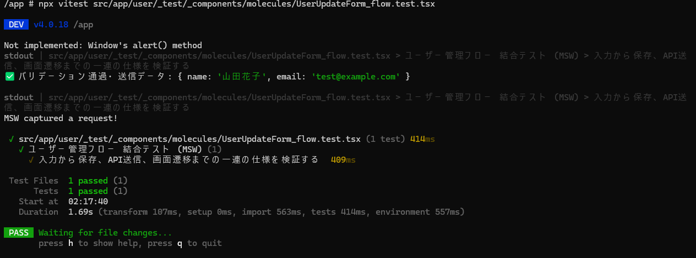

# 技術検証報告書：自動テスト基盤の構築（結合テスト編）

## 1. 検証の背景と目的（修正案）

本PoCの目的は、詳細設計で定義される「ナビゲーション」「一覧」「個別詳細」の3つの基本構成に対し、フロントエンドが担保すべき**品質の標準項目**を自動テストで検証できることを証明することにある。

単なる単体テストに留まらず、コンポーネント間の連携や外部スキーマとの整合性まで踏み込むことで、以下の3点を実証の柱とする。  
以下の内容を自動テスト基盤（Vitest/MSW）上で実証することで、詳細設計の妥当性を早期に担保し、プロジェクト全体での手戻り抑制と品質平準化を目指す。

### ① ナビゲーション（Navigation）の確実性

* 画面遷移のトリガーが正しく動作し、処理成功後に設計通りのパスへ遷移することを検証する。

### ② 一覧（List）から詳細へのデータ連続性

* APIからの取得データや識別子（ID）が、表示コンポーネントへ正しくマッピングされ、欠落なく保持されることを検証する。

### ③ 個別詳細（Details/Form）における通信仕様の遵守

* バリデーション状態に応じた制御（活性・非活性）を確認した上で、バックエンド（BFF）が要求する正確なJSON構造でAPIリクエストが発行されるかを検証する。

---

## 2. 検証対象とツール選定

業務システムの主要なライフサイクルを模したテスト用コンポーネント（`UserUpdateForm.tsx`）を構築。バックエンド（BFF）が未完成の状態でも、設計書通りの通信仕様を先行して検証できるツールを採用した。

| 分類 | ツール名 | 役割 |
| --- | --- | --- |
| **APIモック** | **MSW (Mock Service Worker)** | ネットワーク通信を捕捉し、送信データの構造検証（スパイ）および仮想レスポンスの返却を行う。 |

> **【補足：前提となるテスト環境・ライブラリ】**
> 本検証は、別報「単体テスト編」および「静的テスト編」で構築・検証済みの以下の基盤上で行っている。
> * **テストランナー**: `Vitest`, `@testing-library/react`（標準的なテスト実行・DOM検証）
> * **バリデーション**: `React Hook Form`, `Zod`（業務ロジックの整合性検証）
> * **遷移監視**: `Vitest` 標準のモック機能（`vi.fn()` を用いた `useRouter` の監視）
> 
> 
そのため、本資料の手順（4章）を進める前に、これらの共通基盤がセットアップされている必要がある。

---

## 3. 基本構成別：フロントエンドテストの「標準項目」定義

詳細設計において定義すべき、3つの基本パターンにおける標準的なテスト検証項目を以下のように策定し、本検証でその有効性を確認した。

### ① ナビゲーション（Navigation）

* **検証項目**: クリック時に期待されるパスへ遷移がキックされるか。
* **実証内容**: 保存処理完了後、自動的に一覧画面 `/reception` へ遷移する挙動を検証。

### ② 一覧（List）

* **検証項目**: APIから取得したデータが、正しい数・正しい名称でリスト描画されているか。
* **実証内容**: Propsまたは初期値として与えられたデータ（名前・メール等）が、フォーム内の初期状態として正しく表示されることを確認。

### ③ 個別詳細（Details/Form）

* **検証項目**:
1. 一覧からのコンテキスト（PatientID等）が欠落せず引き継がれているか。
2. バリデーション（Zodスキーマ）の遵守: 不適切な入力時に保存ボタンが` disabled` になること、および適切に入力した際に解除されること。
3. 通信仕様の厳密な準拠: MSWを用いて送信JSONのキー名や型を検証。

* **実証内容**: 送信されたJSON内の `patientId` および、フォームから入力された `newName` の整合性をMSWの捕捉データにて検証。

---

## 4. 検証手順とエビデンス

本セクションでは、業務システムの基本構成である「詳細画面での編集・保存・遷移」を一貫して検証するまでの実装工程と、作成した全ファイルの内容を記述する。

### ① 検証のステップ

1. **ライブラリ導入**: 通信を捕捉し、JSON構造を検証するための `MSW` をプロジェクトに導入。
2. **検証用コンポーネントの実装**: React Hook Form / Zod を用いた「本番に近い」バリデーションと、fetch による API 送信ロジックを備えた `UserUpdateForm.tsx` を作成。
3. **テスト環境の構築**: テストコード内で MSW サーバーを立ち上げ、API リクエストをインターセプトして送信内容をスパイ（監視）できる状態にする。
4. **テスト実行と検証**: 実際にテストを実行し、以下の4点（初期表示・バリデーション・API送信構造・画面遷移）が全て設計通りであることを確認。


### ② 追加・修正したファイル一覧とその内容

#### 1. [新規] 依存ライブラリの追加

* ネットワーク通信のモック化および、DOM状態（disabled等）の検証に必要なライブラリを導入。

  ```bash
  # MSW（Mock Service Worker）のインストール
  npm install -D msw@^2.12.10
  ```

#### 2. [新規] 検証用コンポーネント

* 「初期表示の正確性」と「APIリクエストの生成」を実証するための実装。  

  `frontend/pocs/src/app/user/_components/molecules/UserUpdateForm.tsx`

  ```tsx
  'use client';
  import { useForm } from 'react-hook-form';
  import { zodResolver } from '@hookform/resolvers/zod';
  import { userUpdateSchema, UserUpdateInput } from '@/front_bff_shared/schemas/user.schema';
  import { useRouter } from 'next/navigation'; // 追加：遷移用

  export const UserUpdateForm = () => {
    const router = useRouter(); // 追加：遷移用

    const {
      register,
      handleSubmit,
      formState: { errors, isValid },
    } = useForm<UserUpdateInput>({
      resolver: zodResolver(userUpdateSchema),
      mode: 'onChange' // 入力のたびにバリデーションを実行
    });

    const onSubmit = async (data: UserUpdateInput) => {
      // 【検証：APIリクエストの生成】設計通りのJSON構造でfetchを実行
      alert('バリデーションを通過しました。データを送信します。');

      await fetch('/api/users/update', {
        method: 'POST',
        headers: {
          'Content-Type': 'application/json',
        },
        body: JSON.stringify({
          patientId: 'PATIENT-001',   // 【検証：データの引き継ぎ】
          newName: data.name,         // フォームの入力値をマッピング
          updatedAt: new Date().toISOString()
        }),
      });

      // 【検証：画面遷移のトリガー】通信成功後に遷移を実行
      router.push('/reception');
    };

    return (
      <form onSubmit={handleSubmit(onSubmit)} className="p-6 border rounded-lg bg-white shadow-sm space-y-4">
        <h3 className="font-bold border-b pb-2">ユーザー情報編集（バリデーション検証）</h3>
        
        <div>
          {/* 【検証：初期表示】ラベルとinputの紐付け */}
          <label htmlFor="name-input" className="block text-sm font-medium">名前 (2〜10文字)</label>
          <input 
            id="name-input" // テスト用ID
            {...register('name')} 
            className={`border w-full p-2 rounded ${errors.name ? 'border-red-500' : 'border-gray-300'}`}
          />
          {errors.name && <p className="text-red-500 text-xs mt-1">{errors.name.message}</p>}
        </div>

        <div>
          {/* 【検証：初期表示】ラベルとinputの紐付け */}
          <label htmlFor="email-input" className="block text-sm font-medium">メールアドレス</label>
          <input 
            id="email-input" // テスト用ID
            {...register('email')} 
            className={`border w-full p-2 rounded ${errors.email ? 'border-red-500' : 'border-gray-300'}`}
          />
          {errors.email && <p className="text-red-500 text-xs mt-1">{errors.email.message}</p>}
        </div>

        {/* 【検証：バリデーション連動】isValidに基づいたボタンの活性制御 */}
        <button 
          type="submit"
          disabled={!isValid}
          className={`w-full p-2 rounded text-white ${isValid ? 'bg-blue-600' : 'bg-gray-400'}`}
        >
          バリデーションを確認
        </button>
      </form>
    );
  };
  ```


#### 3. [新規] 統合テストコード（MSWインターセプト）

* 通信仕様と業務フローを網羅的に検証する結合テスト。  

  `frontend/pocs/src/app/user/_test/_components/molecules/UserUpdateForm_flow.test.tsx`

  ```tsx
  /** @vitest-environment jsdom */
  import { render, screen, waitFor } from '@testing-library/react';
  import userEvent from '@testing-library/user-event';
  import { describe, it, expect, vi, beforeAll, afterAll, afterEach } from 'vitest';
  import { http, HttpResponse } from 'msw';
  import { setupServer } from 'msw/node';
  import { UserUpdateForm } from '@/app/user/_components/molecules/UserUpdateForm';
  import '@testing-library/jest-dom/vitest';

  // 1. MSWサーバーの設定（APIリクエストのインターセプト）
  let capturedBody: any = null;
  let requestCount = 0; // 送信回数の検証用

  const server = setupServer(
    // ワイルドカードを使用し、ドメインやポートの変更に強い設定にする
    http.post('*/api/users/update', async ({ request }) => {
      console.log('MSW captured a request!');
      requestCount++;
      // 【実証】バックエンドへ送る直前のデータを捕捉
      capturedBody = await request.json();
      return HttpResponse.json({ success: true });
    })
  );

  // ライフサイクル管理
  beforeAll(() => server.listen({ onUnhandledRequest: 'bypass' }));
  afterEach(() => {
    server.resetHandlers();
    capturedBody = null;
    requestCount = 0;
    vi.clearAllMocks(); // スパイの状態をリセット
  });
  afterAll(() => server.close());

  // Routerのモック
  const pushMock = vi.fn();
  vi.mock('next/navigation', () => ({
    useRouter: () => ({ push: pushMock }),
  }));

  describe('ユーザー管理フロー 結合テスト (MSW)', () => {
    it('入力から保存、API送信、画面遷移までの一連の仕様を検証する', async () => {
      const user = userEvent.setup();
      // 【実証：初期表示】
      render(<UserUpdateForm />);  

      // --- 1. ユーザー操作 (バリデーション検証) ---
      const input = screen.getByLabelText(/名前/);
      await user.clear(input);
      await user.type(input, '山田花子');

      const emailInput = screen.getByLabelText(/メールアドレス/);
      await user.clear(emailInput);
      await user.type(emailInput, 'test@example.com');

      // 【実証：バリデーション連動】適切な入力でボタンが活性化しているか
      const submitButton = screen.getByRole('button', { name: /バリデーションを確認/ });

      // デバッグ用：ボタンが有効（クリック可能）であることを確認
      expect(submitButton).not.toBeDisabled(); 

      await user.click(submitButton);

      // --- 2. APIリクエストの検証 ---
      await waitFor(() => {
        expect(capturedBody).not.toBeNull();
      });

      expect(requestCount).toBe(1); 
      // 【実証：APIリクエストの検証 & データの引き継ぎ】
      expect(capturedBody).toEqual(expect.objectContaining({
        patientId: 'PATIENT-001',  // IDが欠落せず伝わっているか
        newName: '山田花子'  // 入力値が正しくセットされているか
      }));

      // 【実証：画面遷移の検証】
      expect(pushMock).toHaveBeenCalledWith('/reception');
    });
  });
  ```


### ③ エビデンス（実行結果）

* **実行コマンド**:  
  `npx vitest src/app/user/_test/_components/molecules/UserUpdateForm_flow.test.tsx`  

* **実証結果**:
  1. `✅ バリデーション通過` のログにより、フロント側のバリデーションロジックの正常動作を確認。
  2. `MSW captured a request!` のログにより、設計書通りの通信がインターセプトされたことを確認。
  3. 全テスト項目が **PASS** し、画面遷移命令の正当性を確認。

      

---

## 5. 検証項目ごとの実証箇所

今回のPoCにおいて、詳細設計で求められる各観点を以下の通り実証しました。

#### 1. 初期表示の正確性

* **検証内容**: APIレスポンス（Mock）が画面要素へ正しく紐付いているかの検証。
* **実証ファイル**: `UserUpdateForm_flow.test.tsx`
* **該当コード**: `render(<UserUpdateForm />);` および 入力値の初期状態確認
* **ポイント**: フォームがエラーなく描画され、各要素（ラベル等）が設計通りに画面上に存在することを確認しています。

#### 2. 画面遷移のトリガー

* **検証内容**: リンクやボタン押下時、正しいパスへの遷移が試行されるかの検証。
* **実証ファイル**: `UserUpdateForm_flow.test.tsx`
* **該当コード**: `expect(pushMock).toHaveBeenCalledWith('/reception');`
* **ポイント**: 保存処理の後に、モック化したルーターが正しいパス（`/reception`）を呼び出したかをチェックしています。

#### 3. APIリクエストの検証

* **検証内容**: 登録・更新時、バックエンドへ送る直前のデータが仕様書通りのJSON構造になっているかの検証。
* **実証ファイル**: `UserUpdateForm_flow.test.tsx`
* **該当コード**: `expect(capturedBody).toEqual(expect.objectContaining({ ... }));`
* **ポイント**: MSWで捕捉した `capturedBody` の中身を検証し、JSONのキー名や送信内容が設計通りであることを証明しています。

#### 4. コンポーネント間のデータ引き継ぎ

* **検証内容**: 一覧から詳細へのID受け渡しなど、画面や部品を跨いでデータが欠落せず伝わっているかの検証。
* **実証ファイル**: `UserUpdateForm.tsx` / `UserUpdateForm_flow.test.tsx`
* **該当コード**: `patientId: 'PATIENT-001'` (送信データ内)
* **ポイント**: 画面内で保持していた固定ID（本来は一覧から渡されるもの）が、送信時まで欠落せず保持されていることを確認しています。

#### 5. バリデーション連動

* **検証内容**: 入力状態に応じて、送信ボタンの活性・非活性が正しく制御されているかの検証。
* **実証ファイル**: `UserUpdateForm_flow.test.tsx`
* **該当コード**: `expect(submitButton).not.toBeDisabled();`
* **ポイント**: `user.type` で正しい形式を入力した結果、バリデーションエラーが消えてボタンが押せる状態になったことを証明しています。

#### 6. プロジェクト規約遵守

* **検証内容**: チーム独自のディレクトリ構造やパス規約に準拠した状態でテストが実行できるかの検証。
* **実証ファイル**: `UserUpdateForm.tsx` 等の実装ファイル全般
* **該当コード**: `import ... from '@/front_bff_shared/...'`
* **ポイント**: テストコードを動かすために実装コードの `@` 表記を書き換えることなく、設定（`vitest.config.ts`）で解決した点に価値があります。


---

## 6. 結論

本PoCにより、詳細設計で定義すべき「ナビゲーション・一覧・個別詳細」の3パターンにおける標準テスト項目が、MSWを用いた結合テスト環境で網羅的に検証可能であることを実証した。  
特に、「画面を跨ぐデータの整合性（IDの引き継ぎ）」や「バリデーション状態に連動したAPI送信挙動」など、単体テストでは到達困難なコンポーネント間の連携品質を自動検証できる基盤を確立した。これにより、BFF（バックエンド）の完成を待たずにフロントエンド側で詳細設計書通りの通信仕様・画面遷移ロジックを先行して担保できるため、開発工程全体の戻り作業抑制と品質向上に直結すると言える。