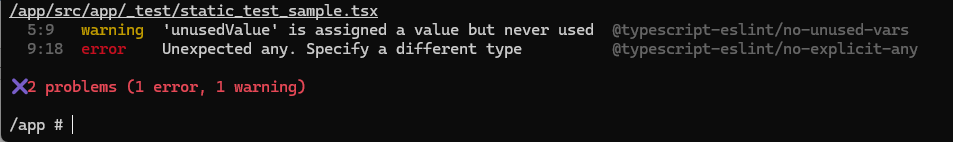
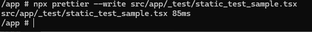
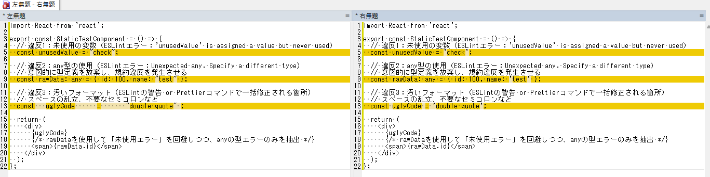

# 技術検証報告書：自動テスト基盤の構築（静的テスト編）

## 1. 検証の背景と目的

システムの長期的なメンテナンス性向上と、レビューコストの削減を目的として、静的解析ツール（静的テスト）の導入を検証した。  
本PoCの目的は、 **「型定義によるバグの未然防止（TypeScript）」、「コードスタイルの統一（Prettier）」、「潜在的なバグパターンの検知（ESLint）」** の3点が、Docker環境およびエディタ上で正常に機能することを証明することにある。

## 2. 検証対象とツール選定

開発者が意識せずとも、保存時やCI実行時にコード品質が一定以上に保たれるツールセットを採用した。

| 分類 | ツール名 | 役割 |
| --- | --- | --- |
| **静的型解析** | **TypeScript** | 型定義の不整合や、プロパティの参照エラーをビルド前に検知する。 |
| **構文解析** | **ESLint** | 未使用変数の放置や、ReactのHooksの誤用など、論理的な誤りを検知する。 |
| **整形** | **Prettier** | インデントや改行などのコードスタイルを自動で統一する。 |

> **【補足：前提条件】**
> 本検証はプロジェクト全体の品質管理基盤の一部であり、これまでに構築した「単体テスト」「結合テスト」と組み合わせることで、多層的な品質担保を実現する。

---

## 3. 基本構成別：静的テストの「標準項目」定義

詳細設計および実装規約において遵守すべき標準項目を以下のように策定し、その有効性を確認した。

### ① 型安全性（Type Safety）

* **検証項目**: コンポーネント間で渡されるPropsの型が一致しているか。
* **実証内容**: `any` 型（型定義の放棄）を使用しようとした際に、規約違反として即座にエラー検知できるか確認。。

### ② コード規約（Linting Rules）

* **検証項目**: プロジェクトで禁止している記法（例: `console.log` の放置、`any` 型の使用）が含まれていないか。
* **実証内容**: 規約違反コードを記述した際に、警告およびエラーが表示されるか確認。

### ③ 均一な可読性（Formatting）

* **検証項目**: 誰が書いても同じコード構造（改行・インデント）に自動調整されるか。
* **実証内容**: 乱れたインデントを保存時に自動修正できるか確認。

---

## 4. 検証手順とエビデンス

本セクションでは、静的テスト基盤（ESLint / Prettier / TypeScript）を導入・有効化するまでの実装工程と、検証に用いたファイル内容を記述する。

### ① 検証のステップ

1. **ライブラリ導入**: プロジェクトのコード規約を機械的にチェック・修正するためのパッケージ群をインストール。
2. **設定ファイルの定義**: ESLint（構文チェック）と Prettier（コード整形）の動作ルールを、プロジェクトの品質基準に合わせて策定。
3. **エディタ/CLI連携**: 保存時の自動整形設定と、ターミナルからのコマンド実行による一括チェック体制を構築。
4. **検証実行**: 意図的に混入させた「型エラー」や「規約違反」が、正しく検知・拒絶されるかを確認。

### ② 追加・修正したファイル一覧とその内容

#### 1. [新規] 依存ライブラリのインストール

* コード解析、自動整形、およびこれらを連携させるためのライブラリを導入。

  ```bash
  # ESLint / Prettier 関連のインストール
  npm install -D eslint-config-prettier prettier
  # TypeScriptによる型チェックの実行（ビルド前の検証用）
  # （※Next.js標準のESLint設定を活用しつつ、整形ルールをPrettierに委ねる構成とする）

  ```

#### 2. [新規] ESLint 設定ファイル

* Next.js の標準ルールを継承しつつ、未使用変数の禁止や `any` 型の使用制限など、開発効率に直結するルールを追加定義。  

  `frontend/pocs/.eslintrc.json`

  ```json
  {
    "extends": [
      "next/core-web-vitals",
      "prettier"
    ],
    "rules": {
      "no-unused-vars": "error",
      "@typescript-eslint/no-unused-vars": ["error"],
      "react-hooks/rules-of-hooks": "error",
      "react-hooks/exhaustive-deps": "warn"
    }
  }

  ```


#### 3. [新規] Prettier 設定ファイル

* チーム開発において「誰が書いても同じ見た目」にするための整形基準を定義。  

  `frontend/pocs/.prettierrc`

  ```json
  {
    "semi": true,
    "singleQuote": true,
    "tabWidth": 2,
    "trailingComma": "es5",
    "printWidth": 100
  }

  ```


#### 4. [検証用] 規約違反・型エラーの再現コード

* 「型安全性の欠如」と「未使用変数の放置」を同時に再現し、静的テストがこれらを捕捉できるかを検証。  

  `frontend/pocs/src/app/_test/static_test_sample.tsx`

  ```tsx
  import React from 'react';

  export const StaticTestComponent = () => {
    // 違反1：未使用の変数（ESLintエラー：'unusedValue' is assigned a value but never used）
    const unusedValue = "check";

    // 違反2：any型の使用（ESLintエラー：Unexpected any. Specify a different type）
    // 意図的に型定義を放棄し、規約違反を発生させる
    const rawData: any = { id: 100, name: "test" };

    // 違反3：汚いフォーマット（ESLintの警告 or Prettierコマンドで一括修正される箇所）
    // スペースの乱立、不要なセミコロンなど
    const   uglyCode      =       "double quote" ;

    return (
      <div>
        {uglyCode}
        {/* rawDataを使用して「未使用エラー」を回避しつつ、anyの型エラーのみを抽出 */}
        <span>{rawData.id}</span>
      </div>
    );
  };

  ```


### ③ エビデンス（実行結果）

* **ESLintの実行結果**
`npm run lint` を実行した結果  
上記 `static_test_sample.tsx` 内の「未使用変数」「any型の使用」が正確に指摘されることを確認

  

* **Prettierの実行（コード整形の確認）**
バラバラだったスペースやセミコロンを、プロジェクトの規約（.prettierrc）通りに自動修正されることを確認
  ```bash
  # 実際にファイルを書き換えて整形
  npx prettier --write src/app/_test/static_test_sample.tsx
  ```
    

  実行後差分（左：実行前 | 右：実行後）  
  

---

## 5. 検証内容と結果マトリクス

| 検証カテゴリ | 検証の目的（標準項目） | 本PoCでの技術的実証内容 | 結果 |
| --- | --- | --- | --- |
| **型安全性** | **厳密な型定義の強制** | `any` 型（型定義の放棄）の使用を禁止ルールとして設定。ESLintによって、実装者が明示的に型を定義するよう強制されることを確認。 | **PASS** |
| **規約遵守** | **コード品質の均一化** | 未使用変数の放置を ESLint が即座に検知し、エラーを返してビルドを中断させることで、低品質なコードの混入を防止できることを確認。 | **PASS** |
| **自動整形** | **可読性の維持・レビュー負荷軽減** | Dockerコンテナ内から Prettier コマンドを実行し、乱れたインデントや記法をプロジェクト標準規約へ一括で矯正できることを実証。 | **PASS** |


---

## 6. 結論

本PoCにより、静的テストを基盤として導入することで、**「ヒューマンエラーによる単純なバグ」を実装段階で自動排除できること**を実証した。  
これにより、コードレビューの時間を「スタイルの指摘」ではなく「設計やロジックの相談」という本来の目的に集中させることが可能となる。
