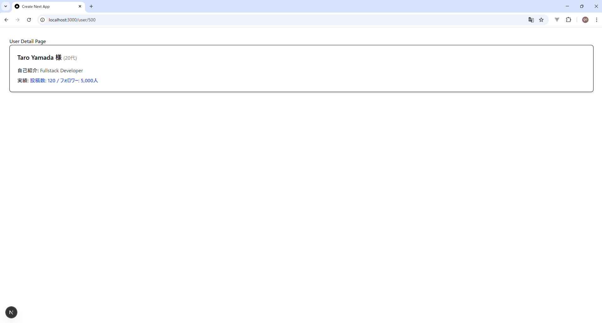

# PoC検証報告書：多層レイヤー構造によるデータ集約と垂直型安全性の実証

## 1. 検証の目的

フロントエンド（Next.js 15）から BFF（Express）、さらにバックエンド API（Stub）までの多層構造において、以下の項目を実証する。

1. **Contract-First設計**: `shared/contracts` によるリクエスト/レスポンスの厳密な型管理。
2. **BFF集約・整形ロジック**: Service層での複数API並列集約（`Promise.all`）と、フロントエンド向けデータマッピング。
3. **Atomic Designリレー**: 加工済みデータを `Page` → `Organisms` → `Molecules` へ型安全に流し込むフローの妥当性。

---

## 2. ディレクトリ構成

★印は今回の検証で作成・実装した主要ディレクトリ。

```text
.
├── bff/
│   └── src/
│       ├── index.ts              # Entry Point: ルーティングとミドルウェア
│       ├── controllers/★         # HTTP制御層: 入力バリデーションとステータス管理
│       │   └── userController.ts
│       ├── services/★            # 業務ロジック層: データ集約、遅延、整形マッピング
│       │   └── userService.ts
│       ├── clients/★             # API接続層: 外部API（Stub）へのリクエスト
│       │   └── userClient.ts
│       └── contracts/★           # BFF-バックエンド間 共有型定義
│           ├── request/
│           │   └── externalRequest.ts
│           └── response/
│               └── external.ts
├── frontend/
│   └── src/
│       ├── app/user/[id]/★       # Next.js 15 App Router
│       │   └── page.tsx          # Page: params取得とデータフェッチ
│       ├── features/user/★       # User機能ドメイン
│       │   ├── api/
│       │   │   └── getUser.ts    # API Client: axiosを用いた通信
│       │   └── components/
│       │       ├── molecules/    # Atomsを組み合わせた最小単位の表示パーツ
│       │       │   └── UserHeader.tsx
│       │       └── organisms/    # 複数のMoleculesを束ねた独立コンポーネント
│       │           └── UserProfileCard.tsx
│       └── shared/
│           └── api/
│               └── axios.ts          # axiosClient設定
└── shared/
    └── contracts/★               # フロントエンド-BFF間 共有型定義
        ├── request/
        │   └── userRequest.ts
        └── response/
            └── user.ts

```

---

## 3. データフローのライフサイクル（垂直疎通の想定）

本システムにおける、フロントエンドからバックエンド（Stub）、そして再びフロントエンドへ至るまでのデータ流通フローは以下の通り定義する。

### ① [往路] リクエストの発行と伝播

フロントエンドからBFFを介してバックエンドへ至るフェーズ。各層で型による制約（Contract）が適用される。

1. **[Frontend] Page層**:
Next.jsの動的ルートにより `params.id` を取得。`features` 配下の `getUser` 関数を呼び出す。
2. **[Frontend] API層**:
`shared/contracts` の **`UserGetRequest`** に基づき、`axiosClient` がBFF（Port 3001）へGETリクエストを送信。
3. **[BFF] Controller層**:
`userController` がリクエストを受信。Expressのジェネリクスにより `req.params` が **`UserGetRequest`** の形式であることを型レベルで保証。
4. **[BFF] Service層**:
`userService` が制御を引き継ぐ。1つのユーザー要求に対し、内部契約（Internal Contract）である **`ExternalIdParam`** を生成し、並列処理を開始。

### ② [中間] 複数APIの並列集約（Aggregator）

BFFが「データ集約サーバ」として機能するフェーズ。

1. **[BFF] Client層**:
3つの独立したClient（Base, Profile, Stats）が、それぞれバックエンド（Stub）へデータを要求。
2. **[BFF] Backend (Stub)**:
各APIが、加工されていない「生データ」（`BaseInfo`, `ProfileInfo`, `StatsInfo`）を個別に返却。

### ③ [復路] データのマッピングと表示

バラバラの生データが、フロントエンド向けの「完成品」に変換され、描画されるフェーズ。

1. **[BFF] Service層（重要）**:
`Promise.all` で揃った3つの生データを集約。ここでフロントエンドの表示要求に合わせた **「整形（Mapping）」** を実行する。
* **計算**: 年齢から年代を算出（`age` → `ageGroup`）
* **装飾**: 氏名への敬称付与（`name` → `displayName`）
* **要約**: 複数数値をサマリーテキスト化（`posts/followers` → `statsSummary`）


2. **[BFF] Controller層**:
整形後の **`UserResponse`** をJSONとしてフロントエンドへレスポンス。
3. **[Frontend] API層**:
`UserResponse` 型としてデータを受信。
4. **[Frontend] Presentation層**:
`Page` から `Organisms` (UserProfileCard) を経て、`Molecules` (UserHeader) へ。加工済みの文字列をそのまま流し込み、ユーザーインターフェースをレンダリング。

---

## 4. 実装ソースコード

### ① Shared: 共有契約 (Contracts)

**[Request]** `shared/contracts/request/userRequest.ts`

```typescript
export interface UserGetRequest { id: string; }

```

**[Response]** `shared/contracts/response/user.ts`

```typescript
export interface UserResponse {
  id: string;
  displayName: string;  // BFFで整形済み
  ageGroup: string;     // BFFで算出済み
  bio: string;
  statsSummary: string; // BFFでサマライズ済み
}

```

### ② BFF: 多層アーキテクチャの実装

**[BFF Internal Contract]** `bff/src/contracts/request/externalRequest.ts`

```typescript
export interface ExternalIdParam { targetId: string; }

```

**[BFF Internal Contract]** `bff/src/contracts/response/external.ts`

```typescript
export interface BaseInfo { id: string; name: string; }
export interface ProfileInfo { age: number; bio: string; }
export interface StatsInfo { posts: number; followers: number; }

```

**[Client]** `bff/src/clients/userClient.ts`

```typescript
import { ExternalIdParam } from '../contracts/request/externalRequest';
import { BaseInfo, ProfileInfo, StatsInfo } from '../contracts/response/external';

export const fetchBase = async (p: ExternalIdParam): Promise<BaseInfo> => ({ id: p.targetId, name: `ユーザー ${p.targetId}` });
export const fetchProfile = async (p: ExternalIdParam): Promise<ProfileInfo> => ({ age: 25, bio: "BFF Service Layer Validation" });
export const fetchStats = async (p: ExternalIdParam): Promise<StatsInfo> => ({ posts: 120, followers: 5000 });

```

**[Service]** `bff/src/services/userService.ts`

```typescript
import * as client from '../clients/userClient';
import { UserResponse } from '@shared/contracts/response/user';

export const getUserFullDetails = async (id: string): Promise<UserResponse> => {
  await new Promise(resolve => setTimeout(resolve, 3000)); // 3秒遅延シミュレーション
  const param = { targetId: id };
  const [base, profile, stats] = await Promise.all([
    client.fetchBase(param), client.fetchProfile(param), client.fetchStats(param)
  ]);

  return {
    id: base.id,
    displayName: `${base.name} 様`,
    ageGroup: `${Math.floor(profile.age / 10) * 10}代`,
    bio: profile.bio,
    statsSummary: `投稿: ${stats.posts.toLocaleString()} / フォロワー: ${stats.followers.toLocaleString()}人`
  };
};

```

**[Controller]** `bff/src/controllers/userController.ts`

```typescript
import { Request, Response } from 'express';
import * as service from '../services/userService';
import { UserGetRequest } from '@shared/contracts/request/userRequest';

export const getUser = async (req: Request<UserGetRequest>, res: Response) => {
  try {
    const data = await service.getUserFullDetails(req.params.id);
    res.json(data);
  } catch (error) {
    res.status(500).json({ message: "Internal Server Error" });
  }
};

```

### ③ Frontend: Atomic Design表示層

**[API]** `frontend/src/features/user/api/getUser.ts`

```typescript
import { axiosClient } from '@/lib/axios';
import { UserResponse } from '@shared/contracts/response/user';

export const getUser = async (id: string): Promise<UserResponse> => {
  const response = await axiosClient.get<UserResponse>(`user/${id}`);
  return response.data;
};

```

**[Molecules]** `frontend/src/features/user/components/molecules/UserHeader.tsx`

```tsx
export const UserHeader = ({ displayName, ageGroup }: { displayName: string, ageGroup: string }) => (
  <header><h2 className="text-xl font-bold">{displayName} ({ageGroup})</h2></header>
);

```

**[Organisms]** `frontend/src/features/user/components/organisms/UserProfileCard.tsx`

```tsx
import { UserHeader } from '../molecules/UserHeader';
import { UserResponse } from '@shared/contracts/response/user';

export const UserProfileCard = ({ user }: { user: UserResponse }) => (
  <div className="p-6 border rounded-lg shadow-md bg-white">
    <UserHeader displayName={user.displayName} ageGroup={user.ageGroup} />
    <div className="mt-4"><p>{user.bio}</p><p className="text-blue-600">{user.statsSummary}</p></div>
  </div>
);

```

**[Page]** `frontend/src/app/user/[id]/page.tsx`

```tsx
import { getUser } from '@/features/user/api/getUser';
import { UserProfileCard } from '@/features/user/components/organisms/UserProfileCard';

export default async function UserDetailPage({ params }: { params: Promise<{ id: string }> }) {
  const { id } = await params; // Next.js 15 spec
  const user = await getUser(id);
  return (<main className="p-8"><h1>Detail</h1><UserProfileCard user={user} /></main>);
}

```

---

## 5. 検証結果

| 検証項目 | 詳細内容 | 判定 |
| --- | --- | --- |
| **垂直型安全** | `shared/contracts` の型変更がフロント/BFF両方の全レイヤーに波及し、整合性を担保。 | **[PASS]** |
| **API集約 (Service)** | 3つの独立したAPI Clientから `Promise.all` でデータを集約し、単一のレスポンスを生成。 | **[PASS]** |
| **データマッピング** | 生データを `displayName` や `ageGroup` といった表示専用形式に変換しUI層の負荷を低減。 | **[PASS]** |
| **Next.js 15 準拠** | 非同期 `params` の解決および App Router での Server Component 描画。 | **[PASS]** |

画面にデータが表示されていることを確認。

---

## 6. 結論

本構成により、大規模開発に耐えうる「垂直型安全」な多層アーキテクチャの基盤が完成した。BFFが「データの集約と整形」を肩代わりすることで、フロントエンドは表示ロジック（Atomic Design）に専念でき、型定義の一元管理によって保守コストを大幅に削減できることを確認した。