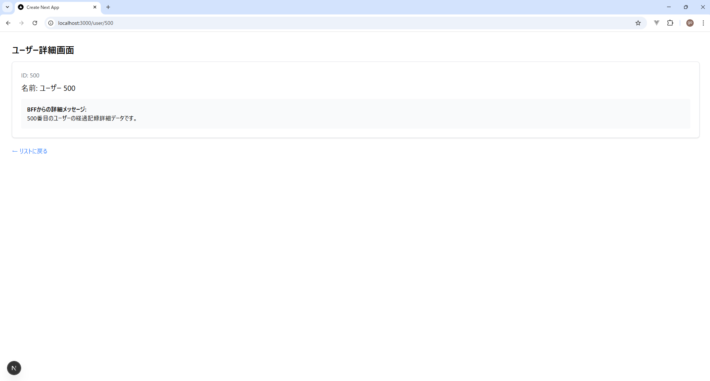

# PoC検証報告書：モノレポ構成における型定義共有と実行環境の構築

## 1. 検証の目的

プロジェクトルート直下に配置した `shared` ディレクトリ内の型定義を、`frontend` (Next.js) と `bff` (Express) の双方からシームレスに参照し、型安全な開発および安定した実行環境を実現できるかを検証する。

---

## 2. 最終的なプロジェクト構造

ディレクトリを跨ぐインポートを可能にし、開発効率を最大化する構成。

```text
.
├── bff/                # Express (BFF)
│   ├── src/index.ts
│   ├── package.json
│   └── tsconfig.json
├── frontend/           # Next.js (App Router)
│   ├── src/
│   │   ├── app/user/[id]/page.tsx
│   │   └── lib/api.ts
│   └── tsconfig.json
└── shared/             # 共有ディレクトリ
    └── contracts/
        └── response/
           └── user.ts     # 共通インターフェース（実体）

```

---

## 3. 環境構築・導入の手順

### ① 使用ツールの整理

開発体験（DX）の向上と実行時のパス解決を両立させるためにツールを最適化しました。

* **追加（インストール）**:
* `tsx`: TypeScript実行ランタイム。ESM対応とパスエイリアス解決のため `ts-node` に代わり採用。
* `cors`: BFF側でのブラウザ通信許可。


* **削除（使用停止）**:
* `ts-node`: 設定が複雑なため廃止。
* `nodemon`: `tsx watch` 機能で代替。


### ② 共有型定義の実装

**パス**: `shared/types/user.ts`

```typescript
export interface User {
  id: string;
  name: string;
  description: string;
}

```

### ③ BFF (Express) の実装と設定

**パス**: `bff/tsconfig.json`

```json
{
  "compilerOptions": {
    "target": "ESNext",
    "module": "ESNext",
    "moduleResolution": "bundler",
    "baseUrl": ".",
    "paths": { "@shared/*": ["../shared/*"] },
    "esModuleInterop": true
  },
  "include": ["src/**/*", "../shared/**/*"]
}

```

**パス**: `bff/package.json`

```json
{
  "type": "module",
  "scripts": {
    "dev": "tsx watch src/index.ts",
    "start": "tsx src/index.ts"
  }
}

```

**パス**: `bff/src/index.ts`

```typescript
import express from 'express';
import cors from 'cors';
import { User } from '@shared/contracts/response/user';

const app = express();
app.use(cors({ origin: 'http://localhost:3000' }));

app.get('/api/user/:id', (req, res) => {
  const userData: User = {
    id: req.params.id,
    name: "Taro Yamada",
    description: "Shared types are working via tsx!"
  };
  res.json(userData);
});

app.listen(3001);

```

### ④ フロントエンド (Next.js) の実装と設定

**パス**: `frontend/tsconfig.json`

```json
{
  "compilerOptions": {
    "baseUrl": ".",
    "paths": {
      "@/*": ["./src/*"],
      "@shared/*": ["../shared/*"]
    }
  },
  "include": ["next-env.d.ts", "**/*.ts", "**/*.tsx", "../shared/**/*"]
}

```

**パス**: `frontend/src/features/user/api/getUser.ts`

```typescript
import { User } from '@shared/contracts/response/user';
import { axiosClient } from '@/shared/api/axiosClient';

export const getUser = async (id: string): Promise<User> => {
  // axiosClientを使用してBFF(Port 3001)へリクエスト
  const response = await axiosClient.get<User>(`/user/${id}`);
  
  return response.data;
};

```

**パス**: `frontend/src/app/user/[id]/page.tsx`

```typescript
import { getUser } from '@/features/user/api/getUser';

export default async function UserDetailPage({
  params,
}: {
  params: Promise<{ id: string }>;
}) {
  // 1. URLパラメータから ID を取得
  const { id } = await params;

  const user = await getUser(id);

  // 3. 取得したデータを画面に表示
  return (
    <div className="p-8">
      <h1 className="text-2xl font-bold mb-4">ユーザー詳細画面</h1>
      <div className="bg-white shadow rounded-lg p-6 border border-gray-200">
        <p className="text-gray-500">ID: {id}</p>
        <h2 className="text-xl mt-2">名前: {user.name}</h2>
        <div className="mt-4 p-4 bg-gray-50 rounded">
          <p className="font-semibold">BFFからの詳細メッセージ:</p>
          <p>{user.description || '詳細情報はありません'}</p>
        </div>
      </div>
      <div className="mt-6">
        <a href="/" className="text-blue-500 hover:underline">← リストに戻る</a>
      </div>
    </div>
  );
}

```

---

## 4. 検証結果と特記事項

### 検証メトリクス

| 検証項目 | 確認内容 | 結果 |
| --- | --- | --- |
| **型同期の整合性** | `shared` 変更時にフロント/BFF両方のエディタでエラー検知されるか | **[PASS]** |
| **実行時パス解決** | `npm run dev` でエイリアスパスが正常に解決されるか | **[PASS]** |
| **CORS疎通** | ブラウザ上でBFFからのデータ取得・表示ができるか | **[PASS]** |
- 変更した画面がエラーなく表示されていることを確認



## 5. 技術的背景（選定理由）

* **なぜ `include` を拡張したか**: TSは通常フォルダ内のみを監視するため、一階層上の `shared` を明示的に認識させる必要がある。
* **なぜ `tsx` か**: `ts-node` + `tsconfig-paths` の複雑な構成を排除し、単一ツールで最新のESM環境をサポートするため。
* **なぜ `bundler` 設定か**: ViteやNext.js等のモダンなツールと開発体験を統一し、相対パスの記述を簡略化するため。

---

## 結論

本PoCにより、モノレポ構成における型定義の一元管理と、それを活用したフルスタックな型安全開発基盤の有効性が証明された。今後はこの基盤をベースに、より複雑なビジネスロジックの共通化（バリデーション等）へ展開することが可能である。
