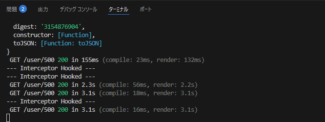
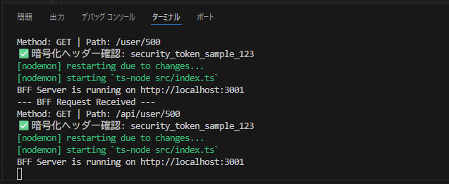

# PoC検証報告書：Axios Interceptorによる通信共通基盤

## 1. 検証の目的

Feature-based × Atomic Designを採用したプロジェクトにおいて、通信基盤（Shared層）にAxios Interceptorを導入し、以下の点を実証する。

* 各機能（Features）で個別実装することなく、横断的にリクエストをフックできること。
* 一括処理（暗号化ヘッダーの付与等）がBFF側で正しく認識されること。

---

## 2. 準備と設定

### パッケージインストール

フロントエンドのプロジェクトルートで以下を実行します。

```bash
# frontendディレクトリにて
npm install axios

```

### 検証用ディレクトリ構成

Atomic Designの原則に基づき、API基盤を `shared` に配置します。

```text
frontend/src/
├── app/
│   └── user/
│       └── [id]/page.tsx      # SSRでのデータ取得
└── shared/
    └── api/
        └── axiosClient.ts     # ★Axios Interceptorの実装

```

---

## 3. 具体的な検証手順とコード

### ① フロントエンドの実装（リクエストのフック）

`shared` 層にカスタムAxiosインスタンスを作成し、すべてのリクエストに特定のヘッダーを注入する設定を行います。

**ファイルパス**: `frontend/src/shared/api/axiosClient.ts`

```typescript
import axios from 'axios';

// 共通設定を持つインスタンスを作成
export const axiosClient = axios.create({
  baseURL: 'http://localhost:3001', // BFFのURL
});

// リクエスト・インターセプターの設定
axiosClient.interceptors.request.use(
  (config) => {
    // 検証用のログ出力
    console.log('--- Interceptor Hooked ---');
    
    // 全リクエストに一括で暗号化想定のヘッダーを付与
    config.headers['X-Encrypted-Key'] = 'security_token_sample_123';
    
    return config;
  },
  (error) => {
    return Promise.reject(error);
  }
);

```

### ② BFF側の準備（受信確認）

フロントから送られたヘッダーをBFF側でキャッチします。

**ファイルパス**: `bff/src/index.ts`

> **注意**: ログ出力用の `app.use` は、必ず `app.get` 等のルーティング定義よりも**上（前）**に記述してください。

```typescript
import express from 'express';
import cors from 'cors';

const app = express();
app.use(cors());

// 【検証用ミドルウェア】ルーティングの前に実行
app.use((req, res, next) => {
  const encryptedKey = req.headers['x-encrypted-key'];
  
  if (encryptedKey) {
    console.log(`✅ 暗号化ヘッダーを確認: ${encryptedKey}`);
  } else {
    console.log('⚠️ ヘッダーが届いていません');
  }
  next();
});

// APIエンドポイント
app.get('/api/user/:id', (req, res) => {
  res.json({ id: req.params.id, name: "検証ユーザー" });
});

app.listen(3001, () => console.log('BFF起動中... (Port: 3001)'));

```

---

## 4. 検証結果とエビデンス

### 検証手順

1. BFFサーバーを起動する。
2. Next.jsの画面（`user/[id]` 等）をリロードし、`axiosClient` を経由した通信を発生させる。
3. 両方のターミナルログを確認する。

### 結果

| 確認場所 | 期待されるログ | 結果 |
| --- | --- | --- |
| **フロントエンドターミナル** | `--- Interceptor Hooked ---` | **[PASS]** |
| **BFFターミナル** | `✅ 暗号化ヘッダーを確認: security_token_sample_123` | **[PASS]** |

- フロントエンドターミナル

  

- BFFターミナル

  
---

## 5. 結論と技術的考察

本検証により、Axios Interceptorを用いることで、Atomic Designにおける最小単位のパーツから大規模なOrganismsに至るまで、**通信の詳細（暗号化やトークン付与）を一切意識せずにセキュアな通信を行える基盤**が証明された。

BFF側のミドルウェア実装において、実行順序（Middleware Stack）の重要性を再確認した。本開発においても、通信基盤の設計はルーティングの前段に集約することを推奨する。

