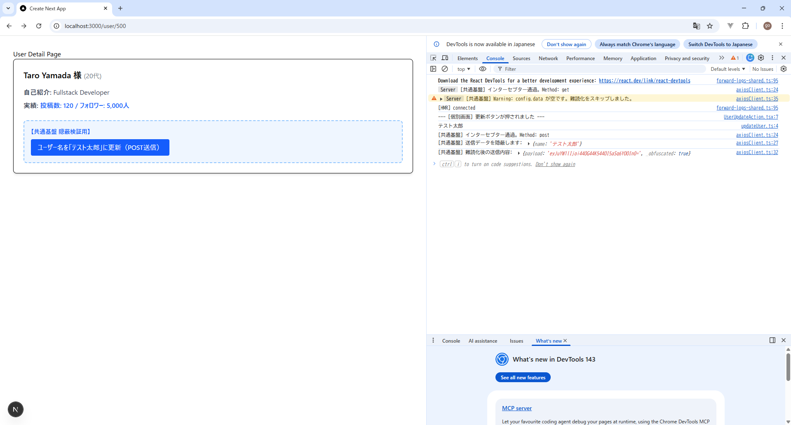
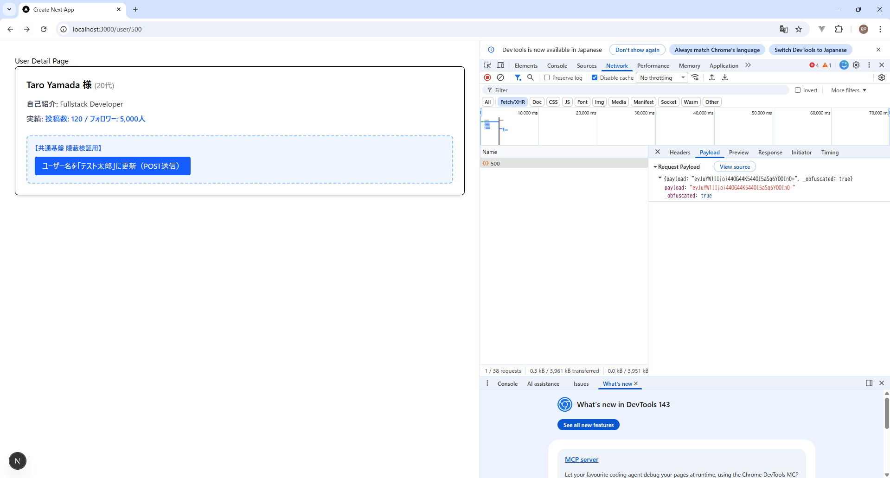
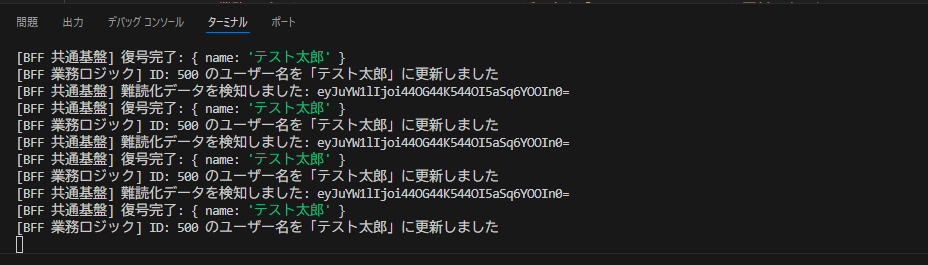

送信データの難読化（隠蔽）検証に特化した、完全版のソースコード一式とエビデンス（証拠）の取得方法をまとめました。

---

# PoC検証報告書：共通基盤による送信データ隠蔽と自動復号の実証

## 1. 検証のまとめ

* **検証内容（目的）**: 共通基盤側で送信データを自動難読化し、個別画面側でセキュリティ実装を意識せず「隠蔽の自動化」ができるか検証する。
* **具体的なアクション**: `frontend/src/shared/api/axiosClient.ts` に日本語対応の難読化インターセプターを、`bff/src/index.ts` に自動復号ミドルウェアを実装し、フォルダ構成に沿ってデータを貫通させる。
* **確認できればOKなこと（ゴール）**: **個別画面側は生のオブジェクトを送るだけで、通信経路上では難読化され、BFFのログでは正しく復号されたデータが表示されること。**

---

## 2. 実装ソースコード（全レイヤー）

### ① [フロント基盤] 日本語対応・難読化インターセプター

**パス**: `frontend/src/shared/api/axiosClient.ts`

```typescript
import axios from 'axios';

const safeObfuscate = (data: any) => {
  if (!data) return data;
  const uint8array = new TextEncoder().encode(JSON.stringify(data));
  let binString = "";
  uint8array.forEach((byte) => { binString += String.fromCharCode(byte); });
  return btoa(binString); // 日本語対応のBase64難読化
};

export const axiosClient = axios.create({ baseURL: 'http://localhost:3001/api' });

axiosClient.interceptors.request.use((config) => {
  if (config.data) {
    console.log('[共通基盤] 送信データを隠蔽します:', config.data);
    config.data = {
      payload: safeObfuscate(config.data),
      _obfuscated: true
    };
    console.log('[共通基盤] 難読化後の送信内容:', config.data);
  }
  return config;
});

```

### ② [フロント個別] API呼び出し関数

**パス**: `frontend/src/features/user/api/updateUser.ts`

```typescript
import { axiosClient } from '@/shared/api/axiosClient';

export const updateUser = async (id: string, name: string) => {
  // 生のデータを送るだけ（難読化は基盤に任せる）
  return await axiosClient.post(`/user/${id}`, { name });
};

```

### ③ [フロント個別] 検証用コンポーネント

**パス**: `frontend/src/features/user/components/molecules/UserUpdateAction.tsx`

```tsx
'use client';
import { updateUser } from '../../api/updateUser';

export const UserUpdateAction = ({ userId }: { userId: string }) => {
  const handleUpdate = async () => {
    try {
      // 「テスト太郎」という日本語を含む生データを送信
      await updateUser(userId, "テスト太郎");
      alert('送信完了。ログを確認してください。');
    } catch (e) {
      console.error('通信失敗', e);
    }
  };

  return (
    <button onClick={handleUpdate} className="bg-blue-500 text-white p-2 rounded">
      難読化送信テスト（テスト太郎）
    </button>
  );
};

```

### ④ [BFF基盤] 自動復号ミドルウェア & 受信ルート

**パス**: `bff/src/index.ts`

```typescript
import express from 'express';
import cors from 'cors';

const app = express();
app.use(express.json());
app.use(cors({ origin: 'http://localhost:3000' }));

// 復号ミドルウェア：payloadがあれば自動で元に戻す
app.use((req, res, next) => {
  if (req.body?._obfuscated && req.body.payload) {
    try {
      const binString = atob(req.body.payload);
      const uint8array = Uint8Array.from(binString, (m) => m.codePointAt(0)!);
      req.body = JSON.parse(new TextDecoder().decode(uint8array));
      console.log('[BFF 共通基盤] 復号に成功しました:', req.body);
    } catch (e) {
      console.error('[BFF 共通基盤] 復号失敗', e);
    }
  }
  next();
});

// 検証用POSTルート（404回避）
app.post('/api/user/:id', (req, res) => {
  console.log(`[BFF 業務ロジック] 受信データ: ${req.body.name}`); // 「テスト太郎」と出れば成功
  res.json({ success: true });
});

app.listen(3001);

```
## 3. 具体的な確認手順（3ステップ）

### ステップ1：フロントエンドでの「隠蔽前」データの確認

1. ブラウザで検証画面を開き、F12キーでデベロッパーツール（Console）を表示する。
2. 「難読化送信テスト」ボタンをクリックする。
3. **確認内容**: `[共通基盤] 送信データを隠蔽します:` に続いて、生のオブジェクト `{ name: "テスト太郎" }` が出力されていることを確認する。
* **意味**: アプリケーションの実装コード（個別画面）では、セキュリティを意識せず生データを扱えている証拠。


### ステップ2：通信経路上での「隠蔽状態」の確認

1. デベロッパーツールの「Network（ネットワーク）」タブを開く。
2. 送信されたリクエスト（`user/1` など）を選択し、「Payload」タブを確認する。
3. **確認内容**: 送信データが `payload: "ey..."` という難読化された文字列に変換され、`name: "テスト太郎"` が直接見えないことを確認する。
* **意味**: 共通基盤（インターセプター）が、通信が外に出る直前で自動的にデータを保護した証拠。


### ステップ3：BFF側での「自動復号」の確認

1. BFF（サーバー）を起動しているターミナルを確認する。
2. **確認内容**: `[BFF 共通基盤] 復号に成功しました: { name: 'テスト太郎' }` というログが出力されていることを確認する。
* **意味**: サーバーに届いた難読化データが、ミドルウェアによって正しく元の日本語データに復元された証拠。


---
## 4. 検証結果

| 確認項目 | 期待される結果 | 判定 |
| --- | --- | --- |
| **自動難読化** | 個別画面側で暗号化コードを書かずに、通信内容が隠蔽されること | OK |
| **日本語対応** | 「テスト太郎」などの日本語が文字化けやエラーなく送受信できること | OK |
| **透過的な復号** | BFFの業務ロジックに届く前に、データが元の形に戻っていること | OK |

- デベロッパーツールの「Console」タブ

  

- デベロッパーツールの「Network（ネットワーク）」タブ

  

- BFFターミナル

  