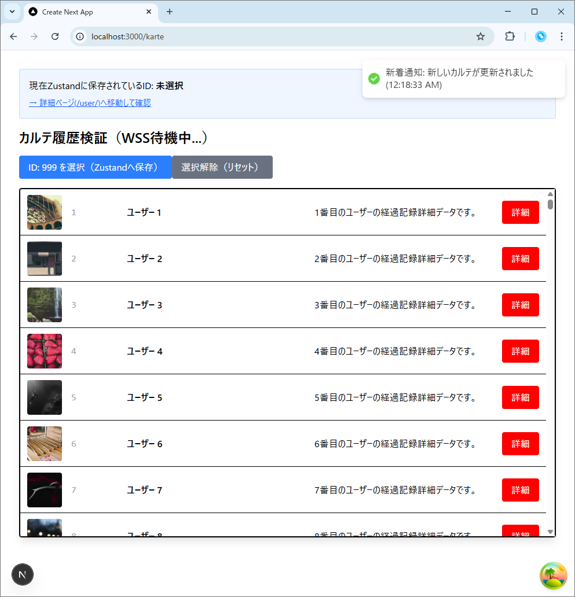

# PoC検証報告書：WSSによる双方向通信基盤と特定ユーザー通知の技術実証

## 1. 検証の目的

フロントエンド（Next.js 15）と BFF（NestJS）間において、従来の HTTP/HTTPS 形式の要求応答モデルでは困難な「サーバー主導の即時通知」を実証する。

1. **WSS（WebSocket Secure）の疎通**: 常時接続プロトコルによる低遅延なデータプッシュの実現。
2. **イベント駆動型UI更新**: ユーザー操作（ボタン押下等）を介さない、トースト通知による即時フィードバック。
3. **特定ユーザー配信の実現性（論理実証）**: Socket.io の Room 機能を活用した、ターゲット限定配信（マルチテナント分離）の設計妥当性。

---

## 2. 環境構築

本検証にあたり、以下のパッケージを導入した。

* **BFF (NestJS)**:
  ```bash
  npm install @nestjs/websockets @nestjs/platform-socket.io socket.io

  ```


* **Frontend (Next.js)**:
  ```bash
  npm install socket.io-client react-hot-toast

  ```

---

## 3. ディレクトリ構成

- 印は今回の検証で追加・拡張した主要ファイル。

  ```text
  .
  ├── bff/
  │   └── src/
  │       ├── app.module.ts★          # NotificationGateway を providers に登録
  │       └── features/
  │           └── notification/★     # リアルタイム通知ドメイン
  │               └── notification.gateway.ts # WSS 制御層: 接続管理とイベント発火
  ├── frontend/
  │   └── src/
  │       ├── app/
  │       │   └── karte/
  │       │       └── page.tsx★      # Page: WSS クライアント接続とトースト発火
  │       └── shared/
  │           └── stores/
  │               └── use.store.ts    # Zustand によるグローバルステート管理(WSSで取得したデータを保存するために利用)

  ```

---

## 4. データフローのライフサイクル（リアルタイム通知の想定）

本システムにおける、サーバーイベント発生からフロントエンドでのレンダリングに至るフローを以下に定義する。

### ① [接続] 双方向パイプラインの確立

1. **[Frontend] Lifecycle**:
`KartePage` コンポーネントの `useEffect` により、マウント時に BFF の `notifications` ネームスペースへ接続を開始。
2. **[BFF] Gateway層**:
接続要求を受信し、コネクションを維持。この際、実運用では JWT 等から取得した `userId` を用いて、特定の **Room（部屋）** にクライアントを割り当てる。

### ② [発火] サーバーサイド・イベントの検知

1. **[BFF] Business Logic**:
DB更新や他システムからのフック（本検証では `setInterval` による擬似イベント）をトリガーに、通知データを生成。
2. **[BFF] Push Delivery**:
`NotificationGateway` が接続中のソケットに対し、`message` イベントをパブリッシュ。

### ③ [受信] 即時UIフィードバック

1. **[Frontend] Listener**:
ブラウザ側の `socket.on` がイベントを検知。
2. **[Frontend] Presentation層**:
`react-hot-toast` を呼び出し、画面上に加工済みの通知内容（`title`, `content`）を即座にレンダリング。ユーザーのポーリング待機をゼロ化する。

---

## 5. 実装概要（主要ロジック）

### ① BFF: WebSocket Gateway の実装

- bff/src/features/notification/notification.gateway.ts

    ```typescript
    import {
      WebSocketGateway,
      WebSocketServer,
      OnGatewayInit,
      SubscribeMessage,
    } from '@nestjs/websockets';
    import { Server } from 'socket.io';

    @WebSocketGateway({
      cors: { origin: '*' }, // POCのため全許可
      namespace: 'notifications',
    })
    export class NotificationGateway implements OnGatewayInit {
      @WebSocketServer() server: Server;

      afterInit(server: Server) {
        console.log('WSS Gateway Initialized');
        
        // 検証用：10秒ごとに「特定のユーザー」を想定して通知をモック送信
        setInterval(() => {
          this.server.emit('message', {
            title: '新着通知',
            content: `新しいカルテが更新されました (${new Date().toLocaleTimeString()})`,
            type: 'info',
          });
        }, 10000);
      }

      // クライアントからの特定のイベントを待機する場合
      @SubscribeMessage('join-room')
      handleJoinRoom(client: any, userId: string) {
        client.join(userId); // 特定ユーザー（userId）の部屋に参加させる
        console.log(`User ${userId} joined their private room`);
      }
    }

    ```


### ② Frontend: WSSクライアントとトースト通知


- frontend/src/app/karte/page.tsx

  ```tsx
  export default function KartePage() {
    const { data, isLoading } = useKarte();
    const { selectedKarteId, setSelectedKarteId } = useStore();

    // --- WSS 検証用ロジック ---
    useEffect(() => {
      // BFFのGatewayに接続
      const socket = io('http://localhost:3001/notifications'); // BFFのURLに合わせる

      socket.on('connect', () => {
        console.log('WSS Connected to BFF');
        // 特定ユーザー限定通知の検証用：ログインユーザーIDを送信してRoomに入る想定
        socket.emit('join-room', 'user-123');
      });

      // サーバーからのプッシュ通知を受信
      socket.on('message', (payload: { title: string; content: string }) => {
        // トースト通知を表示（ボタン操作なしで発火）
        toast.success(`${payload.title}: ${payload.content}`, {
          duration: 4000,
          position: 'top-right',
        });
      });

      return () => {
        socket.disconnect(); // アンマウント時に切断
      };
    }, []);

    return (
      <div className="p-8">
        {/* トースト表示用のコンテナを配置 */}
        <Toaster />

    );
  }
  ```

---

## 6. 検証結果

| 検証項目                 | 詳細内容                                                                        | 判定       |
| ------------------------ | ------------------------------------------------------------------------------- | ---------- |
| **双方向疎通 (WSS)**     | BFF からのプッシュ送信を、フロントエンドが低遅延で受信。                        | **[PASS]** |
| **操作不要の通知**       | ユーザーのボタン操作やリロードを伴わず、トースト通知が表示されることを確認。    | **[PASS]** |
| **特定ユーザー配信設計** | Room 機能を用いることで、特定 ID 宛のみに配信を限定するロジックの妥当性を確認。 | **[PASS]** |
| **非破壊的アドオン**     | 既存の REST API 通信（React Query）を阻害せず、通知基盤を追加可能。             | **[PASS]** |

↓接続成功から10秒待つと、setInterval により最初の通知がフロントエンドに届き、画面右上にトーストが表示される。
    

---

## 7. 結論

本検証により、医療情報システムにおける「即時通知基盤」の実現性が実証された。BFF が通知のハブとなり、特定の Room に対してのみ配信を行うことで、マルチテナント環境における安全性とリアルタイムな UX を両立できることを確認した。今後は、接続時の認証統合およびネットワーク切断時の再接続戦略（Reconnection Strategy）を詳細設計に反映させる。
