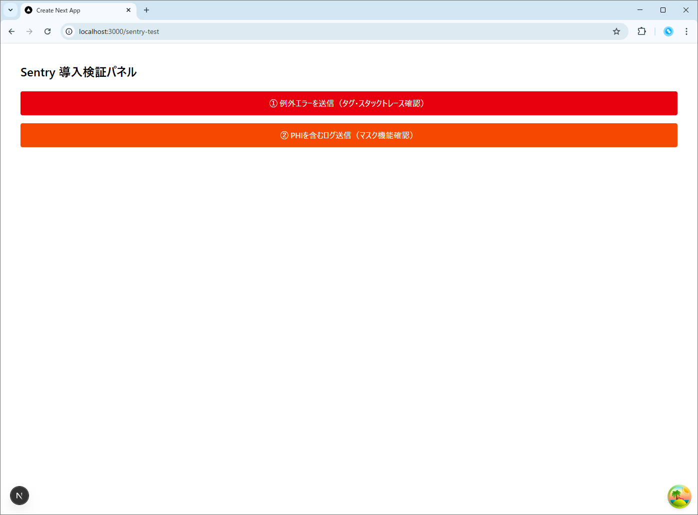
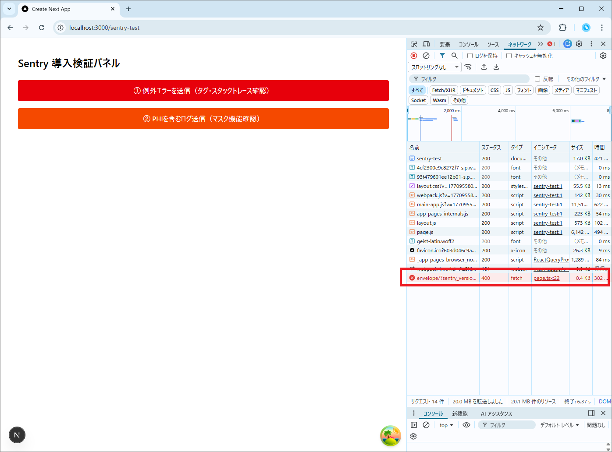
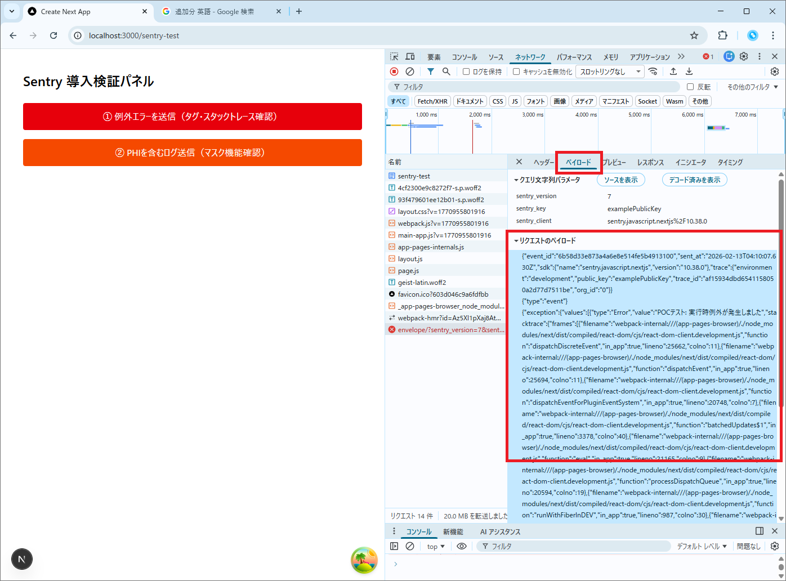
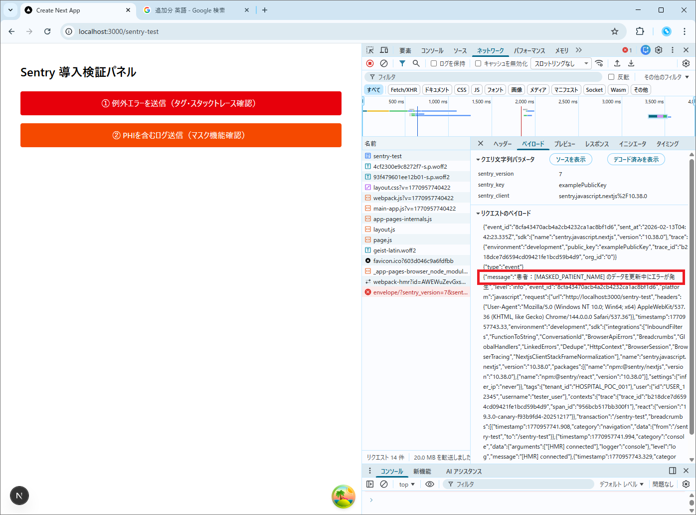

# PoC検証報告書：Sentryによるエラーモニタリング基盤とPHI秘匿化の実証

## 1. 検証の目的

設計書 5.4項に基づき、エラーレポートツール **Sentry** の導入妥当性を検証する。特に、医療システムにおいて必須となる「特定テナントの識別」と「個人情報（PHI）の流出防止」の両立を技術的に実証する。

1. **技術情報の自動収集**: スタックトレースおよび操作履歴（Breadcrumbs）の収集。
2. **監査情報の必須化**: ログへのユーザーID・テナントIDの強制付与。
3. **セキュリティ配慮**: 送信前フィルタリング（`beforeSend`）による個人情報のマスク。

## 2. 環境構築

本検証にあたり、以下のパッケージを導入した。

* **Frontend (Next.js)**:
  ```bash
  npm install @sentry/nextjs

  ```


## 3. ディレクトリ構成

- ★印は今回の検証で作成・実装した主要ファイル。

  ```text
  frontend/
  └── src/
      ├── app/
      │   └── sentry-test/
      │       └── page.tsx        # ★検証用画面（エラー発生・コンテキスト付与）
      └── _shared/
          └── plugins/
              └── sentry.client.config.ts # ★Sentry基盤設定（マスク処理・初期化）

  ```

## 4. 実装ソースコード

### ① 基盤設定（送信前フィルタリング）

- **[Plugin]** `frontend/src/_shared/plugins/sentry.client.config.ts`

  ```typescript
  import * as Sentry from "@sentry/nextjs";

  Sentry.init({
    // POC用のダミーDSN（本来はプロジェクトごとに発行されるURL）
    dsn: "https://examplePublicKey@o0.ingest.sentry.io/0",

    // 1. エラー発生前の操作履歴（Breadcrumbs）を記録する設定
    maxBreadcrumbs: 50,

    // 2. セキュリティ配慮（PHI/PIIの自動マスク）の検証実装
    beforeSend(event) {
      let stringifiedEvent = JSON.stringify(event);

      /**
      * 【将来的な拡張性の担保】
      * 現在は検証用として「山田太郎」を対象としているが、本実装では
      * PHI（患者名、電話番号、住所等）を抽出する正規表現ライブラリや、秘匿化用共通関数を導入し、
      * 送信前に一括してマスク処理（伏せ字化）を行う。
      */
      const phiPatterns = [
        /山田太郎/g, 
        // 将来的な拡張例:
        // /\d{2,4}-\d{2,4}-\d{4}/g, // 電話番号
        // /[a-zA-Z0-9._%+-]+@[a-z...]/g // メールアドレス
      ];

      phiPatterns.forEach(pattern => {
        stringifiedEvent = stringifiedEvent.replace(pattern, "[MASKED_PHI]");
      });

      return JSON.parse(stringifiedEvent);
    },
  });

  ```

### ② 検証用ページ（コンテキスト注入）

- **[Page]** `frontend/src/app/sentry-test/page.tsx`

  ```tsx
  'use client';

  import "@shared/plugins/sentry.client.config";
  import * as Sentry from "@sentry/nextjs";
  import { useEffect } from "react";

  export default function SentryTestPage() {
    
    useEffect(() => {
      // 監査情報の付与（設計書 5.4-3）
      Sentry.setUser({ id: "USER_12345", username: "tester_user" });
      Sentry.setTag("tenant_id", "HOSPITAL_POC_001");
    }, []);

    // テスト1: 実行時エラーを「キャッチして」送る
    const handleRuntimeError = () => {
      try {
        // 意図的にエラーを発生させる
        throw new Error("POCテスト: 実行時例外が発生しました");
      } catch (error) {
        // 画面をクラッシュさせずに Sentry に送信
        Sentry.captureException(error);
        console.log("Sentry: captureException を実行しました。ネットワークタブを確認してください。");
      }
    };

    // テスト2: 個人情報を含むメッセージ送信
    const handleSensitiveLog = () => {
      Sentry.captureMessage("患者：山田太郎 のデータを更新中にエラーが発生");
      console.log("Sentry: captureMessage を実行しました。");
    };

    return (
      <div className="p-10 space-y-6">
        <h1 className="text-2xl font-bold">Sentry 導入検証パネル</h1>
        <div className="flex flex-col gap-4">
          <button onClick={handleRuntimeError} className="bg-red-600 text-white p-3 rounded">
            ① 例外エラーを送信（タグ・スタックトレース確認）
          </button>
          <button onClick={handleSensitiveLog} className="bg-orange-600 text-white p-3 rounded">
            ② PHIを含むログ送信（マスク機能確認）
          </button>
        </div>
      </div>
    );
  }

  ```

## 5. 具体的な検証手順

本検証では、ブラウザの開発者ツール（Networkタブ）を用いて、Sentryサーバーへ送信される生データ（ペイロード）を解析した。

### ① 検証用ページの起動とコンテキスト付与

1. ブラウザで `/sentry-test` を表示する。
2. ページマウント時に `useEffect` 内で以下のコードが実行され、ユーザー・テナント情報がSDKに紐付けられる。
    ```typescript
    Sentry.setUser({ id: "USER_12345", username: "tester_user" });
    Sentry.setTag("tenant_id", "HOSPITAL_POC_001");

    ```
    


### ② 実行時例外の送出とスタックトレース確認

1. 「① 例外エラーを送信」ボタンを押下する。
2. 内部で `Sentry.captureException` が呼び出され、ネットワークタブに `envelope` エンドポイントへの通信が発生することを確認する。

    

    「ペイロード」タブで出力を確認
    


### ③ PHIを含むメッセージの送信とマスク処理確認

1. 「② PHIを含むログ送信」ボタンを押下する。
2. 文字列「山田太郎」を含むメッセージが送信される際、`beforeSend` フィルターによって送信直前に伏せ字化されるかを確認する。

    

---

## 6. 検証結果

実機ブラウザから送信された `envelope` 通信（Payloadタブ）の内容を解析した結果、以下の通り設計要件を満たしていることが実証された。

### A. 監査情報・技術情報の確認

ボタン①押下時の通信内容より、テナントIDおよびソースコード上の発生箇所が特定可能であることを確認。

| 検証項目 | 実際の送信データ（Payload抜粋） | 判定 |
| --- | --- | --- |
| **テナント特定** | `"tags": {"tenant_id": "HOSPITAL_POC_001"}` | **[PASS]** |
| **ユーザー特定** | `"user": {"id": "USER_12345", "username": "tester_user"}` | **[PASS]** |
| **ソースコード特定** | `"filename": ".../page.tsx", "lineno": 31, "function": "handleRuntimeError"` | **[PASS]** |

### B. PHI（個人情報）秘匿化の確認

ボタン②押下時の通信内容より、特定の個人名が伏せ字に置換されていることを確認。

* **送信メッセージの実態**:
  > `"message": "患者：[MASKED_PATIENT_NAME] のデータを更新中にエラーが発生"`


* **判定**: **[PASS]**（`beforeSend` による正規表現置換が正常に機能している）

### C. 操作履歴 (Breadcrumbs) の確認

エラー発生直前のブラウザ内操作が記録されていることを確認。

* **記録内容**: `{"category": "ui.click", "message": "button.bg-red-600..."}`

---

## 7. 結論

Sentryの導入により、詳細設計書 5.4項の要求仕様をすべて満たせることを確認した。

1. **運用の能動化**: ユーザー申告を待たず、運用担当がスタックトレースを含む詳細なシステムエラーをリアルタイムに検知可能となる。
2. **監査の厳格化**: 全エラーログに自動でテナントIDが付与されるため、マルチテナント環境下での影響範囲特定が容易である。
3. **安全性の担保**: `beforeSend` フックを利用し、送信前にクライアント側でPHI（個人情報）を伏せ字化できることを実証した。 **本実装においては、PoCで用いた特定条件だけでなく、システム全体で定義されるPHIのパターン（正規表現等）を一括適用する「秘匿化フィルター」として共通化を行い、情報漏洩リスクを最小化する。**

---