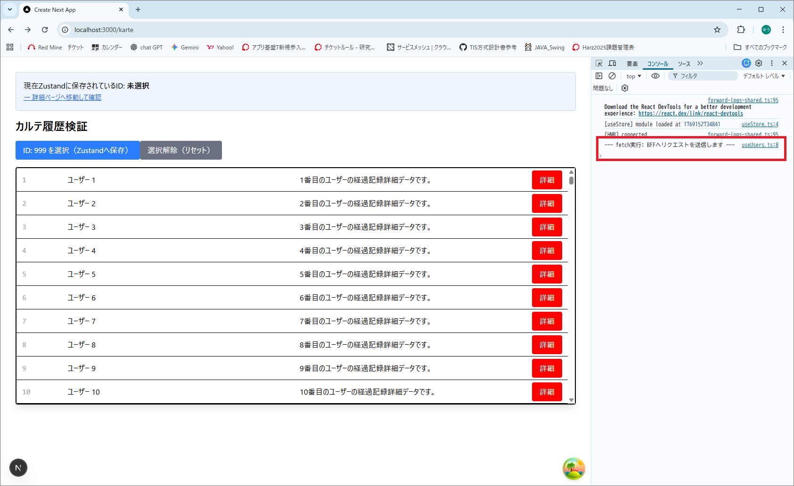
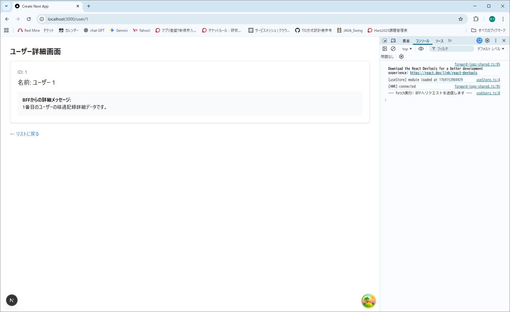
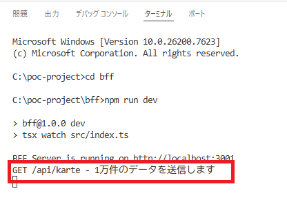
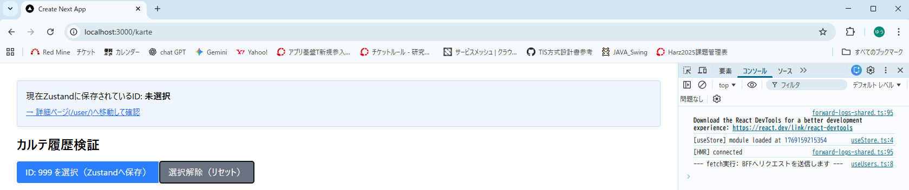
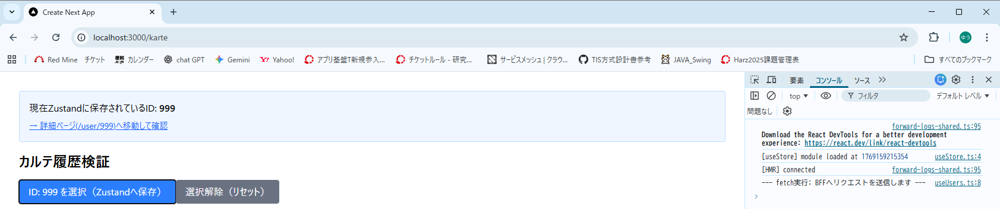
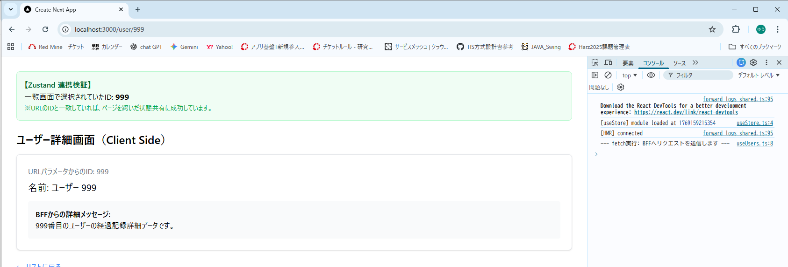
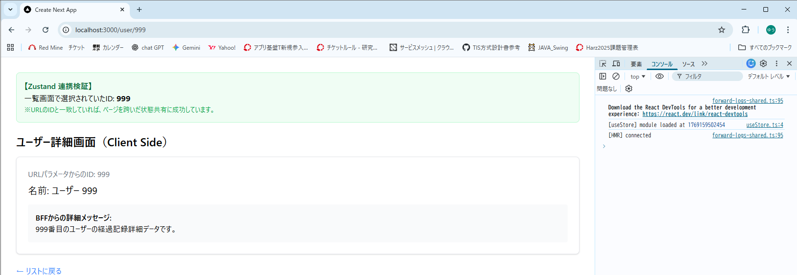

---

# 技術検証報告書：状態管理および通信キャッシュ制御の検証

## 1. 検証の背景と目的

本検証は、非同期データの通信最適化と、アプリケーション全体での状態保持手法を確立することを目的とする。React Queryによるサーバーデータのキャッシュ制御と、ZustandによるグローバルなUI状態管理（永続化を含む）を組み合わせ、効率的なデータ運用が可能かを実証する。

## 2. 検証内容と結果マトリクス

| 検証項目 | 目的 | 検証方法 | 検証結果 |
| --- | --- | --- | --- |
| **非同期通信キャッシュ** | 重複リクエストを削減し、高速な再表示を行う | React Queryの `staleTime` 設定による挙動確認 | **[PASS]** |
| **グローバル状態管理** | ページを跨いで特定のデータを共有する | Zustandを用いた選択済みIDの保持と画面間連携 | **[PASS]** |
| **状態の永続化(Persist)** | リロード後もアプリケーション状態を維持する | `persist` ミドルウェアによるLocalStorage連携確認 | **[PASS]** |

---

## 3. 具体的な検証手順とエビデンス（手順詳細）

### ① React Queryによるキャッシュ制御

* **手順**:
  1. React Queryライブラリの導入
      ```bash
      npm install @tanstack/react-query@5.90.19 @tanstack/react-query-devtools@5.91.2
      ```
      ※　@tanstack/react-query (本体)
      ※　@tanstack/react-query-devtools (開発ツール)  

  2. `useQuery` を用いたカスタムフックを実装し、BFF（`localhost:3001/api/karte`）から1万件のデータを取得する。
  3. ログ確認用として、`queryFn` 内に `console.log` を仕込み、`staleTime`（5分）および `refetchOnWindowFocus: false` を設定する。  
      frontend\src\features\karte\hooks\useUsers.ts
      ```typescript
      import { useQuery } from '@tanstack/react-query';

      export const useKarte = () => {
        return useQuery({
          queryKey: ['karte'],
          queryFn: async () => {
            // 検証用ログ：キャッシュが使われず実際に通信が走った時だけ出力される
            console.log('--- fetch実行: BFFへリクエストを送信します ---'); 
            const response = await fetch('http://localhost:3001/api/karte');
            if (!response.ok) throw new Error('Network error');
            return response.json();
          },
          staleTime: 1000 * 60 * 5,    // 5分間はデータを「新鮮」と見なす
          refetchOnWindowFocus: false, // ウィンドウフォーカス時の再取得を無効化
        });
      };
      ```

  4. 一覧画面（`/karte`）へ初回アクセスし、その後 `<Link>` を用いて他ページ（`/user/1`等）へ遷移する。
  5. ブラウザの「戻る」ボタンで一覧画面へ再訪問した際の、コンソールログおよびBFFターミナルの挙動を確認する。


* **結果**:
  * **初回表示時のログ（通信あり）**: ブラウザコンソールに「fetch実行...」のログが出力される  

      

    BFFターミナルにもデータ送信ログが表示されることを確認。  
    

  * **再訪問時のログ（通信なし・キャッシュ成功）**: 画面遷移後の「戻る」操作において、**コンソールログおよびBFFログが一切更新されない**ことを確認。  
これにより、通信を介さずメモリ上のキャッシュから1万件のデータが即座に復元されていることを証明した。  

      別画面（ユーザー詳細画面）に移動  
    

    ↓　ブラウザの「戻る」操作実施  
ページは表示されているが、コンソールログが増えていない（＝通信が走っていない）状態となっていることを確認。  
  

    2回目のアクセス時にログが追加されていないことを確認。  
  


### ② Zustandによる状態共有と永続化

* **手順**:
  1. Zustandライブラリの導入
      ```bash
      npm install zustand@5.0.10
      ```
  2. `selectedKarteId` とその更新関数、およびLocalStorage連携（persist）を定義する。
  3. 一覧画面でIDを保存し、詳細画面へ遷移後にStoreから直接値を読み取れるかを確認する。  
      frontend\src\shared\stores\useStore.ts
      ```typescript
      // Zustandのcreate関数をインポート
      import { create } from 'zustand'
      import { persist } from 'zustand/middleware';
      console.log("[useStore] module loaded at", Date.now());

      interface StoreState {
        count: number;
        text: string;
        selectedKarteId: string | null; // 追加：選択中のカルテID
        increase: () => void;
        decrease: () => void;
        setText: (newText: string) => void;
        setSelectedKarteId: (id: string | null) => void; // 追加：IDをセットする関数
      }
      // persist用のstoreを作成
      export const useStoreP = create<StoreState>()(
        persist(
          (set) => ({
            count: 0,
            text: '',
            selectedKarteId: null, // 初期値
            increase: () => set((state) => ({ count: state.count + 1 })),
            decrease: () => set((state) => ({ count: state.count - 1 })),
            setText: (newText) => set({ text: newText }),
            setSelectedKarteId: (id) => set({ selectedKarteId: id }), // 更新関数
          }),
          {
            name: 'app-storage', // localStorageに保存されるキー名
          }
        )
      );
      ```

  4. `<Link>` コンポーネントを用いて、一覧画面から詳細画面（`/user/999`）へ遷移する。
  5. 遷移先の詳細画面においても同じStoreをインポートし、Props経由ではなくStoreから直接、保存されたID（999）が読み取れるかを確認する。  

      frontend\src\app\karte\page.tsx（送信側）
      ```typescript
      'use client';

      import { useKarte } from '@/features/karte/hooks/useUsers'; 
      import VirtualizedKarteList from '@/features/karte/components/organisms/VirtualizedKarteList';
      import { useStoreP } from '@/shared/stores/useStore'; // Zustandをインポート
      import Link from 'next/link';

      export default function KartePage() {
        const { data, isLoading } = useKarte();
        const { selectedKarteId, setSelectedKarteId } = useStoreP(); // Zustandから呼び出し

        if (isLoading) return <div className="p-8">読み込み中...</div>;

        return (
          <div className="p-8">
            <div className="mb-4 p-4 bg-blue-50 border border-blue-200 rounded">
              <p>現在Zustandに保存されているID: <strong>{selectedKarteId || '未選択'}</strong></p>
              {/* 修正箇所：href を selectedKarteId に連動させる */}

                <Link href={`/user/${selectedKarteId}`} className="text-blue-600 underline text-sm block mt-2">
                  → 詳細ページ(/user/{selectedKarteId})へ移動して確認
                </Link>

            </div>

            <h1 className="text-2xl font-bold mb-4">カルテ履歴検証</h1>
      
            {/* ボタン押下でZustandのステートを更新 */}
            <button 
              onClick={() => setSelectedKarteId('999')} // ID: 999を選択したと仮定
              className="bg-blue-500 text-white px-4 py-2 rounded mb-4 hover:bg-blue-600"
            >
              ID: 999 を選択（Zustandへ保存）
            </button>

            <button 
              onClick={() => setSelectedKarteId(null)} 
              className="bg-gray-500 text-white px-4 py-2 rounded"
             >
              選択解除（リセット）
              </button>

            <div className="border rounded shadow-lg">
              {data && <VirtualizedKarteList data={data} />}
            </div>
          </div>
        );
      }
      ```  

      frontend\src\app\user[id]\page.tsx（受信側）
      ```typescript
      'use client'; // Client Componentに変更

      import { useStoreP } from '@/shared/stores/useStore'; // Zustandをインポート
      import { useEffect, useState, use } from 'react';

      export default function UserDetailPage({
        params,
      }: {
        params: Promise<{ id: string }>;
      }) {
        // 1. URLパラメータとZustandの状態を取得
        const { id } = use(params); // Promiseを展開
        const { selectedKarteId } = useStoreP(); // Zustandから「さっき選んだID」を取得
  
        const [user, setUser] = useState<any>(null);
        const [error, setError] = useState(false);

        // 2. クライアント側でデータ取得（検証用）
        useEffect(() => {
          fetch(`http://localhost:3001/api/user/${id}`)
            .then((res) => {
              if (!res.ok) throw new Error();
              return res.json();
            })
            .then((data) => setUser(data))
            .catch(() => setError(true));
        }, [id]);

        if (error) return <div className="p-8">ユーザーが見つかりませんでした</div>;
        if (!user) return <div className="p-8">読み込み中...</div>;

        return (
          <div className="p-8">
            {/* ★ここがZustandの検証ポイント★ */}
            <div className="mb-6 p-4 bg-green-50 border border-green-200 rounded-lg">
              <h3 className="font-bold text-green-800">【Zustand 連携検証】</h3>
              <p>一覧画面で選択されていたID: <span className="font-mono font-bold text-lg">{selectedKarteId || '（未選択）'}</span></p>
              <p className="text-sm text-green-600">※URLのIDと一致していれば、ページを跨いだ状態共有に成功しています。</p>
            </div>

            <h1 className="text-2xl font-bold mb-4">ユーザー詳細画面（Client Side）</h1>
            <div className="bg-white shadow rounded-lg p-6 border border-gray-200">
              <p className="text-gray-500">URLパラメータからのID: {id}</p>
              <h2 className="text-xl mt-2">名前: {user.name}</h2>
              <div className="mt-4 p-4 bg-gray-50 rounded">
                <p className="font-semibold">BFFからの詳細メッセージ:</p>
                <p>{user.description || '詳細情報はありません'}</p>
              </div>
            </div>
            <div className="mt-6">
              <a href="/karte" className="text-blue-500 hover:underline">← リストに戻る</a>
            </div>
          </div>
        );
      }
      ```

### ③ 基盤設定（Providerの組み込み）
* **手順**:
  1. `QueryClientProvider` を用いて、アプリ全体でキャッシュを共有可能にする。
  2. 開発ツール（Devtools）を組み込み、検証中のキャッシュ状態を可視化する。  

      frontend\src\shared\providers\ReactQueryProvider.tsx
      ```tsx
      "use client";

      import { QueryClient, QueryClientProvider } from "@tanstack/react-query";
      import { ReactQueryDevtools } from "@tanstack/react-query-devtools";
      import { ReactNode, useState } from "react";

      export default function ReactQueryProvider({ children }: { children: ReactNode }) {
        const [client] = useState(() => new QueryClient());

        return (
          <QueryClientProvider client={client}>
            {children}
            <ReactQueryDevtools initialIsOpen={false} />
          </QueryClientProvider>
        );
      }

      ```


      frontend\src\app\layout.tsx　　※Next.js標準のレイアウト構成のうち、本検証に関連するProvider設定箇所を抜粋。
      ```tsx
      export default function RootLayout({
        children,
      }: {
        children: React.ReactNode;
      }) {
        return (
          <html lang="en">
            <body
              className={`${geistSans.variable} ${geistMono.variable} antialiased`}
            >
              <ReactQueryProvider>
                {children}
              </ReactQueryProvider>
            </body>
          </html>
        );
      }

      ```

---
* **結果**:
  * **ページ跨ぎの連携**: 一覧画面で選択したID「999」が、詳細画面のコンポーネント上でも正しく表示されることを確認。

↓

↓



  * **リロード耐性**: F5キーによるリロード後も、選択中のIDが「未選択」に戻らないことを確認。

    ブラウザのリロードにより React のメモリ状態はリセットされるが、persist 機能によって localStorage から自動的に値が復旧される



---

## 4. 技術的特記事項・課題

* **責務の分離**: BFFから取得する「サーバー状態」はReact Query、ユーザーの操作に伴う「UI状態」はZustandと明確に分離することで、Storeの肥大化を防止できることを確認。
* **メモリ管理**: 大規模データ（1万件）を扱う際、React Queryの `gcTime`（ガベージコレクション時間）を適切に設定することで、不要になったメモリの解放を制御する必要がある。
* **永続化の範囲**: 全てのステートを `persist` 対象にするとストレージ容量を圧迫するため、真にリロード後も必要な項目（ユーザー設定や作業中のID等）に限定して運用することを推奨。

---