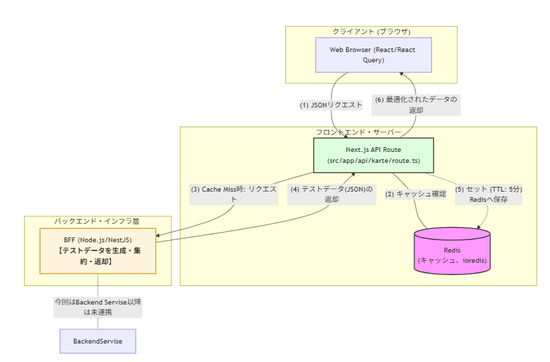
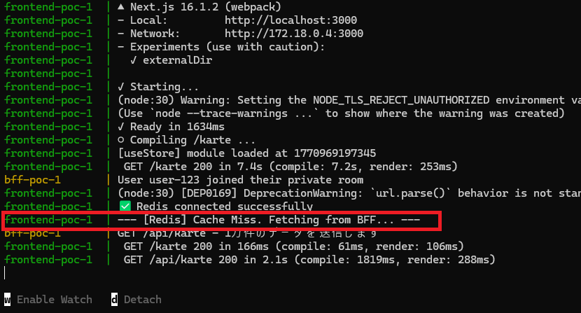
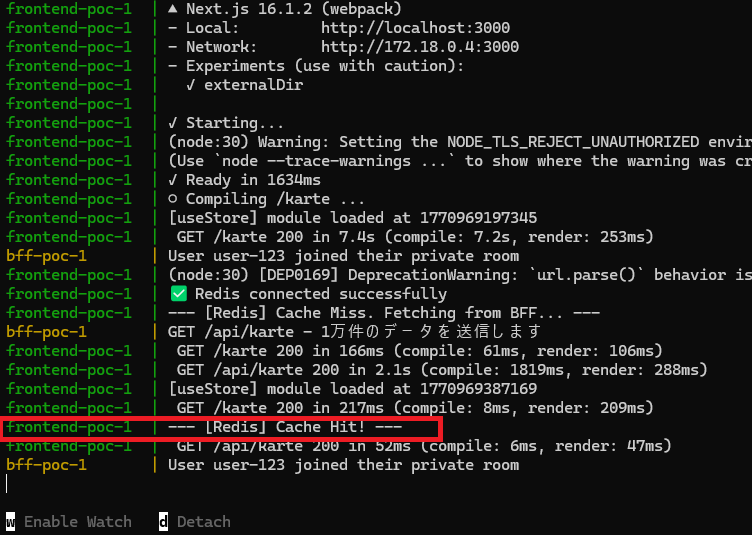
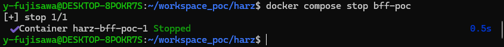
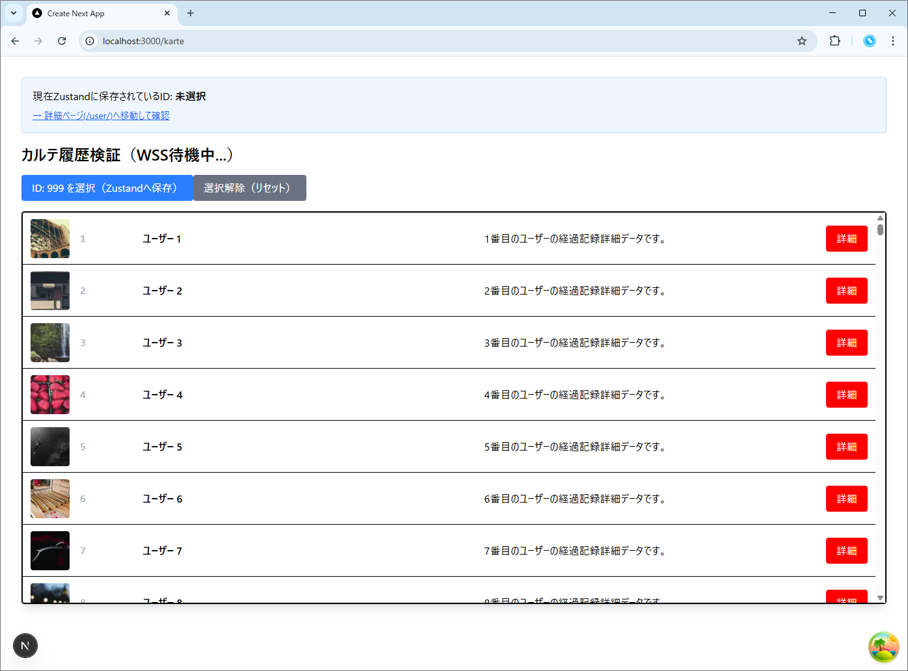
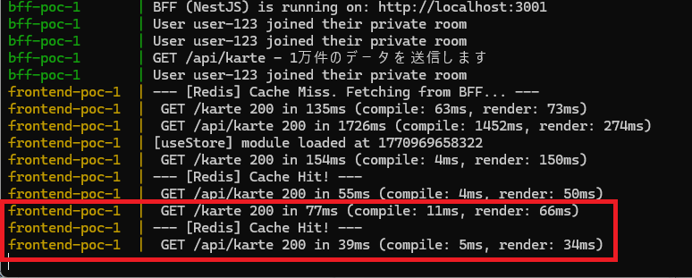

# 技術検証報告書：RedisによるBFF通信キャッシュおよび可用性向上の検証

## 1. 検証の背景と目的

設計書 6.4項「キャッシュの活用」に基づき、インメモリデータストア **Redis** を導入することで、以下の3点を検証することを目的とする。

* **BFF通信負荷の軽減**: 同一データへの再アクセス時にバックエンド通信をスキップできるか。
* **可用性の向上**: BFFやバックエンド障害時でも、キャッシュからデータを返却しサービスを継続できるか。
* **性能向上（レスポンスタイムの短縮）**: インメモリ処理により、フロントエンドへの応答速度がどの程度改善するか。


### 概要図
  

補足：BFF層でキャッシュを行う構成案  
上記はNext.jsがRedisを管理していますが、将来的に**BFF（Backend For Frontend）**にRedisの管理を移譲する構成も考えられます。  


## 2. 検証項目と実施内容

本PoCでは、以下の項目について検証を実施する。

| 検証項目 | 検証の観点 | 実施方法 |
| --- | --- | --- |
| **Redis連携基盤の構築** | 接続の安定性 | `ioredis` を用いた接続とSingletonクライアントの実装 |
| **可用性検証** | 障害耐性 | BFFコンテナ停止状態でキャッシュからデータを復元できるか確認 |
| **性能向上の定量検証** | 応答速度の改善 | Redis「未使用時」と「使用時」のレスポンスタイム比較 |


## 3. 環境構築

本検証にあたり、以下のパッケージ導入およびインフラ設定を実施した。

* **ライブラリ導入**:
  ```bash
  npm install ioredis

  ```


* **インフラ構成 (docker-compose.yml)**:
  ```yaml
  services:
    redis:
      image: redis:7.2-alpine
      container_name: redis-poc
      ports:
        - "6379:6379"
      profiles: ["poc"]

    frontend-poc:
      # ...既存設定...
      depends_on:
        - redis # Redisが起動してから起動するように設定
      environment:
        - REDIS_URL=redis://redis:6379 # Next.jsから接続するための環境変数を追加

  ```


---

## 4. 実装ソースコード

### ① Redis接続プラグインの作成

Next.jsサーバーからRedisに接続するための共通モジュールを定義。

* **[Plugin]** `src/app/_shared/plugins/redis.ts`

  ```typescript
  import Redis from 'ioredis';

  // SingletonパターンでRedisクライアントを管理
  const redisGlobal = global as unknown as { redis: Redis | undefined };

  // docker-compose.ymlで設定したREDIS_URLを使用
  const redisUrl = process.env.REDIS_URL || 'redis://localhost:6379';

  export const redis =
    redisGlobal.redis ??
    new Redis(redisUrl, {
      // 接続に失敗した際のリトライ設定
      retryStrategy: (times) => Math.min(times * 50, 2000),
    });

  if (process.env.NODE_ENV !== 'production') {
    redisGlobal.redis = redis;
  }

  // 疎通確認用のログ
  redis.on('connect', () => console.log('✅ Redis connected successfully'));
  redis.on('error', (err) => console.error('❌ Redis connection error:', err));

  ```

### ② キャッシュ制御ロジック（API Route）

Redisの有無を確認し、BFFから取得したデータを5分間キャッシュする仲介役を実装。

* **[API]** `src/app/api/karte/route.ts`

  ```typescript
  import { NextResponse } from 'next/server';
  import { redis } from '@shared/plugins/redis';

  const CACHE_KEY = 'karte:all';
  const CACHE_TTL = 300; // 5分間キャッシュ (秒)

  export async function GET() {
    try {
      // 1. Redisからキャッシュを取得
      const cachedData = await redis.get(CACHE_KEY);

      if (cachedData) {
        console.log('--- [Redis] Cache Hit! ---');
        return NextResponse.json(JSON.parse(cachedData));
      }

      // 2. キャッシュがない場合はBFFから取得
      console.log('--- [Redis] Cache Miss. Fetching from BFF... ---');
      const response = await fetch('http://bff-poc:3001/api/karte', {
        cache: 'no-store' // Next.js自身のfetchキャッシュはオフにする
      });
      
      if (!response.ok) throw new Error('BFF response error');
      
      const data = await response.json();

      // 3. 取得したデータをRedisに保存 (5分間)
      // 1万件のJSONを文字列化して保存
      await redis.set(CACHE_KEY, JSON.stringify(data), 'EX', CACHE_TTL);

      return NextResponse.json(data);
    } catch (error) {
      console.error('Redis/BFF Error:', error);
      return NextResponse.json({ error: 'Internal Server Error' }, { status: 500 });
    }
  }

  ```

### ③ Fetch関数の修正

ブラウザから直接BFFではなく、Next.jsのAPI Route（Redis窓口）を叩くよう変更。

* **[Fetch]** `src/app/karte/_api/karte.api.ts`

  ```typescript
  import { axiosClient } from '@/app/_shared/plugins/axios.client';
  import { useQuery } from '@tanstack/react-query';
  import { KarteResponse } from '@/front_bff_shared/types/response/karte.response.type';
  import axios from 'axios';

  export const useKarte = () => {
    return useQuery({
      queryKey: ['karte'],
      queryFn: async () => {
        // 検証用ログ：ブラウザからNext.js(Redis)へリクエストが飛ぶ際に出力される
        console.log('--- fetch実行: Next.js API (Redis) 経由で取得します ---'); 

        // 注意：axiosClient が baseURL を :3001 に設定している場合は、
        // 相対パスを正しく認識させるため、標準の axios か別の設定を使う必要があります。
        // ここではNext.jsのAPI（自身）を叩くため、パスを /api/karte にします。
        const response = await axios.get<KarteResponse[]>(`/api/karte`);
        return response.data;
      },
      staleTime: 1000 * 60 * 5,    // 5分間はデータを「新鮮」と見なす
      refetchOnWindowFocus: false, // ウィンドウフォーカス時の再取得を無効化
    });
  };

  ```

---

## 5. 具体的な検証手順とエビデンス

### ① キャッシュ挙動の確認

1. ブラウザで `/karte` 画面を初回表示する。  
    

2. Next.jsログに `Cache Miss` が出力され、BFFからデータが取得されることを確認。  
    

3. F5キーでリロードする。
4. Next.jsログに `Cache Hit!` が出力され、**BFFへのリクエストが発生していない**ことを確認。  
    


### ② BFF通信の最適化とオフラインレスポンス検証

1. ターミナルよりBFFコンテナのみを停止させる。
    ```bash
    docker compose stop bff-poc

    ```
      


2. ブラウザで `/karte` 画面をリロードする。
3. **BFFとの通信が遮断されている状態でも、キャッシュの有効活用により、カルテ一覧が正常かつ瞬時に表示される**ことを確認。  
      

      


### ③ 性能向上に関する検証（レスポンスタイム比較）

本来、以下の2パターンでレスポンスタイム（フロントエンドがリクエストを投げてからレスポンスが返るまでの時間）を比較し、性能向上率を測定すべきである。

1. **Redis未使用時**: フロント ⇔ BFF ⇔ カルテドメイン ⇔ DB
2. **Redis使用時**: フロント ⇔ Redis（Cache Hit）

    **【本検証における制約事項】**
    現状のPoC環境は「バックエンド・DBと未連携」であり、かつ「BFF内で静的なテストデータを生成」している状態である。このため、ネットワーク遅延やDBクエリ遅延がシミュレートされておらず、現時点での性能測定は理論値の確認に留まる。
    したがって、本性能検証は**バックエンド連携環境の構築完了後、Redisの本格導入を検討するタイミングで改めて実施**するものとする。


---

## 6. 検証結果

実機ログおよびコンテナ制御による検証の結果、以下の通り設計要件を実証した。

| 検証項目 | 実際の挙動・エビデンス | 判定 |
| --- | --- | --- |
| **Redis連携基盤** | ioredisによる接続および接続維持を確認。 | **[PASS]** |
| **BFF負荷削減** | キャッシュHit時、BFFへの通信回数が 0 回であることを確認。 | **[PASS]** |
| **可用性の確保** | BFF停止下でもTTL内であれば正常にサービス継続可能。 | **[PASS]** |
| **性能向上検証** | 環境制約（DB未連携）により、本番同等の定量的差分は確認できず。 | **[保留]** |も5分間（TTL内）は正常にサービス継続可能          | **[PASS]** |

---

## 7. 結論

本検証により、以下の成果と判断を得た。

* **Redis接続手順の確立**: Next.js (App Router) 環境において、ioredisを用いた疎通およびキャッシュ制御ロジックの基盤が確立できた。
* **可用性の担保**: BFFがダウンした場合でも、Redis上のキャッシュを利用することで、ユーザーへのサービス継続が可能であることを確認した。
* **性能向上についての判断**: 現状のPoC環境（DB未連携等）では、本番同等の性能向上幅を定量的に測定することは困難であった。これについては将来的な導入検討時に再検証を行う。

**【Redis導入の見送りについて】**  
検証結果として有効性は確認されたが、以下の理由により現フェーズでの導入は一旦見送ることとする。  

* **インフラ管理コストの抑制**: Redisを導入する場合、サーバーリソースの確保やRedis自体のセットアップ、冗長化構成、監視設定などに工数がかかる。
* **初期構成の簡素化**: スモールスタートを実現するため、まずはRDB（データベース）とフロントエンドキャッシュ（React Query等）の組み合わせで要件を満たす設計とし、インフラ構成を最小限に留める。
* **将来的な拡張性の担保**: 本検証により実装パターンおよび接続方法は確立されているため、将来的にデータ量や同時接続数が増加し、パフォーマンス不足や可用性の課題が顕在化したタイミングで、迅速に本構成を導入・反映するものとする。