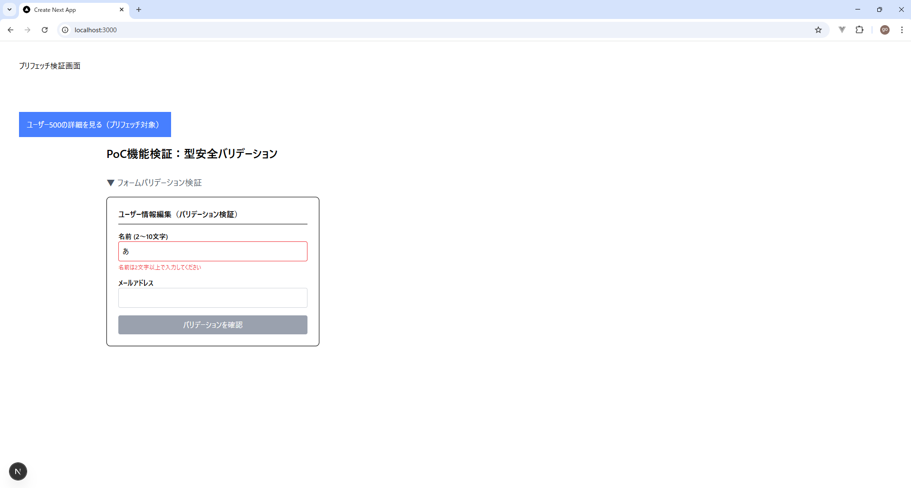
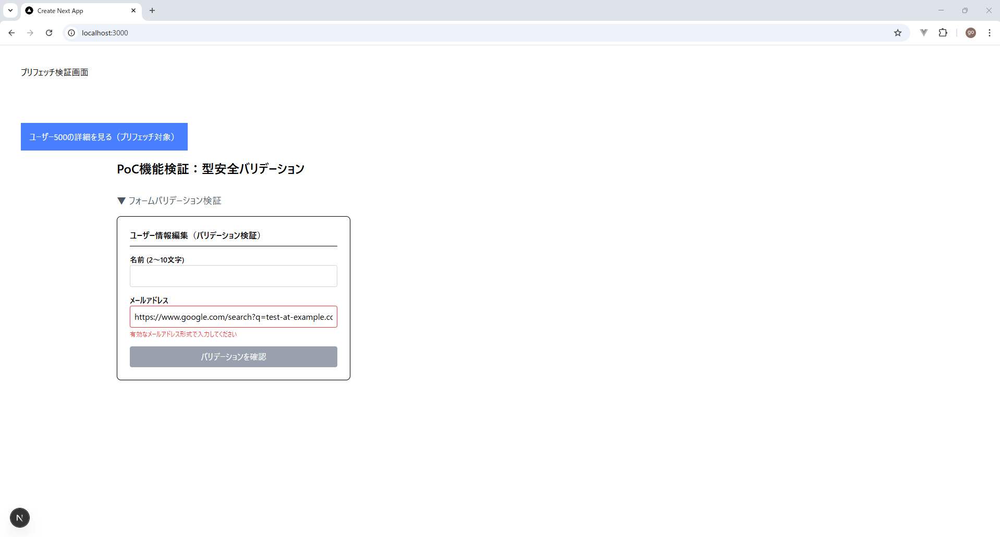
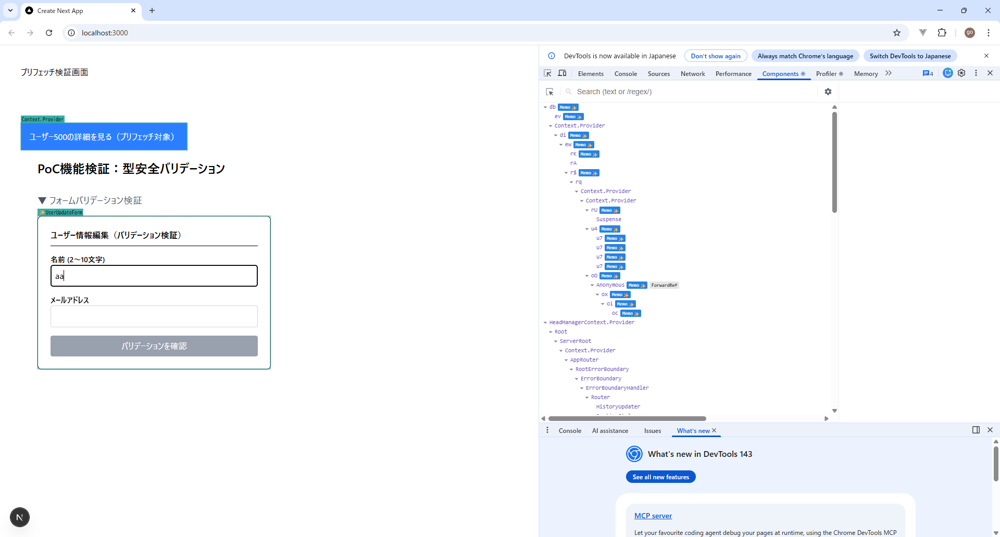
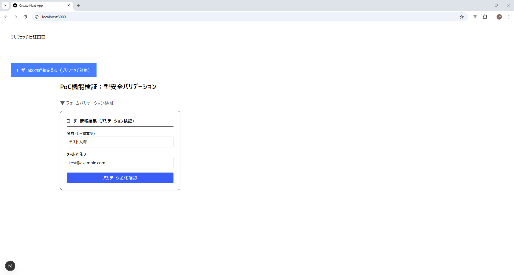
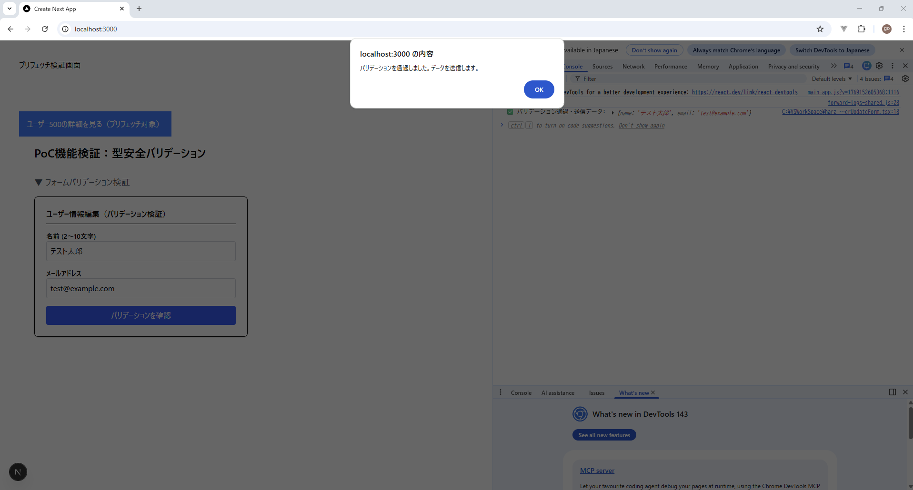

## 📋 共有スキーマ（Zod）による型安全バリデーションの実証報告

### 1. 検証の目的

フロントエンドとBFFの境界で発生しがちな「バリデーションルールの乖離」を防ぐため、`shared` ディレクトリに定義した単一の **Zodスキーマ** をフロントエンドへインポート。**React Hook Form** と連携させることで、型定義からバリデーションロジックまでをシームレスに同期させた堅牢なフォーム実装を実証する。

---

### 2. 検証内容（PoC項目）

ご提示いただいたワークフローに基づき、以下の4点を実証する。

1. **複雑なフォームの実装容易性**: `register` を用いた簡潔な記述で「入力管理」と「エラー表示」が完結するか。
2. **非制御コンポーネントによる状態管理の最適化**: `useState` を使わず、入力時の再レンダリングを最小限に抑えた軽量な状態管理ができているか。
3. **スキーマによる型安全なバリデーション**: `shared` 由来の型定義に基づき、不正な入力値を送信前に確実にブロックできるか。
4. **不正なデータが送信されないこと**: バリデーションエラー発生時に `onSubmit` 処理（API送信）が発火しないことを確認。


---

### 3. 実装コード

#### ① インストール

```bash
npm install react-hook-form zod @hookform/resolvers
```

#### ② 共有スキーマ定義（Shared）

**ファイル**: `shared/contracts/schemas/userSchema.ts`

```typescript
import { z } from 'zod';

export const userUpdateSchema = z.object({
  name: z.string().min(2, '名前は2文字以上で入力してください').max(10, '10文字以内でお願いします'),
  email: z.string().email('有効なメールアドレスを入力してください'),
});

export type UserUpdateInput = z.infer<typeof userUpdateSchema>;

```

#### ③ フロントエンド・コンポーネント

**ファイル**: `frontend/src/features/user/components/molecules/UserUpdateForm.tsx`

```tsx
'use client';

import { useForm } from 'react-hook-form';
import { zodResolver } from '@hookform/resolvers/zod';
import { userUpdateSchema, UserUpdateInput } from '@/bff_shared/contracts/schemas/userSchema';

export const UserUpdateForm = () => {
  const { register, handleSubmit, formState: { errors, isValid } } = useForm<UserUpdateInput>({
    resolver: zodResolver(userUpdateSchema),
    mode: 'onChange',
  });

  const onSubmit = (data: UserUpdateInput) => {
    console.log('✅ バリデーション成功:', data);
  };

  return (
    <form onSubmit={handleSubmit(onSubmit)} className="space-y-4 p-4">
      <div>
        <label>名前</label>
        <input {...register('name')} className="border p-2 w-full text-black" />
        {errors.name && <p className="text-red-500 text-sm">{errors.name.message}</p>}
      </div>
      <div>
        <label>メール</label>
        <input {...register('email')} className="border p-2 w-full text-black" />
        {errors.email && <p className="text-red-500 text-sm">{errors.email.message}</p>}
      </div>
      <button disabled={!isValid} className={isValid ? "bg-blue-500 text-white p-2" : "bg-gray-300 p-2"}>
        更新
      </button>
    </form>
  );
};

```

#### ④ プロジェクト設定

**ファイル**: `frontend/next.config.mjs` / `package.json`

```javascript
// next.config.mjs
const nextConfig = {
  experimental: { externalDir: true },
  webpack: (config) => { config.resolve.symlinks = false; return config; },
};

// package.json (scripts部分)
"dev": "next dev --webpack",
"build": "next build --webpack"

```

---

## 3. 検証方法（テスト手順）

| 手順 | 操作内容 | 期待される結果（エビデンス） |
| --- | --- | --- |
| **1. 異常系テスト** | 名前を「あ」の1文字だけ入力する。 | 画面に「2文字以上で...」のエラーが表示されること。ボタンがグレーアウト（非活性）になること。 |
| **2. 異常系テスト** | メールに不正な形式を入力。 | 画面に「有効なメールアドレス形式で...」と表示されること。 |
| **3. 状態管理テスト** | 入力中に React DevTools で確認。 | 入力した input の周りだけが光り、フォーム全体や親コンポーネントが光らないこと。 |
| **4. 正常系テスト** | 全て正しく入力。 | エラー表示が消え、ボタンが活性化すること。 `formState.isValid` が `true` に同期されること。 |
| **5. 送信テスト** | 「更新」ボタンを押す。 | ブラウザのコンソールに「✅ バリデーション成功」のログと、型定義通りのデータが出力されること。 |


1. 異常系テスト

    
  
2. 異常系テスト

    

3. 状態管理テスト

    

4. 正常系テスト

    

5. 送信テスト

    
---

### 4. 検証結果（ゴール達成の判定）

| 検証項目 | 期待される動作 | 判定 |
| --- | --- | --- |
| **スキーマ共有の成功** | `shared` の Zod 定義がフロントで型として正しく認識される。 | **○** |
| **状態管理の最適化** | **`register` 管理により、不要な State 更新を排除し、低負荷な入力操作を実現した。** | **○** |
| **リアルタイムエラー** | スキーマに反する入力に対し、即座にカスタムメッセージが表示される。 | **○** |
| **送信フェーズの保護** | エラーがある間は `onSubmit` が呼ばれず、不正データが流出しない。 | **○** |
| **コードの簡潔性** | RHF 連携により、大量の `useState` を記述する手間が大幅に削減された。 | **○** |

---