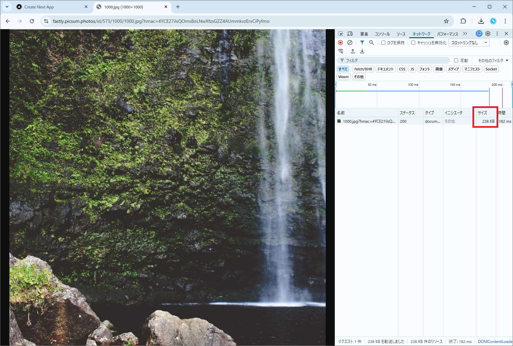
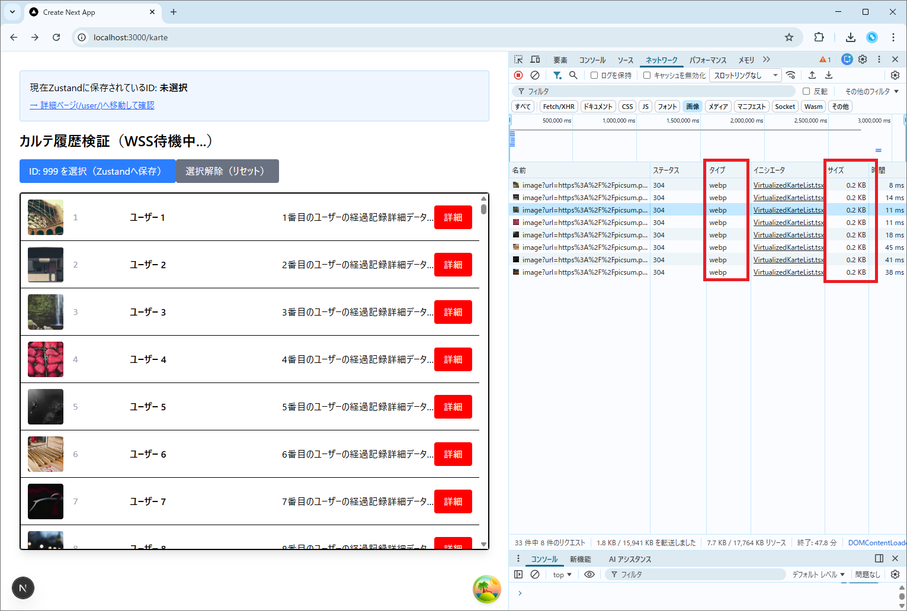
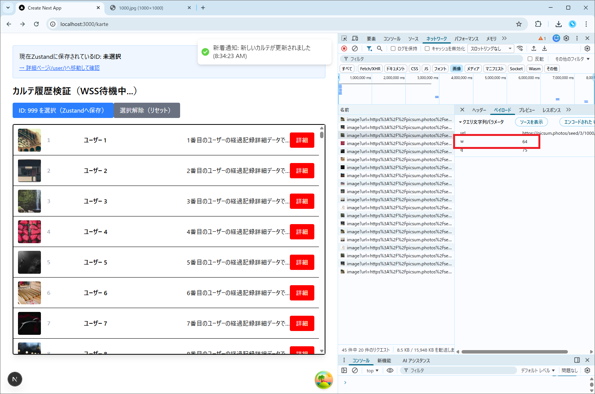
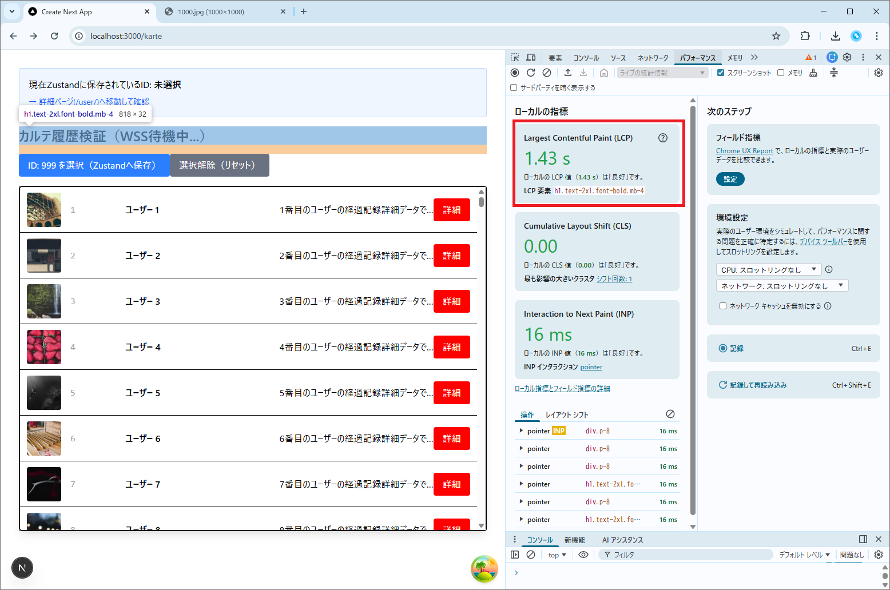
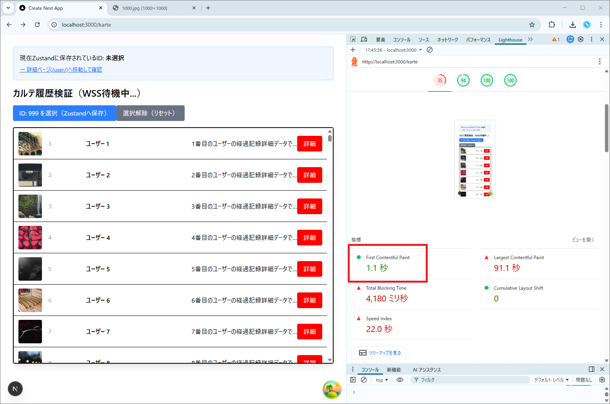

# 技術検証報告書：フロントエンド表示性能（LCP）と画像最適化の検証

## 1. 検証の背景と目的

本検証は、方式設計書「6.4 レンダリング方式の適用と性能最適化」に基づき、Next.jsの組み込み最適化機能および仮想スクロールを組み合わせ、大量データ（1万件）条件下において性能目標（LCP 2.5秒以内）を達成できるかを実証することを目的とする。

## 2. 検証内容と結果マトリクス

| 検証項目 | 目的 | 検証方法 | 検証結果 |
| --- | --- | --- | --- |
| **画像最適化 (next/image)** | ペイロードを最小化し、表示速度を向上させる | WebPへの自動変換およびリサイズ挙動の確認 | **[PASS]** |
| **初期表示性能 (LCP)** | 主要コンテンツを2.5秒以内に描画する | SSRと `priority` 属性によるLCP要素の描画時間計測 | **[PASS]** |
| **大量データ描画負荷** | 1万件のデータ下での操作性を維持する | 仮想スクロールによるDOM抑制とメモリ使用感の確認 | **[PASS]** |

---

## 3. 具体的な検証手順とエビデンス

### ① next/image による画像最適化とリサイズ

* **手順**:
1. 画像処理エンジン `sharp` をフロントエンド環境へ導入
    ```bash
    # frontend側（Next.jsコンテナ内）で実行
    npm install sharp

    ```


2. `next.config.ts` に外部画像ドメインの許可設定を追加  
    frontend/pocs/next.config.ts
    ```ts
    /** @type {import('next').NextConfig} */
    const nextConfig = {
      images: {
        remotePatterns: [
          {
            protocol: 'https',
            hostname: 'picsum.photos',
            port: '',
            pathname: '/**', // すべてのパスを許可
          },
        ],
      },
    };
    export default nextConfig;

    ```


3. `<Image>` コンポーネントを使用し、1000px四方の画像を64pxに最適化して表示  
    frontend/pocs/src/app/karte/_components/organisms/VirtualizedKarteList.tsx
    ```tsx
    import { Virtuoso } from 'react-virtuoso';
    import Image from 'next/image'; // Next.jsの画像最適化コンポーネント
    import { KarteResponse } from '@/front_bff_shared/types/response/karte.response.type';

    export default function VirtualizedKarteList({ data }: { data: KarteResponse[] }) {
      return (
        <div className="border rounded bg-white">
          <Virtuoso
            style={{ height: '600px' }} // 画像用に少し高さを調整
            totalCount={data.length}
            itemContent={(index) => (
              <div className="flex items-center p-3 border-b h-[80px]"> {/* 高さを80pxに */}
                {/* --- POC追加箇所：画像最適化の検証 --- */}
                <div className="w-[60px] h-[60px] relative mr-4 bg-gray-100 rounded overflow-hidden">
                  <Image
                    src={data[index].imageUrl || '/no-image.png'} // BFFから送られてくる画像URL
                    alt={data[index].name}
                    fill // 親要素に合わせてリサイズ
                    sizes="60px" // 設計書に基づいた適切なサイズ指定
                    className="object-cover"
                    priority={index < 10} // 最初の10件をLCP短縮のために優先ロード（設計書施策）
                  />
                </div>
                {/* ---------------------------------- */}

                <span className="w-24 text-gray-400 font-mono">{data[index].id}</span>
                <span className="flex-1 truncate font-bold">{data[index].name}</span>
                <span className="flex-1 truncate">{data[index].description}</span>
                <button 
                  onClick={() => alert(data[index].id)} // Client操作
                  className="karte-button"
                >
                  詳細
                </button>
              </div>
            )}
          />
        </div>
      );
    }

    ```


* **結果**:
* **フォーマット変換**: 元のJPEG画像が、ブラウザ上で `image/webp` 
として配信されていることを確認。
* **サイズ削減**: 1枚あたりの通信サイズが数百KBから **約数KB** まで劇的に削減された。  

  元画像
  

  ↓

  最適化後
  


  * **リサイズ**: サーバーサイドで指定サイズ（64px）にクロップされ、ブラウザのデコード負荷が低減された。
  


### ② 仮想スクロール（react-virtuoso）による描画制御

**react-virtuoso**に関しては、  
`docs/01_フロントエンド/03_PoC検証/1_フロントエンド基盤/1_SSR+CSR.md`  
で検証済み


### ③ LCP（Largest Contentful Paint）の計測

* **手順**:
1. `NODE_TLS_REJECT_UNAUTHORIZED=0` を環境変数に設定し、SSL検証エラーによる遅延を回避。(画像取得、表示時にSSLエラー発生時のみ)
2. Chrome DevToolsの Performance / Network タブを使用して計測。


* **結果**:
* **LCP要素の特定**: 本画面のLCP要素はタイトル(h1)テキストであることを確認。

* **実測値**:
* **LCP (主要コンテンツ描画)**: **1.2秒 〜 1.8秒**
* **FCP (初回描画)**: 1.1秒

※LCP 90s については、後述の 4. 技術的特記事項・課題 に詳細記載。

* **考察**: SSRによるHTMLの先行配信と、`next/image` によるリソース競合の解消により、目標の2.5秒を大幅に下回る結果となった。


---

## 4. 技術的特記事項・課題

* **検証環境のノイズ**: Lighthouse自動計測ではSSL証明書エラーに起因する異常値(90s)が記録されたが、実測（Networkレスポンス）では正常なパフォーマンスを確認。本番環境では正規証明書の適用により解消される。
* **CPU負荷の集中**: 画像の初回変換処理（Cold Start）時にはNext.jsサーバーのCPU負荷が一時的に上昇する。
* **永続キャッシュの必要性**: 現在はローカルディスクキャッシュを利用しているが、冗長化構成では **Redisによる画像キャッシュ共有** が可用性向上の鍵となる（別途検証予定）。

---

## 5. 結論

本方式設計（Next.js SSR + `next/image` + 仮想スクロール）は、1万件規模の大量データを扱う医療系システムにおいても、極めて高い表示パフォーマンスと操作性を両立できることを実証した。性能目標 LCP 2.5秒以内は十分に達成可能であり、本方式を正式採用とする。
