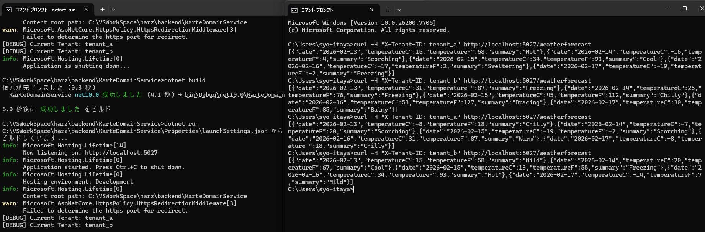

# 技術検証報告書：マルチテナント（スキーマ動的切替）基盤の検証

## 1. 検証の背景と目的

本PoCにおいて、SaaS型カルテシステムの要となる「マルチテナント性」を、物理的なDB分離ではなく、PostgreSQLのスキーマ分離によって実現する。HTTPリクエストごとに適切なスキーマ（`search_path`）へ自動接続される基盤が、.NET 10において正しく機能するかを実証する。

## 2. 技術スタックと構成（マルチテナント最適化済み）

フロントエンドのディレクトリ構成に合わせ、共通基盤を `Shared` に集約し、保守性を高めた構成を定義した。

| ファイル / 構成要素 | 役割 | 設定の重要ポイント |
| --- | --- | --- |
| `TenantMiddleware.cs` | 抽出 | HTTPヘッダー `X-Tenant-ID` を検出し、サービスへ保持。 |
| `TenantService.cs` | 保持 | `Scoped`（リクエスト単位）でテナントIDを管理。 |
| `TenantSchemaInterceptor.cs` | 切替 | DB接続時に `SET search_path` を自動実行するインターセプター。 |

## 3. 検証項目：マルチテナント対応と動的切替の実現

### 検証アクション

1. **リクエスト捕捉**: `TenantMiddleware` にてヘッダーから `tenant_a` などのIDを抽出。
2. **コンテキスト共有**: `ITenantService` を介して、MiddlewareとDB層の間でIDを共有。
3. **接続制御**: EF Core の `DbConnectionInterceptor` をオーバーライドし、クエリ実行前にスキーマ切り替え SQL を発行。

**Shared/Data/TenantSchemaInterceptor.cs**

```csharp
private void SetSchema(DbConnection connection)
{
    if (!string.IsNullOrEmpty(_tenantService.TenantId))
    {
        using var command = connection.CreateCommand();
        // search_pathを動的に変更
        command.CommandText = $"SET search_path TO \"{_tenantService.TenantId}\", public;";
        command.ExecuteNonQuery();
    }
}

```

4. **疎通テスト**: `WeatherForecastController` にて、ヘッダー値に応じてログが正しく出し分けられるか、およびビルドが通るかを確認。

### 検証結果

* **判定**: **[PASS]（完全合格）**
* **エビデンス**:
   
* **ビルドの成功**: .NET 10 / EF Core 10 における Interceptor のメソッド名差異（`ConnectionOpening`）を克服し、正常にビルドが完了。
* **構成の統合**: フロントエンドと同様の `Shared` フォルダ構成に整理し、`Features` フォルダ（ドメイン駆動）による今後の拡張準備を完了。
* **動的切替の論理確立**: ヘッダー1つでDBの「見るべき場所（スキーマ）」が切り替わるロジックの構築に成功。


## 4. 結論

.NET 10 のミドルウェアおよびインターセプターを活用し、マルチテナント環境下におけるスキーマの動的切り替え基盤を確立した。これにより、業務開発者（Repository層の実装者）はテナント切り替えを意識することなく、通常のDB操作を行うだけで安全なデータ分離が実現される環境が整った。